# Sơ đồ hoạt động: UniWork Meeting Control Plane + LiveKit

Tài liệu mô tả kiến trúc, luồng xử lý và tích hợp LiveKit trong module meetings của UniWork.
Bổ sung cho `meeting-livekit-implementation-plan.md`, `meeting-d08a-delivery.md` và `meeting-scale-upgrade-plan.md` (P4–P5).

**Nguyên tắc cốt lõi:** UniWork = Meeting Control Plane (Postgres là nguồn sự thật). LiveKit = Conference Provider (media plane). Hai bên giao tiếp qua `ConferenceProvider`, `RunWorkers` (outbox lease + webhook inbox) và webhook — **không** để LiveKit quyết định trạng thái cuộc họp, host hay quyền vào phòng.

---

## Mục lục

1. [Kiến trúc tổng thể](#1-kiến-trúc-tổng-thể)
2. [Ranh giới Control Plane vs LiveKit](#2-ranh-giới-control-plane-vs-livekit)
3. [State machine cuộc họp](#3-state-machine-cuộc-họp)
4. [Mô hình dữ liệu (ERD rút gọn)](#4-mô-hình-dữ-liệu-erd-rút-gọn)
5. [Luồng tạo họp lịch → Start → Mở phòng LiveKit](#5-luồng-tạo-họp-lịch--start--mở-phòng-livekit)
6. [Luồng Instant Meeting](#6-luồng-instant-meeting)
7. [Luồng Join / Admission](#7-luồng-join--admission)
8. [Luồng Invite Link (public)](#8-luồng-invite-link-public)
9. [Luồng Join Request (approve/reject)](#9-luồng-join-request-approvereject)
10. [Luồng Remove Participant](#10-luồng-remove-participant)
11. [Luồng End Meeting](#11-luồng-end-meeting)
12. [Luồng Webhook LiveKit → Attendance](#12-luồng-webhook-livekit--attendance)
13. [Outbox Worker (retry provider ops)](#13-outbox-worker-retry-provider-ops)
14. [Realtime WebSocket (Control Plane → Frontend)](#14-realtime-websocket-control-plane--frontend)
15. [Stack Frontend phòng họp](#15-stack-frontend-phòng-họp)
16. [Bảng tóm tắt API theo vai trò](#16-bảng-tóm-tắt-api-theo-vai-trò)
17. [Chạy local LiveKit](#17-chạy-local-livekit)
18. [Tham chiếu mã nguồn](#18-tham-chiếu-mã-nguồn)
19. [Production scale — observability & partition](#19-production-scale--observability--partition)

---


## 1. Kiến trúc tổng thể

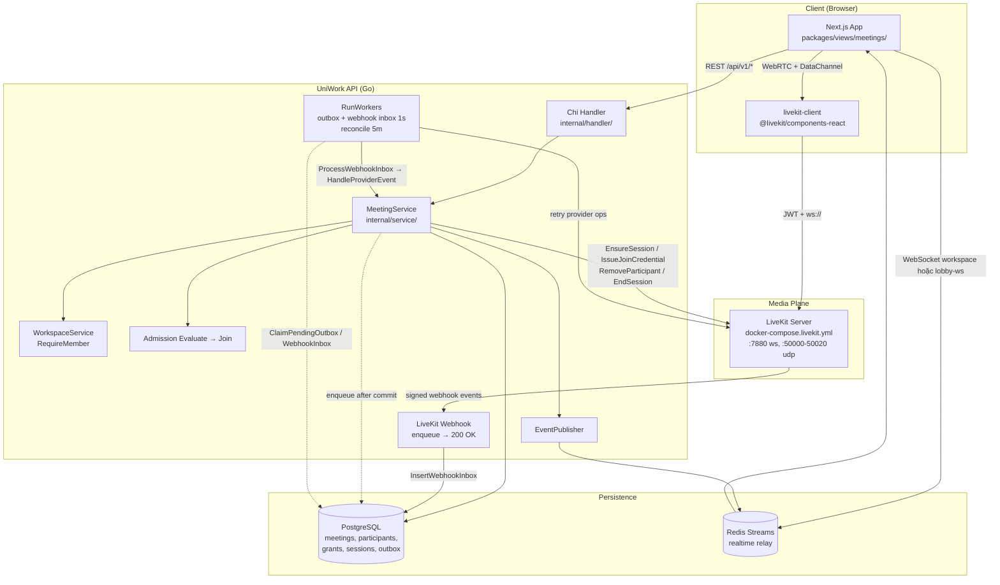


### Thành phần hạ tầng


| Thành phần           | Vai trò                                                       |
| -------------------- | ------------------------------------------------------------- |
| **PostgreSQL**       | Nguồn sự thật: lifecycle, participants, grants, audit, outbox |
| **Redis**            | Rate limit, WS relay giữa các node API                        |
| **LiveKit** (`7880`) | Phòng media `uw_mtg_{meeting_id}`                             |
| **Outbox + webhook worker** | `RunWorkers`: claim SKIP LOCKED, lease, dead-letter; webhook inbox async |


### Layer backend

- Client → Chi handler → MeetingService → Postgres (SoT)
                      → outbox_events + webhook_inbox → RunWorkers → ConferenceProvider → LiveKit
LiveKit webhook → verify → inbox → worker → attendance/session sync (không đổi meetings.status)
MeetingService → EventPublisher (meeting_id + version) → Redis/WS

---


## 2. Ranh giới Control Plane vs LiveKit

```mermaid
flowchart LR
    subgraph CP["UniWork Control Plane — QUYẾT ĐỊNH"]
        A1["Trạng thái meeting<br/>SCHEDULED → IN_PROGRESS → ENDED/CANCELED"]
        A2["Host (host_user_id)"]
        A3["AccessGrant / InviteLink / JoinRequest"]
        A4["Admission: ADMIT | WAITING | DENY"]
        A5["Audit log append-only"]
        A6["Phát WS events sau commit"]
    end

    subgraph LK["LiveKit — THỰC THI MEDIA"]
        B1["CreateRoom / DeleteRoom"]
        B2["JWT join token<br/>RoomJoin, không RoomAdmin"]
        B3["RemoveParticipant trên SFU"]
        B4["WebRTC audio/video/screenshare"]
        B5["Webhook: room/participant events"]
    end

    CP -->|"ConferenceProvider API"| LK
    LK -->|"webhook (attendance only)"| CP
```


### LiveKit **không** quyết định

- Host, RSVP, grant, link còn hạn, join request
- Meeting canceled/ended
- Chuyển trạng thái `meetings.status`


### LiveKit **được** làm

- Media room, join JWT (`RoomJoin`, đúng room/identity, TTL ngắn)
- `RemoveParticipant`, `DeleteRoom`
- Webhook phòng/attendance


### Quy tắc quan trọng


| Quy tắc           | Chi tiết                                                                                    |
| ----------------- | ------------------------------------------------------------------------------------------- |
| Webhook lifecycle | `room_started` / `room_finished` **không** đổi `meetings.status`                            |
| RSVP vs grant     | `DECLINED` **không** thu hồi grant — chỉ Remove / Revoke link / End meeting                 |
| JWT sau remove    | Token cũ vẫn valid đến hết TTL → mitigation: `RemoveParticipant` ngay + không cấp token mới |
| Transaction       | Commit DB trước; gọi LiveKit sau — không giữ transaction DB khi gọi mạng                    |


---


## 3. State machine cuộc họp

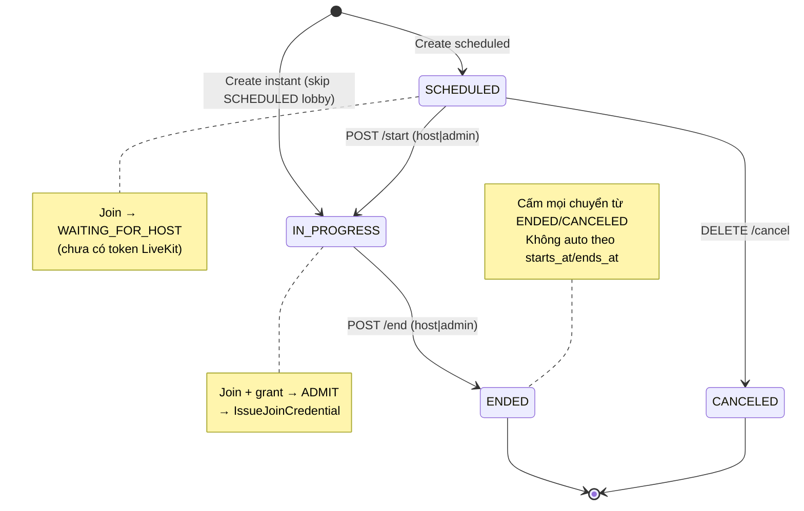


### Chuyển trạng thái cho phép


| Từ          | Đến         | Trigger                                     |
| ----------- | ----------- | ------------------------------------------- |
| SCHEDULED   | IN_PROGRESS | `POST /meetings/{id}/start`                 |
| SCHEDULED   | CANCELED    | `DELETE /meetings/{id}` hoặc `POST /cancel` |
| IN_PROGRESS | ENDED       | `POST /meetings/{id}/end`                   |


### Cấm

- IN_PROGRESS → CANCELED
- Mọi chuyển từ ENDED / CANCELED

Mọi chuyển dùng **conditional UPDATE + version** trong cùng transaction với audit log.

---


## 4. Mô hình dữ liệu (ERD rút gọn)

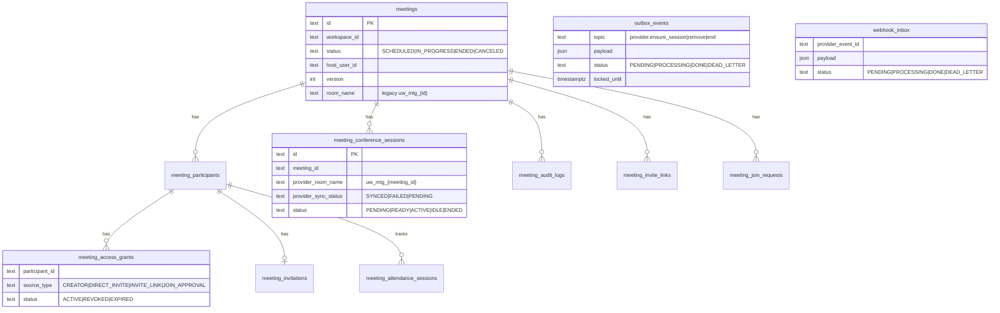


### Định danh LiveKit (opaque)


| Khái niệm            | Giá trị                           | Hàm helper                          |
| -------------------- | --------------------------------- | ----------------------------------- |
| Room name            | `uw_mtg_{meeting_id}`             | `meetings.RoomNameForMeeting()`     |
| Participant identity | `uw_participant_{participant_id}` | `meetings.IdentityForParticipant()` |
| Token TTL            | mặc định 30 phút                  | env `LIVEKIT_TOKEN_TTL`             |


Nguồn sự thật phòng provider là `meeting_conference_sessions`, không phải cột legacy `meetings.room_name`.

---


## 5. Luồng tạo họp lịch → Start → Mở phòng LiveKit

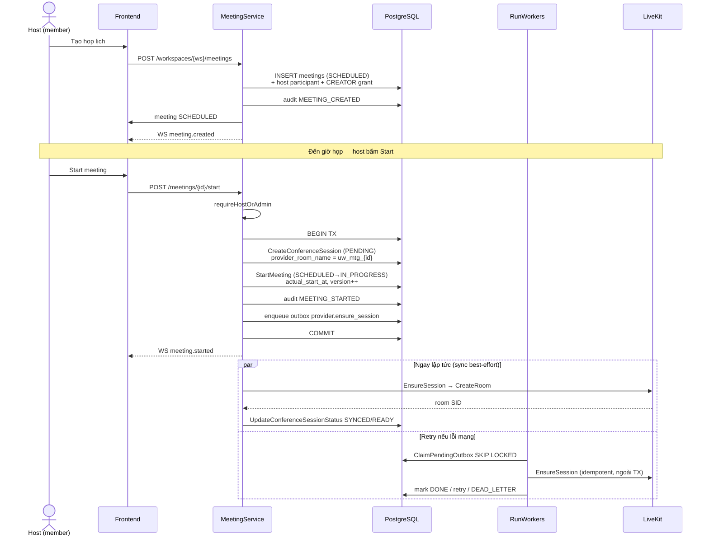


**File liên quan:** `server/internal/service/meeting_lifecycle.go` — `Start()`, `ensureProviderSession()`

---


## 6. Luồng Instant Meeting

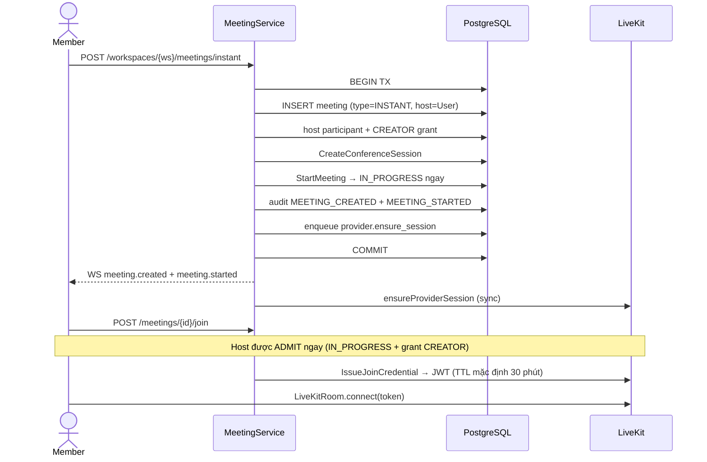


**File liên quan:** `server/internal/service/meeting_lifecycle.go` — `CreateInstant()`

---


## 7. Luồng Join / Admission

Mọi cấp credential (kể cả route deprecated `POST .../token`) đều gọi `Evaluate` trước, rồi `IssueJoinCredential` khi `ADMIT`.

**P4 — hot path read-only:** `POST /join` **không** gọi sync `ensureProviderSession()`. Chỉ đọc `provider_sync_status`; nếu chưa `SYNCED` → `WAITING_FOR_PROVIDER`. Outbox worker (hoặc sync best-effort ở Start/Instant) đảm nhiệm ensure; khi session SYNCED, `recordConferenceEnsure` publish WS `conference.session_ready` để lobby retry ngay.

### Sơ đồ quyết định

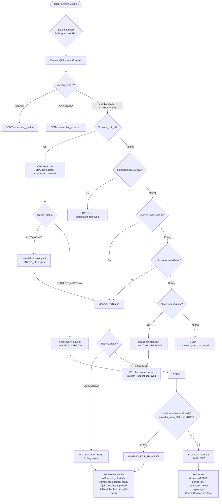


### Kết quả admission


| Decision           | Ý nghĩa                                 | Token LiveKit                      |
| ------------------ | --------------------------------------- | ---------------------------------- |
| `ADMIT`            | Được vào phòng                          | Có (`participant_token`, TTL mặc định 30 phút) |
| `WAITING_FOR_PROVIDER` | Provider chưa READY/SYNCED | Không |
| `WAITING_FOR_HOST` | Meeting SCHEDULED, chưa start | Không |
| `WAITING_APPROVAL` | Join request PENDING                    | Không                              |
| `DENY`             | Không có quyền / đã bị gỡ / đã kết thúc | Không                              |


### Frontend: kết nối phòng

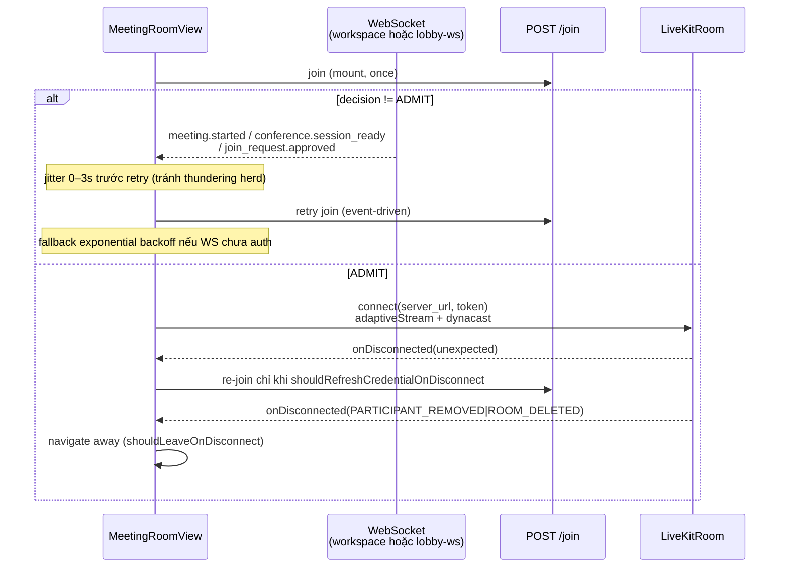


**File liên quan:**

- Backend: `server/internal/service/meeting_admission.go`, `meeting_guest.go`, `meeting_queries.go` (`recordConferenceEnsure`)
- Backend lobby WS: `server/internal/service/meeting_lobby.go`, `server/internal/realtime/meeting_lobby_ws.go`
- Frontend: `packages/views/meetings/room-view.tsx`, `meeting-lobby.tsx`, `use-lobby-join-retry.ts`, `room-connection.ts`
- Frontend lobby WS: `packages/core/realtime/meeting-lobby-provider.tsx`, `apps/web/app/invite/meeting/[linkId]/room/page.tsx`

---


## 8. Luồng Invite Link (public)

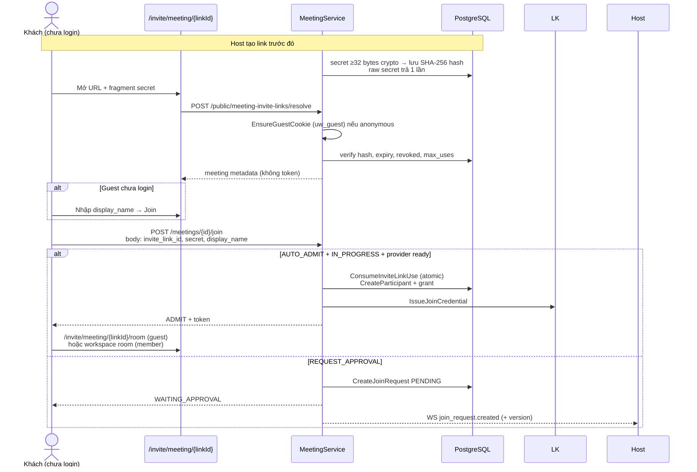


- Raw secret chỉ trả **một lần** khi tạo link; FE giữ ở URL fragment `#secret=`
- Revoke: `revoked_at` + revoke grant `INVITE_LINK`

**File liên quan:** `server/internal/service/meeting_links.go`, `meeting_guest.go`, `packages/views/meetings/public-invite-view.tsx`, `apps/web/app/invite/meeting/[linkId]/room/page.tsx`

---


## 9. Luồng Join Request (approve/reject)

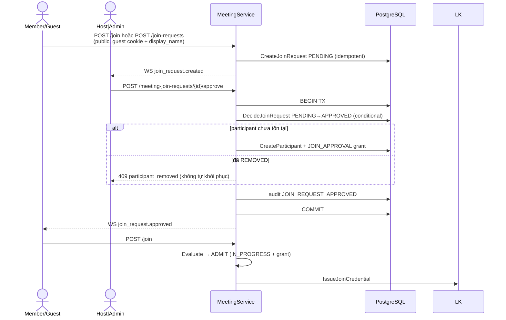


---


## 10. Luồng Remove Participant

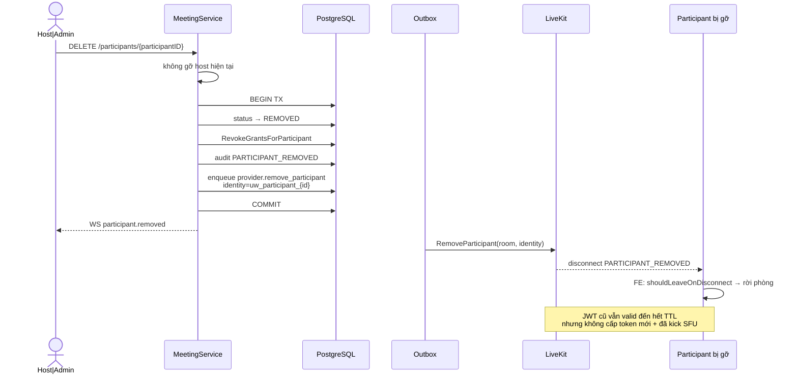


**File liên quan:** `server/internal/service/meeting_participants.go` — `RemoveParticipant()`

---


## 11. Luồng End Meeting

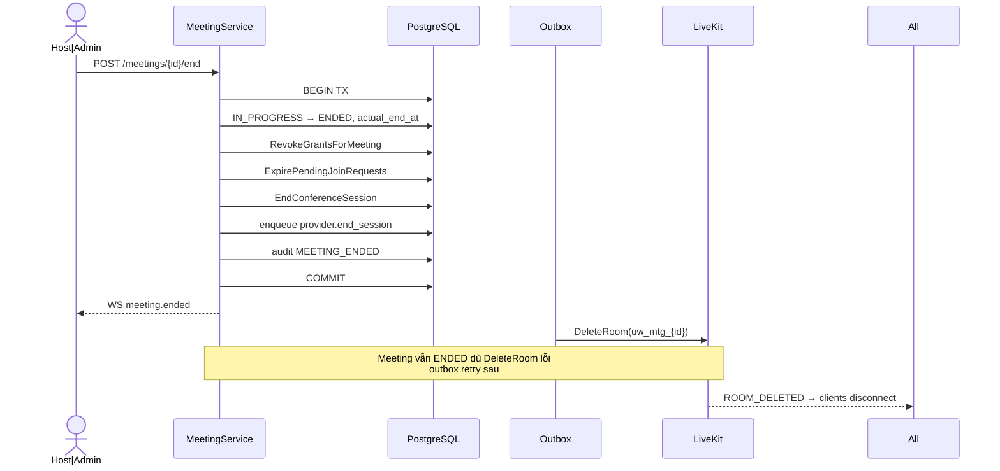


Meeting vẫn `ENDED` nếu `DeleteRoom` lỗi — outbox worker retry sau.

---


## 12. Luồng Webhook LiveKit → Attendance

Webhook **không** thay đổi `meetings.status`. Handler enqueue inbox và trả 200 ngay; worker xử lý async.

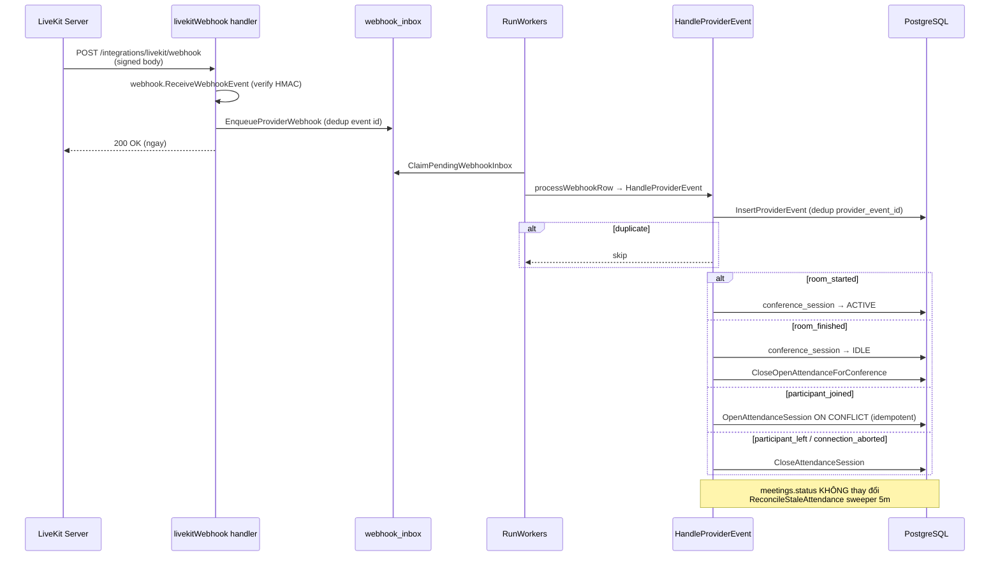


### Map sự kiện LiveKit → neutral


| LiveKit event                    | ProviderNeutralEvent                        | Hành động DB                                  |
| -------------------------------- | ------------------------------------------- | --------------------------------------------- |
| `room_started`                   | `conference.room_started`                   | Session → ACTIVE                              |
| `room_finished`                  | `conference.room_finished`                  | Session → IDLE                                |
| `participant_joined`             | `conference.participant_joined`             | Open attendance                               |
| `participant_left`               | `conference.participant_left`               | Close attendance                              |
| `participant_connection_aborted` | `conference.participant_connection_aborted` | Close attendance (reason: connection_aborted) |


**File liên quan:**

- Handler: `server/internal/handler/meeting_token.go` — `livekitWebhook()`
- Worker: `server/internal/service/meeting_webhook.go` — `EnqueueProviderWebhook`, `ProcessWebhookInbox`, `ReconcileStaleAttendance`, `ReconcileProviderDesync`
- Service: `server/internal/service/meeting_queries.go` — `HandleProviderEvent()`

---


## 13. Outbox Worker (retry provider ops)

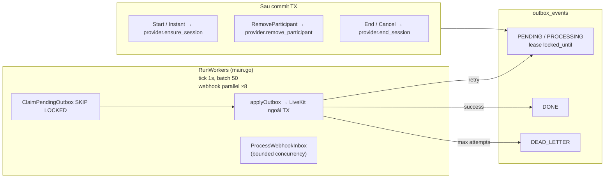

Worker khởi chạy trong `server/cmd/server/main.go`:

```go
go meetingSvc.RunWorkers(runCtx)
```

Env tunable (mặc định): `MEETING_WORKER_TICK=1s`, `MEETING_OUTBOX_BATCH=50`, `MEETING_WEBHOOK_BATCH=50`, `MEETING_WEBHOOK_CONCURRENCY=8`.

`ensureProviderSession()` vẫn được gọi **ngay sau commit** ở Start/Instant (best-effort sync); **không** gọi trên `POST /join` (P4). Outbox là nguồn retry, cập nhật `provider_sync_status`, và publish `conference.session_ready` khi SYNCED.

**P5 — desync auto-heal:** `ReconcileProviderDesync` (5m) enqueue `provider.ensure_session` khi meeting `IN_PROGRESS` nhưng room LiveKit IDLE.

**Migration 034:** index `(status, next_attempt_at) WHERE status = 'PENDING'` trên `webhook_inbox` — claim pending nhanh hơn.

---


## 14. Realtime WebSocket (Control Plane → Frontend)

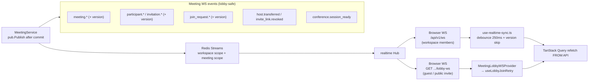

**Dual publish:** lobby events (`meeting.started`, `join_request.approved`, `conference.session_ready`, …) được publish cả workspace scope lẫn meeting scope (`ScopeMeeting`) để guest route không cần workspace WS.

**Quy tắc:** payload WS mang `meeting_id` + `version`; cache không ghi trực tiếp từ frame — luôn refetch API. Lobby dùng WS events để trigger join (jitter 0–3s), không poll 4s. Guest lobby WS: `GET /api/v1/meetings/{meetingID}/lobby-ws` — rate limit 30 connect/min/IP.

**File liên quan:** `packages/core/realtime/use-realtime-sync.ts`, `invalidate-scheduler.ts`, `meeting-lobby-provider.tsx`, `packages/views/meetings/use-lobby-join-retry.ts`, `server/internal/realtime/meeting_lobby_ws.go`

---


## 15. Stack Frontend phòng họp

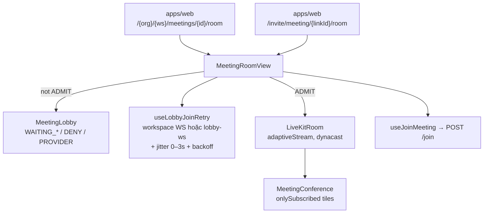


### Hành vi FE quan trọng


| Hành vi | Chi tiết |
| --- | --- |
| Join on mount | Gọi `POST /join` một lần khi vào phòng (read-only provider check) |
| Lobby retry | WS `meeting.started` / `conference.session_ready` / `join_request.approved` → retry join với jitter 0–3s; fallback backoff 10s→60s |
| Guest lobby WS | Route public `/invite/.../room` bọc `MeetingLobbyWSProvider` → `GET .../lobby-ws` |
| Token refresh | **Không** timer proactive; re-join chỉ khi LiveKit disconnect bất thường |
| LiveKit opts | `adaptiveStream`, `dynacast`, `onlySubscribed: true` |
| Disconnect | Rời trang khi `PARTICIPANT_REMOVED`, `ROOM_DELETED`, `ROOM_CLOSED` |
| Public guest | `/invite/meeting/{linkId}` → resolve + guest cookie → join → `/room` |
| Host panel | Start/end/cancel, invite, RSVP, join requests, remove, transfer, invite links |


---


## 16. Bảng tóm tắt API theo vai trò


| Vai trò | Hành động    | Endpoint                                    | LiveKit liên quan                      |
| ------- | ------------ | ------------------------------------------- | -------------------------------------- |
| Host    | Start        | `POST /meetings/{id}/start`                 | EnsureSession + outbox                 |
| Host    | End          | `POST /meetings/{id}/end`                   | DeleteRoom + outbox                    |
| Host    | Cancel       | `DELETE /meetings/{id}` (SCHEDULED)         | end_session nếu có session             |
| Host    | Remove       | `DELETE /meetings/{id}/participants/{id}`   | RemoveParticipant + outbox             |
| Host    | Approve join | `POST /meeting-join-requests/{id}/approve`  | User tự join sau                       |
| Member  | Join         | `POST /meetings/{id}/join`                  | IssueJoinCredential khi ADMIT (120/min/IP) |
| Public  | Resolve link | `POST /public/meeting-invite-links/resolve` | Mint `uw_guest` (60/min/IP) |
| Public  | Join         | `POST /meetings/{id}/join`                | IssueJoinCredential khi ADMIT (120/min/IP) |
| Public  | Join request | `POST /meetings/{id}/join-requests`       | Guest/member (60/min/IP) |
| Public  | Cancel request | `POST /meeting-join-requests/{id}/cancel` | Requester |
| Public  | Lobby WS     | `GET /meetings/{id}/lobby-ws`               | Guest listen-only; 30 connect/min/IP |
| Guest   | Room         | `/invite/meeting/{linkId}/room` (FE)      | LiveKitRoom + MeetingLobbyWSProvider |
| LiveKit | Webhook      | `POST /integrations/livekit/webhook`        | Enqueue inbox → worker |
| Legacy  | Token        | `POST /meetings/{id}/token` (deprecated)    | Header `Deprecation`; dùng `/join` |


---


## 17. Chạy local LiveKit

```bash
# Terminal 1 — LiveKit (tách khỏi Postgres/Redis chính)
docker compose -f docker-compose.livekit.yml up
```

Thêm vào `.env`:

```env
LIVEKIT_URL=ws://localhost:7880
LIVEKIT_API_KEY=devkey
LIVEKIT_API_SECRET=secret_must_be_at_least_32_chars
MEETING_PROVIDER=livekit
LIVEKIT_TOKEN_TTL=30m
# Worker tuning (optional — defaults: 1s tick, batch 50, webhook ×8)
# MEETING_WORKER_TICK=1s
# MEETING_OUTBOX_BATCH=50
# MEETING_WEBHOOK_BATCH=50
# MEETING_WEBHOOK_CONCURRENCY=8
# Để trống (0) = control plane owns lifecycle; LiveKit empty timeout 24h
# LIVEKIT_ROOM_EMPTY_TIMEOUT=0
```

Production mẫu: `livekit.production.yaml.example`.

Restart API:

```bash
make start
```

Cấu hình LiveKit dev: `livekit.dev.yaml`. Port: `7880` (WS), `7881`, UDP `50000-50020`.

---


## 18. Tham chiếu mã nguồn


| Thành phần                    | Đường dẫn                                                                    |
| ----------------------------- | ---------------------------------------------------------------------------- |
| ConferenceProvider interface  | `server/internal/meetings/provider.go`                                       |
| LiveKit adapter               | `server/internal/meetings/livekit.go`                                        |
| Fake provider (tests)         | `server/internal/meetings/fake.go`                                           |
| MeetingService                | `server/internal/service/meeting.go`                                         |
| Lifecycle (start/end/instant) | `server/internal/service/meeting_lifecycle.go`                               |
| Admission / join              | `server/internal/service/meeting_admission.go`                               |
| Participants / RSVP / remove  | `server/internal/service/meeting_participants.go`                            |
| Invite links                  | `server/internal/service/meeting_links.go`                                   |
| Guest cookie                  | `server/internal/meetings/guest_cookie.go`                                   |
| Webhook inbox + workers       | `server/internal/service/meeting_webhook.go`                               |
| Reconcile / metrics           | `server/internal/service/meeting_reconcile.go`, `meeting_metrics.go`         |
| Meeting lobby WS              | `server/internal/service/meeting_lobby.go`, `realtime/meeting_lobby_ws.go` |
| Meeting metrics (Prometheus)  | `server/internal/metrics/meetings.go`, `meeting_lag.go`                      |
| Webhook + outbox + stats      | `server/internal/service/meeting_queries.go`                                 |
| WS event payloads + version   | `server/internal/service/meeting_events.go`                                  |
| HTTP routes                   | `server/internal/handler/router/meetings.go`                                 |
| Webhook handler               | `server/internal/handler/meeting_token.go`                                   |
| Worker bootstrap              | `server/cmd/server/main.go` (`RunWorkers`)                                   |
| Migrations D08a + scale       | `008_*` … `029_*`, `030_outbox_events_lease`, `031–033_webhook/attendance`, `034_webhook_inbox_pending_idx` |
| FE public invite              | `packages/views/meetings/public-invite-view.tsx`                             |
| FE guest room route           | `apps/web/app/invite/meeting/[linkId]/room/page.tsx`                           |
| FE room view                  | `packages/views/meetings/room-view.tsx`                                      |
| FE lobby retry                | `packages/views/meetings/use-lobby-join-retry.ts`                            |
| FE lobby                      | `packages/views/meetings/meeting-lobby.tsx`                                  |
| FE conference UI              | `packages/views/meetings/meeting-conference.tsx`                             |
| FE hooks / API                | `packages/core/meetings/hooks.ts`, `packages/core/api/endpoints/meetings.ts` |
| Realtime sync                 | `packages/core/realtime/use-realtime-sync.ts`, `invalidate-scheduler.ts`     |
| Guest lobby WS (FE)           | `packages/core/realtime/meeting-lobby-provider.tsx`                          |
| Load test (k6)                | `scripts/load/`                                                              |
| Kế hoạch triển khai           | `docs/meeting-livekit-implementation-plan.md`                                |
| Kế hoạch scale P4–P6          | `docs/meeting-scale-upgrade-plan.md`                                         |
| Báo cáo nghiệm thu D08a       | `docs/meeting-d08a-delivery.md`                                              |

---

## 19. Production scale — observability & partition

### Prometheus metrics (control plane)

| Metric | Type | Ý nghĩa |
| --- | --- | --- |
| `uniwork_meeting_join_decisions_total{decision}` | counter | ADMIT / WAITING_* / DENY |
| `uniwork_meeting_outbox_oldest_pending_seconds` | gauge | Tuổi job outbox cũ nhất (alert > 30s) |
| `uniwork_meeting_webhook_inbox_oldest_pending_seconds` | gauge | Tuổi webhook inbox cũ nhất |
| `uniwork_meeting_provider_desync_total` | counter | Meeting IN_PROGRESS nhưng room LiveKit IDLE |

### Grafana alert gợi ý

- Outbox lag > 30s trong 5 phút → page on-call
- Webhook inbox lag > 60s → kiểm tra worker / DB lock
- `provider_desync` tăng → kiểm tra `LIVEKIT_ROOM_EMPTY_TIMEOUT` (nên để 0 = control plane owns lifecycle)

### Partition strategy (khi volume cao)

Chưa partition trong D08a. Khi `meeting_audit_logs` hoặc `meeting_attendance_sessions` vượt ~50M rows/workspace lớn:

1. **Range partition theo tháng** trên `joined_at` / `created_at` (attendance, audit).
2. Giữ hot path (meetings, participants, grants) không partition — workspace-scoped, index B-tree đủ.
3. Archive cold partitions sang object storage trước khi DROP partition cũ.
4. Chạy benchmark trước khi bật — `scripts/load/meeting-join.k6.js`.

### Load test

Xem `scripts/load/README.md` — k6 scenarios cho `/join` admission và lobby wait.

---

## ConferenceProvider interface (tóm tắt)

```go
type ConferenceProvider interface {
    Key() string
    Capabilities(ctx context.Context) ConferenceCapabilities
    EnsureSession(ctx context.Context, req EnsureSessionRequest) (ProviderSessionRef, error)
    IssueJoinCredential(ctx context.Context, req IssueJoinCredentialRequest) (JoinCredential, error)
    RemoveParticipant(ctx context.Context, req RemoveProviderParticipantRequest) error
    UpdateParticipant(ctx context.Context, req UpdateProviderParticipantRequest) error
    EndSession(ctx context.Context, req EndProviderSessionRequest) error
}
```

Token LiveKit: `RoomJoin`, `CanSubscribe` / `CanPublish` / `CanPublishData`, **không** `RoomAdmin`.