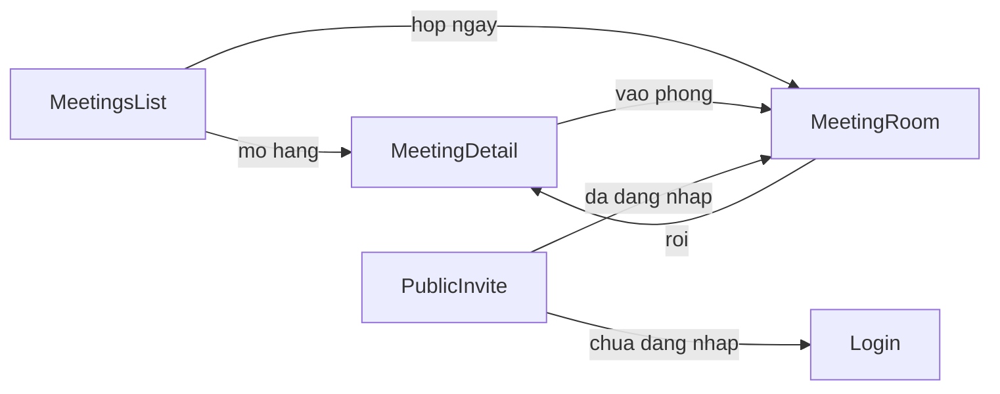

# Meeting UI D08a — kế hoạch triển khai giao diện

UniWork là Meeting Control Plane. LiveKit chỉ cung cấp phòng media. Frontend không tự quyết định quyền, không dùng API key / RoomAdmin, và chỉ kết nối LiveKit khi UniWork trả `decision === "ADMIT"` kèm `participant_token` và `server_url`.

Tài liệu này ghi hiện trạng đã khảo sát và phạm vi Must have. Specs/plans viết tiếng Việt; comment trong code tiếng Anh.

## 1. Hiện trạng frontend

Skeleton đã có: list upcoming/past, dialog 3 trường, chi tiết + host panel thô, phòng `VideoConference` sau `POST /join`, trang public resolve link.

Thiếu so với UR-MTG-01…11: form lên lịch đủ field, badge trạng thái/RSVP, sửa cuộc họp, quản lý link, xin vào phía requester, xác nhận chuyển chủ trì, timeline, thống kê/lọc/phân trang, poll lobby, `useWorkspaceEvents` trên detail/room.

Stack giữ nguyên: Next.js App Router, TanStack Query, sonner, Lucide, shadcn/Base UI, i18n `t()`. Không có `PageContainer`, TanStack Form, nuqs, Storybook.

## 2. Design system tái sử dụng

- Chrome: `CollectionPageHeader`, `CollectionPageState`, `BreadcrumbHeader`, `PAGE_GUTTER`. Thân trang `mx-auto w-full max-w-2xl` như members.
- Form: `Field` / `FieldGroup` / `FieldLabel`, `Input`, `Textarea`, `Select`, `Switch`, `TimeInput`.
- List: bordered `<table>`, không lồng Card, không `DataTable`.
- Badge outline/secondary/destructive cho status/RSVP/link.
- `AlertDialog` cho huỷ, kết thúc, chuyển chủ trì.
- Member pick: `useMembers` + checkbox list.
- Permissions: `useMeetingPermissions` (host hoặc ws owner/admin).

## 3. Màn hình

1. Danh sách — `/{org}/{ws}/meetings`
2. Chi tiết — `/{org}/{ws}/meetings/{id}`
3. Phòng — `/{org}/{ws}/meetings/{id}/room`
4. Public invite — `/invite/meeting/{linkId}#secret=`
5. Dialog: lên lịch, họp ngay, sửa, tạo link, xác nhận huỷ/kết thúc/chuyển chủ trì

## 4. Sơ đồ điều hướng

## 5. User flow

- Lên lịch: title, description, ngày, giờ bắt đầu/kết thúc, timezone (`Asia/Ho_Chi_Minh`), attendees, `allow_join_request`. Chủ trì = người tạo.
- Họp ngay: title + attendees → instant → invite → vào room.
- RSVP: PENDING / ACCEPTED / DECLINED / TENTATIVE.
- Vào phòng: `POST /join`. ADMIT → LiveKit. WAITING_* → lobby + poll 4s. DENY → không token.
- Link mời: name, expiry, AUTO_ADMIT | REQUEST_APPROVAL, max_uses. Secret chỉ lúc tạo. Trạng thái derive: active / expired / revoked / limit_reached.
- Xin vào: requester `POST join-requests`. Host duyệt/từ chối, badge số PENDING, không popup.
- Chuyển chủ trì: AlertDialog, chỉ USER ACTIVE là member.

## 6. Phân quyền giao diện

Host hoặc workspace owner/admin: start, end, cancel, update, invite, remove, links, transfer, approve/reject. Member: tạo, xem, RSVP, join. Frontend không suy quyền từ việc có token LiveKit.

## 7. State matrix

| Status | Host | Member |
| --- | --- | --- |
| SCHEDULED | Start, Sửa, Huỷ, Mời, Link, Transfer. Join → WAITING_FOR_HOST | RSVP, Join → lobby |
| IN_PROGRESS | End, Sửa (không đổi giờ), Mời/Gỡ, Link, Transfer, badge xin vào | Join nếu ADMIT |
| ENDED / CANCELED | Chỉ xem + timeline | Chỉ xem |

## 8. Component tree

`meetings-page-view` → stats, filters, table, dialogs. `meeting-detail-view` → RSVP, participants, host-panel (links, join requests, transfer), activity, notes. `room-view` → lobby hoặc LiveKit + host dock. `public-invite-view`.

## 9. API mapping

Dùng đủ route Control Plane: list+filter+total, create (đủ body), instant, PATCH, start/end/cancel, participants, invitations/RSVP, invite-links list/create/revoke, join-requests create/list/approve/reject/cancel, join, statistics, activity. Không dùng deprecated `/token` cho phòng mới.

## 10. Realtime

`useWorkspaceEvents` trên list, detail, room. Invalidate list/detail/participants/invitations/joinRequests/inviteLinks/activity/stats. Payload id-only, không ghi cache từ frame.

## 11. LiveKit connection

`POST /join` → chỉ `LiveKitRoom` khi ADMIT + token + url. Re-join trước `expires_at`. Giữ `VideoConference`, overlay host dock. Không RoomAdmin.

## 12. Responsive

Desktop: header + bảng. `<md`: filter Select, bảng scroll-x, room full viewport. `CollectionPageHeaderAction` icon+label.

## 13. Accessibility

Chữ trên hành động quan trọng. Icon có `aria-label`. Focus outline global. Touch ≥ 44px. `switch` status/RSVP/decision có `default`.

## 14. Loading / empty / error / offline

Skeleton hàng. `CollectionPageState` empty/error. Toast `common.error`. Không mock hàng. Offline = error, không giả dữ liệu.

## 15. File tạo

`docs/meeting-ui-implementation-plan.md`; `packages/core/meetings/status.ts`; các file views: status-badge, stats-row, filters, list-table, instant-dialog, edit-dialog, member-multi-picker, rsvp-bar, participants-section, invite-links-section, join-requests-panel, transfer-host-dialog, activity-timeline, lobby, room-host-dock.

## 16. File sửa

`packages/core/types/meeting.ts`, `api/endpoints/meetings.ts` + test, `meetings/hooks.ts` + test, `realtime/use-realtime-sync.ts` + test, `i18n/locales/{vi,en}.json`, toàn bộ `packages/views/meetings/*`, pages web chỉ thêm callback instant → room.

## 17. Thứ tự triển khai

Core API/hooks → list/form → detail/host → activity → room/LiveKit → test/lint/typecheck/build.

## 18. Test plan

Endpoint malformed; `inviteLinkStatus`; `isJoinAdmitted`; realtime keys; list badge/filter; create body; host Start; RSVP 3 nút; transfer dialog; room không mount LiveKit khi chưa ADMIT; secret không render trên list link.

## 19. Rủi ro

VideoConference lệch token — wrapper tối thiểu. TTL 2 phút — phải re-join. Dual approve — disable nút. Instant invite sau create có thể fail từng người — toast.

## 20. Must / Should / Backlog

Must: đủ UR-MTG-01…11 trừ field backend không hỗ trợ (project, host lúc tạo, in-room). Should: theme LiveKit sâu, tên actor trên timeline. Backlog: calendar, recording, transcript, AI, guest cookie, recurring, nuqs.
