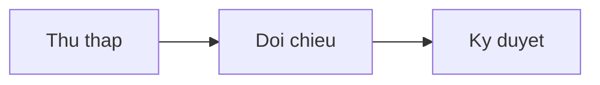

# Báo cáo tổng hợp năm 2026

Tài liệu kiểm thử tiếng Việt: dấu huyền, sắc, hỏi, ngã, nặng; chữ Đ và đ; tổ hợp ư, ơ, ă, â, ê, ô.

## Bang so lieu

| Hạng mục | Quý I | Quý II |
| --- | --- | --- |
| Doanh thu | 1.250.000.000 | 1.410.000.000 |
| Chi phí | 780.000.000 | 820.000.000 |
| Lợi nhuận | 470.000.000 | 590.000.000 |

## Cong thuc va so do

Cong thuc tinh lai: $E = mc^2$ va khoi inline `SUM(B2:B4)`.



```js
const tong = [1, 2, 3].reduce((a, b) => a + b, 0);
console.log("Tong:", tong);
```

## Lien ket tai nguyen


Lien ket tuong doi: [chi tiet](assets/notes.txt)

> Ghi chu trich dan: noi dung giu nguyen khi luu.

- Muc mot
- Muc hai
  - Muc hai phan cap

Ket thuc tai lieu. Tieng Viet co dau: Tài liệu kiểm thử tiếng Việt: dấu huyền, sắc, hỏi, ngã, nặng; chữ Đ và đ; tổ hợp ư, ơ, ă, â, ê, ô.
