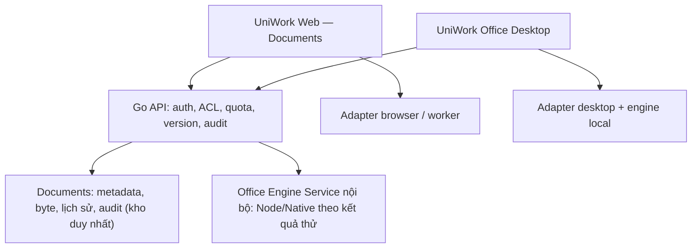

# UniWork Office — bản đồ tích hợp và ma trận đổi brand (BRAND-01)

> **Trạng thái:** in-progress — bản 1a (2026-09-16) theo BRAND-01/INT-01 trong spec G0.
> Đây là **ma trận bề mặt cần đổi**, không phải bằng chứng đã đổi. Nhiều giá trị đích
> còn để trống và thuộc DOC-002/DOC-004/DOC-005.

> **Quy ước đường dẫn.** Không path nào dưới đây tính từ thư mục của file này; tất cả là
> citation của sibling checkout, không phải link tương đối trong repo.
>
> - Dạng `../genoffice` và `../.uniwork-dev/...` tính **từ repo checkout `dev-uniwork/`**
>   (root workspace = `D:/.Vietants_Project/uniwork-workspace`; `dev-uniwork/../genoffice`
>   = `<workspace>/genoffice`, có thật; `dev-uniwork/../.uniwork-dev/office-g0` =
>   `<workspace>/.uniwork-dev/office-g0`, có thật).
> - Dạng `dev-uniwork/...` tính **từ root workspace**.
>
> Viết `../genoffice` mà tính từ root workspace sẽ trỏ tới `D:/.Vietants_Project/genoffice`,
> **không** tồn tại.

**Issue:** UNI-665 (DOC-001) · **Parent:** UNI-656.
**Spec:** `Documents + Office G0` — file nguồn ở workspace tổng:
`dev-uniwork/docs/superpowers/specs/2026-09-16-documents-office-g0-design.md` §2.1, §8.1.
File đó **không** nằm trên branch này (`git ls-tree`/`git log --all` không thấy), nên
link tương đối cũ ở đây là **link chết** và đã được thay bằng đường dẫn thật.
**FE spec:** [Yêu cầu FE cho G0](../../superpowers/specs/2026-09-16-documents-office-fe-design.md) §8.
**ADR ràng buộc:** 0018 (0018 §Ràng buộc giấy phép và thương hiệu) và ADR kế thừa dự kiến.

Quy tắc nền: **GenOffice là tên nguồn upstream; UniWork Office là tên sản phẩm.** Tên
upstream chỉ được còn ở nơi có lý do truy vết/nâng cấp/giấy phép, và không bao giờ hiện
thành brand sản phẩm.

---

## 1. Nguyên tắc

1. **Tên hiển thị sản phẩm:** `UniWork Office`, viết đúng từng ký tự.
2. **Tên kỹ thuật/slug:** `uniwork-office` — dùng cho namespace kỹ thuật, không dùng làm
   chuỗi hiển thị.
3. **Không ghi đè bản GenOffice đang cài.** App/bundle id, scheme, thư mục dữ liệu và
   kênh cập nhật phải khác upstream; không nhận binary mang brand cũ qua feed upstream.
4. **Giữ attribution.** `LICENSE`, `NOTICE`, commit gốc đã fork, và tên engine trong
   metadata kỹ thuật được giữ. Không thay chuỗi hàng loạt trong license, tài liệu người
   dùng hoặc metadata tác giả.
5. **Giữ nội dung người dùng.** Theme/rebrand chỉ tác động chrome ứng dụng, **không** đổi
   màu, font, logo hay nội dung bên trong file người dùng.
6. **Loại `/ee`.** Không có đường dẫn `/ee` trong bản fork UniWork Office; có bước kiểm CI.
7. **Kiểm bằng máy + kiểm bằng UI thật.** Scan chuỗi chỉ là một nửa; nửa còn lại là
   screenshot/UI trên binary thật Windows/macOS.

---

## 2. Bản đồ tích hợp (INT-01)

Luồng dữ liệu và trách nhiệm; vị trí runtime từng thao tác còn chờ DOC-003/004.

| Lớp | Trách nhiệm | Nguồn | Nhóm nhận |
| --- | --- | --- | --- |
| Nguồn upstream (pin) | Source + dependency cần dùng, pin commit/checksum, giữ LICENSE/NOTICE, patch có ghi nguồn | `../genoffice` (đọc) → bản thử `../.uniwork-dev/office-g0/` | G0 task 2 |
| Module engine dùng chung | Đọc/ghi/chuyển đổi theo khả năng; entry point browser tách khỏi Node/Electron/native; không chứa auth/ACL | GenOffice `packages/*-engine`, `*-gateway` | G2 (UNI-658) |
| Editor UniWork | Canvas + thao tác; nối Documents, toolbar, theme/i18n, brand | UniWork Office canvas | G3 (UNI-659), G4 |
| Backend Go | Quyền, quota, phiên bản, commit, audit/outbox; gọi engine nội bộ | `server/` + Documents | G1 (UNI-657) |
| Office Engine Service | Parse/serialize/render/convert hoặc tác vụ native phía server; không sở hữu tài khoản/ACL/kho phiên bản | Service nội bộ | G2, G7 |
| Host desktop | Dùng module/editor qua adapter; filesystem, kho token, native process thuộc host; tài liệu cloud commit qua cùng API Documents | UniWork Office | G4, G5 (UNI-660) |

**Ranh giới dữ liệu (không thương lượng):** Documents sở hữu định danh, byte, phiên bản,
quyền, nhật ký (ADR 0016). Office **không** có kho phiên bản riêng, không có tài khoản
riêng, không có đường chia sẻ riêng.

---

## 3. Ma trận bề mặt đổi brand

Cột "Đích" ghi `UniWork Office` khi giá trị đã chốt, hoặc `(DOC-004/005 chốt)` khi chưa.
Nguồn hiện tại là **bằng chứng đọc source** tại `../genoffice` commit
`09485f884dc845cf3bf27fb7edfe489f9d457aad`, không phải kết quả chạy.

| # | Bề mặt | Nguồn hiện tại | Đích | Owner | Phép kiểm |
| --- | --- | --- | --- | --- | --- |
| B-01 | Product name (packaging) | `apps/shell/package.json` `"productName": "GenOffice"` | `UniWork Office` | G4 | Đọc manifest build + screenshot About/taskbar trên binary thật |
| B-02 | App id / bundle id | `electron-builder.cjs` `appId: 'com.genoffice.app'` | Namespace `uniwork-office` (giá trị cụ thể: DOC-004/005 chốt) — **khác** upstream | G4 | Cài cạnh GenOffice: hai app cùng tồn tại, không ghi đè |
| B-03 | Executable name | `executableName: 'genoffice'` | `(DOC-004 chốt)` theo `uniwork-office` | G4 | Kiểm file cài, shortcut, PATH |
| B-04 | Artifact name | `artifactName` deb/rpm `genoffice_…` | `(DOC-004 chốt)` | G4, G7 | Kiểm tên file phát hành + release feed |
| B-05 | Update feed | `GENOFFICE_UPDATE_URL`, `publish.url` | Kênh riêng của UniWork Office | G4 | Update không nhận binary upstream; không mất nháp |
| B-06 | Deep link / URL scheme | khảo sát apps/shell — chưa chốt | Scheme riêng theo `uniwork-office` | G4, G5 | Cài cạnh GenOffice: callback không mở nhầm app |
| B-07 | File association | `electron-builder` fileAssociations | Giữ định dạng hỗ trợ; đăng ký theo app id mới | G4 | Mở file từ Explorer/Finder mở đúng UniWork Office |
| B-08 | Icon / app icon / installer icon | `apps/shell/build/`, `src/renderer/src/assets/` (có `genoffice-logo.svg`, `app-icon.png`, icon định dạng) | Bộ icon UniWork lấy từ `packages/ui/brand/` của **UniWork** (có `svg/app-icon*`, `wordmark*`, `mark*`, `logo.tsx`, `assets.lock.json`). Nguồn thiết kế **không** ở upstream: `../genoffice` không có `packages/ui/brand` | G3, G4 | Screenshot icon trên taskbar/Dock/installer |
| B-09 | Renderer HTML title / favicon | `apps/shell/src/renderer/index.html`, `update.html` | `UniWork Office` / favicon UniWork | G4 | Mở app, mở trang update |
| B-10 | Home / launcher | `apps/shell/src/renderer/src/Home.tsx` | Tên + IA UniWork | G4 | Kiểm màn mở đầu và luồng vào editor |
| B-11 | About / Settings / help | khảo sát app shell | `UniWork Office` + phiên bản + provenance | G4, G7 | UI thật trên binary |
| B-12 | i18n / locale | `@genoffice/i18n` | Bộ vi/en UniWork; giữ `UniWork`/`UniWork Office` không dịch | G3, G4 | Parity vi/en; không chuỗi brand cũ trong UI |
| B-13 | Login / provider surfaces | `apps/shell/src/main/`, integrations | Danh tính UniWork; không lộ endpoint upstream | G4, G5 | Đăng nhập bằng tài khoản UniWork trên binary thật |
| B-14 | Telemetry / analytics | `apps/shell/src/main/analytics.ts` | Theo chính sách UniWork; không gửi dữ liệu ra endpoint upstream | G4, G7 | Kiểm cấu hình + không có request ra host lạ |
| B-15 | User-data / cache / keychain namespace | khảo sát electron main | Namespace `uniwork-office`, tách khỏi GenOffice | G4, G5 | Cài cạnh nhau, kiểm thư mục dữ liệu + kho token riêng |
| B-16 | Web nav + editor chrome | UniWork hiện tại (chưa có Documents) | Mục nav `documents`, tint orange; tên UniWork Office khi mở file Office | G1, G3 | E2E + screenshot web |
| B-17 | Installer metadata (deb/rpm/nsis/dmg) | `electron-builder.cjs` deb control, StartupWMClass, fpm name | Metadata + StartupWMClass theo tên mới | G4, G7 | Cài trên Windows/macOS; taskbar/Dock đúng tên |
| B-18 | Thư mục `/ee` | Upstream có `/ee` (phải kiểm ở task 2) | **Không** tồn tại trong bản fork | G0 task 2, G2 | Bước kiểm CI: fail nếu có đường dẫn `/ee` |

### 3.1 Attribution **được giữ** (không phải brand sản phẩm)

| # | Mục | Vì sao giữ |
| --- | --- | --- |
| A-01 | `LICENSE` (Apache-2.0) | Bắt buộc theo giấy phép |
| A-02 | `NOTICE` + owner Mainfunc, Inc. | Bắt buộc theo giấy phép |
| A-03 | Commit gốc đã fork + provenance engine | Truy vết + nâng cấp |
| A-04 | Tên package/import nội bộ `@genoffice` | Truy vết/nâng cấp, không hiện thành brand sản phẩm |
| A-05 | Tên engine trong metadata kỹ thuật (ví dụ `docx-engine`) | Chứng minh engine nào tạo/patch file |

**Không giữ:** tên/logo GenOffice–Genspark trong UI, title, menu, About, installer,
shortcut, icon, thông báo, hay bất kỳ chuỗi hiển thị nào cho người dùng.

---

## 4. Phép kiểm nghiệm thu (giao cho G2/G3/G4/G7)

| Kiểm | Cách làm | Giao cho |
| --- | --- | --- |
| Không còn brand upstream ngoài allowlist | Scan chuỗi + screenshot UI/bộ cài thật; không chỉ grep | G7 (UNI-661) |
| Cài cạnh GenOffice không xung đột | Cài cả hai; kiểm app id, dữ liệu, shortcut, deep link | G4 |
| Update không quay về binary upstream | Trỏ feed riêng; kiểm app-update.yml + một chu kỳ update | G4, G7 |
| Theme không đổi nội dung file | Mở file, đổi theme chrome, save, so byte nội dung | G3 |
| Thư mục `/ee` không tồn tại | Bước kiểm CI trên bản fork | G2 |
| LICENSE/NOTICE còn nguyên | So với nguồn upstream | G2, G7 |
| Cùng tài khoản/quyền/lịch sử web↔desktop | Mở cùng tài liệu hai nơi; lưu một nơi, nơi kia nhận đúng | G4, G7 |

Mọi mục trên cần **bằng chứng thật** (binary, screenshot, log lệnh) trước khi được coi
đạt. Giá trị "chưa chốt" trong §3 không được tự điền ở tài liệu này.
