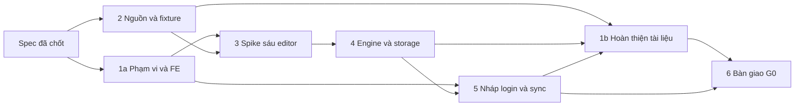

# Documents + UniWork Office — kế hoạch thực thi G0

> **Trạng thái:** in-progress — người dùng đã cho triển khai ngày 2026-09-16.
> DOC-001a, DOC-002 và mô hình thử DOC-005 đang thực thi; checkbox chỉ đánh dấu
> khi có bằng chứng đã qua kiểm tra. QA macOS/Safari thật chuyển backlog UNI-671.

**Issue của plan:** UNI-656 · Parent UNI-437 · Roadmap C-01, liên quan C-15/C-16.
> **Cập nhật 2026-09-25 (quyết định của người dùng):** với G0, mỗi cổng chu
> trình lõi chỉ cần hàng chạy trong trình duyệt nhúng của Orca (Chromium) trên
> Windows; mỗi hàng ghi rõ phiên bản Orca, phiên bản Chromium nhúng, chuỗi
> giao thức engine/adapter có phiên bản trên đường lưu và định danh engine.
> Chrome/Edge trên Windows đã cài và macOS/Safari trở thành phần hoãn ghi
> nhận cho giai đoạn sau (UNI-671); các hàng scoped Chrome/Edge/Chromium đã
> nghiệm thu vẫn hợp lệ như hàng không thuộc cổng.

**Spec:** [Documents + Office G0](../specs/2026-09-16-documents-office-g0-design.md).
**Nguồn checklist:** `DOCUMENTS_OFFICE_CHECKLIST.md` tại workspace tổng.
**Yêu cầu hiện tại:** worker Terra xhigh triển khai; Claude Code review UI,
Cursor review phần không phải UI qua Orca orchestration; main tổng hợp findings,
quyết hướng sửa và giao lại worker.
Theo quyết định mới nhất ngày 2026-09-17, worker Terra xhigh được spawn thành
subagent ngay trong thread điều phối; reviewer vẫn nhận Task/Dispatch qua Orca.
Sau khi subagent không nhận được task qua cả spawn/follow-up, người dùng đã
cho phép tạm dùng lại Terra xhigh qua Orca; đây là tuyến triển khai hiện tại.
Mỗi worker cần brief đầy đủ và xác nhận đã nhận đúng phạm vi. Terra trả patch text;
main kiểm tra, áp patch và chạy kiểm chứng. Worker không sửa trực tiếp repo,
commit/push hoặc tự nhận vai trò điều phối. Cả hai reviewer chỉ đọc/review,
không nhận fix ở vòng 3-4 như quy trình cũ; mọi finding được main giao lại Terra cho đến
khi đạt. Các lần lỗi hạ tầng không tính thành vòng sửa. Đọc lịch sử bên dưới
như quyết định cũ, không dùng để đổi vai trò hiện tại.
Khi Claude kết thúc vì lỗi API, tạm giao Cursor review UI; quay lại Claude khi
khả dụng. Tab hoàn tất được đóng sau khi lưu báo cáo/nội dung còn cần dùng;
chỉ giữ tab có công việc tiếp nối hoặc vai trò điều phối đang cần.
**Nhánh điều phối/tích hợp:** `feature/UNI-656-documents-office-g0` từ `develop`;
các task có nhánh issue riêng, chỉ tích hợp phần đã được review.

## 1. Mục tiêu và ranh giới

Hoàn tất DOC-001..006 bằng thiết kế có bằng chứng: kiểm kê đầy đủ khả năng
GenOffice, chứng minh sáu luồng editor trên browser thật, chọn runtime và
contract dùng chung, chốt auth/sync/phiên bản và bàn giao phạm vi pilot kèm
ước lượng đã cập nhật cho G1-G7.

Đích sản phẩm là **UniWork Office**, tên kỹ thuật/slug **`uniwork-office`**: tích hợp năng lực GenOffice vào Documents của
UniWork trên web và ứng dụng desktop cùng danh tính, quyền, phiên bản và audit.
GenOffice tiếp tục chỉ tên upstream trong kiểm kê/provenance. Yêu cầu đổi brand
do người dùng xác nhận ngày 2026-09-16 đã được ghi thành BRAND-01 trong spec.

G0 tạo spike, fixture và contract có thể kiểm lại. G1-G7 mới triển khai kho
Documents, editor tích hợp sản phẩm, ứng dụng Office, sync đầy đủ, AI và release.
Không bật feature cho tenant thật, migrate dữ liệu thật hoặc phát hành bộ cài
chỉ vì spike đạt. UI lab và mô hình protocol phải mang nhãn thử nghiệm.

Các quyết định bắt buộc:

| Quyết định | Hệ quả trong plan |
| --- | --- |
| Q1-B | Pilot phải có toàn bộ năng lực upstream được kiểm kê/xác minh trên web và desktop. Spike cơ bản đạt chưa có nghĩa pilot đạt |
| Q2-A | PDF phải sửa được nội dung có lớp chữ; OCR scan ở mốc sau. Annotation hoặc thêm lớp chữ đè không thay cho sửa nội dung đã cam kết |
| Q3-B | Windows/macOS; Chrome/Edge/Safari. Kết quả WebKit tự động không thay cho Safari thật  Phạm vi trình duyệt của G0 (quyết định 2026-09-25): mọi cổng core-cycle chỉ cần hàng chạy trên Orca embedded browser (Chromium) trên Windows; Chrome/Edge cài sẵn và macOS/Safari không bắt buộc ở G0, ghi nhận hoãn ở giai đoạn sau (UNI-671). Các hàng scoped đã nhận vẫn hợp lệ như hàng không phải cổng. |
| Q4-A | Engine ở browser/worker hoặc hạ tầng nội bộ UniWork/on-premise; không chuyển file sang nhà cung cấp Office/OCR ngoài |
| Q5-A | Pilot sync online; thư viện offline và hàng đợi đầy đủ ở G5 trước M2 |
| Q6 | Nhóm triển khai tự xây bộ mẫu đầy đủ theo ma trận; mẫu doanh nghiệp là phần bổ sung |
| Q7-B | Chuyển đổi có mất mát phải cảnh báo và tạo Document bản sao theo lựa chọn chủ động; giữ bản gốc, lịch sử, quyền và nguồn gốc |
| Q8-A | Bảo vệ và giữ nháp chưa sync sau logout; cùng tài khoản, quyền hiện tại và base version hợp lệ mới phục hồi/gửi |
| Q9-A | File chủ yếu dưới 50 MiB là dải đo ban đầu; không tự đổi quota/trần upload hoặc nhận mọi file nhỏ là nhẹ |
| BRAND-01 | Tích hợp GenOffice vào UniWork; tên hiển thị `UniWork Office`, tên kỹ thuật/slug `uniwork-office`; thống nhất UI, metadata, bộ cài và product identity; giữ attribution và nội dung tài liệu |
| INT-01 | Hướng thử ưu tiên: module nội bộ trong monorepo + editor tích hợp + engine service nội bộ khi cần; DOC-002/003/004 chứng minh và chốt runtime từng thao tác |
| QA-01 | Tiếp tục dev/kiểm Windows; kiểm thực tế trên Mac của team chuyển backlog UNI-671. Giữ mục tiêu Mac/Safari, chưa nhận đã nghiệm thu nền tảng |

### 1.1 Mô hình tích hợp và cách triển khai thử

Áp dụng [spec §8.1](../specs/2026-09-16-documents-office-g0-design.md#81-mô-hình-tích-hợp-ưu-tiên--int-01).
Mô hình này xác định cách tổ chức nguồn và ranh giới trách nhiệm để bắt đầu G0;
phân bổ từng engine vào browser/desktop/service là kết quả phải thử, không là
cam kết đã đạt. ADR thay thế 0018 chỉ hoàn thiện sau bằng chứng task 3/4.

| Thành phần | Phương án ưu tiên | Nơi xác minh/chốt |
| --- | --- | --- |
| Source GenOffice | Nhập chọn lọc vào vùng riêng trong monorepo, pin commit và dependency; giữ patch/provenance/LICENSE/NOTICE, loại `/ee` | Task 2; package layout cuối ở task 4 |
| Engine/module dùng chung | Đóng gói nội bộ, expose API qua adapter; entry point browser không kéo Node/Electron/native vào client | Task 3 và 4 |
| Editor | Tích hợp canvas/chức năng vào Documents, dùng UI/token/i18n UniWork; thay bridge Electron bằng adapter theo host | Requirement task 1; lab task 3; production G3/G4 |
| Backend Go | Sở hữu auth/ACL/quota/commit version/audit; cấp dữ liệu và gọi engine nội bộ | Contract task 4/5; production G1/G2 |
| Office Engine Service | Process/container riêng cho Node/Rust hoặc xử lý phía server; có thể cùng máy với UniWork và có trong bộ on-premise | Task 3/4; production G2/G7 |
| Desktop | Dùng chung module/editor và adapter local; filesystem/token/native process thuộc host, tài liệu cloud dùng API Documents | Task 4/5; production G4/G5 |

Trong G0, nguồn thử nằm ở `../.uniwork-dev/office-g0/` như task 2.4; script và
manifest có trong repo. Khi đưa vào production, mã nguồn/dependency được pin
trong quy trình build của monorepo; không yêu cầu máy khác có `../genoffice`
hoặc symlink đến checkout của người dùng. Ban đầu chưa tách repo hoặc private
npm registry riêng; quyết định tách sau chỉ khi có nhu cầu phát hành độc lập.

Vị trí production dự kiến dưới đây là **vai trò để bàn giao, chưa phải file đã
tạo**; task 4 chốt tên package/entry point sau dependency inventory:

- Vùng nguồn upstream riêng trong monorepo: chỉ source/dependency cần dùng và
  patch đã ghi nhận; không trộn tùy biến auth/storage/brand sâu vào engine.
- Module engine/contract độc lập host: parser/serializer và type dùng chung,
  dependency browser/server tách rõ; không tự đưa vào UI primitives.
- `packages/views/`: UI Office dùng chung; `packages/core/`: logic nghiệp vụ và
  endpoint qua transport hiện có; `packages/ui/`: primitive/token.
- `apps/web/platform/` và host desktop: bridge cho worker/IPC, filesystem và
  các API riêng của nền tảng. Browser editor dùng adapter được inject.
- `server/`: adapter Go gọi service engine nội bộ; service Node/Rust có entry
  point/build/deployment riêng trong monorepo, không đưa vào binary Go.

Thao tác tương tác xử lý tại client; thử TypeScript engine trong worker khi
phù hợp và đo độ trễ phép tính cần service. Không mặc định gọi server cho mỗi
phím gõ. Go quản lý job, quyền và commit; engine chỉ nhận input được cấp phạm
vi, trả output/lỗi. Token service không vào client. Dừng engine không được làm
hỏng danh sách tài liệu, tải bản gốc hoặc mất nháp.

Task 3/4 phải ghi bằng chứng cho dependency closure, độ tách biệt browser/native,
khả năng thay transport, fidelity theo runtime và build tái lập. Dùng cùng engine
version giúp giảm sai lệch nhưng không thay kiểm thử theo từng nền tảng.

## 2. Tiền kiểm và nguồn đã đọc

| Thành phần | Bằng chứng khi lập plan | Cách dùng |
| --- | --- | --- |
| UniWork | `develop` nền `97b4fa59`; spec G0 đang là file local chưa commit | Lúc thực thi đọc lại HEAD, issue và worktree; không ghi đè thay đổi của task khác |
| GenOffice | Người dùng cung cấp `D:/.Vietants_Project/uniwork-workspace/genoffice`; HEAD `09485f884dc845cf3bf27fb7edfe489f9d457aad`, worktree sạch lúc đọc | Đầu vào khảo sát, chưa phải commit engine đã được nghiệm thu/pin chính thức |
| Dependency GenOffice | Có `package-lock.json`, `LICENSE`, `NOTICE`, source Rust; chưa có `node_modules` ở checkout lúc đọc | Có bước chuẩn bị dependency/build trong task 2-3; không coi user đã clone là build đã đạt |
| Nguồn lịch sử | Checklist khảo sát `a4d8e1a0a3a232685e8f430339b58ea153467ad1`; adapter UniDigital ghi `d24c964a3e693a52d9fece4fef03a4de34d0d853` | So sánh và ghi provenance; không mang kết quả phiên bản cũ sang bản mới |
| UI UniWork | `packages/ui/components.json`: shadcn `base-nova`; Base UI, token chung; ESLint package chạy được `v9.39.5` | Tái dùng thiết kế hiện có; không dựng design system khác cho Office |
| GenOffice renderer | `apps/*/src/preload`, `src/shared/ipc.ts` và các `vite.renderer.config.ts` | Có renderer dev server nhưng chưa chứng minh bridge mở/lưu chạy trong browser |
| Sheets | `apps/sheets/native/xlsx-engine`, `packages/xlsx-gateway`, renderer Univer; tài liệu architecture có mục production gaps | Kiểm source/runtime từng khả năng; không dùng mô tả tài liệu để tự xác nhận hoặc phủ định tính năng |
| PDF | `apps/pdf/src/shared/ipc.ts` có `TextEditInput`, save và content-stream image operations | Kiểm save thật; tên package mô tả viewer không đủ kết luận PDF chỉ xem được |
| Runtime dependency | UniWork React `19.2.3`, TipTap override `3.30.6`; GenOffice Docs khai React `19.2.4`, TipTap `3.31.0` | Spike phải ghi phiên bản thực tế; không nâng dependency toàn sản phẩm chỉ để thử engine |
| Brand upstream | `apps/shell/package.json` còn `productName: GenOffice`; `apps/shell/electron-builder.cjs` còn `appId: com.genoffice.app`; có icon và updater riêng | Kiểm kê identity/assets/update trước port; chỉ đổi title chưa đủ thành UniWork Office |

Trước mỗi task, worker đọc `UNIAI_COORDINATION.md`, `dev-uniwork/CLAUDE.md`,
`docs/engineering/UNIAI_TRACKING.md` và issue/comments. Với checkout khác, dùng
đường dẫn tuyệt đối của guide tại workspace này. Chỉ coordinator ghi UniAI.
Nhánh thực thi lấy issue của task; không dùng nhánh tài liệu UNI-656 để trộn mã
của nhiều sub-issue. Worker làm trên worktree riêng trong workspace, main tổng
hợp và tích hợp các phần đã review; không ghi đè thay đổi của worker khác.

## 3. Task và phụ thuộc

Coordinator đã xác nhận sáu sub-issue dưới UNI-656 từ request
`01a0aa84-6226-7373-885d-1e098a21db25:documents-office-g0-plan:sub_issue:8`.
Ánh xạ được xác nhận với assignee `mtruong.dev`; UniAI là nơi tra tiến độ hiện
tại. Khi bắt đầu thực thi, UNI-656/665/666/669 được chuyển `in_progress`.
QA-01 có issue backlog riêng UNI-671 theo quyết định mới của người dùng.

| Task | Checklist | Sub-issue | Đầu ra chính | Phụ thuộc |
| --- | --- | --- | --- | --- |
| 1 | DOC-001 | UNI-665 | Đồng bộ phạm vi, ADR và requirement FE | 1a bắt đầu từ spec; 1b hoàn tất sau 2/4/5 |
| 2 | DOC-002 | UNI-666 | Nguồn/license, capability matrix, fixture | Spec đã chốt; dùng requirement 1a khi có |
| 3 | DOC-003 | UNI-667 | Spike sáu editor và báo cáo browser/fidelity | Bộ mẫu và nguồn task 2; requirement 1a |
| 4 | DOC-004 | UNI-668 | Contract engine/editor/storage và runtime | Kết quả task 3, ma trận task 2 |
| 5 | DOC-005 | UNI-669 | Contract login/sync/nháp và fault harness | Nháp từ 1a; chốt sau task 4 và thử nghiệm liên quan |
| 6 | DOC-006 | UNI-670 | Nghiệm thu G0, estimate/pilot, bàn giao | 1b và task 2-5 có bằng chứng |

1a/1b là hai bước của cùng task/issue, không có vòng phụ thuộc: spike dùng phạm
vi đã chốt ở 1a; tài liệu kiến trúc cuối cùng dùng kết quả spike ở 1b. Task 5
có thể dựng mô hình lỗi sớm, nhưng chưa chốt protocol trước khi biết cách lưu
và đơn vị phiên bản của task 4.

## 4. Vị trí đầu ra dự kiến

Đường dẫn dưới đây tính từ root `dev-uniwork`, trừ nơi ghi khác. Những file ghi
“tạo” **chưa tồn tại**; chúng là đầu ra các task, không phải bằng chứng đã có.

| Path dự kiến | Task | Nội dung |
| --- | --- | --- |
| `docs/superpowers/specs/2026-09-16-documents-office-fe-design.md` (tạo) | 1 | Screen map, wireframe luồng chung, component/state/responsive/accessibility requirements |
| `docs/office/g0/uniwork-office-integration-brand.md` (tạo) | 1/2/4/5/6 | Bản đồ tích hợp, source/asset/identity đổi brand, ngoại lệ attribution, owner G1-G7 và nghiệm thu |
| `docs/adr/drafts/documents-office-runtime.md` (tạo, sau đó đưa thành ADR được chấp nhận) | 1/4 | Thay quyết định DOCX-only; số ADR cấp lúc thực thi |
| `docs/office/g0/README.md` (tạo) | 2/6 | Mục lục, hướng dẫn tái lập, phân loại bằng chứng |
| `docs/office/g0/source-manifest.json` (tạo) | 2 | Commit, allowlist source/dependency, runtime, license/NOTICE và checksum |
| `docs/office/g0/capabilities.json` + `capability-matrix.md` (tạo) | 2/3 | Dữ liệu máy đọc và bảng khả năng; upstream/web/desktop tách riêng |
| `docs/office/g0/fixtures/manifest.json` (tạo) | 2 | Fixture ID, nguồn/license, checksum, tính năng, thao tác/kết quả chuẩn |
| `docs/office/g0/browser-proof.md` + `evidence-index.json` (tạo) | 3 | Kết quả từng tổ hợp, file đầu ra, render/diff và môi trường |
| `docs/office/g0/engine-contract.md` (tạo) | 4 | INT-01: module/entry point, runtime placement, request/result/error, lifecycle, version, resource budget và deployment |
| `docs/office/g0/login-sync-contract.md` (tạo) | 5 | Sequence, quyền, phiên, phiên bản, cursor, retry, xung đột, nháp |
| `docs/office/g0/pilot-handoff.md` (tạo) | 6 | Phạm vi M1/M2, ngưỡng, estimate, blocker, issue nhận bàn giao |
| `scripts/office-g0/` (tạo) | 2-5 | Script kiểm manifest, chuẩn bị source thử, chạy/kiểm bằng chứng và harness |
| `e2e/office-g0/` và `e2e/playwright.office-g0.config.ts` (tạo) | 3 | Test browser lab riêng, không giả làm route sản phẩm |
| `../.uniwork-dev/office-g0/` (phát sinh, trong workspace tổng) | 2-5 | Bản source thử, dependency/cache/build, dữ liệu fixture lớn, output; không chứa dữ liệu sản phẩm thật |

Giữ fixture nhỏ, metadata và script tái tạo có license trong Git. File lớn,
render, trace và output lưu ở vùng bằng chứng; ghi đường dẫn bền hoặc vị trí
artifact, checksum và lệnh tái tạo. Không chỉ đưa đường dẫn máy cá nhân không
thể truy xuất làm bằng chứng duy nhất khi bàn giao PR.

## Task 1 — DOC-001: phạm vi, ADR và yêu cầu FE

**Issue:** UNI-665. **Bàn giao:** hợp đồng phạm vi và UI cho G1/G2/G3/G4.

**Đọc:** spec G0; ADR 0016/0018 và `docs/adr/README.md`; C-01 §1-13;
`docs/roadmap/FEATURE_ROADMAP.md`; `PRODUCT.md`; `docs/conventions.md`;
`packages/ui/components.json`, `packages/ui/styles/tokens.css`; Documents FE cũ
§7. File design-system-rework còn ghi chưa được PO duyệt: không dùng nó để tự
đổi theme toàn sản phẩm.

**Sửa khi thực thi:** spec C-01, roadmap, ADR index/trạng thái 0018 ở bước 1b;
checklist workspace chỉ cập nhật phạm vi/bằng chứng liên quan, không tick trước.

- [x] **1a.1 — Lập bảng thay thế yêu cầu.** Đối chiếu từng mệnh đề DOCX-only,
  web chỉ xem, preview hoãn, bình luận, C-15/C-16, sync và cộng tác. Mỗi hàng có
  yêu cầu mới, nguồn Q/DOC, mục tài liệu đổi và nhóm nhận triển khai. Giữ quyền
  Work Product của C-01 §13; tách CRDT page cũ khỏi cộng tác Office ở ADV-001.
- [x] **1a.2 — Viết requirement FE riêng.** Bao phủ thư viện/cây tài liệu,
  tạo/upload, detail/editor shell, chọn editor theo khả năng, tab/toàn màn hình,
  chuyển web-desktop, thư viện cloud desktop, chia sẻ/phiên bản và trạng thái
  lưu/sync. Các flow Q7 tạo bản sao, Q8 logout/khôi phục và conflict có từng bước,
  quyền, nút hành động, hủy, lỗi và kết quả dữ liệu; không chỉ ghi tên màn hình.
- [x] **1a.3 — Vẽ wireframe và state map của luồng chung.** Chốt vị trí breadcrumb,
  toolbar, canvas, panel, trạng thái lưu; ghi khác biệt cần thiết giữa sáu editor.
  Có empty/loading/error/read-only/dirty/saving/saved/conflict/recovery, thao tác
  bàn phím, focus, sáng/tối, responsive và vi/en. Dùng shadcn/Base UI/token hiện
  có; màu dữ liệu tài liệu không bị đổi theo theme của chrome.
- [x] **1a.4 — Ghi phạm vi pilot và chuẩn bị ADR draft.** Q1-B là điều kiện pilot,
  Q2-A là ngoại lệ OCR; Q8 là phục hồi nháp chứ chưa mở rộng thành offline web.
  Draft dùng INT-01 làm hướng thử; runtime còn chờ task 3/4, không đóng dấu
  accepted cho giả thuyết.
- [x] **1a.5 — Đặc tả tích hợp và brand UniWork Office.** Web mở sáu editor trong
  Documents; desktop dùng tài khoản, quyền và lịch sử chung. FE spec chốt cách
  dùng tên hiển thị `UniWork Office`, tên kỹ thuật/slug `uniwork-office`, logo/icon/favicon, title/menu/About/Settings, trạng thái
  và vi/en trên token UniWork. Lập ma trận bề mặt cần đổi, đích thiết kế, owner
  và phép kiểm; phân biệt attribution được giữ với brand sản phẩm phải thay.
  Kiểm đường dẫn từ thư viện vào editor và chuyển web-desktop, không chỉ màn mở đầu.
- [ ] **1b.1 — Sau task 2/4/5, hoàn thiện ADR thay thế.** Lấy số ADR trống ở HEAD
  khi thực thi; giữ nội dung lịch sử 0018, đánh dấu superseded khi quyết định mới
  được chấp nhận; thêm chỉ mục. Phân biệt quyết định của người dùng, lựa chọn kỹ
  thuật có bằng chứng và câu hỏi còn chặn.
- [ ] **1b.2 — Đồng bộ hợp đồng chính thức.** Sửa C-01/roadmap trong cùng PR phạm
  vi; coordinator cập nhật UNI-635/UNI-636 và issue liên quan, readback bằng chứng.
  Đồng bộ requirement FE với khả năng/contract đã thử trước khi bàn giao G1/G3/G4.

**Kiểm:** không còn câu cũ có hiệu lực trái scope mới; mỗi màn/flow có nguồn yêu
cầu và nơi thực thi; đường chia sẻ/phục hồi không vượt quyền; kiểm link, ADR
number/status và checklist phạm vi. Chạy `node --test scripts/governance.test.mjs`
khi cập nhật ADR/index. Không đòi test UI runtime cho wireframe chưa có code.
BRAND-01 phải có ma trận riêng, bao phủ cả desktop packaging; brand không thay
nội dung/metadata tác giả trong tài liệu hoặc license upstream.

**Đạt:** tài liệu thiết kế đủ làm đầu vào cho spike và các nhóm sau; runtime
không còn placeholder trong ADR chính thức; issue/roadmap đã được coordinator
xác nhận đồng bộ. Chỉ hoàn tất 1a chưa đủ đóng DOC-001.

## Task 2 — DOC-002: nguồn, khả năng và bộ mẫu

**Issue:** UNI-666. **Bàn giao:** manifest và fixture có thể tái lập.

**Đọc source:** `../genoffice/CLAUDE.md`, root/app/package manifests, LICENSE,
NOTICE, lockfile; `apps/{docs,sheets,slides,pdf,markdown,html}/src/{main,preload,shared,renderer}`;
`packages/{docx-engine,pptx-engine,pptx-render,xlsx-gateway,file-parse}` và
`apps/sheets/native/xlsx-engine`. Đây là bản đồ khảo sát, không giả định các app
có cấu trúc con hoàn toàn giống nhau.

- [ ] **2.1 — Pin nguồn có kiểm chứng.** Đọc HEAD/status và chênh lệch với nguồn
  khảo sát cũ. Manifest ghi commit cụ thể, runtime, lockfile checksum, package
  closure, license/NOTICE và cách dựng lại. Không pin nhãn `latest`; thư mục
  `/ee` và mã không được cấp phép không được đi vào bản thử được tái sử dụng.
- [ ] **2.2 — Kiểm kê các đường thao tác.** Đi từ menu/toolbar đến bridge và
  engine; ghi mọi định dạng import/export và tính năng nội dung upstream có.
  Tách `upstream có`, `phải port`, `web đã chứng minh`, `desktop đã chứng minh`.
  Gắn yêu cầu Q1-B, ngoại lệ OCR và phần ADV-002 rõ; nút UI tồn tại chưa phải đạt.
- [ ] **2.3 — Xây fixture theo tính năng.** Mỗi capability có ít nhất một ca,
  expected result và ca kết hợp/biên thích hợp; tiếng Việt, font, bảng/ảnh,
  công thức liên sheet, biểu đồ, theme/layout, PDF chữ/ảnh, Markdown/HTML asset.
  Tạo dải file dưới/sát 50 MiB; kiểm riêng độ phức tạp và kích thước giải nén.
  File hỏng/password/không hỗ trợ có kết quả mong đợi rõ, không tự chạy macro.
- [ ] **2.4 — Tạo bộ chuẩn bị source thử.** Source người dùng là đầu vào đọc;
  chuẩn bị bản thử trong `../.uniwork-dev/office-g0/` từ manifest/allowlist.
  Ghi patch của spike và checksum để tái lập, không sửa checkout nguồn của user
  hoặc copy nguyên `/ee`. Output/cache của npm/Electron/Rust/browser nằm trong
  workspace được phép; thiếu quyền/khả năng môi trường thì ghi đúng giới hạn.
  Ghi đủ dependency trực tiếp/gián tiếp và entry point để tách module theo INT-01;
  kiểm chuẩn bị lại ở thư mục sạch, không dựa vào dependency global hoặc symlink
  source. Hướng dẫn bàn giao phân biệt nguồn lab với nguồn build production.
- [ ] **2.5 — Kiểm dependency/build prerequisites.** Ghi Node/npm/Rust/Cargo,
  toolchain native, bộ font và renderer prerequisites. GenOffice có lockfile:
  dùng cài đặt tái lập ở bản thử; không chạy install/upgrade vào monorepo sản
  phẩm chỉ để giải xung đột phiên bản của spike.
- [ ] **2.6 — Viết kiểm manifest/fixture.** Từ chối source không đúng commit,
  checksum sai, đường dẫn ngoài bộ mẫu, fixture thiếu kỳ vọng hoặc capability
  được nhận hỗ trợ nhưng không có ca kiểm. Giữ fixture gốc bất biến khi chạy.
- [ ] **2.7 — Kiểm kê tích hợp và brand upstream.** Bắt đầu từ
  `apps/shell/package.json`, `apps/shell/electron-builder.cjs`, `apps/shell/build/`,
  `apps/shell/src/renderer/src/assets/`, `apps/shell/src/main/updater.ts`; mở rộng
  đến sáu app, i18n, help/login/provider/telemetry và build scripts. Mỗi mục ghi
  source path, hành vi/asset, thay bằng gì, nơi port trong UniWork và phép kiểm.
  Đưa app ID, file association, URL scheme, cache/keychain namespace, update feed
  vào ma trận; chưa biết giá trị đích thì giao task 4/5 chốt. LICENSE/NOTICE và
  package/provenance được phép giữ tên upstream theo lý do cụ thể; không replace
  mù chuỗi GenOffice/Genspark hoặc tự gửi tài liệu ra endpoint upstream.

**Kiểm:** mọi format/tính năng đã phát hiện có dòng và owner xử lý; không gán
nhãn đạt cho ô chưa thử. Scripts mới phải có negative cases cho checksum,
path và thiếu evidence, không chỉ snapshot chính output do script sinh ra.

**Đạt:** một worker khác chuẩn bị được cùng nguồn/bộ mẫu từ manifest, biết rõ
những gì chưa chứng minh và có thể chạy task 3 mà không cần dữ liệu riêng của user.

## Task 3 — DOC-003: spike sáu editor và bằng chứng browser

**Issue:** UNI-667. **Bàn giao:** `browser-proof.md` và evidence index.

- [ ] **3.1 — Dựng lab browser và transport thật tối thiểu.** Renderer dùng
  adapter browser, tải/lưu file thật trong vùng lab. Engine nội bộ thử chỉ bind
  môi trường test; không dùng phiên/credential sản phẩm. Bridge không trả save
  success giả hoặc chỉ giữ model trong RAM. Lab không xuất hiện ở navigation app.
  Theo INT-01, adapter nhận transport được inject: engine phù hợp chạy worker;
  tác vụ cần service qua cổng lab có cùng ranh giới dự kiến của Go. Cổng lab
  chưa chứng minh auth/permission sản phẩm. Không giả lập Electron toàn cục để
  nhận editor là tương thích web, hoặc đưa secret service vào bundle browser.
- [ ] **3.2 — Thử điểm rủi ro trước.** Sheets: cầu nối Rust/Univer/xlsx-gateway,
  tính lại công thức và serialization; PDF: sửa content-stream chữ/ảnh rồi
  kiểm file kết quả. Sau đó DOCX, PPTX, Markdown, HTML. Có thể thay thứ tự theo
  evidence, nhưng không bỏ một nhóm vì nhóm đó khó port.
- [ ] **3.3 — Với mỗi định dạng, chạy vòng mở-sửa-lưu-đóng-mở lại.** Lưu output,
  checksum, operation log và model/render sau khi mở lại trong phiên mới. So
  với expected content/structure; kiểm phần không sửa và dùng viewer tham chiếu
  khi cần chứng nhận tương thích. Không lấy preview trước save làm kết quả cuối.
- [ ] **3.4 — Kiểm Q7 trên file vượt khả năng bảo toàn.** Cảnh báo đúng phần
  sẽ đổi; hủy không tạo output; chấp nhận tạo bản sao có nguồn gốc; nguồn và
  lịch sử giữ nguyên. Chưa có engine chuyển đổi hợp lệ thì báo blocker, không
  bỏ lỗi nội dung bằng thông báo chung. Fixture thuộc Work Product có ca quyền
  trong contract task 5; lab không được coi là đã chứng minh permission sản phẩm.
- [ ] **3.5 — Đo và phân tách chi phí.** Ghi cold/warm open, parse, render,
  serialization, transfer, memory, page/sheet/formula/object count và kích thước
  nén/giải nén. Dùng các fixture Q9; ghi số lần lặp và sample count. Không báo
  p95/p99 từ vài lần đo hoặc dùng máy khác để che một ca fail.
- [ ] **3.6 — Chạy ma trận nền tảng.** Mục tiêu Chrome/Edge trên Windows,
  Chrome/Edge/Safari trên macOS; ghi OS/browser/CPU/font thực tế. Playwright
  Chromium/WebKit là kiểm bổ sung. Theo QA-01, thực thi phần Windows hiện tại,
  bàn giao lệnh/bộ mẫu/kỳ vọng cho team kiểm Mac ở backlog UNI-671; giữ ô Mac
  chưa nghiệm thu, không báo đạt tương thích đủ Q3-B. Mac không chặn phần dev.
- [ ] **3.7 — Thu failure evidence và cập nhật matrix.** File lỗi, password,
  thiếu font, timeout/hủy, lỗi lưu, restart và rò state giữa các file có kết
  quả đúng. Ghi renderer/main/IPC/native dependency thật và các patch cần cho
  browser. Đánh giá khả năng đưa adapter đã thử vào UniWork với version hiện có.
- [ ] **3.8 — Kiểm mô hình module/adapter INT-01.** Ghi import graph/bundle để
  chứng minh entry point browser không kéo Node/Electron/native; kiểm React,
  TipTap và CSS khi ghép vào môi trường UniWork. Với các đường local/service
  được đề xuất, chạy cùng fixture/operation qua adapter tương ứng; so kết quả
  và lỗi, ghi runtime chưa thử. Mất service/retry/cancel giữ thay đổi trong lab;
  số đo tách latency xử lý và transport. Không nâng catalog sản phẩm để né lỗi.

> **Ghi chú phạm vi 2026-09-25 cho 3.6:** ma trận Chrome/Edge trên Windows và
> Safari trên macOS vẫn là mục tiêu cho giai đoạn sau, không phải điều kiện của
> G0. Phần G0 chỉ cần trình duyệt nhúng Orca trên Windows; ô macOS/Safari giữ
> nguyên trạng thái chưa nghiệm thu.

**Kiểm tối thiểu theo loại:**

| Định dạng | Bằng chứng cần để qua chu trình cơ bản |
| --- | --- |
| DOCX | Đoạn/bảng/ảnh đã sửa tồn tại khi mở lại; phần không sửa, đầu/chân trang/font/bố cục được đối chiếu |
| XLSX | Sửa ô đầu vào, tính lại công thức theo expected result, giữ sheet/công thức/định dạng khi mở lại; thiếu recalculation là blocker |
| PPTX | Sửa chữ/ảnh/shape trong slide, save và mở lại/trình chiếu; so bố cục và object còn lại |
| PDF | Thay chữ/ảnh có sẵn trong nội dung file, save/mở lại; extraction/render chứng minh thay đổi, không chỉ thêm annotation |
| Markdown | Source đúng sau save; bảng/code/Unicode/asset và liên kết tương đối còn dùng được |
| HTML | Source/asset đúng sau save, preview cách ly; nội dung không đọc được phiên app hoặc thoát origin bằng script |

**Đạt:** cả sáu chu trình đã chốt có evidence tái lập, ma trận ghi rõ giới hạn
và môi trường. Khả năng nâng cao Q1-B có coverage inventory và kế hoạch port,
chưa cần toàn G3 xong để đóng spike; nhưng pilot không được nhận khi chúng còn thiếu.
Không đạt một nhóm lõi thì báo blocker/điều kiện còn thiếu, giữ checkbox tương
ứng mở và tiếp tục phần độc lập. Phần macOS/Safari thật được hoãn rõ theo QA-01;
bàn giao dev phải dẫn UNI-671, chưa đồng nghĩa nghiệm thu đủ nền tảng pilot.

## Task 4 — DOC-004: contract engine/editor/storage

**Issue:** UNI-668. **Đọc thêm:** `server/internal/storage/storage.go`,
layering trong CLAUDE, `docs/api-sdi-sdo.md`, auth/membership/audit boundaries.

- [ ] **4.1 — Chọn nơi chạy dựa trên task 3.** Mỗi capability có browser/worker/
  dịch vụ nội bộ/native desktop cụ thể, dependency và fallback được phép. Không
  mặc định Rust thành WASM được hoặc toàn bộ engine vào Node sidecar. Chỉ chọn
  phương án đã có proof hoặc ghi rõ blocker cần thử tiếp.
  Đối chiếu INT-01, giải thích từng sai khác so với mô hình ưu tiên; chỉ hỏi lại
  khi phương án làm đổi phạm vi, chi phí hoặc chính sách người dùng đã chốt.
- [ ] **4.2 — Đặc tả contract.** Capability, open/parse, edit/serialize, convert/
  export, cancel: input/result/error, engine/protocol version, checksum, cảnh
  báo fidelity, deadline và tính idempotent. Schema JSON/byte boundary có ví dụ
  và malformed/error cases; path/file handle của desktop không lộ ra web API.
- [ ] **4.3 — Thiết kế commit và cleanup.** Go service kiểm quyền/quota, nhận
  output đã đủ byte, rồi commit Document/version/metadata/audit/outbox đúng
  transaction. Engine không ghi bảng nghiệp vụ. Xác định owner/lifetime của
  temp object, upload không xong, save lỗi và object mồ côi, retry cleanup.
- [ ] **4.4 — Kiểm contract với adapter thật của spike.** Type/version mismatch,
  malformed result, checksum sai, timeout, cancel-vs-complete race, crash/restart
  phải có kết quả xác định. Engine chết không chặn xem danh sách/metadata/tải
  bản gốc; chỉ thao tác cần engine nhận lỗi rõ.
- [ ] **4.5 — Chốt đóng gói và nâng phiên bản.** Ma trận web/server/desktop,
  private endpoint/auth, resource limits, runtime on-premise, font/license,
  health và metric. Có chiến lược version negotiation và chạy lại fixture khi
  nâng engine; nguyên tắc theme chỉ đổi chrome, không đổi byte nội dung xuất.
- [ ] **4.6 — Chốt điểm tích hợp và identity UniWork Office.** Chỉ rõ phần tái sử
  dụng, adapter, phần thay thế và package/host đích theo boundary UniWork; Documents
  vẫn sở hữu bytes/ACL/version/audit. Product name là `UniWork Office`; tên kỹ thuật
  dùng `uniwork-office`. App/bundle ID,
  executable/installer, icon, association, user-data và update identity theo
  namespace sản phẩm đã kiểm. Chốt cách cùng tồn tại với GenOffice và nâng phiên
  bản không mất nháp; không nhận binary qua feed GenOffice. Namespace kỹ thuật
  chưa có được ghi như đầu ra G0, không giả làm đường dẫn đã tồn tại.
- [ ] **4.7 — Chốt cách đưa module vào monorepo.** Bàn giao source/patch layout,
  public entry point, dependency direction và adapter web/desktop/server; quy
  trình build từ checkout sạch không cần thư mục `../genoffice`. Chọn cách pin
  source/runtime, đối chiếu catalog và giữ code nghiệp vụ ngoài engine. Định nghĩa
  API nội bộ Go-service, quyền của từng job, giới hạn tài nguyên, cleanup và bộ
  cài service cùng host/on-premise. Nêu cách nâng upstream, kiểm fixture theo
  engine/adapter/protocol version và rollback không mất nháp. Tách việc cần
  làm ở G2/G3/G4/G7; chưa phát hành thư viện private hoặc dựng service production.

**Đạt:** không còn thao tác chưa có nơi chạy/chủ thể quyết quyền hoặc kết quả
khi lỗi; ví dụ request/result phù hợp adapter đã thử. Bàn giao contract sang
G1/G2 và trả kết luận cho task 1b. Chưa triển khai service sản phẩm đầy đủ.
INT-01 có module map và build/deployment contract đủ giao cho nhóm thực thi;
mọi entry point được nhận tương thích phải có bằng chứng task 3.

## Task 5 — DOC-005: login, sync, phiên bản và phục hồi nháp

**Issue:** UNI-669. **Đọc:** `server/internal/handler/router/auth.go`,
`server/internal/service/auth.go`, `server/internal/service/idempotency.go`,
`packages/core/auth/`, `packages/core/platform/storage.ts`, `storage-cleanup.ts`,
`workspace-storage.ts`; C-01 §13, Q5/Q7/Q8 và contract task 4.

- [ ] **5.1 — Chọn luồng login desktop.** Dựa trên auth đang có và môi trường
  Windows/macOS: browser hệ thống, MFA, callback/state, one-time code, PKCE hoặc
  device authorization theo phương án được chứng minh. Liệt kê endpoint và
  session-device backend cần bổ sung; cookie web hiện có chưa chứng minh refresh
  desktop đã đúng. Token vào kho bảo mật host, không vào deep link hoặc log.
  Scheme/callback của UniWork Office thống nhất với task 4.6; kiểm khi GenOffice cũng
  đang cài để tránh callback mở nhầm ứng dụng, đồng thời giữ nguyên scope quyền.
- [ ] **5.2 — Chốt version và save protocol.** Phân biệt working revision,
  checkpoint và immutable blob version; mở/lưu với base revision, checksum,
  idempotency key. Kiểm quyền cả lúc mở, upload và commit; stale base giữ hai
  bản. `BeginIdempotent` hiện có phải được đối chiếu thêm payload fingerprint:
  không suy ra cùng key/khác payload đã bị chặn chỉ vì có helper idempotency.
- [ ] **5.3 — Chốt change feed và reconnect.** Định danh theo account/org/ws/doc,
  cursor, pagination, retention, full resync, tombstone, rename/move/archive/
  restore/permissions; realtime chỉ báo thay đổi, cursor bù phần bỏ lỡ. Retry
  không hồi sinh file đã xóa, không replay sang account khác. Chốt phân loại
  lỗi cho 422 của C-01 và 409 của C-16 để client xử lý thống nhất.
- [ ] **5.4 — Đặc tả nháp Q8 và chuyển đổi Q7.** Persistent draft giữ data/base/
  asset cần phục hồi, bảo vệ theo account/host; logout thu hồi phiên nhưng không
  xóa nháp. Đăng nhập lại kiểm account/quyền/document/base; quyền mất thì khóa
  trong app, không xuất/sync nơi khác. Chỉ dọn sau commit được xác nhận hoặc
  hành động bỏ nháp rõ ràng. Bản chuyển đổi tạo Document mới và giữ quyền owner.
- [ ] **5.5 — Dựng reference harness và fault cases.** Lập bảng tình huống trước
  khi dựng mô hình; tách oracle/kỳ vọng khỏi cách mô hình cài đặt. Harness kiểm
  race/retry/reorder/disconnect/restart và transcript protocol, không tạo UI
  giả thành tính năng sản phẩm. Adapter/draft store thử có persistence thật;
  authorization giả lập phải ghi rõ, không gọi là đã kiểm cách ly service thật.
- [ ] **5.6 — Nối contract với FE và phân kỳ.** State/action/error/permission map
  quay lại requirement FE task 1. Recovery khi lỗi lưu/logout thuộc M1; chọn
  file offline/thư viện offline và hàng đợi đầy đủ thuộc G5. Ghi trường/backend
  cần thêm, thứ tự migration/client rollout và các ca E2E phải chạy lại ở G1/G4/G5.

**Ca bắt buộc:** hai save cùng base; retry cùng payload; cùng key khác payload;
mất phản hồi sau commit; commit lỗi không đổi bản hiện hành; logout/restart với
nháp; tài khoản B không đọc/gửi nháp A; A mất quyền; A có quyền nhưng base đã đổi;
quota hết; thu quyền giữa upload và commit; tạo bản sao từ Work Product; tombstone
và cursor hết hạn; client/engine không tương thích; token/code hết hạn hoặc dùng lại.

**Đạt:** mỗi ca có expected state, quyền và cách phục hồi; persistence/protocol
được thử đúng mức harness công bố. G0 chưa thay thế E2E web-server-desktop thật
của G7, hoặc chứng nhận auth/tenant isolation cho mã sản phẩm chưa viết.

## Task 6 — DOC-006: nghiệm thu, pilot và bàn giao

**Issue:** UNI-670. **Đầu vào:** bằng chứng task 1-5, không chỉ mô tả.

- [ ] **6.1 — Đóng evidence register.** Từng capability/fixture/contract case nối
  tới commit/runtime, lệnh, artifact/checksum và kết quả. Tách source-read,
  model/harness, engine round-trip, browser thật và E2E sản phẩm; không lấy mức
  bằng chứng thấp thay mức cao.
  INT-01 có bảng hướng thử/kết quả/quyết định cuối theo từng module/runtime;
  việc chưa chứng minh không được đổi thành quyết định kiến trúc đã đạt.
- [ ] **6.2 — Chốt ngưỡng nghiệm thu theo số đo.** Nội dung/cấu trúc không mất,
  sai khác render ngoài vùng sửa phải được giải thích; thời gian/bộ nhớ/size/
  complexity theo format và máy. Người nghiệm thu quyết mức sai khác bố cục
  chấp nhận được sau khi xem bằng chứng. Không âm thầm nới ngưỡng để qua một file.
- [ ] **6.3 — Lập lại M1/M2 và estimate.** M1 theo Q1-B đầy đủ năng lực upstream
  đã xác minh, OCR hoãn; nền tảng Q3-B; online Q5; Q7/Q8 bắt buộc. Tính công port,
  native/runtime, FE design/integration, test, ký/phân phối, hạ tầng và rủi ro;
  gồm công thay brand, assets, identity, update và kiểm tích hợp UniWork Office.
  ghi dependency/resource/calendar riêng. Không giữ nguyên 8-12 ngày G0 hoặc
  12-18 tuần pilot cũ khi bằng chứng không còn hỗ trợ.
- [ ] **6.4 — Ghi quyết định chuyển bước.** Nếu sáu luồng cơ bản/contract bắt buộc
  chưa đạt thì báo no-go có blocker và đường xử lý; hoàn thành báo cáo thất bại
  không có nghĩa DOC-003 đạt. Ghi rõ phần G1/G2 có thể bắt đầu độc lập theo
  contract ổn định; không mở G3/G4 trên giả định chưa chốt.
- [ ] **6.5 — Bàn giao và cập nhật đúng bằng chứng.** Coordinator xác nhận
  mapping G1 UNI-657, G2 UNI-658, G3 UNI-659, G4 UNI-636, G5 UNI-660, G6 UNI-635,
  G7 UNI-661; coauthoring UNI-662 và phần mở rộng ADV-002 có phạm vi riêng. Cập
  nhật checklist/spec/plan/roadmap phù hợp thực tế và dẫn PR; con người quyết `done`.
- [ ] **6.6 — Bàn giao tiêu chí tích hợp/brand.** G0 hoàn tất ma trận và contract;
  M1 chỉ nhận khi người dùng đi từ Documents web hoặc cloud library desktop tới
  cùng tài liệu, lưu/mở lại cùng version theo đúng quyền. G2 UNI-658 nhận adapter,
  G3 UNI-659 nhận editor/brand web, G4 UNI-636 nhận desktop/login/deep link/brand,
  G7 UNI-661 nhận kiểm bộ cài, update, identity và UI. Kiểm string/asset có allowlist
  attribution cùng screenshot và luồng trên binary thật Windows/macOS; product UI
  không còn brand GenOffice/Genspark ngoài thông tin nguồn được phép. Kiểm theme
  không đổi nội dung file; update không quay lại binary upstream hoặc làm mất nháp.

**Đạt:** một nhóm thực thi mới có thể nhận artifact, hiểu phạm vi/giới hạn,
chạy lại bằng chứng và lập plan G1-G7 mà không đoán những quyết định chưa có.

## 5. Lệnh kiểm chứng và quy ước bằng chứng

Các script dưới đây là **giao diện dự kiến cần tạo ở task tương ứng**, chưa có
và chưa chạy trong lượt lập plan. Không báo chúng pass chỉ từ việc có trong plan.

| Lệnh dự kiến, chạy từ root UniWork | Task tạo | Kết quả phải chứng minh |
| --- | --- | --- |
| `node scripts/office-g0/verify-manifest.mjs` | 2 | Commit/license/fixture coverage/checksum hợp lệ; fail khi thiếu dữ liệu |
| `node scripts/office-g0/prepare-source.mjs --source ../genoffice --work-dir ../.uniwork-dev/office-g0` | 2 | Bản thử đúng manifest, không làm bẩn source gốc; source closure và patch tái lập được |
| `pnpm --filter @uniwork/e2e exec playwright test --config=playwright.office-g0.config.ts` | 3 | Chạy test lab ở browser đã cài; cấu hình mới khai đủ format và dự án browser, báo môi trường thiếu |
| `node scripts/office-g0/run-contracts.mjs` | 4/5 | Contract/adapter thật và protocol/draft harness được phân loại rõ, fault cases có kết quả |
| `node scripts/office-g0/verify-evidence.mjs` | 6 | Mọi dòng được nhận đạt có bằng chứng đúng commit/platform/fixture; blocker không bị bỏ |

Script tạo ở task nào có kiểm thử vào task đó. Lệnh upstream đã có như
`npm run typecheck --workspace=@genoffice/docs`, các script `test`, `compat`,
`native:test` của Sheets được chạy trong **bản source thử đã chuẩn bị**, sau khi
đọc package scripts thực tế tại commit pin. Kết quả upstream không thay test port.

Kiểm repo theo phần thực sự thay đổi:

- Tài liệu/ADR/plan: link/status/checklist mapping và
  `node --test scripts/governance.test.mjs` khi liên quan governance.
- Code hành vi: test hồi quy trước implementation trong đúng package, rồi
  typecheck/lint/test hẹp; các package giữ boundary và i18n hiện tại.
- Trước kết luận thay đổi code hoàn tất: `make check` theo repo. Gate `fast`
  không ép E2E/lint; đọc diagnostic và chạy riêng browser/permission/fidelity
  checks của G0. Thiếu môi trường thì ghi skipped và việc còn lại, không sửa
  GATE_LEVEL hoặc giảm assertion để báo xanh.

Mỗi bằng chứng ghi: issue/task, Git HEAD và source manifest, lệnh, cwd, runtime/
browser/OS/font, fixture/operation, expected/actual, artifact/checksum, pass/fail/
blocked, giới hạn và người nghiệm thu. Không đưa token, file doanh nghiệp chưa
ẩn dữ liệu hoặc secret vào Git/log/comment.

## 6. Khôi phục và phát hành sau spike

- Spike chạy trong vùng lab, không sửa object/file gốc; giữ source và output
  riêng, không có thao tác tự xóa workspace/user checkout.
- Engine hỏng/quota hết/revoke không đổi current version; giữ nháp theo Q8.
  Retry commit cần idempotency, cleanup không được xóa bản gốc hoặc asset của nháp.
- Bàn giao G1-G7 có feature flag, version negotiation và rollback đọc được dữ
  liệu đã lưu; không bật route/engine mới cho người dùng từ lab. Bộ on-premise
  phải chứa runtime được chọn, không phụ thuộc dịch vụ Office bên thứ ba.
- Khi chuyển spike sang production, port adapter theo `views -> core + ui`,
  API qua Go service và audit/outbox, production dependency về catalog chung.
  Không copy nguyên scaffold/Electron bridge hoặc runtime AI upstream vào app.

## 7. Trạng thái bàn giao plan

Trong lượt lập plan trước đó chỉ đọc source/config và viết tài liệu. Spec đã ghi việc
người dùng chốt phạm vi để lập plan và đường dẫn source GenOffice. Chưa cài
dependency GenOffice, chưa build, chạy browser, benchmark, auth/sync harness,
đổi tài liệu phạm vi chính thức hoặc triển khai sản phẩm.
Spec và plan đã bổ sung BRAND-01 về tích hợp GenOffice vào UniWork với tên
`UniWork Office`; việc đổi source/asset/installer thực tế thuộc các task thực thi.
INT-01 đã ghi mô hình tích hợp ưu tiên, cách tổ chức source và trách nhiệm kiểm
ở DOC-002/003/004; cập nhật này chưa tạo module hoặc service sản phẩm.

Ngày 2026-09-16, người dùng yêu cầu thực thi plan bằng subagent. Main điều phối;
worker dùng `gpt-5.6-terra` xhigh, reviewer dùng `gpt-5.6-sol` xhigh. Worker hoàn
tất phần được giao rồi reviewer kiểm code/spec/checks và trả findings cho main.
Main quyết hướng xử lý; hai vòng sửa đầu giao worker, lỗi còn lại chuyển reviewer
sửa ở vòng 3-4, vòng 5 main tự xử lý. Dừng vòng sửa khi đã đạt, không tạo vòng
giả chỉ để đủ số. Không có hai người cùng ghi một bộ file trong vòng review/fix.

Các bước chưa có bằng chứng vẫn mở; không tick DOC-001..006 từ việc dispatch.
Kiểm Mac/Safari thật chuyển backlog UNI-671 theo QA-01, phần dev vẫn tiếp tục.

Ngày 2026-09-17, người dùng đổi reviewer sang `gpt-5.5` xhigh vì Sol liên tục
lỗi giải mã phản hồi. Worker vẫn dùng Terra xhigh; thứ tự review, main tổng hợp
và phân công các vòng sửa giữ nguyên. Lỗi hạ tầng của reviewer không được tính
là vòng sửa code hoặc bằng chứng artifact đã qua review.

Cùng ngày, GPT-5.5 cũng lỗi khi nhận kết quả tool; một lượt review bằng văn bản
đã thành công nhưng chỉ bao phủ các đoạn được cung cấp. Người dùng chọn
`gpt-6-astra` medium cho review tiếp theo; nếu Astra cũng không dùng được tool,
thử Sol với diff/ngữ cảnh qua văn bản. Main/worker vẫn chạy kiểm chứng và ghi
giới hạn phạm vi; review qua text không tự chứng minh mã phụ thuộc hoặc test.

Quy trình hiện hành theo chỉ dẫn mới nhất của người dùng ngày 2026-09-17:
Terra xhigh giao bản sửa dạng patch text; main kiểm tra, áp patch và chạy kiểm
chứng. Review UI chuyển sang phiên Claude Code người dùng đang mở trong Orca;
review engine, storage, protocol và phần không phải UI vẫn qua Cursor. Cả hai
nhận task qua Orca orchestration và chỉ làm reviewer. Main
tổng hợp findings, đối chiếu bằng chứng và giao hướng sửa lại cho Terra; không
áp dụng vai trò reviewer tự sửa ở vòng 3-4 trong quy trình cũ. Tracking đi qua
session UniAI coordinator được chỉ định, hiện đã kết nối qua terminal Orca
người dùng mở. Dispatch/review/test riêng lẻ không tự đóng checkbox G0.
