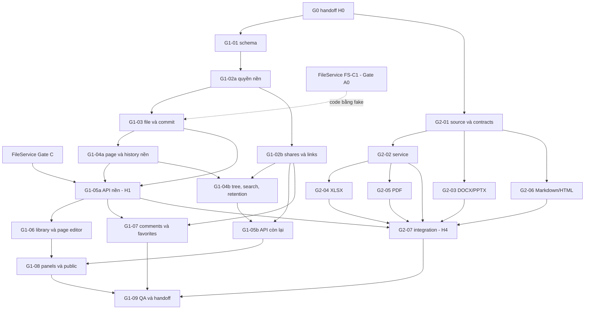

# Documents + UniWork Office - plan triển khai G1 và G2 song song

> **Trạng thái:** in-progress - tài liệu kế hoạch ngày 2026-09-18; các task sản phẩm bên dưới chưa bắt đầu.
> Đây là plan thực thi theo task, không phải spec mới hay bằng chứng G0/G1/G2 đã nghiệm thu.
> **Cập nhật 2026-09-22:** bổ sung nhóm FE/BE/Engine/QA/DevOps, đợt chạy song song và hợp đồng bàn giao; chưa khởi chạy implementation.
> **Cập nhật 2026-09-24:** Documents lưu bytes qua FileService (UNI-726) theo hợp đồng FS-C1: bỏ ledger `document_objects` riêng, version/asset giữ `file_id`, cleanup chỉ qua FileService. G1-03 code bằng fake từ Gate A0 của FileService, không chờ FileService implement xong; chỉ nghiệm thu H1 chờ FileService Gate C.
> **Cập nhật 2026-09-26 (sau G0 = GO):** baseline chuyển sang develop `c6b567f0` (PR #130 đã merge G0), migration mới nhất 217; tick H0 theo bằng chứng (§1.2); layout package là quyết định chờ người dùng U-1 (§1.3, §3.2); bổ sung các việc G2 còn thiếu (Q7, P3/P5, `host:slides-edit-transform`, guard test ADR 0021, clean build, đo tài nguyên); thống nhất tên lỗi idempotency và hình dạng API save; ước lượng đối chiếu với `m1-m2-estimate.md` (§8.4). Vẫn chưa khởi chạy implementation.
> **Cập nhật 2026-09-27:** người dùng trả lời U-1..U-4 (cả bốn theo khuyến nghị, §1.3) và ra lệnh triển khai; FileService (PR #133) đã merge vào nhánh gốc ở `0fba24a0`. ADR 0024 accepted, C-01 §14 có hiệu lực.

**Issue tài liệu:** UNI-657. **Roadmap:** C-01, phase C.
**Nhóm triển khai:** G1 UNI-657 và G2 UNI-658, cùng parent UNI-437.
**Người phụ trách trên UniAI:** mtruong.dev. Trạng thái issue phải đọc từ UniAI.
**Quyết định người dùng:** G1 và G2 chạy song song; G2 tích hợp dữ liệu thật sau API nền G1.
Chỉ G2-02 (phần ghép commit) và G2-07 chờ H1; G2-01 và phần không cần kho của G2-03..06 không chờ G1.
**Phạm vi phiên viết plan:** tạo và cập nhật tài liệu này, liên kết issue; không giao chạy implementation.
Implementation chỉ bắt đầu khi người dùng ra lệnh, sau khi các quyết định ở §1.3 có câu trả lời.

## 1. Kết quả cần bàn giao và cách sử dụng

G1 bàn giao thư viện Documents sử dụng dữ liệu thật: page/file, cây, tìm kiếm,
upload/download, phiên bản, quyền, chia sẻ, lịch sử truy cập, bình luận và yêu thích.
G2 bàn giao engine/adapter sáu định dạng và luồng lưu vào chính kho Documents.
Đầu ra là nền để G3 tích hợp sáu editor sản phẩm và G4 xây ứng dụng desktop.

Mỗi task bên dưới có issue, phụ thuộc, file map, checklist, lệnh kiểm và điều kiện
bàn giao. Dùng §2.4 để phân nhóm chuyên môn, §2.5 để chọn đợt chạy song song và
§2.6 để kiểm đầu vào trước khi giao việc. File ghi "tạo" là đích triển khai,
chưa tồn tại khi viết plan. Các bước
trong task chạy theo thứ tự; task khác chỉ chạy đồng thời nếu DAG cho phép.
Checkbox chỉ được tick khi có bằng chứng; một test model G0 không thay được test
service/engine thật.

### 1.1 Đầu vào đã đọc và baseline

- Workspace guide: `UNIAI_COORDINATION.md` ở thư mục workspace tổng (ngoài repo).
- Repo baseline: develop `c6b567f08ec5a30b6a947243d1c9a7721d7276e8` (2026-09-26), đã chứa
  kết quả G0 (PR #130, G0 = GO). Migration mới nhất tại baseline là 217
  (`217_email_hub_threads_conversation_key_idx`); số 159-179 trong C-01 đã bị dùng.
  Bản plan trước đo ở develop `97b4fa59` (migration 192).
- Spec nghiệp vụ: [C-01 Documents](../specs/2026-09-08-documents-design.md),
  đặc biệt §13 về Work Product và §14 (amendment theo FS-C1, người dùng duyệt 2026-09-27).
- Checklist phạm vi: DOCUMENTS_OFFICE_CHECKLIST.md tại workspace tổng,
  DOC-010..019 và DOC-020..025.
- Đầu vào G0 (đã merge ở `c6b567f0`): spec G0/FE ngày 2026-09-16; source/capability/
  fixture manifest UNI-666; [engine-contract](../../office/g0/engine-contract.md) +
  [module-runtime-map](../../office/g0/module-runtime-map.json) UNI-668;
  [login-sync-contract](../../office/g0/login-sync-contract.md) (DOC-005) UNI-669;
  [handoff-map](../../office/g0/handoff-map.md), register và
  [pilot-handoff](../../office/g0/pilot-handoff.md) UNI-670; [ADR 0021](../../adr/0021-runtime-engine-office-da-dinh-dang.md).
- Artifact G0 mà G1/G2 cần nhưng trước đây chỉ nằm ngoài git (runtime conclusion,
  packaging/handoff, Q7 blocker, port items P1-P5) nay ở [`docs/office/g1g2/`](../../office/g1g2/README.md).
  Ngưỡng đo được là [`acceptance-thresholds.md`](../../office/g0/acceptance-thresholds.md).
- FileService: [spec](../specs/2026-09-22-shared-file-service-design.md),
  [plan](2026-09-22-shared-file-service.md) và [hợp đồng FS-C1](../specs/2026-09-24-file-service-contract.md)
  (UNI-726). Documents là một bên tiêu thụ; plan này không tự dựng pipeline file.
  Quyền sở hữu blob/intent/GC được ghi trong ADR 0024 (accepted 2026-09-27).
  Tại baseline, develop **chưa** có `server/internal/files`: code FS-C1 T1a (UNI-739)
  nằm trên nhánh `feature/UNI-739-fs-c1-contract` (đầu nhánh `5fececa8` lúc đọc ngày
  2026-09-26, chưa phải bản cuối). Theo Advisor FileService, T1a merge cục bộ vào
  `feature/UNI-726-shared-file-service` trước, rồi chỉ tới develop qua PR do lead merge.
  FS-C1 vẫn là v1, không có thay đổi đang chờ.
- **Đọc `engine-contract.md` và `module-runtime-map.json` kèm
  [`docs/office/g1g2/fs-c1-alignment.md`](../../office/g1g2/fs-c1-alignment.md).** Hai file đó
  (file đầu bị pin sha256) vẫn giao "orphan ledger + reconciler" cho G1 (§1, §8.3, §11, §13, §15;
  `g1_g2_handoff`, `ownership_map`); ghi chú liệt kê từng câu bị thay theo FS-C1.
- Code có sẵn: Go Chi + pgx/sqlc, storage S3/LocalStorage, audit/outbox,
  entitlement, task comments, TipTap, core/views và workspace shell.
  Chưa có DocumentService, module Documents hay Office service sản phẩm.

Đọc lại guide, CLAUDE.md và UNIAI_TRACKING.md khi nhận task. Checkout khác phải
được chỉ rõ đường dẫn guide tuyệt đối. Chỉ coordinator ghi tracker.

### 1.2 Điều kiện vào đợt và phần chưa làm

Kiểm lại ngày 2026-09-26 trên develop `c6b567f0`; verifier
`node scripts/office-g0/verify-evidence.mjs --registry docs/office/g0/evidence-register.json --root . --json --require-go`
(kèm hai thư mục `--artifacts` ngoài repo) trả `valid: true`, `go: true`, 8/8 gate bắt buộc.
Lần chạy này cần hai thư mục bằng chứng G0 ngoài git (`.uniwork-dev/office-g0` và
`dev-uniwork/.uniwork-dev`), nên không tái lập được từ một bản clone sạch; phần pin trong repo
vẫn kiểm được.

- [x] G0 bàn giao source pin + checksum + license/dependency inventory:
  `docs/office/g0/source-manifest.json` (commit upstream `09485f88`, LICENSE/NOTICE, hash từng input).
- [x] G0 bàn giao contract engine và save/version/error đã review, có revision:
  `engine-contract.md` được pin sha256 trong register; `login-sync-contract.md`
  "accepted G0" (Advisor g118, 2026-09-25); cả hai ở revision `c6b567f0`.
- [x] Có fixture và bảng capability bắt buộc cho sáu định dạng; runtime mỗi thao tác
  là proven (sáu hàng `E-*-CYCLE`) hoặc blocker kèm tên test:
  `fixtures/manifest.json`, `capabilities.json`, `capability-matrix.md`, `module-runtime-map.json`, ADR 0021.
- [x] G0 hoàn tất thay thế các mệnh đề cũ trái phạm vi mới trong C-01/ADR: ADR 0021 thay 0018;
  C-01 có luật HTML (2026-09-25) và §14 theo FS-C1 (người dùng duyệt U-3, 2026-09-27); ADR 0024
  thay phần "sổ object mồ côi" của ADR 0021 QĐ3 (người dùng chấp nhận U-2, 2026-09-27).
- [x] G0 docs khớp FS-C1 (phần tài liệu của UNI-748): UNI-748 (PR #133, merge vào nhánh này ở
  `0fba24a0`) sửa `engine-contract.md` §1/§8.3/§8.4/§11/§13 và `login-sync-contract.md`; ghi chú
  [`docs/office/g1g2/fs-c1-alignment.md`](../../office/g1g2/fs-c1-alignment.md) phủ phần còn lại.
- Điều kiện theo từng task, không tick ở H0: người thực thi đọc issue/comments, gửi
  start qua coordinator rồi dùng nhánh issue từ develop đã chứa dependency được chấp nhận.

Không suy diễn "model test xanh" thành đủ điều kiện port toàn bộ engine.
Capability bắt buộc chưa có runtime là blocker của đúng task, không tự loại khỏi scope.
G0 = GO là quyết định khả thi, không phải nghiệm thu pilot: Q1-B là 0/95 trên web và
desktop, và register vẫn liệt kê các giới hạn ở `decision.limits` / `unproven` (§1.4).

### 1.3 Quyết định của người dùng (đã trả lời 2026-09-27)

| Mã | Quyết định | Khuyến nghị | Chặn task |
| --- | --- | --- | --- |
| U-1 | Layout package/thư mục cho G2 và Documents: layout của plan (§3.2) hay layout đề xuất ở G0 (`engine-contract.md` §15) | Giữ layout của plan; lý do ở §3.2 | G2-01, G1-01 (tên file Go) |
| U-2 | Chấp nhận ADR 0024: FileService sở hữu blob, intent và GC của Documents; thay một phần QĐ3 ADR 0021 | Chấp nhận | G1-03, G1-04b, G2-02 |
| U-3 | Duyệt amendment C-01 §14: `file_id`, đọc bằng proxy, `ReleaseInTx`, cột còn thiếu, bảng lỗi DOC-005, một hình dạng API save | Duyệt | G1-01, G1-03, G1-05 |
| U-4 | Codec ảnh cho PDF trên web: codec Node an toàn ở G2-05, hay để host desktop (G4) và web từ chối thao tác sửa ảnh có sẵn | Codec Node ở G2-05 (giữ capability web theo Q1-B) | G2-05 |

**Trả lời của người dùng ngày 2026-09-27, cả bốn theo khuyến nghị:** U-1 giữ layout của plan (§3.2);
U-2 chấp nhận ADR 0024; U-3 duyệt C-01 §14; U-4 codec Node ở G2-05. Không còn task nào bị chặn bởi U-1..U-4.

### 1.4 Giới hạn G0 còn mở và chủ của chúng

| Mục (nguồn) | Chủ trong plan này | Cách đóng |
| --- | --- | --- |
| Q7: không có engine chuyển BIFF8/ODF/RTF/XLSB → OOXML (`docs/office/g1g2/q7-blocker.md`; handoff-map G2) | G2-02 (service) + G2-07 (bản sao, provenance) | Chọn/xây engine phía service; hàng Orca-browser theo §"Closing test" của q7-blocker |
| P5: lưu DOCX có mật khẩu (`port-items.md`) | G2-03 | Re-encrypt ở service hoặc từ chối save theo policy; contract test round-trip |
| P3 nửa adapter: open lỗi phải báo failure class (`port-items.md`) | G2-03 (DOCX), G2-01 (host contract chung) | Lỗi typed tới shell; G3 giữ phần màn hình |
| PPTX gesture shape cần `host:slides-edit-transform` (ADR 0021 QĐ6.3) | G2-03 | Implement channel trong host contract hoặc từ chối gesture tường minh, có test |
| PDF: `excludeAnnots` cần build v3; ảnh qua kênh lab `pageImagePng` (register `decision.limits`, `unproven`) | G2-05 | Đường annotation-delete chạy end-to-end trên engine đã port |
| PDF HIGH F1 (sau save, tài liệu còn mở vẫn giữ nội dung trước khi sửa) và F2 (Save ghi vào thư mục nội bộ theo view) — register, hàng PDF scoped | G2-05 (F2: đường save qua host adapter tới G1 commit); G3 nhận phần F1 nếu nguyên nhân nằm ở editor | Test two-save trên PDF: lần mở/lưu thứ hai thấy nội dung mới; output chỉ đi qua commit Documents |
| Brand r8 và các thay đổi engine đang đóng băng (quyết định G108) | G2-01 | Đưa vào patch series khi port nguồn; không sửa cây nguồn đóng băng |
| Clean-checkout engine build: esbuild local, `g0-text.pdf` chưa track, runner temp/git (`packaging-and-handoff.md` §5b) | G2-01 | Xem checklist G2-01 |
| Ca fault DOC-004: register coi gate đã đạt, nhưng sáu trong bảy ca chạy với Go/storage/ACL/commit mô hình (register `unproven`) | G2-07 | Chạy lại với Go + FileService + engine thật |
| Tài nguyên CPU/RAM chưa đo (`acceptance-thresholds.md`) | G2-02 | Đo và ghi trước khi đặt giới hạn |
| DOCX chỉ sửa đoạn văn; bảng/ảnh/header/footer chưa chứng minh | G2-03 | Hàng capability tương ứng chạy trên engine đã port |

Ngoài đợt: UI Office hoàn chỉnh G3, desktop login/keychain/installer G4,
change feed/offline queue/full sync G5, AI G6 và pilot G7. Page CRDT vẫn là lát
cắt sau theo C-01; Office coauthoring là ADV-001. OCR scan nằm ngoài mốc hiện tại.
Thư viện/page editor G1 vẫn phải dùng được trên mobile web. Mac/Safari thật
giữ backlog UNI-671; kết quả Windows/WebKit không phải nghiệm thu Mac.

## 2. Phân công, phụ thuộc và mốc ghép

### 2.1 Issue map

Coordinator xác nhận mapping bằng request
01a0b22f-4668-7953-8f04-931b7c3e53e7:documents-office-g1-g2-plan:sub_issue:2.
Tất cả 16 task ở todo khi lập plan và khi đọc lại ngày 2026-09-26; bảng này không là tracker sống.

| Task | Issue | Nhóm chính | Nhóm phối hợp | Phụ thuộc trước khi hoàn tất | Checklist |
| --- | --- | --- | --- | --- | --- |
| G1-01 Schema, validation, contracts | UNI-675 | BE-DATA | BE-API, FE-CORE, QA | G0 data/save handoff | DOC-010 |
| G1-02 Quyền, shares, links, access log | UNI-676 | BE-DATA | BE-API, FE-CORE, QA | G1-01 | DOC-016/017 |
| G1-03 File qua FileService, quota, commit, idempotency | UNI-677 | BE-DATA | BE-API, ENG-RUNTIME, QA, OPS | G1-01; quyền nền G1-02a; FS-C1 T1a (UNI-739) merge vào develop = Gate A0 để code; FileService Gate C để nghiệm thu; U-2, U-3 | DOC-014/015 |
| G1-04 Page/tree/search/history/retention | UNI-678 | BE-DATA | BE-API, FE-CORE, QA | G1-02, G1-03; 04a giao trước H1 | DOC-012/013/015/018 |
| G1-05 HTTP và core client | UNI-679 | BE-API | FE-CORE, BE-DATA, QA | G1-01; từng service G1-02..04 | DOC-010..019 |
| G1-06 Thư viện và page editor | UNI-680 | FE-UI | FE-CORE, QA | G1-05a/H1; list/tree cần 05b | DOC-011..014 |
| G1-07 Bình luận, notifications, favorites | UNI-681 | BE-API | BE-DATA, FE-CORE, FE-UI, QA | G1-02, core nền G1-05; UI sau G1-06 | DOC-019 |
| G1-08 Panels, settings, public view | UNI-682 | FE-UI | FE-CORE, BE-API, QA | G1-04..06, shares G1-02 | DOC-015..018 |
| G1-09 QA, vận hành và rollout | UNI-683 | QA | OPS, BE-DATA, BE-API, FE-UI | G1-01..08; Office acceptance ở G2-07 | DOC-010..019 |
| G2-01 Nguồn/build/contracts/host adapter | UNI-684 | ENG-RUNTIME | ENG-FORMAT, FE-CORE, OPS, QA | G0 source + engine handoff | DOC-020/021 |
| G2-02 Engine service và Go adapter | UNI-685 | ENG-RUNTIME | BE-API, BE-DATA, OPS, QA | G2-01; commit thật sau H1 | DOC-021/023 |
| G2-03 DOCX/PPTX | UNI-686 | ENG-FORMAT | ENG-RUNTIME, QA | G2-01; service operations dùng G2-02 | DOC-022/024 |
| G2-04 XLSX/native recalc | UNI-687 | ENG-FORMAT | ENG-RUNTIME, OPS, QA | G2-01, G2-02 | DOC-022/024 |
| G2-05 PDF | UNI-688 | ENG-FORMAT | ENG-RUNTIME, OPS, QA | G2-01, G2-02 | DOC-022/024 |
| G2-06 Markdown/HTML/assets | UNI-689 | ENG-FORMAT | ENG-RUNTIME, FE-CORE, QA | G2-01; service operations dùng G2-02 | DOC-022/024 |
| G2-07 Ghép Documents và nghiệm thu engine | UNI-690 | BE-API | FE-CORE, ENG-RUNTIME, ENG-FORMAT, QA, OPS | H1, G2-02..06; đủ ACL trước nghiệm thu | DOC-024/025 |

G1-05 chạy thành các PR nối tiếp: 05a contract + create/get/update page,
upload/download, assets và version/restore nền; 05b list/tree/search/shares/
retention. G1-07 tự bổ sung endpoint comments/favorites theo mẫu 05a. G1-06
bắt đầu sau 05a/H1, không chờ toàn bộ backend. Một issue có thể nhiều PR;
một nhánh chỉ mang một issue. Các nhãn a/b dưới đây là lát bàn giao trong
issue hiện có, không phải task hoặc issue mới.

G1-02a giao quyền nền trước (membership/owned/effective level), rồi G1-02b
tiếp tục shares/links/access log. G1-03 được dùng phần nền đã qua test, không
giả lập quyền trong production. G1-04a giao create/update page, history/restore
nền và audit trước H1; G1-04b tiếp tục tree/search/lifecycle/worker. G2-02 dựng
service bằng fixture trước; Go business integration ghép commit thật sau H1.

### 2.2 Mốc và thứ tự tích hợp

| Mốc | Điều kiện qua | Mở khóa |
| --- | --- | --- |
| H0 - Nhận G0 | Contract/source/runtime có revision và evidence rõ | G1-01 và G2-01 song song |
| H1 - API nền | Schema + quyền nền + commit/version + page/restore G1-04a + upload/download/assets + HTTP/core G1-05a chạy với DB thật và FileService thật (FileService Gate C, MinIO) | G1-06 và G2 ghép kho |
| H2 - Thư viện | G1-01..08 đạt các ca riêng; Office chưa cần UI sản phẩm | G1 nghiệm thu độc lập |
| H3 - Engine | Sáu adapter đạt ma trận G0; cùng contract browser/server/desktop | G2-07 |
| H4 - Ghép hoàn chỉnh | Go + DB + object storage + engine thật qua six-format suite | Bàn giao G3/G4 |

Đường găng: G0 -> G1-01/02a -> G1-03 -> G1-04a + G1-05a/H1 -> G2-07. FileService
không nằm trên đường găng khi viết code: G1-03 bắt đầu ngay khi có FS-C1 (Gate A0)
và dùng `filesfake`. H1 là điểm duy nhất chờ FileService, ở Gate C; nếu Gate C
đến muộn hơn G1-03, phần nghiệm thu của H1 chờ, còn G1-04a/05a và FE tiếp tục
theo fake và sample response.
G2-01 -> G2-02/03/04/05/06 cùng tiến tới G2-07. G1-09 có thể kiểm thư viện trước;
chỉ đóng nghiệm thu cả đợt khi H4 đạt.



### 2.3 Quyền sửa file chung

- G1-01 giữ migration register; task khác gửi schema delta, lấy số tiếp theo
  trên develop trước merge. Không ghi số 218 cố định cho nhiều nhánh.
- G1-05 giữ router/SDI/SDO/core transport; G1-07 bổ sung comments sau 05a.
- G2-01 giữ pnpm-workspace.yaml, lockfile, build/tsconfig và package exports.
  Adapter task khai dependency cần dùng; G2-01 cập nhật lockfile tập trung.
- G1-09 tích hợp event catalogue, CI/runbook và kiểm regression; mỗi task vẫn
  chịu trách nhiệm thêm audit/event/test cùng thay đổi của mình.
- Không phát sinh giao việc cho agent chỉ từ việc file plan tồn tại. Nếu chạy
  nhiều worker, mỗi worker dùng worktree/branch issue riêng trong workspace.

### 2.4 Nhóm chuyên môn FE, BE, Engine, QA và DevOps

Đây là nhóm trách nhiệm để giao việc; không mặc định cần tám người hoặc tám
agent. Một người có thể kiêm nhóm, nhưng không tính các việc họ kiêm là chạy
song song. Nhóm chính trong §2.1 chịu trách nhiệm tích hợp và bàn giao task;
nhóm phối hợp chỉ sửa phần file được giao. Giữ nguyên 16 issue hiện có.

| Nhóm | Phạm vi sở hữu | Task nhận việc | Đầu ra bàn giao |
| --- | --- | --- | --- |
| BE-DATA | SQL/migration, validate, quyền, service Documents, storage/quota, version và worker | Chính G1-01..04; hỗ trợ schema/transaction của G1-07, G2-02/07 | API service có actor/transaction rõ, SQL cùng scope, test DB/storage và concurrency |
| BE-API | HTTP/SDI/SDO/OpenAPI, wiring Go, comments/notification orchestration, nối Office vào Documents | Chính G1-05/07, G2-07; phần Go của G2-02 | Endpoint có response/error thật, permission gate, schema mẫu và integration evidence |
| FE-CORE | Types/schema TS, API clients, query keys/hooks, save machine, permission mapping và realtime | Phần core của G1-05/07 và G2-07 | Core exports chạy qua transport thật; test malformed response, conflict, retry và đổi session |
| FE-UI | Library, page editor, tree, panels, public/settings, routes, i18n và accessibility | Chính G1-06/08; UI G1-07 | Màn hình dùng core hooks, trạng thái loading/error/dirty/read-only và ca kiểm browser |
| ENG-RUNTIME | Pin nguồn/build, contracts, host adapters, service jobs/grants/limits, native supervisor | Chính G2-01/02; runtime hỗ trợ G2-03..07 | Package browser/node/desktop, service/container thật, contract version và lỗi typed |
| ENG-FORMAT | Parse/edit/serialize/render theo định dạng, asset mapping và fidelity | Chính G2-03..06; sửa lỗi format trong G2-07 | Bốn gói adapter: DOCX/PPTX, XLSX, PDF, Markdown/HTML; đủ fixture/capability evidence |
| QA | Ma trận nghiệm thu, dữ liệu kiểm, E2E, fault/race/fidelity replay, tổng hợp evidence | Chính G1-09; phần nghiệm thu G2-07, hỗ trợ mọi task | Kết quả theo SHA/fixture/runtime, phân biệt pass/fail/blocked; không dùng skip làm pass |
| OPS | Môi trường riêng checkout, build/CI/container, native assets, metrics, runbook và backup/restore | Phần vận hành G2-01/02, G1-09 và G2-07 | Build tái lập, cấu hình có tài liệu, CI chạy thật và quy trình khôi phục |

QA không nhận thay unit/contract tests của nhóm feature: mỗi nhóm giao code
cùng test của mình. OPS không tự nhận quyền sửa lockfile/router/migration;
mọi thay đổi qua owner file ở §2.3 và §2.7. Người tích hợp G1-09 điều phối mốc
H2/H4 và evidence, không thay coordinator UniAI hoặc người quyết định done.

**Tách các task xuyên FE-BE để không chờ cả task:**

| Task | Phần BE/Engine | Phần FE | Thứ tự nhận việc |
| --- | --- | --- | --- |
| G1-05 / UNI-679 | BE-API giữ handler/DTO/router/OpenAPI cho 05a rồi 05b | FE-CORE giữ schema/client/hooks/save-state cho từng đợt API | Chốt wire contract cùng G1-01; core unit tests dùng response fixture trong khi BE triển khai; ghép HTTP thật mới đóng 05a/H1 |
| G1-07 / UNI-681 | BE-API giữ comments/favorites, notification và endpoint; BE-DATA phối hợp schema | FE-CORE giữ hooks/draft state; FE-UI giữ thread/panel và favorite action | Bắt đầu service sau G1-02 + H1; core theo contract; UI nối sau G1-06 và endpoint tương ứng |
| G2-02 / UNI-685 | ENG-RUNTIME giữ Node service/supervisor; BE-API giữ Go client/job orchestration | Chưa có Office UI sản phẩm; FE-CORE chỉ review public error/save contract | Service chạy fixture sau G2-01; Go ghép commit sau H1; không tạo đường lưu riêng cho engine |
| G2-07 / UNI-690 | BE-API giữ public Office routes + Documents commit; ENG-RUNTIME/FORMAT cung cấp runtime/adapter | FE-CORE giữ office endpoint/hooks và browser harness | H1 + service và adapter tương ứng mở tích hợp từng format; H3 + toàn bộ suite mới đủ xét H4 |

G1-06/08 chỉ sửa shared views + web host; FE không tự dựng service, storage,
permission policy hoặc engine thứ hai. Phần FE của G2 là adapter/harness và
core API, không bao gồm sáu màn hình editor sản phẩm của G3.

### 2.5 Các đợt triển khai song song

P0..P5 là nhóm công việc theo phụ thuộc, không phải sáu sprint có thời lượng
bằng nhau. Chỉ chờ đầu vào của chính task: BE có thể sang P2 khi G1-01 đủ,
không phải chờ G2-01; adapter đủ contract cũng không phải chờ toàn bộ G1.
Mỗi mũi tên trong một ô là thứ tự bắt buộc, không phải các việc chạy cùng lúc.

| Đợt | BE-DATA / BE-API | FE-CORE / FE-UI | Engine | QA / OPS | Điều kiện bàn giao |
| --- | --- | --- | --- | --- | --- |
| P0 - Nhận đầu vào | Đối chiếu schema/ACL/save và baseline; chuẩn bị file map | Đối chiếu JSON page, lỗi lưu và trạng thái UI | Đọc source pin, runtime/capability/fixture G0 | Đối chiếu ma trận kiểm, môi trường và giới hạn nền tảng | H0 được bàn giao; trước đó chỉ chuẩn bị, không nhận runtime chưa chứng minh |
| P1 - Contracts và nền | G1-01; BE-API cùng FE-CORE chốt response/error mẫu của G1-05 | Sau contract G1-01: phần schema/client test của G1-05; FE-UI chuẩn bị ca kiểm G1-06 | G2-01 độc lập với SQL G1; bàn giao package/host contracts | Chuẩn bị fixture/evidence G1-09, môi trường test riêng; OPS hỗ trợ clean build G2-01 | G1-01 mở G1-02; G2-01 mở service và adapter không cần native service |
| P2 - Quyền, lưu và runtime | G1-02a -> G1-03 -> G1-04a -> hoàn tất G1-05a; G1-02b có thể chạy cạnh G1-03 nếu khác owner/file | FE-CORE làm hooks/save-state theo 05a, kiểm với HTTP khi có; FE-UI chưa nối route sản phẩm trước H1 | G2-02 service; G2-03 và G2-06 phần không cần service chạy cạnh nhau sau G2-01; G2-04/05 mở khi G2-02 đủ runtime | Chạy test ACL/quota/commit sớm; kiểm job timeout/cancel, native packaging | H1 gồm page + file + asset + version/restore qua HTTP/core thật; runtime từng adapter có evidence riêng |
| P3 - Library và adapter | G1-04b -> G1-05b theo từng service; G1-07 phần BE sau đủ G1-02 + H1; hỗ trợ Go của G2-02 | G1-06 nối API 05a; list/tree nối khi 05b đủ; core G1-07 chạy theo contract | G2-03/04/05/06 có thể chạy bốn nhánh adapter; ghép thử G2-07 từng format sau H1 + service/adapter sẵn sàng | E2E từng luồng vừa có; replay theo format, ghi fidelity/faults; sửa lỗi tại task sở hữu | Library/page/file hoạt động thật; API 05b và contract comments đủ cho panels; chưa nhận hoàn tất cả G1/G2 |
| P4 - Panels và tích hợp | G1-07 hoàn tất notification/favorites; G2-07 expose APIs/copy/commit và xử lý race | G1-08 sau G1-02/04/05/06; UI G1-07 sau G1-06; hai nhánh chia file panel riêng | Hoàn tất adapter còn lại; hỗ trợ G2-07, version negotiation/upgrade replay | G1-09 nghiệm thu thư viện khi G1-01..08 đủ; suite G2-07 theo runtime thật | H2 độc lập H3; G2-07 chỉ được đóng H4 khi H1 + H3 + quyền đầy đủ và six-format suite đạt |
| P5 - Bàn giao | Sửa lỗi tích hợp tại đúng issue/file owner; không thêm capability ngoài scope | Chạy lại các ca UI bị ảnh hưởng bởi sửa lỗi cuối | Chốt artifact/engine pin và compatibility evidence | Q-FULL trên checkout tích hợp; backup/restore, flags/runbook; bàn giao G3/G4 | H2 + H4 và checklist §8.3; trạng thái review theo PR, done do người quyết |

**Các tổ có thể giao riêng ở thời điểm mở rộng nhất (P3/P4):**

- Tổ BE dữ liệu: G1-04b; tổ BE API/core: G1-05b rồi phần BE G1-07. Bàn giao
  từng service/endpoint, không giữ toàn bộ 05b tới khi mọi API xong.
- Tổ FE thư viện: G1-06 rồi G1-08; UI comments của G1-07 là gói riêng sau
  thư viện. Mỗi tổ có file owner; detail view chung tích hợp qua owner G1-06/08.
- Tổ runtime: G2-02 và hỗ trợ ghép G2-07; tổ adapter có thể tách thành
  G2-03 DOCX/PPTX, G2-04 XLSX, G2-05 PDF, G2-06 Markdown/HTML.
- Tổ QA/OPS: kiểm từng đầu ra đã có, giữ môi trường và gom evidence; không
  cần chờ tất cả feature xong mới viết fixture/E2E hoặc chuẩn bị runbook.

Nếu runtime, schema hoặc package export chưa ổn định, chỉ mở phần không dùng
dependency đó. Contract thay đổi phải báo các tổ đang tiêu thụ và cập nhật
fixture cùng PR; không để mock cũ tiếp tục xanh trong khi API đã khác.

### 2.6 Điểm bàn giao giữa nhóm và điều kiện mở việc

| Từ -> đến | Bàn giao bắt buộc | Bằng chứng tối thiểu | Mở khóa |
| --- | --- | --- | --- |
| BE-DATA -> BE-API + FE-CORE | Page JSON schema, field/revision/version, error codes, service signatures, scope/ACL | G1-01: Q-DB/Q-GO và fixture Go/TS; sample response là contract cho tới khi có HTTP thật | G1-05 phần HTTP/core; chưa mở UI G1-06 |
| BE-DATA quyền -> storage | Effective level, owned resolver mặc định deny, membership và revoke checks của G1-02a | Q-GO isolation gồm cả quyền hợp lệ và bị từ chối | G1-03; shares/links G1-02b tiếp tục riêng |
| BE-DATA + BE-API + FE-CORE -> FE-UI + Engine | H1: create/get/update page, upload/download/asset, version/restore, internal commit; schemas/hooks và errors thống nhất | Q-HTTP/Q-CORE và integration DB/storage thật; lưu/reload, conflict, retry, quota, revoke có evidence | G1-06, commit integration G2-02 và từng format G2-07 |
| BE-DATA + BE-API -> FE-CORE + FE-UI | 05b list/tree/search/share/public/retention theo từng endpoint | Q-HTTP + Q-CORE; quyền và response lỗi đúng | Hoàn tất list/tree G1-06; G1-08 khi các phụ thuộc còn lại đủ |
| BE-API -> FE-CORE + FE-UI | G1-07 comments/favorites/notification, permission và draft identity | Q-GO/Q-NOTIFY, response fixtures; task comment regression vẫn đạt | UI comments/favorites sau G1-06 |
| ENG-RUNTIME -> ENG-FORMAT | G2-01 package exports, host/error/capability contract; G2-02 job/native runtime cho thao tác cần service | Q-OFFICE boundary + job/grant tests; build sạch, không phụ thuộc checkout nguồn cá nhân | G2-03/06 trước; G2-04/05 sau runtime cần thiết |
| ENG-FORMAT -> BE-API + FE-CORE + QA | Output bytes/checksum, engine version, typed warnings, fixtures của format đã chạy thật | Q-OFFICE mở/sửa/lưu/mở lại, kiểm nội dung/bố cục theo G0 | Ghép từng format G2-07; H3 vẫn đòi đủ sáu format |
| Các nhóm -> QA + OPS | SHA/PR, config/runtime versions, lệnh + artifacts + giới hạn còn mở | Q-E2E/Q-INTEGRATION; sau đó Q-FULL và replay đủ trên checkout tích hợp | H2/H4, runbook và handoff G3/G4 |

Mỗi bàn giao ghi issue/PR/SHA, contract version, file hoặc artifact, lệnh đã
chạy và người/nhóm nhận. Dependency phục vụ production phải là bản đã review
và tích hợp vào baseline của bên nhận. Nhánh thử ghép sớm phải ghi rõ chưa
được nghiệm thu; không dùng kết quả fake/fixture transport thay bằng chứng
engine hoặc storage thật. Bên nhận xác nhận đọc/chạy được trước khi coi đã mở khóa.

### 2.7 Tránh xung đột file khi nhiều nhóm cùng chạy

| File hoặc vùng dùng chung | Owner tích hợp | Cách nhóm khác đóng góp |
| --- | --- | --- |
| Migration numbering, schema và sqlc output | BE-DATA / G1-01 | Gửi delta từ G1-07/G2-02; lấy số trên develop lúc tích hợp; generate từ cùng schema |
| Router, SDI/SDO, OpenAPI và core transport | BE-API + FE-CORE / G1-05, chia theo ngôn ngữ | G1-07/G2-07 thêm file riêng; owner ghép registration, error envelope và exports |
| Core document types/keys/hooks | FE-CORE / G1-05 | Comment/Office có module riêng; sửa type/key chung qua owner, không nhân đôi cache |
| Document detail, routes, paths, sidebar, i18n | FE-UI / G1-06; bàn giao detail sang G1-08 khi 06 xong | G1-07 giao panel và callback contract; owner gắn panel/actions; namespace dịch chia theo feature |
| Office registry/facade và browser host adapter | ENG-RUNTIME / G2-01 | G2-03..06 sửa thư mục adapter/fixture riêng; owner ghép registry và capability exports |
| Workspace/catalog/lockfile/tsconfig | ENG-RUNTIME / G2-01 | OPS và adapter gửi dependency delta; một lượt generate/kiểm boundary sau tích hợp |
| Service entry/supervisor/Dockerfile/native packaging | ENG-RUNTIME / G2-02 | XLSX/PDF gửi runtime requirements; OPS ghép theo thứ tự, không hai nhánh sửa cùng image config |
| Event catalogue, startup/shutdown, CI/env/runbook | QA điều phối G1-09; BE-API/OPS sửa phần tương ứng | Feature PR luôn mang event/audit/test của mình; owner sắp thứ tự ghép, không hoãn catalogue tới cuối |

Worktree/DB/port riêng cho từng luồng thực thi; không dùng DB của G0 để migrate.
Mỗi task có một người chịu trách nhiệm tích hợp dù nhiều nhóm hỗ trợ. Trước khi
đổi file chung, xác định owner và lượt ghép trong issue; không sửa chồng rồi
giải quyết bằng ghi đè. Tiến độ và evidence vẫn qua coordinator, không tạo
tracker hoặc assignee riêng trong bảng nhóm này.

### 2.8 Bố trí nguồn lực và ranh giới với phase khác

| Nguồn lực có thể dành | Cách ghép nhóm | Mức song song thực tế |
| --- | --- | --- |
| 3 người thực thi | Một BE-DATA + BE-API; một FE-CORE + FE-UI; một ENG-RUNTIME + ENG-FORMAT; bố trí thời gian QA/OPS riêng hoặc kiêm nhiệm rõ | Ba luồng; adapter chạy lần lượt; phần BE G2-02/07 xếp sau ưu tiên H1 |
| 5 người thực thi | Hai BE (data, API), một FE (core + UI), một runtime, một format; thêm QA/OPS hỗ trợ có lịch | Năm luồng sau khi đủ dependency; hai BE giúp giao 05a/05b sớm; format vẫn làm lần lượt |
| Có thêm người sau H1/runtime | Giữ owner core/runtime; tách FE panels/comments và tách tối đa bốn gói format G2-03..06 | Chỉ mở nhánh khi dependency/file map rõ và có năng lực review; không nhân đôi tổ trên cùng adapter |

Ưu tiên nhân lực cho G1-01/02a/03/04a/05a tới H1 và G2-01/02 tới runtime dùng
được. Tăng người làm adapter trước khi hai đầu vào này sẵn sàng không mở khóa
luồng lưu thật. Các cấu hình trên là phương án phân việc, không phải yêu cầu
tạo agent hoặc cam kết số ngày; thời gian review/QA/OPS tính vào năng lực thực.

G3 có thể chuẩn bị khung editor, G4 chuẩn bị desktop/auth theo contract G0 và
G7 chuẩn bị fixture/harness ở các issue riêng khi được giao. Các phần đó không
nằm trong 16 task G1/G2; không kéo UI Office, desktop login hoặc sync vào nhóm
FE/OPS của plan này. H4 vẫn là mốc bàn giao nền đã nghiệm thu cho G3/G4. C-11
có thể lập luồng riêng; C-14 chỉ triển khai lát 1a khi ownership C-01 §13 đủ,
không mặc định H1 tối thiểu đã hoàn thành toàn bộ hợp đồng ownership.

## 3. Quyết định triển khai cần giữ xuyên task

### 3.1 Khác biệt giữa spec cũ và code hiện tại

| Chỗ dễ làm sai | Cách triển khai trong đợt này |
| --- | --- |
| ContentEditor hiện là Markdown | Tạo DocumentEditor dùng JSON trực tiếp, tái dùng extension/toolbar phù hợp; không đổi hợp đồng Markdown của task/chat |
| storage.bytes mới giữ chỗ | Wire snapshot meter vào dữ liệu Documents, có test race/quota; không coi giá trị 0 hiện tại là đã metered |
| BeginIdempotent chưa so payload | Thêm fingerprint có version; Documents bắt buộc so fingerprint; cập nhật call sites theo typed options, không phá endpoint cũ |
| ApiError chỉ giữ code/status/correlation | Bổ sung fields và error_class tùy chọn, parse an toàn; code vẫn là khóa dispatch cho hành động client |
| C-01 chặn HTML | Cho lưu HTML, download attachment; preview qua môi trường cách ly, không chạy trong origin ứng dụng |
| C-01 events mang revision/version tùy ý | Client-visible event giữ ids-only theo governance hiện hành; fetch lại để lấy version, không mở ngoại lệ Patch mới |
| C-01 ghi autosave không audit | Giữ quy tắc repo: autosave là command lưu bền nên audit metadata, không log content; mốc auto vẫn riêng, không mỗi phím gõ |
| Mỗi share đều RequireMember workspace nguồn | List workspace vẫn gate workspace; direct shared-document access gate org rồi tính share bằng membership gates chuẩn |
| Created-by có thể tự nâng quyền bản sao | Tách attribution khỏi người nắm quyền quản lý: acl_owner_id mặc định creator human; copy giữ acl_owner_id và ACL nguồn |
| Số migration C-01 đã bị dùng | Cấp số từ max trên develop lúc tích hợp; không sửa migration lịch sử |
| C-01/DOC-004 có ledger object riêng của Documents | Dùng FileService theo FS-C1: `file_id` trên version/asset, `ClaimInTx`/`ReleaseInTx` trong transaction nghiệp vụ, `ReferenceProvider` của Documents; không bảng `document_objects`, không reconciler riêng |
| Full Work Product chưa có | OwnerLevelResolver trả none mặc định; API công khai không nhận owner_kind/owner_id |
| G0 engine host/model là mã lab | Port phần đã review sang module sản phẩm, bỏ fake success; runtime test mới quyết acceptance |
| G0 có hai tên cho cùng lỗi "cùng key, khác payload": `payload_fingerprint_mismatch` (engine-contract) và `idempotency_payload_mismatch` (DOC-005 §3.1, §4) | Dùng một tên `idempotency_payload_mismatch` (409, `conflict`) theo DOC-005; G1-03 hợp nhất trong cùng PR migration fingerprint (engine-contract §13 bước 2) |
| Ba hình dạng API save: DOC-005 §3 (uploads rồi commit), C-01 §5.2 (`versions/file` multipart), plan cũ (multipart + commit nội bộ) | Một hình dạng theo C-01 §14 (U-3 duyệt 2026-09-27): `POST /documents/{id}/uploads` trả `upload_id` = `file_id` của FileService, rồi `POST /documents/{id}/versions/commit`; tạo tài liệu file mới vẫn là một multipart. G1-05 chốt, không mở đường thứ hai |
| Trường lớp lỗi: DOC-005/C-01 viết `errorClass`, plan viết `error_class` | Trên wire là `error.error_class` (snake_case theo `docs/conventions.md`); `errorClass` trong DOC-005 là tên trong model JS. C-01 §14 ghi lại |
| C-01 tải về bằng presign 302 | Documents đọc bằng proxy qua `files.Service.Open` (policy purpose FS-C1 §3); không presign cho byte tài liệu |

Các điều chỉnh hợp đồng C-01 tương ứng đi cùng task sở hữu, ghi lý do và giữ lịch
sử spec. Không dùng plan để nhận một capability G0 chưa chứng minh là đã đạt.

### 3.2 Ranh giới module mới

| Đường dẫn dự kiến | Trách nhiệm |
| --- | --- |
| server/internal/document | Validate/sanitize/extract page JSON và nhận dạng tệp; không import service |
| server/internal/service/document*.go | Quyền, nghiệp vụ, transaction, phiên bản; gọi `files.Service` để lưu/đọc bytes |
| server/internal/office | Go client/validator của engine; không ghi business DB |
| packages/core/documents | Types/schema, query/mutation, save state, permission mapping |
| packages/views/documents | Library/page editor/panels; host navigation được inject |
| packages/office-contracts | Wire schema/type/error/capability thuần, không Node/Electron |
| packages/office-engine | Facade + sáu adapter; exports browser/node/desktop tách biệt |
| packages/office-upstream | Vùng nguồn pin + patch/provenance; package entry riêng theo inventory |
| apps/office-engine | Node service nội bộ và supervisor cho native process |
| apps/web/platform/office | Browser worker/transport adapter; G3 tiêu thụ qua injection |

**Layout đã chốt: người dùng chọn layout của plan (U-1, 2026-09-27).** G0 đề xuất một layout khác
(`engine-contract.md` §15, `module-runtime-map.json` → `g1_g2_handoff`). Hai bên:

| Thành phần | Plan (bảng trên) | Đề xuất G0 |
| --- | --- | --- |
| Nguồn upstream pin | `packages/office-upstream` | `packages/office-engine-upstream/<module>` |
| Engine | một gói `packages/office-engine`, exports `/browser` `/node` `/desktop` | hai gói `packages/office-engine-browser` + `packages/office-engine-node` |
| Service engine | `apps/office-engine` | `services/office-engine` |
| Go client engine | `server/internal/office` | `server/internal/officeengine` |
| Service Documents | `server/internal/service/document*.go` | `server/internal/service/documents/` |

Khuyến nghị giữ layout của plan, vì:

- Go: `internal/service` là một package và `RequireMember`, `audit.Recorder`, `files.Service`
  đều được gọi từ đó (CLAUDE.md, FS-C1 §2). Package con `service/documents/` phải import ngược
  `service` để gọi membership gate, sinh vòng import hoặc một lớp chuyển tiếp mới; các domain
  hiện có (task, meeting, chat) đều là file `service/<domain>*.go`.
- TypeScript: repo chưa có thư mục `services/`; process Node chạy riêng đặt ở `apps/` như
  `apps/web`. Một gói engine với exports tách biệt vẫn giữ được ranh giới browser nếu có test
  import-graph (G2-01), và tránh hai gói phải cùng version với một nguồn upstream.
- Tên Go `internal/office` ngắn và không trùng package nào hiện có.

Nếu người dùng chọn layout G0, G2-01 cập nhật bảng này và file map mọi task một lần trước
code; không tạo hai hệ package song song. Giữ tên nội bộ upstream khi cần provenance;
product display là UniWork Office.

### 3.3 Hợp đồng tối thiểu giữa G1 và G2

- DocumentRef: organization/workspace/document, working revision và base version ID.
  Identity không phụ thuộc title/path.
- EngineRequest/Result: contract/protocol/engine version, operation, format,
  checksum/length, edits hoặc export options, cảnh báo fidelity và typed error.
  Dùng schema G0 đã bàn giao; không copy model JS làm HTTP backend.
- Document service cấp input được authorize; Go đọc và tính lại checksum output.
  Chỉ transaction Go tạo version, đổi con trỏ, quota, audit và outbox.
- Public API mới dùng snake_case, errors giữ envelope error.code/message/fields;
  thêm error.error_class tùy chọn. 422 revision_conflict và 409
  document_version_conflict đi cùng UI conflict. Không đổi quota_exceeded 403
  hiện có thành 413 toàn hệ thống chỉ vì ví dụ trong model G0 (DOC-005 §3/§4 ghi 413;
  bản ghi chú `docs/office/g1g2/fs-c1-alignment.md` sửa thành 403, khớp `entitlement.go` và FS-C1 §7).
- Bảng mã lỗi Documents là bảng DOC-005 §4 cộng mã C-01 §5.5, gộp ở C-01 §14; mọi mã đi qua
  `mapServiceError` một lần.
- Version IDs là ULID; revision trên wire là chuỗi thập phân để không mất chính
  xác bigint. Version ordinal phục vụ hiển thị, không là identity cho engine.
- Fingerprint băm canonical payload có operation/document/base/checksum và
  các lựa chọn làm đổi kết quả; không chỉ băm tên file. Retry giữ key cũ.
- Bytes chỉ đi qua FileService (FS-C1). DocumentRef/EngineRequest mang `file_id`,
  không mang key, bucket hay URL ký; engine ghi output vào write target do
  `RegisterProviderOutput` cấp theo job.
- Engine xong serialize chưa có nghĩa Document đã lưu. Chỉ ACK sau DB commit
  mới chuyển UI sang saved.
- Chuyển đổi tạo Document riêng theo lựa chọn rõ ràng; giữ provenance và ACL.
  Không sao chép token public link. Owned document chỉ copy qua owner service.
- File trống theo loại phải do adapter tạo ra bytes hợp lệ. Không upload zero
  bytes rồi gọi đó là DOCX/XLSX/PPTX/PDF.


## 4. Tasks G1 - kho Documents

### G1-01 / UNI-675 - Schema, queries và page JSON contract

**Nhóm:** BE-DATA chính; BE-API, FE-CORE, QA phối hợp. **Đợt:** P1.
**Phụ thuộc:** H0. **Bàn giao cho:** G1-02/03/05 và G2-01.

**Tạo:** migrations cho documents, document_versions, document_assets,
document_shares, document_share_links, document_access_logs, document_favorites,
document_comments; query files documents.sql,
document_versions.sql, document_assets.sql, document_shares.sql;
internal/document/schema.go, sanitize.go, mime.go;
service/document.go, document_types.go, document_owner.go;
core/documents/schema.ts và fixtures schema chung.

**Sửa:** testutil database cleanup, migration lint khi cần, sqlc generated code.
Migration comments/favorites do G1-07 hoàn thiện nhưng số và owner nằm trong register này.

- [ ] Viết migration lint và test constraint trước: kind page/file, owner pair,
  owned-no-parent, organization/workspace bắt buộc, attribution có kind.
- [ ] Giữ working content/revision tách document_versions; chọn
  file_version_id làm con trỏ blob, current_version làm ordinal. Không tạo
  current_version_id thứ hai chỉ vì model G0 dùng tên khác.
- [ ] Thêm metadata engine/protocol, source_document_id/source_version_id,
  source_revision, conversion reason và acl_owner_id. Public create không nhận
  owner hoặc acl_owner; service tự gán và kiểm cùng organization/workspace.
  Danh sách cột đầy đủ ở C-01 §14 (U-3 duyệt 2026-09-27): `document_versions.engine_name/engine_version/
  contract_version/protocol_version`; provenance bản sao Q7 theo DOC-005 §7.1
  (`source_document_id`, `source_version_id`, `source_revision`, `source_format`,
  `source_engine`, `target_format`, `source_checksum_sha256`); `documents.acl_owner_id`;
  `idempotency_keys.payload_fingerprint` (cột của G1-03, số migration do register này cấp).
- [ ] document_versions và document_assets giữ `file_id` (TEXT, không FK) trỏ
  vào `files` của FileService. Không bảng ledger object riêng: key, size,
  checksum, trạng thái intended/stored/orphaned và retry nằm ở FileService
  (FS-C1). Không record nào của Documents tự điều khiển xóa blob.
- [ ] Tạo từng index CONCURRENTLY trong migration riêng; không FK, không sửa
  migration đã áp dụng. Ghi số cấp thật vào migration register trong PR.
- [ ] Implement page sanitizer theo C-01 §3.7: allowlist node/mark/attrs,
  giới hạn 2 MiB sau sanitize, depth/count chống input cực đoan, asset:// IDs,
  link scheme an toàn, extract text/search_text ở server.
- [ ] Tạo OwnerLevelResolver và default deny implementation; internal owned
  commands nhận transaction từ owner service, chưa expose qua HTTP.
- [ ] Chạy make sqlc và so fixture JSON với schema frontend.

**Kiểm:** Q-DB, Q-GO với TestDocumentSchema/TestDocumentSanitize/
TestDocumentOwner; Q-CORE với documents/schema.test.ts.
**Xong khi:** schema lên được trên DB trắng và DB baseline; JSON nguy hiểm bị
loại đúng, roundtrip JSON hợp lệ không mất node/asset; fixture Go/TS cùng kết quả.

### G1-02 / UNI-676 - Một đường quyền, shares, links và access log

**Nhóm:** BE-DATA chính; BE-API, FE-CORE, QA phối hợp. **Đợt:** P2, phần 02b có thể kéo sang P3.
**Phụ thuộc:** G1-01. Giao 02a quyền nền trước để G1-03 mở việc; 02b hoàn tất
shares/links/access log. G1-02 chỉ được nghiệm thu khi cả hai phần đủ.

**Tạo:** service/document_permissions.go, document_shares.go,
document_links.go, document_access.go và tests cùng tên;
queries document_access.sql; test matrix isolation.
**Sửa:** core/permissions/rules.ts + tests; org setting schema/query;
notification/realtime recipient resolver interfaces khi cần.

- [ ] Viết bảng test dương/âm cho creator/acl owner, ws admin, effective member,
  restricted, share user/workspace/org, deactivated/suspended, agent và anonymous.
- [ ] effectiveLevel kiểm owned trước; khi owned bỏ shares/visibility/created_by.
  Agent tối đa view kể cả resolver trả edit/manage. Mọi membership qua service gate.
- [ ] List/tree của workspace qua RequireMember; document theo ID và shared-with-me
  kiểm org membership rồi effectiveLevel. Không bắt recipient phải vào workspace nguồn.
- [ ] Không tiết lộ title, parent/breadcrumb hoặc user list của resource không đọc được.
  Mọi path child asset/version/comment phải authorize đúng document cha.
- [ ] Shares đổi mức bằng revoke cũ + insert mới trong tx, giữ audit; share không
  tự kế thừa xuống con. Danh sách "có quyền" resolve effective access, không chỉ
  hiển thị rows trong document_shares.
- [ ] Public link token random 32 bytes, lưu hash; mặc định 7 ngày, tối đa 90,
  tối đa 5 link sống; cần entitlement và setting org. Anonymous chỉ view.
- [ ] Mọi public read/asset/download kiểm flag org + expiry + revoke. Public file
  stream qua Go để lần đọc tiếp theo bị chặn ngay; private download cũng qua
  route Go gọi `files.Service.Open` (policy Documents đọc bằng proxy theo FS-C1,
  vì DOC-004 không cho client thấy key storage); không presign, nên thu quyền chặn ngay lần đọc kế tiếp.
- [ ] Access log gồm actor/via/document/version/action/correlation, via thêm owner.
  Ghi lỗi log qua metric; không log nội dung/token/IP. Giữ policy gộp 5 phút C-01.
- [ ] Authorize mutation và revoke nhất quán trong transaction; tạo test revoke
  cạnh tranh commit, không dựa vào kết quả quyền đã cache lúc open.
- [ ] Notification/realtime reader dùng Document access resolver tại lúc giao;
  không áp membership workspace nguồn cho recipient đã được share hợp lệ.

**Kiểm:** Q-GO với TestDocumentPermission/TestDocumentIsolation/
TestDocumentShare/TestDocumentPublicLink/TestDocumentOwner/TestDocumentAccessLog.
**Xong khi:** actor hợp lệ đọc được qua mọi cửa; actor không hợp lệ bị chặn cả
bytes/history/assets/search; public revoke và owned constraints có test thật.

### G1-03 / UNI-677 - Storage, quota và commit phiên bản không mất dữ liệu

**Nhóm:** BE-DATA chính; BE-API, ENG-RUNTIME, QA, OPS phối hợp. **Đợt:** P2.
**Phụ thuộc:** G1-01, quyền nền G1-02; FS-C1 (FileService Gate A0) để bắt đầu code
bằng `filesfake`; FileService Gate C để nghiệm thu với storage thật.
Gate A0 = T1a của UNI-739 đã merge vào develop. Ngày 2026-09-26 T1a mới ở nhánh
`feature/UNI-739-fs-c1-contract` (chưa phải bản cuối), develop chưa có `server/internal/files`:
G1-03 chưa mở code được, trong khi G1-01 và G1-02a vẫn làm được.
**Cập nhật 2026-09-27:** FileService (PR #133, CI xanh, chờ lead merge vào develop) đã merge vào nhánh gốc
G1-G2 ở `0fba24a0`: `server/internal/files`, `filesfake`/`filescontract` và `service.FileService` thật có trên
nhánh này, nên G1-03 code và chạy test FileService thật được ngay trên nhánh gốc. Khi #133 vào develop thì
merge develop. U-2 và U-3 đã được duyệt.
**Đây là dependency chính của G2.**

**Tạo:** service/document_files.go, document_commit.go, document_references.go
(ReferenceProvider) và tests; internal/document/file_validation_test.go.
**Sửa:** service/idempotency.go, entitlement.go, queries/idempotency.sql,
migration fingerprint. Không sửa `internal/storage` hay `internal/files`: thiếu
thao tác thì đề xuất đổi FS-C1 với chủ FileService (FS-C1 §9).

- [ ] Viết test trước cho cùng key/cùng payload, khác payload, khác actor,
  hai save cùng base, quyền bị thu giữa put/commit và lỗi DB sau put.
- [ ] Thêm payload_fingerprint nullable cho ledger hiện tại và typed idempotency
  options. Documents bắt buộc fingerprint; legacy call sites chuyển compile-time
  sang options rỗng để giữ hành vi công khai cũ. Key Document mới không replay
  ledger không có fingerprint; trả lỗi rõ, không phỏng đoán payload trước.
- [ ] Hợp nhất tên lỗi trong cùng PR migration fingerprint: chỉ còn
  `idempotency_payload_mismatch` (409, `error_class = conflict`), cùng
  `idempotency_key_reuse` và `idempotency_in_flight` theo DOC-005 §4. Sửa mọi chỗ G0 mang
  tên `payload_fingerprint_mismatch` ở code sản phẩm; fixture/harness G0 bị pin giữ nguyên,
  chỉ ghi ánh xạ tên trong test mới. Rollout theo DOC-005 §9.1 bước 1-3.
- [ ] Upload qua `files.Service.Upload` với purpose `document_file`/`document_asset`;
  FileService ghi intent trước put, đo byte thật và tính checksum (policy
  Documents bắt buộc checksum). Documents không tin Content-Length hay checksum
  client/engine, và không tự dựng key.
- [ ] Cap 50 MiB file, 10 MiB ảnh asset nằm ở policy purpose trong registry của
  FileService. Kiểm định dạng cho editor (OOXML entries, PDF signature, text,
  giới hạn unpack/entry/path traversal) ở internal/document sau khi FileService
  báo ready; file sai format không chuyển sang editor khác.
- [ ] Wire storage.bytes bằng snapshot từ page working/history bytes và các
  file_id Documents còn giữ. Một file_id chỉ tính một lần dù nhiều mốc restore
  trỏ tới (FileService T1-Q9); archive vẫn tính, xóa vật lý thành công mới giải
  phóng phần blob. Reservation cho upload chưa ready dùng hook quota của
  FileService, không cộng hai lần cho cùng file.
- [ ] Dùng lock subscription trong caller transaction qua Consume, cùng thứ tự
  lock giữa các command; đọc tổng usage bằng transaction đó. Hai upload song song
  không vượt quota. Staging/object chưa commit có TTL và quota reservation hữu hạn.
- [ ] Commit nhận actor + document/base + staged file_id + fingerprint;
  kiểm theo thứ tự DOC-005 §3 (session, tombstone, idempotency, quyền, engine, base, quota);
  gọi `ClaimInTx` rồi insert version/update pointer/revision, audit/outbox/idempotency
  response trong cùng tx. Rollback để file ở staged cho lần thử lại. Page/file conflict
  dùng code riêng. `upload_id` trên wire chính là `file_id`; file đã claim cho một version
  khác trả `upload_already_committed`.
- [ ] Download/version download authorize trước, log access, filename an toàn,
  stream qua `files.Service.Open` (HEAD/Range). Public qua G1-02.
- [ ] Không reconciler/cleanup riêng. `ReferenceProvider` của Documents trả hold
  cho version hiện hành và cũ, asset còn trong nội dung hoặc còn trong 7 ngày giữ,
  document archive/soft delete chưa purge. Gỡ reference gọi `ReleaseInTx` cùng tx.
  Registry FileService chỉ bật purpose Documents khi provider này qua test.
- [ ] Restore binary trỏ lại file_id đã có; không copy byte hoặc tính quota hai lần.

**Kiểm:** unit Q-GO với TestDocumentCommit/TestDocumentUpload/TestDocumentQuota/
TestDocumentReferences/TestDocumentIdempotency trên `filesfake` (qua đủ
`filescontract`), rồi chạy lại cùng bộ trên FileService thật với Local và MinIO
sau FileService Gate C. Smoke `@files-smoke`: tạo tài liệu file, tải về đúng
checksum. E2E upload/download/version thuộc G1-09, theo plan FileService §6.1.
**Xong khi:** test chạy service Go thật chứng minh retry chỉ có một version,
rollback không có pointer hỏng, cleanup không xóa dữ liệu đã commit và usage đúng.

### G1-04 / UNI-678 - Page, cây, tìm kiếm, history và retention

**Nhóm:** BE-DATA chính; BE-API, FE-CORE, QA phối hợp. **Đợt:** 04a ở P2, 04b ở P3.
**Phụ thuộc:** 04a cần quyền nền G1-02a và G1-03; 04b cần 04a, đầy đủ G1-02/03.
**Tạo:** service/document_pages.go, document_tree.go,
document_search.go, document_versions.go, document_lifecycle.go,
document_workers.go và tests; queries tương ứng.
**Sửa:** audit actions/coverage, outbox catalogue và server startup/shutdown.

**Lát bàn giao:** 04a gồm create/get/update page, list/create version và restore
nền, kiểm revision, audit/outbox. Giao cho 05a trước H1. 04b gồm cây, tìm kiếm,
archive/retention/compaction và auto-version worker. Các checklist về mốc bên
dưới được chia tương ứng; cả 04a/04b vẫn thuộc UNI-678.

- [ ] Viết test create/update page có base revision; sanitize content trước tx,
  kiểm base trong tx; title/icon/visibility đúng permission của từng field.
- [ ] Tree dùng parent_id, page rỗng là folder, sâu tối đa 5. Move kiểm toàn bộ
  subtree depth/cycle/workspace và quyền source + destination. Serialize các move
  trong cùng workspace bằng transaction advisory lock để hai move không tạo cycle.
- [ ] List all/recent/shared/archived có cursor ổn định, filter kind/date và query
  folded text. Lọc quyền trước limit; không fetch 50 rồi lọc còn 2 làm sai pagination.
- [ ] Free document queries loại owner_id; owned search thuộc owner service.
  File index text chỉ nhận kết quả extractor đã xác minh; thiếu capability thì
  tìm metadata, không giả có OCR hoặc full-text binary.
- [ ] Mốc manual tạo khi working state đổi; restore tạo mốc mới và tăng revision.
  Page auto-version sau 10 phút yên, worker scan mỗi 60 giây, idempotent theo
  document/content_saved_at; retry không tạo mốc trùng.
- [ ] Archive subtree trong một transaction sau khi kiểm manage trên mọi node
  bị tác động; không archive trái quyền tài liệu restricted nằm bên dưới.
  Lưu archive batch ID để restore chỉ phục hồi node do chính đợt archive đó.
- [ ] Purge sau 30 ngày, asset orphan sau 7 ngày; xóa metadata và `ReleaseInTx`
  cùng tx, bytes do GC FileService xóa sau khi provider hết hold. Có test object dùng chung không bị xóa sớm.
- [ ] Compaction giữ manual/restore/upload; chỉ bỏ auto cũ khi quá 500 mốc.
  Nếu riêng mốc được bảo vệ đã vượt 500, giữ chúng và báo metric; 500 không phải
  lý do xóa lịch sử người dùng.
- [ ] Autosave audit metadata-only, không ghi JSON hoặc mỗi keystroke.
  Realtime document content/metadata change dùng IDs và invalidation, không đưa
  revision vào event trái contract repo.
- [ ] Worker nhận context, có stop/drain trong shutdown; timestamp inject trong
  test để không sleep 10 phút/30 ngày. Owner archive/purge dùng internal seam.

**Kiểm:** Q-GO với TestDocumentPage/TestDocumentTree/TestDocumentSearch/
TestDocumentVersion/TestDocumentArchive/TestDocumentPurge/TestDocumentAudit.
**Xong khi:** các race tree/version/worker và retention có kết quả xác định;
lịch sử và byte gốc vẫn truy cập được khi engine không chạy.

### G1-05 / UNI-679 - HTTP/OpenAPI và core client

**Nhóm:** BE-API chính phần HTTP; FE-CORE giữ phần client; BE-DATA, QA phối hợp.
**Đợt:** contract/core tests P1; 05a P2, 05b P3. Chia file theo §2.4/2.7.
**Phụ thuộc:** chuẩn bị 05a sau contract G1-01; đóng H1 khi services G1-02a/03/04a
và HTTP/core nền chạy thật. 05b theo từng service G1-02b/04b đã sẵn sàng.

**Tạo:** handler/document*.go, dto/sdi/document.go, dto/sdo/document.go,
router/documents.go; core/types/document.ts, api/endpoints/documents*.ts,
documents/keys.ts, hooks.ts, hooks-versions.ts, hooks-sharing.ts, save-state.ts.
**Sửa:** handler/router.go, router/routes.go, router/openapi.go,
auth.go + json.go + dto/sdo/common.go; core/api/http.ts + tests,
permissions/paths/feature-flags/realtime/types exports và package exports.

- [ ] 05a: register flag documents mặc định false; create/get/update page,
  upload/download, assets, uploads + versions/commit, version list/create/restore. Auth actor do handler
  xây bằng service.Human, không lấy organization/workspace từ body để tin.
- [ ] Một hình dạng save cho phiên bản file (C-01 §14, U-3 duyệt 2026-09-27): `POST /documents/{id}/uploads`
  (multipart, stream vào `files.Service.Upload`, trả `upload_id` = `file_id`, checksum, hạn claim)
  rồi `POST /documents/{id}/versions/commit` `{upload_id, base_revision}` + `Idempotency-Key`.
  Không mở `versions/file` multipart song song; engine output (G2-02) đi cùng commit bằng `file_id`
  từ `RegisterProviderOutput`.
- [ ] Error envelope mang `error_class` theo bảng C-01 §14 (từ DOC-005 §4); mã `quota_exceeded`
  giữ 403.
- [ ] 05b: list/recent/shared/tree/search, move/archive/restore, shares/links,
  access-log, public view, org settings. Giữ naming C-01 §5.
- [ ] Endpoint document JSON dùng decode với cap phù hợp 2 MiB content cộng
  envelope, không giữ maxJSONBody 1 MiB khiến UI bị cắt ở nửa giới hạn spec.
  Multipart cap tách riêng.
- [ ] API mới cho file create/copy nhận base/version/consent/provenance qua SDI
  được allowlist; field owner/ACL override từ client bị từ chối.
- [ ] ErrorDetail thêm error_class tùy chọn; ApiError thêm fields + class ở cuối
  constructor để caller cũ vẫn chạy. Parse lỗi malformed không throw secondary error.
- [ ] Schema response lenient theo repo; mutation thiếu ID/version/revision bắt
  buộc phải báo "không xác minh được kết quả", giữ dirty/idempotency key, không
  biến fallback {} thành saved. Replay key cũ để reconcile response không rõ.
- [ ] Hook keys scope theo account/org/workspace; clear/invalidate khi đổi session
  và revoke. List/tree/version/share/favorites có keys riêng, không dùng Zustand
  làm server cache.
- [ ] Save machine debounce 2 giây, một request in-flight/document, xếp bản sửa
  tiếp theo trên revision ACK mới. Realtime không replace nội dung đang dirty.
  Unknown error/timeout giữ draft và key; conflict không tự retry trên base mới.
- [ ] Wire document events vào ba catalogue đồng bộ; ids-only refetch. Consumer
  notification của document thêm trong G1-07, không thêm unconsumed topic.
- [ ] Add path builders và reserved slug share; publish shared exports có consumer.
  Không thêm unused endpoint export chỉ để "đủ danh sách".

**Kiểm:** Q-HTTP, Q-CORE (api/http.test.ts, api/endpoints/documents*.test.ts,
documents, permissions, realtime, paths), Q-CONTRACT.
**Xong khi:** HTTP catalog/Swagger khớp routes; response malformed không báo lưu
thành công; H1 chạy upload->get->version->restore qua HTTP thật.

### G1-06 / UNI-680 - Library, navigation và editor trang

**Nhóm:** FE-UI chính; FE-CORE, QA phối hợp. **Đợt:** P3 sau H1.
**Phụ thuộc:** G1-05a; tree/search dùng 05b.
**Tạo:** views/documents/documents-page-view.tsx, document-detail-view.tsx,
document-tree.tsx, document-editor.tsx, document-file-view.tsx,
document-upload-dialog.tsx, document-save-indicator.tsx, conflict-dialog.tsx;
web routes documents/page.tsx và documents/[documentId]/page.tsx.
**Sửa:** sidebar/module tones, search-command, paths, views exports, i18n vi/en;
web platform navigation/lifecycle guard nếu cần.

- [ ] View tests trước cho loading/empty/error/data/readonly, flag off và revoke.
- [ ] Library có tabs all/recent/shared/archived, count thật, filter kind/date,
  pagination và tree. Không gọi endpoint unsupported rồi hiện dữ liệu giả.
- [ ] Tree load theo nhánh, keyboard đầy đủ; kéo thả gọi move và chờ server.
  Breadcrumb chỉ chứa ancestor đọc được; owned document dùng owner breadcrumb.
- [ ] Page editor là TipTap JSON với cùng schema G1-01. Tái dùng toolbar/extensions
  phù hợp qua helper chung; không đi JSON -> Markdown -> JSON ở đường persistence.
  ContentEditor Markdown của task/chat giữ nguyên API.
- [ ] Asset upload giữ asset:// trong JSON; renderer resolve URL riêng. Không
  serialize presigned URL vào content. Pending upload không bị nhận đã lưu đủ.
- [ ] Autosave dùng hook G1-05; đổi document flush hoặc giữ bản dirty riêng theo
  document/account, không để callback cũ ghi sang document mới.
- [ ] Khi rời trang đang dirty, chặn điều hướng với lựa chọn lưu/chờ/huỷ rõ.
  beforeunload chỉ cảnh báo; không dựa vào keepalive để hứa lưu JSON 2 MiB.
  Recovery tối thiểu theo account trong session; không tự nhận đã làm offline G5.
- [ ] File detail hiển thị metadata/history/upload-new-version/download thật.
  Nút Office chỉ xuất hiện khi G3 có editor consumer và capability được kiểm;
  G1 không dựng nút "Sửa" giả bằng lab.
- [ ] Search palette debounce 250 ms, query scoped và cancel khi đổi workspace.
- [ ] Kiểm mobile tree sheet, keyboard/44px touch target, dark/light, vi/en và
  lazy load editor bằng React.lazy, không import next trong views.

**Kiểm:** Q-VIEWS với documents, editor và search; Q-E2E với documents.spec.ts.
**Xong khi:** tạo trang/gõ/reload còn nội dung; realtime không ghi đè dirty;
upload đổi phiên bản được; thư viện hoạt động khi Office service tắt.

### G1-07 / UNI-681 - Bình luận chung, mentions, notifications và favorites

**Nhóm:** BE-API chính; BE-DATA, FE-CORE, FE-UI, QA phối hợp.
**Đợt:** BE/core P3; UI P4 sau G1-06 và endpoint tương ứng.
**Phụ thuộc:** G1-02, G1-05a; tích hợp UI sau G1-06.
**Tạo:** service/comments.go (lõi chung), document_comments.go, document_favorites.go;
queries/document_comments.sql, document_favorites.sql; core/comments/common types;
views/comments components chung và document-comments-panel.tsx.
**Sửa:** task_collaboration.go và task comment views gọi lõi chung;
notification/rules.go, consumer.go, kinds.go; core notification schema/href,
document endpoint/hooks và i18n.

- [ ] Giữ task_comments và API task hiện có; Document dùng document_comments.
  Dùng một lõi validate/thread/reaction/mention với adapter persistence và
  resource authorizer, không copy nguyên TaskService sang DocumentService.
- [ ] Lõi nhận ResourceRef(kind,id,org,workspace); comment parent phải cùng
  resource. Shared comment_reactions giữ ULID comment; lookup luôn đi qua resource
  adapter đã được xác thực, không thử mọi bảng rồi trả resource đầu tiên.
- [ ] Document view được đọc; edit/manage mới được comment/react/resolve;
  tác giả hoặc manage được sửa/xóa, nhưng vẫn phải còn quyền resource. Anonymous
  và agent direct write bị chặn. Không mở thêm mức comment ở đợt này.
- [ ] Persist comment + audit/outbox trong tx, mutation revision và idempotency.
  Document comments không nhận comment_type hệ thống từ client công khai.
- [ ] Notify mentioned user chỉ khi quyền đọc hiện tại cho phép; không tự share
  tài liệu khi mention. Resolver của notification được inject từ service để
  package notification không tự dựng policy hoặc import service gây cycle.
- [ ] Giao notification sau outbox có dedup; revoke trước delivery không lộ snippet.
  Direct share recipient khác workspace vẫn nhận khi còn quyền.
- [ ] Favorites ở server theo user/document, idempotent add/remove, query lọc
  quyền mỗi lần; đồng bộ giữa hai phiên, không lưu duy nhất ở localStorage.
- [ ] Extract component comment thread/editor cần dùng; hooks task vẫn là adapter.
  Draft key document bao gồm account/org/workspace/resource/comment-parent;
  không làm mất draft task hiện tại hoặc cho account mới đọc draft account cũ.
- [ ] Test regression task comments, chat-mirrored comments, reactions,
  notifications và attachment linking hiện có sau extraction.

**Kiểm:** Q-GO với TestDocumentComment/TestDocumentFavorite/TestTaskComment;
Q-NOTIFY; Q-CORE/Q-VIEWS comments và task-collaboration suites.
**Xong khi:** reload còn comments/favorite, notification đúng người/quyền,
reply chéo document bị chặn; toàn bộ ca task cũ tiếp tục đạt.

### G1-08 / UNI-682 - Phiên bản, chia sẻ, nhật ký, public và settings

**Nhóm:** FE-UI chính; FE-CORE, BE-API, QA phối hợp. **Đợt:** P4.
**Phụ thuộc:** G1-02/04/05/06.
**Tạo:** views/documents/version-history-sheet.tsx, share-dialog.tsx,
access-log-sheet.tsx, public-document-view.tsx, document-archive-dialog.tsx;
views/settings/components/documents-settings.tsx;
web app/share/[token]/page.tsx.
**Sửa:** detail actions, settings tab/router adapter, i18n, paths exports.

- [ ] History đọc server, xem mốc, tải mốc, đặt tên và confirm restore. Không
  đổi selected version thành working version trước ACK.
- [ ] Conflict giữ bản server và bản local; action tạo bản sao qua API có
  consent/ACL/provenance. Không lấy revision mới rồi gửi lại local content để
  giả vờ "giải quyết" conflict.
- [ ] Shares cho ba principal, ba level; effective access list, revoke và
  visibility update. Owned document không có cửa share/public/move/archive riêng.
- [ ] Public link chỉ hiển thị URL raw ở lần tạo; mất token thì tạo link mới,
  không dựng lại token từ hash. Hết hạn/thu hồi có state thật.
- [ ] Public page render JSON read-only; assets qua token-scoped proxy cùng
  quyền link, không qua endpoint chỉ auth. Public HTML/file chỉ tải attachment.
- [ ] Access log có actor/anonymous/owner attribution, paging/action filter;
  chỉ manage nhìn thấy. Settings org kiểm admin, entitlement và quota thật.
- [ ] Archive subtree hiển thị tác động trước confirm; restore chỉ nhóm đã
  archive cùng nhau, xử lý conflict vị trí/cha đã archive bằng thông báo có hành động.
- [ ] View tests cho permission thay đổi khi dialog đang mở, failure giữ input;
  focus management, Escape/Tab, mobile và contrast hai theme.

**Kiểm:** Q-VIEWS với documents/settings; Q-E2E documents-sharing.spec.ts,
documents-versions.spec.ts và onboarding-contrast.spec.ts.
**Xong khi:** mọi control dùng API thật; public readonly không truy cập session
ứng dụng; restore/share/revoke có hậu kiểm từ phiên thứ hai.

### G1-09 / UNI-683 - Tích hợp, kiểm chứng và vận hành G1

**Nhóm:** QA chính phần nghiệm thu; OPS giữ vận hành; BE-DATA, BE-API, FE-UI phối hợp.
**Đợt:** chuẩn bị fixture/môi trường P1; kiểm tăng dần P2/P3; nghiệm thu P4/P5.
**Phụ thuộc:** G1-01..08; nhận kết quả G2-07 để đóng phần Office.
Phụ thuộc này áp cho nghiệm thu; chuẩn bị test/evidence và kiểm từng luồng đã
có không phải chờ tất cả task xong.
**Tạo:** e2e/documents*.spec.ts; performance scenarios;
docs/ops/RUNBOOK_DOCUMENTS.md; integration evidence document.
**Sửa:** metrics, startup/shutdown, env example, CI gates, spec/roadmap sau acceptance.

- [ ] Tạo fixture hai organization, ba workspace, recipient ngoài workspace,
  owner/admin/member/agent/deactivated/public; không dùng toàn admin để nghiệm thu.
- [ ] Chạy ma trận end-to-end §7 với Postgres + Redis + MinIO thật; chạy thêm
  LocalStorage contract. Evidence ghi exact command, SHA, versions và artifacts.
- [ ] Metrics: save outcomes/latency, conflicts, quota rejects, access-log
  failures, worker lag; orphan backlog/delete failures lấy từ metric FileService. Không label theo doc/user ID.
- [ ] Runbook: failed save, storage unavailable (trỏ runbook FileService), purge error,
  engine down, backup/restore metadata + blob; cấu hình được khai trong env example.
- [ ] K6 baseline C-01: 200 user autosave 200 KiB/2s p95 <150 ms; search 20k
  docs p95 <200 ms; storage quota query 100k rows <50 ms. Ghi môi trường và
  dataset; không so số benchmark khác máy như cùng một kết quả.
- [ ] Run Q-FULL trên checkout tích hợp; phân biệt lỗi baseline với lỗi mới,
  không sửa unrelated failure tiện tay hoặc hạ coverage/gate để xanh.
- [ ] Bật documents cho org nghiệm thu nội bộ; Office flag vẫn tắt cho tới H4.
  Giữ migration forward-compatible, chưa purge dữ liệu để rollback feature.
- [ ] Gửi evidence/PR qua coordinator; chỉ con người quyết done. Handoff G3/G4
  nêu rõ phần nào đạt runtime, phần nào vẫn chờ Mac/Safari hoặc capability.

**Kiểm:** Q-FULL, Q-E2E, Q-CONTRACT và các bài performance nêu trên.
**Xong khi:** G1 DoD có evidence thật; H4 là điều kiện riêng để nói G1+G2 hoàn tất.


## 5. Tasks G2 - engine và adapter Office

### G2-01 / UNI-684 - Nguồn pin, build graph và hợp đồng host

**Nhóm:** ENG-RUNTIME chính; ENG-FORMAT, FE-CORE, OPS, QA phối hợp. **Đợt:** P1.
**Phụ thuộc:** H0 source/engine contract. **Chạy song song:** G1-01..04.
**Tạo:** packages/office-upstream, packages/office-contracts,
packages/office-engine; scripts/office/build-upstream.mjs,
scripts/office/check-boundaries.mjs, scripts/office/replay-fixtures.mjs;
docs/office/source-manifest.json, runtime-map.json, capability-matrix.json.
**Sửa:** pnpm workspace/catalog/lockfile, turbo/knip/tsconfig và CI build paths.

- [ ] Copy chọn lọc source theo manifest G0 đã accept, ghi commit/tree/hash từng
  input, LICENSE/NOTICE và patch series. Không vendor node_modules, cache hay /ee.
- [ ] Thiết lập workspace cho các package con vendor cần build; script root
  build-order tái lập. Package nội bộ có build/typecheck/test/lint rõ; library
  mới dùng vitest, test script không trả xanh nếu chưa có test.
- [ ] Chốt exports @uniwork/office-contracts và
  @uniwork/office-engine/browser, /node, /desktop; browser không resolve tới
  Node/Electron/native kể cả qua barrel hoặc dependency transitive.
- [ ] Chuyển schema G0 sang schema runtime có Go/TS fixture parity. Public engine
  errors không lộ path/key/token. Capability trả operation + giới hạn/version;
  pending proof không thành supported=true.
- [ ] Host adapter tách read/write/asset resolve/worker/IPC khỏi engine functions.
  Browser trả output bytes/streams cho Go; desktop file path ở host adapter.
  Không global window.desktop hoặc fake callback trả success.
- [ ] Giữ React/TipTap theo catalog UniWork khi tích hợp; vendor conflict phải có
  resolution trong package boundary và test thực. Không nâng toàn repo cho dễ build.
- [ ] Tạo contract suite adapter dùng chung; fake chỉ dùng unit test.
  Six-format fixture replay đòi actual engine adapter ở integration mode.
- [ ] Boundary script kiểm license/source drift, /ee và import browser bị cấm;
  CI chạy từ clean checkout không cần ../genoffice hoặc symlink máy cá nhân.
- [ ] Đóng ba chỗ thiếu mà clean-checkout G0 đã nêu tên (`docs/office/g1g2/packaging-and-handoff.md` §5b):
  (a) build engine và fixture generator không cần nguồn `genoffice` đã chuẩn bị và `esbuild`
  cục bộ của nó: esbuild vào catalog/lockfile của repo; (b) `e2e/office-g0/lab/fixtures/g0-text.pdf`
  (sha256 `30860ead…`) được track hoặc sinh lại có kiểm hash, để chín test PDF publication chạy
  từ clean copy; (c) `scripts/office-g0/run-contracts.mjs` mặc định scratch trong checkout và
  không chạy `git rev-parse` lên thư mục cha. Các file này bị pin trong register: sửa kèm cập
  nhật pin trong cùng commit, chạy lại `verify-evidence --require-go`.
- [ ] Chạy test lab office-g0 trong CI (`docs/office/g0/README.md` dòng 37: CI hiện chỉ chạy
  `run-contracts.test.mjs`; phần còn lại cần nguồn đã chuẩn bị), rồi chuyển sang Q-OFFICE khi
  package sản phẩm có test.
- [ ] Đưa brand r8 và các thay đổi engine đang đóng băng (quyết định G108) vào patch series
  có review; không sửa cây nguồn đóng băng, không bỏ qua bản vá đã nghiệm thu.
- [ ] Host contract khai P3 (open lỗi báo failure class) và channel
  `host:slides-edit-transform` (hoặc refusal tường minh) để G2-03 dùng.
- [ ] Guard test của ADR 0021 (mục "Test giữ luật"), đặt tên thật khi land:
  arch test chỉ adapter Office gọi engine service và engine không import gói nghiệp vụ;
  test credential engine không có trong bundle client; CI không có đường `/ee`, `LICENSE`/`NOTICE`
  khớp pin; replay fixture khi đổi engine/adapter/protocol version. Phần compose/Helm thuộc G2-02.
  Khi test có tên, thêm luật vào `CLAUDE.md` trỏ tới test (mẫu ADR 0008/0010).

**Kiểm:** Q-OFFICE (contracts + boundary), pnpm typecheck, clean install/build
theo lockfile trong checkout kiểm thử.
**Xong khi:** các adapter task import được cùng contract; build độc lập nguồn
khảo sát; artifact ghi nguồn chính xác và bundle browser không có privileged import.

### G2-02 / UNI-685 - Engine service, job lifecycle và Go transport

**Nhóm:** ENG-RUNTIME chính service; BE-API giữ Go client/job orchestration;
BE-DATA, OPS, QA phối hợp. **Đợt:** service P2; ghép Go/commit sau H1 ở P3.
**Phụ thuộc:** G2-01. Dùng fixture lúc G1-03 chưa xong, ghép commit sau H1.
**Tạo:** apps/office-engine/src/{server,jobs,grants,limits,cleanup}.ts,
worker supervisor, Dockerfile; server/internal/office/{client,contract,errors}.go;
service/document_office.go và queries/office_jobs.sql.
**Sửa:** config/env example, server DI/shutdown, compose profiles,
internal service routes, metrics và job migrations qua register G1-01.

- [ ] Server HTTP private có capability, submit/status/cancel job và health;
  Go là caller duy nhất. Mọi request cần credential nội bộ + grant theo job.
  Tách service authentication khỏi quyền đọc input của từng job.
- [ ] Go lưu office_jobs trước dispatch: actor, scope, operation, base, fingerprint,
  deadline, state và output file_id từ `RegisterProviderOutput`. Engine không có
  DB URL hoặc storage credential; đọc input và ghi output qua write target/grant
  có phạm vi do Go cấp.
- [ ] State machine accepted/running/completed/failed/cancelled/timed_out;
  persist state phía Go và CAS terminal outcome. Completed engine output chưa
  là committed Document. Cancel thắng trước commit thì cấm late output commit.
- [ ] Worker pool hữu hạn, queue hữu hạn; cấu hình deadline/bytes/CPU/memory/temp.
  G0 chỉ đo envelope thời gian mở (`acceptance-thresholds.md` §2, §5); CPU/RAM, save và
  fixture lớn vẫn `chua do`. Task này đo trên service thật, ghi máy/n/lệnh theo luật T-1/T-2
  của file đó rồi mới đặt giới hạn; chưa đo thì đặt giá trị bảo thủ có ghi rõ là tạm.
  Test dùng cấu hình thấp để chứng minh bị chặn; không dùng một timeout vô hạn chung.
- [ ] Engine chuyển đổi Q7 (BIFF8 `.xls`, ODF `.odt/.ods`, RTF, XLSB → OOXML) chạy ở service,
  không bao giờ trong bundle browser (`docs/office/g1g2/q7-blocker.md`). Chưa có engine nào:
  đây là việc chọn hoặc xây, không phải port. Ghi lựa chọn vào contract engine (bản sản phẩm
  của DOC-004) trước khi code; chưa chọn được thì operation `convert` trả
  `unsupported_operation` (501) và Q7 vẫn là blocker M1 có tên.
- [ ] Runtime đã chọn có mặt trong compose (dev/on-prem) và chart Helm; CI kiểm (guard ADR 0021, E-01).
- [ ] Quyết định nơi chạy sidecar XLSX khi triển khai (container riêng hay cùng service), ghi vào
  runbook; đây là câu hỏi mở của handoff-map G2.
- [ ] Grant bind actor/org/workspace/doc/base/operation/output key/deadline;
  expired, wrong scope hoặc reuse bị từ chối. Không nhận arbitrary URL/path
  từ browser làm input fetch của service.
- [ ] Native subprocess có ownership rõ, shutdown/timeout kill cả process tree;
  temp dir riêng job, không dùng filename người dùng làm path tin cậy.
- [ ] Retry cùng job/key đọc trạng thái hoặc replay output; không spawn hai job
  commit cùng version. Crash Go/engine sau output vẫn reconcile từ office_jobs +
  intent của FileService (`CompleteProviderOutput`).
- [ ] Output nhận vào G1-03, Go tự kiểm length/hash/MIME/base/quota/current ACL;
  audit/outbox của business commit thuộc G1, không duplicate từ engine service.
- [ ] Add readiness cho engine riêng và metric queue/job latency/outcome.
  Engine down không khiến /readyz chính chặn toàn bộ Documents download.
- [ ] Docker/on-prem dev composition đóng gói các native assets cần thiết;
  không gọi Office/OCR bên ngoài khi service lỗi.

**Kiểm:** Q-OFFICE service jobs/grants/cleanup; Q-GO internal/office và
TestDocumentOfficeJob. Fault cases process kill, timeout, cancel/complete race,
late response, retry, grant reuse và restart.
**Xong khi:** có service/container chạy thật và Go integration test; không chỉ
mock transport; engine down vẫn list/download Document được.

### G2-03 / UNI-686 - Adapter DOCX và PPTX

**Nhóm:** ENG-FORMAT chính; ENG-RUNTIME, QA phối hợp. **Đợt:** P2..P4.
**Phụ thuộc:** G2-01; service operation dùng G2-02.
**Tạo:** office-engine/src/docx/{adapter,model,assets}.ts,
pptx/{adapter,model,assets}.ts và integration tests.
**Sửa:** runtime/capability registry và fixture metadata tương ứng.

- [ ] Port signature thực từ source pin: DOCX parseDocx/saveDocx; PPTX
  openPptx/runTxn/savePptx. Không dùng tên hàm suy ra từ tên UI.
- [ ] Bind session model với content người dùng sửa; serialize chính model đó,
  không serialize lại input gốc rồi ghi "save passed".
- [ ] Test edit xác định bằng extraction độc lập: DOCX text/bảng/ảnh/đầu-chân trang;
  PPTX text box/slide/shape/ảnh và ordering theo ma trận G0.
- [ ] Giữ unknown OOXML parts và phần không sửa; trường hợp mất mát trả warnings
  typed để UI yêu cầu copy consent. Không ghi đè document nguồn.
- [ ] Hai lần save liên tiếp phải dùng state/base mới; assets giữ mapping quan hệ,
  không nhân đôi media hoặc mất embedded content.
- [ ] Browser entry dùng worker ở operation G0 đã chọn; server entry cho export
  cần DOM/render. Test font/layout theo runtime, không coi binary hash bằng nhau
  là điều kiện duy nhất của OOXML hợp lệ.
- [ ] Theme/branding chrome không đổi font/màu/logo trong tài liệu.
- [ ] P5 (`docs/office/g1g2/port-items.md`): DOCX có mật khẩu. Adapter mang trạng thái ý định
  mật khẩu (set/clear/intent revision) tới service re-encrypt với đúng mật khẩu, hoặc từ chối
  save theo policy với lỗi typed; stub lab `docPasswordIntentRevision: async () => 0` không phải
  câu trả lời. Mật khẩu không bao giờ vào log/audit ở dạng rõ. Contract test: giải mã → sửa →
  lưu → mở lại vẫn mã hóa cùng mật khẩu.
- [ ] P3 nửa adapter: open DOCX lỗi (hỏng, hủy nhập mật khẩu) trả failure class typed cho
  shell, gắn với file id; không bao giờ trả tài liệu trống cho đường Save. Màn hình là G3.
- [ ] PPTX gesture shape: implement channel `host:slides-edit-transform` trong host contract
  sản phẩm, hoặc từ chối gesture tường minh có test (ADR 0021 QĐ6.3). Hàng `E-PPTX-CYCLE` dùng
  channel lab, không thuộc CONTRACT-v1.
- [ ] DOCX: hàng bảng/ảnh/header/footer chạy trên engine đã port (`E-DOCX-CYCLE` chỉ sửa đoạn văn).
- [ ] Re-run entire required capability rows cho hai định dạng; trả artifact
  output, extraction, render diff và version manifest.

**Kiểm:** Q-OFFICE docx/pptx, browser worker contract harness và fixture replay
formats docx,pptx; Go integration cuối ở G2-07.
**Xong khi:** actual output có thay đổi đúng và giữ phần còn lại; no-op save,
two-save, cancel và unsupported part có kết quả đúng.

### G2-04 / UNI-687 - XLSX và native recalculation

**Nhóm:** ENG-FORMAT chính; ENG-RUNTIME, OPS, QA phối hợp.
**Đợt:** P2 khi runtime cần thiết đã có, tiếp tục P3/P4.
**Phụ thuộc:** G2-01/02.
**Tạo:** office-engine/src/xlsx/{adapter,session,native-client}.ts;
office-engine service native supervisor/build recipe và XLSX tests.
**Sửa:** registry, native protocol manifest, Dockerfile và cache/build keys.

- [ ] Port gateway và Rust sidecar ở commit pin, build từ nguồn có lockfile;
  không giả định WASM. Record Rust crate/protocol/native binary checksum.
- [ ] Split package parse/edit/serialize khỏi recalc native; browser worker chỉ
  gọi phần browser-safe. Thao tác recalc web qua Go/service nội bộ.
- [ ] Session binding gắn input hash + engine version + model; sau save rebind
  session vào snapshot mới. Test hai save liên tiếp bằng engine Rust thật.
- [ ] Verify multi-sheet, references, công thức, formatted cells và charts
  theo capability matrix. Giá trị công thức kiểm oracle độc lập, không chỉ
  xem file mở được hoặc so count tests.
- [ ] Publish output atomic ở host; checksum failure hoặc cleanup failure không
  đổi current snapshot nhầm. Output đã publish thành công có lifecycle rõ.
- [ ] Native crash/timeout/hủy job giải phóng process/session; lần open tiếp theo
  không dùng state account/document cũ. Worker pool chặn cross-job state leakage.
- [ ] Preserve unsupported parts hoặc trả warning + copy requirement;
  không tự thay công thức bằng displayed value rồi nhận đã giữ định dạng.
- [ ] Package native runtime cho container nội bộ và adapter desktop; desktop
  installer/release signing vẫn thuộc G4.

**Kiểm:** Q-OFFICE xlsx + native integration; fixtures formula/two-save/
digest-failure/cleanup-failure/crash-reopen.
**Xong khi:** tính lại và lưu ra bytes thật; output qua parser độc lập đúng;
mỗi fault giữ version nguồn và không báo saved sai.

### G2-05 / UNI-688 - PDF sửa nội dung có lớp chữ

**Nhóm:** ENG-FORMAT chính; ENG-RUNTIME, OPS, QA phối hợp.
**Đợt:** P2 khi runtime cần thiết đã có, tiếp tục P3/P4.
**Phụ thuộc:** G2-01/02.
**Tạo:** office-engine/src/pdf/{adapter,text,image,serialize}.ts, runtime
asset loader và PDF fixtures/tests.
**Sửa:** registry, PDF WASM/font packaging và dependency manifest.

- [ ] Wire text-edit/validate/verify/save pipeline thật; PDF input có text layer,
  annotation overlay không đáp ứng yêu cầu sửa nội dung.
- [ ] Tách dependency Electron nativeImage bằng host image codec adapter.
  **U-4 (người dùng quyết 2026-09-27): codec Node ở G2-05.** Cung cấp codec Node đã test cho các
  thao tác ảnh bắt buộc trên web; không hạ capability bắt buộc thành desktop-only để né dependency.
- [ ] Thay kênh lab `pageImagePng` và build r7 cộng thêm bằng đường sản phẩm; đường
  annotation-delete (`excludeAnnots`) chạy end-to-end (register `decision.limits` nói cần build v3).
- [ ] Đóng PDF HIGH F1 (sau save, tài liệu còn mở vẫn giữ nội dung trước khi sửa) và F2 (Save
  ghi vào thư mục nội bộ theo view): output chỉ đi qua commit Documents; test two-save thấy nội
  dung mới. Phần F1 nằm ở editor thì chuyển G3 kèm bằng chứng.
- [ ] Bundle pdfium/WASM/fonts bằng đường dẫn tương đối package được kiểm;
  service không tìm asset từ absolute path máy dev.
- [ ] Persist output PDF, mở lại và trích xuất text bằng parser độc lập; so render
  trước/sau để phát hiện layout/glyph lỗi. Chỉ extraction in-memory chưa đủ.
- [ ] Test tiếng Việt/font subset, mixed text/image/page operations theo G0,
  encrypted/unsupported input trả lỗi typed, giữ original bytes.
- [ ] OCR scan capability false với lý do đã chốt, vẫn quản lý/tải file được;
  không triển khai OCR ngoài scope bằng dependency bên thứ ba.
- [ ] Save/cancel/crash/late result theo G2-02; warnings kích hoạt copy consent
  theo G2-07 khi có mất mát.

**Kiểm:** Q-OFFICE pdf, persisted fixture extraction/render + service job.
**Xong khi:** text nguồn thật thay đổi đúng trên PDF đã lưu, original giữ nguyên,
các capability PDF thuộc mốc có runtime web/server được chứng minh.

### G2-06 / UNI-689 - Markdown, HTML, assets và preview cách ly

**Nhóm:** ENG-FORMAT chính; ENG-RUNTIME, FE-CORE, QA phối hợp. **Đợt:** P2..P4.
**Phụ thuộc:** G2-01; service asset handling dùng G2-02.
**Tạo:** office-engine/src/markdown, src/html, src/assets; browser preview
adapter trong apps/web/platform/office/preview.ts; preview contract tests.
**Sửa:** runtime registry, asset schema, preview CSP/config và fixture manifest.

- [ ] Markdown giữ source và relative asset mapping; HTML giữ source/document
  model phù hợp upstream. Không đổi Markdown/HTML thành page JSON một cách ngầm.
- [ ] Asset reference normalize/rebase qua manifest, chặn traversal/absolute
  host path. Resolve và serialize cùng manifest, không chép imageSources mù.
- [ ] Một save có text + assets chỉ được publish khi tất cả byte cần thiết đã
  vào staging hợp lệ. Asset I/O fail sau text serialization phải báo failure,
  không nhận thành công một tài liệu mở lại bị mất ảnh.
- [ ] Phần không chỉnh sửa được bảo toàn trong artifact; policy cấm render asset
  nguy hiểm tách khỏi policy bảo toàn bytes. Không âm thầm bỏ SVG hoặc unknown
  asset khỏi output chỉ để làm preview an toàn.
- [ ] HTML preview qua sandbox opaque-origin iframe không allow-same-origin,
  không app credentials/storage/top-navigation; CSP chặn network tùy ý.
  Interactive script chỉ chạy trong sandbox nếu capability yêu cầu.
- [ ] Bridge preview dùng MessageChannel/session nonce, không tin bất kỳ message
  origin null nào; không nhận đường dẫn/raw URL để fetch. Asset proxy cấp đúng
  document/job và lifetime, không share route của app có credential.
- [ ] Relative URL/CSS/font/image rewrite chỉ trong preview copy; source output
  vẫn giữ nội dung theo lựa chọn edit. Theme chrome không đổi source.
- [ ] Test create blank, edit/save/reopen hai lần, UTF-8/tiếng Việt,
  image path có khoảng trắng, save-as rebasing và no-op roundtrip.

**Kiểm:** Q-OFFICE markdown/html/assets; browser preview security tests;
asset-failure injection và save/reopen fixture.
**Xong khi:** source/asset đúng sau reopen, nội dung không đọc được session app;
failure không publish bản thiếu asset.

### G2-07 / UNI-690 - Ghép kho thật, chuyển đổi và parity/upgrade

**Nhóm:** BE-API chính tích hợp; FE-CORE, ENG-RUNTIME, ENG-FORMAT, QA, OPS phối hợp.
**Đợt:** ghép từng format ở P3/P4; bàn giao toàn bộ ở P5.
**Phụ thuộc:** mở ghép một format khi H1 + G2-02 + adapter format đó đủ;
đóng task cần H3 (G2-02..06), ACL đầy đủ G1-02 và toàn bộ suite H4.
**Tạo:** service/document_office_integration_test.go;
core/api/endpoints/office.ts + tests; core/documents/office-hooks.ts;
scripts/office/integration.test.mjs; e2e/office-adapters.spec.ts;
docs/office/g1-g2-evidence.md.
**Sửa:** registry, engine routes/SDI/SDO, blank-file/copy APIs,
OpenAPI, service config, CI và runbook Office.

- [ ] Expose capability/open/job status/cancel/serialize/export/convert qua Go
  có document authority. Browser không gọi private engine address.
- [ ] Browser serialization và service serialization đều đi cùng G1 commit path.
  Desktop adapter harness dùng cùng public contract, không ghi DB trực tiếp.
- [ ] Create blank theo format gọi engine tạo bytes hợp lệ rồi G1 tạo version đầu;
  unsupported create ẩn action, không upload file rỗng với extension Office.
- [ ] Luồng chính cho từng format: upload/create -> open lấy base -> edit ->
  serialize -> stage -> validate -> commit -> đọc lại -> mở lại qua adapter.
  Ghi actor/engine/source provenance đầy đủ.
- [ ] Convert/export kiểm consent và provenance. Lossy same-format output cũng
  đi copy path. Copy standalone giữ acl_owner_id/visibility/share snapshot nguồn;
  không làm creator bản sao tự thành manage nếu nguồn chỉ edit.
- [ ] Q7 end-to-end với engine chuyển đổi của G2-02: hàng Orca-browser trên F-LEGACY-XLS và
  F-UNSUPPORTED-ODT theo "Closing test" của `docs/office/g1g2/q7-blocker.md` — cảnh báo liệt kê
  thay đổi, Cancel không tạo gì, Accept tạo bản sao OOXML có provenance (id + sha256 nguồn),
  nguồn và lịch sử không đổi. UI cảnh báo là G3; G2-07 giao API và bằng chứng phía server.
- [ ] Chạy lại bảy ca fault DOC-004 với Go + FileService + engine thật; register G0 ghi sáu
  trong bảy ca dùng Go/storage/ACL/commit mô hình, nên gate đã đạt ở ranh giới mô hình, không
  phải ở sản phẩm.
- [ ] Copy owned document qua owner seam; nếu C-14 chưa có, trả
  owner_requires_copy, không tạo standalone bản sao mở rộng quyền.
- [ ] Version negotiation reject protocol/contract/engine không tương thích
  trước mutation; tests cả code/response client drift và engine result malformed.
- [ ] Matrix có actual browser adapter, Go/service và desktop host adapter
  harness. Login installer/full Office screen không phải điều kiện G2, thuộc G3/G4.
  Không lấy harness làm bằng chứng UX desktop sản phẩm.
- [ ] Upgrade replay fixtures trước đổi engine pin; rollback đọc được version
  đã commit. Nếu engine cũ không đọc được bản mới, tắt edit cho bản đó, giữ
  download/recovery và báo incompatible; không hứa rollback bằng mọi engine cũ.
- [ ] Handoff cho G3/G4: imports, contract version, schemas, fixture IDs, sample
  caller, runtime deployment, typed errors và giới hạn còn mở.

**Kiểm:** Q-INTEGRATION, Q-E2E office-adapters.spec.ts, Q-OFFICE toàn bộ,
Q-CONTRACT, Q-FULL sau tích hợp.
**Xong khi:** H4 đạt với sáu định dạng; mỗi claimed capability có fixture và
actual engine evidence. Đạt G2 không đồng nghĩa pilot G7 đạt.


## 6. API/file handoff để hai luồng không chờ nhau

### 6.1 API G1 giao ở H1

Tất cả đường dẫn có prefix /api/v1; tham số scope lấy từ authenticated context.
Tên route đầy đủ và SDI/SDO theo C-01 §5 và §14 (amendment U-3 duyệt 2026-09-27), với các bổ sung
base/idempotency/error đã nêu trong plan.

| Nhóm | API tối thiểu | Người dùng đầu tiên |
| --- | --- | --- |
| Page | POST /workspaces/{workspaceID}/documents; GET/PATCH /documents/{documentID} | G1-06 |
| Files | POST /workspaces/{workspaceID}/documents/files; GET /documents/{documentID}/download | G1-06, G2-07 |
| Binary versions | POST /documents/{documentID}/uploads; POST /documents/{documentID}/versions/commit; GET /documents/{documentID}/versions | G2-07 |
| Restore | POST /documents/{documentID}/versions/{versionNo}/restore | G1-08 |
| Assets | POST/GET /documents/{documentID}/assets[/{assetID}] | G1-06 |
| Ownership nền | OwnerLevelResolver + internal transactional create; archive/purge bàn giao ở G1-04b | C-14 chỉ bắt đầu khi đủ toàn bộ C-01 §13 |
| Commit | Internal service commit accepting scope/base/fingerprint/staged file_id | G2-02/07 |

H1 phải có schemas/tests và sample request/response thật được lấy từ integration
test, không chỉ interface TypeScript. G2 không cần đợi tree drag/drop, comments
hay share dialog để ghép kho. Ownership ở H1 là nền kiểm quyền/create; lifecycle
và toàn bộ bất biến owned document phải qua G1-02/04 trước khi bàn giao C-14.

### 6.2 API bổ sung của plan

- POST /workspaces/{workspaceID}/documents/files/blank: tạo bytes hợp lệ theo
  format qua adapter; chỉ nhận format/title/parent, không raw engine executable.
- POST /documents/{documentID}/copies: explicit copy consent, source base và
  staged result có quyền; server tự áp ACL/provenance.
- GET/POST /documents/{documentID}/comments; PATCH/DELETE
  /documents/{documentID}/comments/{commentID}; resolve/unresolve và reactions
  theo pattern task suite, luôn kiểm comment thuộc document trong URL.
- PUT/DELETE /documents/{documentID}/favorite; GET danh sách dùng favorite filter.
- GET /documents/{documentID}/office/capabilities; POST
  /documents/{documentID}/office/jobs; GET
  /documents/{documentID}/office/jobs/{jobID}; POST .../{jobID}/cancel.
  Operation trong SDI allowlist quyết open/serialize/export/convert; không để
  client tự chọn endpoint nội bộ hay storage key.
- Preview HTML là host adapter sandbox, không mở một proxy URL tùy ý trên API.
- Chưa mở endpoint desktop OAuth/device/change-feed chỉ để chuẩn bị G4/G5.

### 6.3 Handoff package từ G2

- @uniwork/office-contracts: schemas/types/errors/capability fixtures.
- @uniwork/office-engine/browser: worker-safe adapter facade.
- @uniwork/office-engine/node: server adapter và serializers cần native/service.
- @uniwork/office-engine/desktop: host contract và native adapter harness.
- apps/office-engine: service entry/build/container cùng config có tài liệu.
- apps/web/platform/office: browser host injection; G3 mới nối canvas sản phẩm.

Contract tests phải chứng minh browser import không kéo node/desktop entry.
Không export toàn vendor tree từ một barrel rồi hy vọng bundler tree-shake đủ.

## 7. Kiểm thử và tiêu chí nghiệm thu chung

### 7.1 Lệnh chuẩn

Các lệnh dưới đây là hướng dẫn phải chạy khi implementation; chưa phải kết quả
của phiên viết plan. Chạy tại checkout đang sở hữu task, không chạy mutation
migration lên DB của G0. Dùng Node 22, pnpm/Go version repo pin, test DB/Redis/
MinIO riêng checkout và các env test hiện hành.

Trên máy Windows này có runtime Node 22 ở workspace .uniwork-dev/tools.
Không chạy bản Node 25 mặc định rồi gọi đó là cùng môi trường CI. Thiết lập
cache/temp ở workspace; không ghi ra ngoài workspace khi chưa được cho phép.

| ID | Lệnh hoặc phạm vi lệnh |
| --- | --- |
| Q-DB | make sqlc; go -C server test ./migrations -count=1; migrate up/down trên DB test mới dùng riêng |
| Q-GO | go -C server test ./internal/document ./internal/service ./internal/storage -run 'Document\|Idempotent' -count=1 |
| Q-HTTP | go -C server test ./internal/handler/... -run 'Document\|Swagger\|OpenAPI' -count=1 |
| Q-NOTIFY | go -C server test ./internal/notification/... -count=1 |
| Q-CORE | pnpm --filter @uniwork/core exec vitest run documents api/endpoints/documents api/http.test.ts permissions/rules.test.ts realtime/use-realtime-sync.test.tsx paths/consistency.test.ts |
| Q-VIEWS | pnpm --filter @uniwork/views exec vitest run documents editor search settings |
| Q-CONTRACT | node --test scripts/events-catalogue.test.mjs scripts/governance.test.mjs scripts/catalog-check.test.mjs |
| Q-OFFICE | pnpm --filter @uniwork/office-contracts test; pnpm --filter @uniwork/office-engine test; pnpm --filter @uniwork/office-engine-service test |
| Q-INTEGRATION | go -C server test ./internal/office ./internal/service -run 'Office\|DocumentCommit' -count=1; node --test scripts/office/integration.test.mjs |
| Q-E2E | pnpm --filter @uniwork/e2e exec playwright test 'documents.*\.spec\.ts' 'office-adapters\.spec\.ts' |
| Q-FULL | make check, make test-go và E2E nếu gate fast đã bỏ qua; pnpm knip; office fixture replay bắt buộc |

Tên package service ở apps/office-engine/package.json là
@uniwork/office-engine-service để không trùng tên library @uniwork/office-engine.
Q-OFFICE chỉ có sau G2-01/02 tạo scripts. Không chấp nhận "no tests found", một
nhánh test DB bị skip vì thiếu env, hoặc chỉ chạy contract fake như evidence
integration. Go -race phải chạy trong môi trường có CGO/C compiler hoặc CI Linux;
nếu Windows không có thì báo rõ, không nhận đã chạy race.

Lệnh test Go có regex trong bảng được thể hiện với dấu | bình thường ở shell;
escape trong Markdown chỉ để không tách cột bảng. Chạy lại tập task sau fix,
rồi broad checks trên nhánh tích hợp; không lặp full suite cho tài liệu đơn thuần.

Các lệnh bổ sung bắt buộc cho G1-07, chạy từ repo root:

```sh
go -C server test ./internal/service ./internal/handler -run 'Comment|Reaction|Attachment' -count=1
pnpm --filter @uniwork/core exec vitest run api/endpoints/task-collaboration.test.ts tasks/hooks-collaboration.test.tsx tasks/stores/comment-draft-store.test.ts
pnpm --filter @uniwork/views exec vitest run tasks/detail/components/comment
```

H1 chưa có office-adapters.spec.ts thì chạy riêng nhóm documents đã tạo; H4
chạy đủ Q-E2E. File test mới phải được thêm trong task sở hữu trước khi dùng
lệnh làm bằng chứng. Q-CORE/Q-VIEWS là tập feature chung; lúc lặp một defect
có thể chỉ định file test tương ứng đã nêu trong task để giảm thời gian.

Fixture replay CLI do G2-01 tạo:

    node scripts/office/replay-fixtures.mjs --formats docx,xlsx,pptx,pdf,md,html --runtime all --evidence-dir .uniwork-dev/office-evidence

CLI phải exit khác 0 nếu thiếu fixture, thiếu engine hoặc thiếu artifact của
capability bắt buộc; report phân biệt pass/fail/blocked, không tính skip là pass.

### 7.2 Ma trận bắt buộc

| Nhóm ca | Kết quả phải chứng minh | Task giữ |
| --- | --- | --- |
| Tạo page/sanitize/reload | JSON và asset đúng, input lạ không thực thi | G1-01/06 |
| Cách ly org/workspace | Không đọc/ghi bytes, history, comments hoặc search chéo quyền | G1-02/09 |
| Share cross-workspace | Recipient hợp lệ truy cập được; revoke chặn lần đọc tiếp theo | G1-02/08 |
| Owned document | Resolver đứng trước share/creator/admin; không có public path riêng | G1-02 |
| Hai save cùng base | Một commit thắng; bản còn lại conflict, không overwrite | G1-03 |
| Retry và payload mismatch | Same payload một version; different payload từ chối | G1-03 |
| Upload/DB lỗi | Không tạo version trỏ blob thiếu; file staged không claim được FileService dọn | G1-03 |
| Cleanup/commit race | Blob đã commit không bị GC FileService xóa (provider Documents giữ) | G1-03 |
| Quota race/restore | Không vượt limit; reference cùng blob không tính hai lần | G1-03 |
| Move/tree race | Không cycle/depth overflow; không mở rộng quyền | G1-04 |
| Archive/restore/purge | Restore đúng archive batch; không hồi sinh/xóa sai document | G1-04 |
| Public link | Expiry/revoke/rate-limit/assets đúng; token không lộ ở log | G1-02/08 |
| Autosave/realtime | Không reset dirty; switch document không ghi nhầm | G1-05/06 |
| Mutation response malformed | Không báo saved từ fallback response | G1-05 |
| Bình luận/notifications | Reload còn, recipient có quyền, task/chat không regression | G1-07 |
| Engine down | Library/download/history vẫn dùng được | G2-02/07 |
| Cancel/crash/restart | Kết quả terminal nhất quán, không commit muộn | G2-02 |
| Six-format two-save | Engine sửa model thật và mở lại output đúng | G2-03..07 |
| PDF text layer | Nội dung text đã thay, không chỉ annotation | G2-05 |
| HTML/asset isolation | Không đọc app session, fetch path/URL ngoài grant | G2-06 |
| Conversion copy | Consent + provenance, giữ nguồn và không nâng ACL | G2-07 |
| Version mismatch/rollback | Chặn edit không tương thích, giữ byte gốc và download | G2-07 |
| Clean build/license | Không phụ thuộc checkout cá nhân, đủ runtime/license, không /ee | G2-01, G1-09 |
| UI thực | Empty/error/readonly, keyboard/mobile, vi/en, contrast dark/light | G1-06/08/09 |

### 7.3 Mẫu bằng chứng một task

    Task: G1-03 / UNI-677
    Branch/HEAD:
    Dependency HEADs:
    Commands and actual outcomes:
    Database/storage/engine/browser versions:
    Fixtures and artifacts:
    Review findings addressed:
    Remaining blockers:
    PR URL (only when opened):
    Tracker evidence comment:

Không dùng con số từ lần chạy khác SHA như kết quả mới. File output/fidelity
report phải liên kết với fixture checksum, engine build, runtime và command.
Token, file doanh nghiệp thật và raw content không đưa vào issue/comment log.

## 8. Rollout, recovery và đóng đợt

### 8.1 Thứ tự rollout

1. Merge schema/queries bổ sung, flag documents và office_engine mặc định false;
   kiểm migration tại staging và phiên bản app trước đó còn chạy.
2. Deploy backend G1 + workers, quan sát quota/cleanup trước khi bật Documents
   cho org nghiệm thu nội bộ. Billing setting dùng entitlement thật.
3. Bật library/page flows sau H2; smoke lại upload/download/share/restore.
4. Deploy Office service theo pinned version, chạy fixture replay và H4;
   bật office_engine cho org kiểm thử. Flag chỉ mở capability backend/harness;
   chưa có UI Office sản phẩm cho tới G3.
5. Bàn giao G3/G4 với contracts/schema/example caller/evidence và issue còn chờ.
   Pilot cần G7 và các điều kiện nền tảng đã cam kết.

### 8.2 Recovery

- Tắt office_engine khi job/engine lỗi; giữ documents để người dùng list,
  history và download bản đã commit.
- Nếu lỗi ở Documents mới, tắt flag documents, giữ DB/object; không chạy down
  migration hoặc purge dữ liệu sản phẩm như một thao tác rollback.
- Cleanup/purge có công tắc riêng để dừng khi nghi delete sai; job FileService
  giữ trạng thái, không xóa hàng lỗi thủ công để làm metric đẹp.
- Engine rollback không được xóa drafts/versions; incompatible edit bị chặn
  nhưng bytes vẫn tải được. G4/G5 sở hữu durable offline draft recovery đầy đủ.
- Backup/restore diễn tập khôi phục metadata và blobs theo cùng mốc; kiểm
  checksum/references và version download sau restore.

### 8.3 Tiêu chí đóng đợt

- [ ] DOC-010..019 và DOC-020..025 có task/evidence map, không chỉ checkbox.
- [ ] G1 acceptance qua Go/DB/storage/HTTP/UI thật; G2 qua engine thật sáu loại.
- [ ] Required checks, review và các ca lỗi/race trong §7 đã có kết quả.
- [ ] Không còn blocker bắt buộc bị giấu bằng unsupported hoặc skip.
- [ ] Docs/roadmap/spec/issue mô tả đúng phần đã ship; phần G3/G4/G5/G6/G7
  còn lại không bị đánh dấu xong theo đợt nền này.
- [ ] Coordinator ghi evidence và trạng thái review đúng PR; con người xác
  nhận done sau merge/DoD. File plan vẫn in-progress tới khi implementation đạt.

### 8.4 Dự toán và cơ sở lập lịch

**Đối chiếu 2026-09-26.** Bản plan trước ghi G1 20-30 ngày công, G2 12-20 ngày công (tổng
32-50, tức khoảng 6,4-10 EW với 1 EW = 5 ngày công). DOC-006 đã ước lượng lại ở
[`m1-m2-estimate.md`](../../office/g0/m1-m2-estimate.md) cho toàn M1 (G1-G7): ~82 / ~149 / ~265 EW.
Con số cũ **rút lại**; không dùng để lập lịch. Không con số nào dưới đây là đo đạc: mọi
tỷ lệ là giả định có nhãn của DOC-006.

| Phần của G1 + G2 | Hạng mục trong `m1-m2-estimate.md` | Thấp / kỳ vọng / cao (EW) |
| --- | --- | --- |
| Kho Documents Go (metadata, version, commit, audit/outbox, quota) = G1-01..05 | R5 | 6 / 10 / 16 |
| Engine service + sidecar native + engine chuyển đổi Q7 = G2-02 | R4 | 3 / 5 / 8 |
| **Cộng, trước dự phòng** | | **9 / 15 / 24** |
| Dự phòng R12 (25 / 30 / 40 %) | | 2,3 / 4,5 / 9,6 |
| **Sàn G1 + G2** | | **~11 / ~20 / ~34** |

Sàn này **chưa gồm** ba phần mà DOC-006 không tách riêng cho G1/G2: (1) phần G2 trong việc port
56 hàng capability bị chặn (R1, toàn M1 28 / 50,4 / 84 EW, chia G2/G3 chưa có tỷ lệ);
(2) UI thư viện, comments, panels G1-06..08 (R2 là tích hợp editor từng định dạng, không phải
thư viện); (3) phần Q7/Q8 của G1/G2 trong R9. R5 của DOC-006 còn tính "orphan ledger + reconciler";
theo ADR 0024 (accepted 2026-09-27) việc đó thuộc FileService, nên R5 hơi cao ở phần đó, nhưng G1 thêm
`ReferenceProvider` và test hai lớp FS-C1 §8.1. Sprint đầu của G1 thay các tỷ lệ này bằng
số đo (rows/sprint, EW theo task) như `m1-m2-estimate.md` §2 yêu cầu. Đây không phải lịch
cam kết cho 16 task hoặc thời gian chạy agent.

Lập lịch bằng H0-H4 và dependency thực; nhóm chuyên môn ở §2.4, đợt song song
ở §2.5, phương án nguồn lực ở §2.8. Reviewer/integrator phải có thời gian riêng.
Chưa đủ người thì ưu tiên H1 và G2-01/02 trước, sau đó từng adapter.
Không chia tổng ngày công cho số worker để suy ra ngày hoàn tất.

## 9. Trạng thái tài liệu và việc tiếp theo

- Plan này được viết theo yêu cầu người dùng để chuẩn bị triển khai G1 + G2.
- Cập nhật 2026-09-22 bổ sung tám nhóm trách nhiệm, sáu đợt P0..P5, phân việc
  xuyên FE-BE, owner file chung và điều kiện bàn giao. Giữ 16 issue, không
  khởi chạy implementation hoặc mở rộng phạm vi G3/G4/G5/G6/G7.
- 16 issue đã được coordinator xác nhận; chưa bắt đầu implementation.
- Cập nhật 2026-09-24 theo quy tắc hợp đồng trước: G1-01/03/04, G2-02 dùng
  FileService FS-C1 thay ledger object riêng. Coordinator cần cập nhật mô tả
  UNI-677 và dependency tới UNI-739 (FS-C1) trên UniAI.
- Cập nhật 2026-09-26 (Advisor G1-G2, sau G0 = GO): plan được đưa vào git lần đầu; baseline
  `c6b567f0`/migration 217; H0 tick theo bằng chứng (§1.2); bốn quyết định chờ người dùng U-1..U-4
  (§1.3); giới hạn G0 còn mở có chủ (§1.4); bổ sung việc G2-01..07; thống nhất
  `idempotency_payload_mismatch` và một hình dạng API save; ước lượng rút về `m1-m2-estimate.md`.
  Mô tả UNI-657/658/677 trên UniAI được cập nhật cùng đợt. Implementation chờ lệnh người dùng.
- Các lệnh trong §7 là hướng dẫn thực thi, chưa được chạy như kiểm chứng sản phẩm
  trong task viết tài liệu này.
- Khi nhận triển khai, đọc H0 và issue/comments trước, chọn task đã đủ dependency,
  gửi start qua coordinator và giữ bằng chứng theo §7.3.
