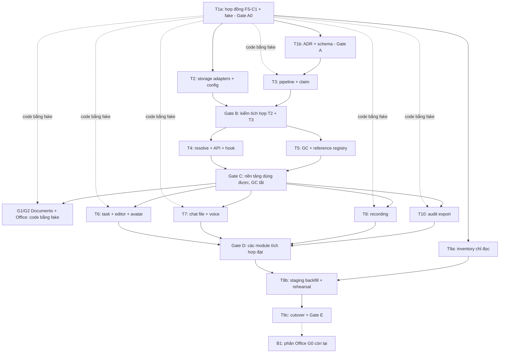

# UniWork - Kế hoạch triển khai FileService dùng chung

> **Trạng thái:** in-progress - Kế hoạch để duyệt; chưa triển khai runtime. Cập nhật 2026-09-24: hợp đồng trước, implement sau (Gate A0); Documents/Office G1-G2 code theo hợp đồng thay vì chờ backlog.

**Ngày:** 2026-09-22, cập nhật 2026-09-24

**Issue tài liệu:** UNI-726. **Parent / Roadmap:** UNI-437 / C-01.

**Spec:** [FileService dùng chung và vòng đời file](../specs/2026-09-22-shared-file-service-design.md). **Hợp đồng module:** [FS-C1](../specs/2026-09-24-file-service-contract.md).

**Quy tắc workspace:** `UNIAI_COORDINATION.md` ở thư mục workspace gốc (ngoài repo). Các task gửi tracking qua coordinator theo guide; không tự cập nhật UniAI. Người triển khai đọc thêm `CLAUDE.md`, `docs/conventions.md`, `docs/api-sdi-sdo.md` và `docs/engineering/UNIAI_TRACKING.md`.

## 1. Kết quả và phạm vi bàn giao

Đợt đầu xây một FileService bằng Go interface/composition; chuyển các luồng task/editor, avatar, chat file/voice, meeting/call recording và audit export sang service này. Mỗi file có một hàng metadata kỹ thuật và organization_id trong `files`; bảng nghiệp vụ giữ `file_id`. Storage, upload session, resolve private media và cleanup dùng chung.

Người dùng đã thống nhất ngày 2026-09-22: triển khai phần file trước, để việc chuyển G0 Documents/Office vào backlog; plan phải nêu thứ tự và các nhóm có thể làm song song. Việc yêu cầu viết plan chưa phải lệnh chạy implementation, migration hoặc cleanup dữ liệu hiện hữu.

Audit export được bổ sung sau khi rà consumer: `server/internal/service/audit_export.go` đang gọi Upload trực tiếp, `handler/audit.go` dựng ObjectURL và `audit_exports` lưu object_key. Đây là consumer file hiện có cần chuyển, không mở rộng chức năng xuất audit.

**Đợt đầu hoàn tất khi:**

- Các consumer trong phạm vi gọi FileService, trả ID/URL theo quyền hiện tại, không tự dựng object key hoặc xóa bytes.
- Unknown purpose bị chặn trước đọc bytes/ghi DB/storage; cấu hình storage sai/chưa có adapter làm startup lỗi rõ ràng; selector vắng chọn MinIO.
- Save, cancel, expiry, unlink, crash và retry không làm mất file còn được dùng; job cleanup bền vững và kiểm đúng storage/version.
- Cutover có inventory, backfill, kiểm quyền, dry-run, đối soát và recovery; GC chỉ được quản lý tập object đã chuyển giao ownership.
- G0/legacy ngoài tập cutover vẫn hoạt động theo đường hiện tại; không tuyên bố Documents/Office đã chuyển chỉ vì nền tảng FileService đã xong.

**Cập nhật 2026-09-24 - hợp đồng trước:** người dùng chốt quy tắc: task cần service của task khác thì bên cung cấp giao hợp đồng trước, implement sau, để bên tiêu thụ không phải chờ. FileService giao [FS-C1](../specs/2026-09-24-file-service-contract.md) ở Gate A0 (T1a) và mọi bên tiêu thụ, gồm Documents/Office G1-G2 (UNI-657/658), code theo hợp đồng + fake từ đó. Documents chưa có dữ liệu production nên không cần chuyển dữ liệu: G1 dùng `file_id` từ đầu, không dựng ledger object riêng. B1 thu hẹp còn phần ở §5. Không trì hoãn các task editor/fidelity đang chạy của G0.

Không làm thumbnail/transcode bắt buộc, direct browser upload, file manager, ACL file độc lập, dedup xuyên tenant hoặc nhiều MinIO deployment chung một code.

## 2. Điểm xuất phát và ràng buộc

Plan khảo sát trên worktree UNI-726 từ develop `97b4fa5946fc2ccb208d626de45a13dd0805d546`. Trước implementation phải đọc lại HEAD và inventory trên nền tích hợp mới nhất; không chép đè code Office đang làm trong checkout `dev-uniwork`.

| Hiện trạng | Hệ quả cho triển khai |
| --- | --- |
| `server/internal/storage/storage.go` có Upload, ObjectURL, Delete/DeleteObject, GetReader và presigner | Mở rộng package storage hiện có; giữ đường legacy cần thiết trong giai đoạn chuyển giao, không tạo pipeline nghiệp vụ thứ hai |
| `cmd/server/main.go` chọn s3, các giá trị khác rơi về local | Thay bằng loader/registry strict; đổi env và startup cùng đợt rollout |
| Task upload object trước khi ghi attachments; vài nhánh bỏ lỗi xóa | Ghi intent trước Put, claim cùng transaction domain, cleanup bằng durable job |
| Chat handler upload trực tiếp, metadata file nằm trong JSON message | Tách technical metadata sang files, dùng quan hệ của module chat và giữ client_msg_id/idempotency |
| Avatar handler ghi storage rồi cập nhật user | Chuyển orchestration vào service; replace/unlink file cũ theo transaction |
| LiveKit start egress trước khi lưu recording; config ghi riêng | Cấp intent trước start; chốt locator, endpoint provider, lease và reconcile kết quả muộn |
| Audit export ghi object và complete-export riêng | Claim file với complete-export trong transaction; outbox retry không tạo nhiều bản đã gắn |
| Readiness hiện kiểm DB/schema/Redis, dùng timeout chung 500 ms | Bổ sung storage probe có deadline phù hợp, không buộc liveness phụ thuộc storage |

Các bất biến xuyên mọi task:

1. `files` chứa metadata kỹ thuật và organization_id theo T1-Q10. File tổ chức bắt buộc tenant; avatar tài khoản có ngoại lệ NULL qua identity scope. Không thêm owner, purpose, ref_count hoặc bảng đa hình media_usages. Actor/scope chi tiết/purpose của lượt upload ở session; quyền lâu dài ở domain.
2. ULID TEXT; không FK/REFERENCES/cascade. Mỗi index CONCURRENTLY ở một migration riêng. Chọn số migration tại thời điểm tích hợp, không đóng đinh số từ worktree cũ.
3. Layer handler -> service -> sqlc. Command domain ghi quan hệ, claim, audit/outbox trong cùng transaction. Không tự đọc bảng membership ngoài gate.
4. Lock files theo ID tăng dần trước session/job và quan hệ domain; GC kiểm reference sau khi có lock bằng READ COMMITTED. Không giữ DB transaction trong khi stream storage.
5. Có enum không có nghĩa capability đã mở. Document purpose giữ trong registry nhưng disabled cho tới B1; request bị từ chối trước đọc bytes.
6. Adapter registry dispatch theo `files.storage`, không theo default hiện tại. `local` là filesystem server; MinIO trên localhost/Docker vẫn là `minio`.
7. Comment Go/TS/env và COMMENT ON COLUMN dùng tiếng Anh, nêu ý nghĩa, NULL, đơn vị, default và sự khác biệt local/MinIO.
8. Vòng đời đã chốt: hạn claim staged 24h; quét dọn rác 1 lần/ngày khi file quá 24h từ ready, không có khoảng đệm riêng sau cancel/unlink cuối; URL 12h, không tự lấy URL mới khi hết hạn. Trước xóa vẫn kiểm reference/lease/retention/hold. Tombstone ít nhất 30 ngày còn là baseline vận hành đề xuất. Không áp TTL staged lên draft Office hoặc recording còn writer.
9. Không xóa theo prefix/tuổi toàn bucket. File legacy chưa xác minh hoặc chia sẻ với G0 được giữ ngoài tập destructive cleanup.

## 3. Thứ tự triển khai và nhóm song song

### 3.1 Bảng task và phụ thuộc

Các mã T chỉ là định danh task, không phải thứ tự số để thực thi. T10 là audit export được phát hiện thêm; nó chạy cùng nhóm tích hợp, trước T9 cutover.

| Task | UniAI | Kết quả | Điều kiện bắt đầu | Điều kiện tích hợp/hoàn tất |
| --- | --- | --- | --- | --- |
| T1a | UNI-739 | Hợp đồng FS-C1: type, interface, fake, contract test | Spec + plan được duyệt để triển khai | Gate A0 |
| T1b | UNI-739 | ADR, schema/sqlc hạ tầng | Gate A0 | Gate A |
| T2 | UNI-740 | Adapter/config/capability/preflight | Gate A0 (storage không cần schema) | T2 và T3 cùng đạt Gate B |
| T3 | UNI-741 | Upload/session/claim/idempotency | Gate A0 để code; query DB cần Gate A | T2 và T3 cùng đạt Gate B bằng adapter thật |
| T4 | UNI-742 | Resolve/proxy/presign + API/hook dùng chung | Gate A0 để code theo hợp đồng; tích hợp cần Gate B | Gate C cùng T5 |
| T5 | UNI-743 | Reference registry, GC/reconcile/metrics | Gate A0 để code; race test DB thật cần Gate B | Gate C cùng T4; chưa bật destructive GC |
| T6 | UNI-744 | Task/editor/avatar | Gate A0, code bằng fake | Gate D, chạy lại trên FileService thật sau Gate C |
| T7 | UNI-745 | Chat file/voice | Gate A0, code bằng fake | Gate D, chạy lại trên FileService thật sau Gate C |
| T8 | UNI-746 | Meeting/call recording | Gate A0, code bằng fake | Gate D, provider intent/lease và test LiveKit trên FileService thật |
| T10 | UNI-749 | Audit export | Gate A0, code bằng fake | Gate D, outbox/expiry và quyền tải trên FileService thật |
| T9a | UNI-747 | Inventory và chuẩn bị migration, chỉ đọc/report | Gate A0 | Báo cáo mapping/phạm vi, có thể làm song song T2-T8/T10 |
| T9b/c | UNI-747 | Backfill, kiểm tích hợp và rollout/cutover | Gate D + T9a | Gate E; chạy theo thứ tự §7 |
| G1/G2 | UNI-657/658 | Documents/Office tiêu thụ FS-C1 (plan riêng) | Gate A0, code bằng fake | Nghiệm thu storage thật (H1 của plan G1-G2) sau Gate C |
| B1 | UNI-748 | Phần còn lại cho Office G0 (§5) | Sau khi G0 bàn giao DOC-004 | Không là điều kiện hoàn tất đợt đầu |

"Code bằng fake" nghĩa là viết code và unit/DB test của module với `filesfake`, qua đủ `filescontract`. Nghiệm thu từng gate vẫn đòi FileService thật như cột cuối; fake xanh không thay bằng chứng tích hợp.

### 3.2 Sơ đồ phụ thuộc



Mũi tên nét đứt là quan hệ "code bằng fake": bên tiêu thụ bắt đầu ngay khi có A0, còn mũi tên liền tới gate là điều kiện nghiệm thu với FileService thật.

**Lịch thực thi đề xuất:**

| Đợt | Chạy song song được | Điểm phải chờ |
| --- | --- | --- |
| 0 | T1a | Hợp đồng FS-C1, fake và contract test merge vào develop; đây là việc duy nhất các bên phải chờ |
| 1 | T1b + T2 + T9a; bên tiêu thụ (T6/T7/T8/T10, G1-03) bắt đầu code bằng fake | T1b chốt schema; T2 chỉ cần hợp đồng storage |
| 2 | T3 + T4 + T5; bên tiêu thụ tiếp tục | T3 query thật sau Gate A; T4/T5 code theo hợp đồng, tích hợp sau Gate B |
| 3 | Bên tiêu thụ chạy lại trên FileService thật | Sau Gate C; lỗi lệch giữa fake và thật sửa ở hợp đồng/fake, không vá riêng ở module |
| 4 | T9b, sau đó T9c | Không chạy cutover/GC song song trước khi đủ inventory, reference coverage và bài kiểm tra |
| Sau đợt đầu | B1 | G0 editor/fidelity tiếp tục độc lập |

Chuỗi quyết định thời điểm bàn giao: T1a -> (T1b, T2) -> T3 -> T4/T5 (Gate C) -> nghiệm thu module trên FileService thật (Gate D) -> T9b -> T9c. Phần viết code của module không còn nằm trên chuỗi này; nó chỉ chờ A0.

### 3.3 Gate nghiệm thu trước khi chuyển đợt

| Gate | Bằng chứng bắt buộc |
| --- | --- |
| A0 | Các mục §8 của FS-C1 đã merge: type/enum/registry khai báo, interface `files.Service` + `files.ReferenceProvider`, `filesfake` qua `filescontract`, luật arch test và mã lỗi; không migration, không nối main |
| A | ADR tenant và ngoại lệ avatar nullable có lý do; schema/sqlc/lint đạt; contract upload/claim/resolve/reference và lock order được ghi thống nhất; catalogue purpose/capability và mã lỗi dùng chung |
| B | Một upload/claim/rollback chạy được qua Local và MinIO; schema, factory và pipeline tích hợp; negative config/enum không tạo side effect |
| C | Resolve private đúng quyền, proxy/Range chạy; GC dry-run giữ referenced/staged/active writer; race claim-cancel-GC và retry được kiểm; shutdown worker có quản lý |
| D | Từng module dùng file_id, claim/audit/outbox đúng transaction; UI phù hợp; providers đủ cho mọi reference mới; retry/permission/retention từng module đạt |
| E | Inventory/backfill/recovery rehearsal đạt; toàn bộ checks cần thiết đạt; phạm vi GC được xác nhận và không chạm G0/legacy ngoài quyền; đủ bằng chứng để người dùng quyết rollout/nghiệm thu |

### 3.4 Ownership khi làm song song

Có thể do nhiều người hoặc agent thực hiện sau khi được giao; plan này không tự spawn hay giao việc. Mỗi task phụ trách các file riêng được liệt kê ở §4; không revert thay đổi của nhóm khác.

- Người phụ trách T1 giữ hợp đồng FS-C1, schema và lock contract. Mọi thay đổi hợp đồng sau Gate A0 tăng version FS-C1, sửa fake + contract test cùng PR và báo mọi bên tiêu thụ, gồm plan G1-G2 (FS-C1 §9).
- Người phụ trách T2 giữ `internal/storage` và config loader; T3 giữ `file_service.go`/upload/claim; T4 thêm file resolve/proxy/hook; T5 thêm file worker/reference/reconcile. T4/T5 không cùng sửa constructor lõi tùy ý.
- Vai trò tích hợp thuộc người phụ trách T9 ngay từ đầu: tổng hợp thay đổi `cmd/server/main.go`, `handler/router.go`, `router/routes.go`, `router/openapi.go`, error map, audit coverage và event catalogue. Từng nhóm gửi thay đổi cần nối; tích hợp lần lượt ở mỗi gate.
- Migrations được cấp số theo thứ tự merge; domain task sở hữu nội dung migration/query riêng. Chạy sqlc sau khi hợp nhất query, không resolve conflict generated bằng cách chọn một phía.
- T7 sở hữu file/voice message và `chat-media.ts`; T8 sở hữu call recording, `chat-voice.ts` và playback cache. Các file chung `chat.go`, hooks/DTO chat và constructor được tích hợp lần lượt, không sửa chồng.
- T6 sở hữu UI task/editor/avatar; T7 sở hữu chat gửi/hiển thị file; T8 sở hữu player recording. Hook/DTO file chung do T4 cung cấp; mọi consumer không tự làm mới URL theo expiry (T1-Q7).
- Ngôn ngữ i18n, export package, dependency manifest và CI cũng đi qua người tích hợp khi nhiều nhóm cùng thay. Chỉ thêm dependency có nhu cầu đã chứng minh.

## 4. Nội dung từng task

Tên file mới dưới đây là vị trí dự kiến. File hiện có phải đọc lại trên HEAD trước sửa; không coi đường dẫn mới là đã có code.

### T1 - Contract, ADR và persistence (UNI-739)

**Phụ thuộc:** bắt đầu trước các task implementation khác. Chia hai PR trong cùng issue: **T1a** giao hợp đồng (Gate A0), **T1b** giao ADR + schema (Gate A).

**T1a - hợp đồng trước (Gate A0).** Nội dung và danh sách giao phẩm là [FS-C1](../specs/2026-09-24-file-service-contract.md) §8: `server/internal/files` (type, enum, registry khai báo, mã lỗi, interface), `server/internal/files/filesfake`, `server/internal/files/filescontract`, luật arch test. T1a không có migration, không nối main, không đổi consumer; nó nhỏ để merge nhanh và mở khóa mọi bên tiêu thụ. Các mục checklist dưới đây về type/state/error/ReferenceProvider thuộc T1a; phần schema/query/migration thuộc T1b.

**File chính:** mới `server/internal/files/types.go`, `contracts.go`, `filesfake/`, `filescontract/`, `server/pkg/db/queries/files.sql`, `file_upload_sessions.sql`, `file_jobs.sql`; migration files/session/job và index; sửa `server/migrations/lint_test.go`, `server/internal/testutil/db.go`; thêm ADR số kế tiếp trong `docs/adr/`.

- [ ] Chốt ObjectLocator, StorageType, UploadPurpose/policy, trạng thái file/session/job, error codes, authorized context, capability và hợp đồng ReferenceProvider. Không đưa interface storage mới sang package cạnh tranh với `internal/storage`.
- [ ] Chốt contract Upload, RegisterProviderOutput, ResolveMany, ClaimInTx, CancelUpload, ScheduleCleanupInTx; chữ ký transaction dùng cùng `q.WithTx(tx)` với module.
- [ ] Tạo schema metadata + organization_id theo spec; session có actor pair/scope/purpose/idempotency/lease; job có attempt/deadline/retry. Định nghĩa unique idempotency, locator nullable bucket và claim invariants.
- [ ] Áp dụng quyết định T1-Q1 người dùng chốt ngày 2026-09-22: thuộc tính kỹ thuật riêng theo định dạng nằm trong `metadata JSONB`, có schema/version, allowlist và kiểm kiểu dữ liệu; trường chung là cột riêng. Không nhét dữ liệu nghiệp vụ vào JSON hoặc tách các thuộc tính này thành cột nullable riêng.
- [ ] Áp dụng T1-Q2 người dùng chốt ngày 2026-09-22: giữ `checksum_sha256` nullable, mặc định không tính; G0/module khác bật tính/xác minh khi cần. Comment và CHECK phải cho phép ready với NULL; khi có giá trị, chỉ lưu SHA-256 đã xác minh. Yêu cầu checksum theo policy được kiểm ở service, không thành NOT NULL toàn bảng.
- [ ] Áp dụng T1-Q3 người dùng chốt ngày 2026-09-22: nhiều quan hệ nghiệp vụ cùng tổ chức giữ chung file_id/bytes và một tên file trong files; không có alias tên theo attachment. Quyền và unlink/replace độc lập ở từng nơi. Schema không ép một file chỉ có một reference toàn hệ thống. Upload riêng không tự dedup.
- [ ] Áp dụng T1-Q4 người dùng chốt ngày 2026-09-22: không triển khai đổi tên file sau upload. Giữ original_filename đã làm sạch lúc upload cho mọi nơi hiển thị/tải xuống; tái sử dụng không đổi tên hoặc object_key. Không bổ sung API, UI hoặc quyền đổi tên.
- [ ] Áp dụng T1-Q5 người dùng chốt ngày 2026-09-22: file upload chưa gắn có hạn claim 24 giờ từ ready/staged; quét dọn rác 1 lần/ngày, chỉ chọn file chưa gắn đã quá 24 giờ và đủ điều kiện reference/lease/hold. Upload xong rồi hủy trước khi lưu cũng là file rác, không có khoảng đệm riêng sau cancel hoặc tính lại tuổi từ lúc hủy. File đã claim không chịu TTL này; không cần tác vụ chạy riêng đúng lúc từng file hết hạn.
- [ ] Áp dụng T1-Q6: file bị gỡ khỏi nơi tham chiếu cuối cũng là file rác, dùng chung lịch/ngưỡng dọn; không chờ thêm 24 giờ từ unlink. Reference của version/soft delete/retention vẫn được tính, kiểm lease/hold trước xóa.
- [ ] Lưu ready_at kỹ thuật trong files làm mốc tuổi file bền vững sau khi dọn session; set một lần khi ready, không đổi do claim/cancel/unlink hoặc cập nhật metadata. GC không lấy created_at intent/updated_at thay mốc này.
- [ ] Áp dụng T1-Q7: URL có thời hạn 12 giờ, giới hạn bởi grant/credential; UI không tự resolve lại khi sắp hết hạn hoặc gặp lỗi expiry. Lần tải dữ liệu mới vẫn kiểm quyền và resolve bình thường.
- [ ] Áp dụng T1-Q8: dùng idempotency key cho một lượt upload logic, giữ key khi retry; ràng buộc actor/scope/purpose và command. Replay không mở writer trùng hoặc thay bytes của kết quả đã thành công, command khác trả conflict, không hồi sinh phiên canceled/expired.
- [ ] Áp dụng T1-Q9: cùng file_id/bytes trong cùng tổ chức chỉ tính dung lượng một lần dù có nhiều reference; không cộng theo số attachment. Các lượt upload riêng vẫn là file riêng theo T1-Q3. Quy tắc tính không tự bật quota hoặc đặt mức trần mới.
- [ ] Áp dụng T1-Q10: thêm files.organization_id từ context đã xác minh, bắt buộc với file tổ chức và bất biến sau tạo intent. Avatar tài khoản hiện có dùng NULL chỉ qua UserAvatar/user scope được cấp quyền, không dùng NULL cho unknown tenant hoặc như quyền public. Cùng tenant mới reuse file_id; copy sang tenant khác tạo file_id/object mới.
- [ ] ADR giải thích tenant file và ngoại lệ nullable cho avatar cá nhân, cùng bảng điều phối user/org. Migration lint vẫn bắt files có organization_id/CHECK/comment; chỉ ngoại lệ NOT NULL có lý do và test, không miễn toàn bộ kiểm tra tenant cho files.
- [ ] COMMENT ON COLUMN đầy đủ, CHECK storage/status, ràng buộc ready đủ metadata bắt buộc; migration lên/xuống và index CONCURRENTLY riêng. Legacy không có checksum giữ NULL, không tự backfill nếu luồng không yêu cầu.
- [ ] Query khóa file theo thứ tự, cập nhật trạng thái có điều kiện, claim job/lease và chống double claim. Query file tổ chức luôn lọc organization_id; nhánh identity riêng kiểm NULL và user grant/reference, không dùng OR organization_id IS NULL trong query tenant. Worker toàn hệ thống có query nội bộ riêng và đối chiếu tenant session/job/reference.
- [ ] Unique locator storage/bucket/object_key vẫn toàn bảng để chặn hai tenant cùng giữ một object; index theo organization_id cho truy cập tenant, không dùng key/prefix thay tenant. Metadata/schema comment mô tả rõ NULL của avatar khác tenant chưa xác minh.
- [ ] Chạy sqlc, cập nhật test DB cleanup. Ghi acceptance T1 và contract dùng chung cho các nhóm.

**Kiểm chứng:** T1a: `go test ./internal/files/...` với fake qua toàn bộ `filescontract`, arch test mới, mapping mã lỗi; đây là Gate A0. T1b: migration lint/round-trip trên DB thử, SQL uniqueness/NULL và transaction rollback, attribution pair; schema có tenant nhưng không có liên kết nghiệp vụ/owner; hai tenant cách ly, chỉ nhánh avatar cá nhân nhận NULL. Đây là Gate A.

### T2 - Storage adapter, config và startup (UNI-740)

**Phụ thuộc:** Gate A. **Song song:** T3 và T9a.

**File chính:** `server/internal/storage/storage.go`, `local.go`, `s3.go`; mới registry/config/contract tests trong cùng package; `server/internal/config/`, `server/internal/service/readiness.go`, `.env.example`. Main/deploy do người tích hợp nối ở gate.

- [ ] Một loader typed config dùng LookupEnv: selector vắng -> minio; rỗng -> lỗi; trim/lowercase code; enum hợp lệ nhưng chưa có factory -> lỗi. Registry reject trùng/nil/typed-nil.
- [ ] Đăng ký thực tế `local`, `s3`, `minio`; S3/MinIO dùng chung SDK được nhưng config độc lập. MinIO bắt buộc endpoint/bucket/access/secret/region, không dùng ngầm AWS credential chain.
- [ ] Kiểm groups được khai báo, storage còn file/job, capability theo luồng. S3 IAM/static pair đúng quy tắc; local root không nhập nhằng MinIO.
- [ ] Put/Open/Stat/Delete theo locator, stream/cancel/timeout, presign và Range; filesystem giới hạn root cả symlink, temp + atomic finalize. Delete phải trả lỗi.
- [ ] Versioning/hold: phát hiện bucket mode; xóa đúng version nếu có capability. Nếu chưa hỗ trợ đầy đủ mode/capability đã cấu hình thì reject trước nhận upload, không giả DeleteObject 2xx đã thu hồi bytes.
- [ ] Preflight bounded, errors không lộ secret; probe runtime cập nhật readiness, liveness độc lập. Credential refresh khi dùng IAM/STS.
- [ ] Khi nối loader mới vào main, tích hợp env/deploy/CI cần thiết trong cùng đợt; không phát hành binary đổi default MinIO trước khi môi trường có cấu hình tương ứng. T9 kiểm lại mapping và readiness khi cutover dữ liệu.
- [ ] Viết contract suite cùng input/expected result trên local và MinIO; S3 integration dùng bucket test được cấp quyền, không dùng dữ liệu thật để smoke.
- [ ] Giữ các method/consumer legacy còn cần trong migration dưới package hiện có, với danh mục callsite và điều kiện gỡ rõ; không dual-write cùng một file qua hai pipeline.

**Kiểm chứng:** negative env matrix, no-fallback/typed-nil, Put/Get/Stat/Delete thật, private object, range/cancel, clock/TTL/credential, bucket permissions/timeout, local root/disk errors. Tích hợp T3 bằng adapter thật để đạt Gate B.

### T3 - Pipeline upload, session và claim (UNI-741)

**Phụ thuộc:** Gate A. **Song song:** T2; unit/DB tests dùng fake theo contract, acceptance chờ T2.

**File chính:** mới `server/internal/service/file_service.go`, `file_upload.go`, `file_claim.go`; registry purpose/key/processor trong `server/internal/files/`; tests và query riêng tương ứng.

- [ ] Registry đầy đủ enum và prefix/policy/scope, gồm AuditExport; DocumentFile/DocumentAsset khai báo nhưng chưa enabled. Purpose được module chọn, input generic phải qua allowlist.
- [ ] Chặn unknown/empty/unmapped/disabled purpose và sai scope trước đọc reader, tạo intent hoặc I/O adapter. Handler phải kiểm route/header trước parse multipart.
- [ ] Validate size thực trên stream, MIME/content/OOXML, filename/path và processor limits. Checksum SHA-256 chỉ tính/đối chiếu khi module bật policy theo T1-Q2; dùng chung cơ chế giữa các adapter. Giữ policy hiện tại; không tăng cap hoặc sửa bytes âm thầm.
- [ ] Upload idempotency theo T1-Q8 có scope/actor/purpose và fingerprint các tham số command; cùng key khác tham số phải conflict. Cùng key trả trạng thái/kết quả cũ; đang xử lý không mở writer trùng, đã thành công không đọc/ghi lại body để thay file. Khi không có checksum, không tuyên bố fingerprint metadata phát hiện được hai stream khác bytes; luồng cần ràng buộc nội dung bật checksum, verify bytes thật trước ready và không tin digest client/provider khai.
- [ ] Kiểm riêng default không tính checksum/ready với NULL, policy bắt buộc checksum thì chặn thiếu/sai, và provider output không bị đọc lại toàn bộ chỉ để tính checksum khi chưa bật policy.
- [ ] Ghi intent/session/job trước Put với organization_id đã xác minh; nhánh avatar cá nhân được cấp phép dùng NULL tường minh. Không giữ transaction khi stream. Put thành công nhưng DB finalize lỗi được reconcile từ intent; fail/cancel enqueue job bền vững.
- [ ] ClaimInTx khóa file cũ/mới và session theo giao thức; check lại actor/scope/purpose/expiry/ready và tenant của file khớp session/đích, consume session cùng domain reference; rollback trả file về staged.
- [ ] T1-Q5: ghi hạn claim 24 giờ khi file ready/phiên staged; từ chối claim/cấp URL mới khi hết hạn dù lượt quét hằng ngày chưa chạy. Preview/retry/mở tab không gia hạn; kiểm mốc trước/đúng/sau hạn bằng clock điều khiển được.
- [ ] Nhánh tái sử dụng file theo T1-Q3 kiểm quyền nguồn/đích và policy đích, tạo reference mới dưới lock, không consume lại session cũ. Giữ key/prefix ban đầu; replace tạo file mới cho nơi đang thao tác. Quyền đọc reference đích sau commit không phụ thuộc quyền đọc nguồn.
- [ ] Cancel/expiry idempotent; already_claimed không được xóa. Cancel file đã upload xong thu hồi grant ngay và đưa vào cùng luồng dọn rác T1-Q5, giữ mốc ready/staged ban đầu. Retry writer có attempt/generation và file/key mới khi kết quả lần trước chưa chắc chắn; không hồi sinh terminal.
- [ ] Chuẩn bị seam provider output/lease cho T8 và system-generated content cho T10. Tác nhân hệ thống không được bỏ qua grant của command gốc.
- [ ] Hooks quota/reservation có idempotency và chỉ áp dụng khi module bật quota; nhóm theo files.organization_id đã đối chiếu domain/session, không tự đặt hạn mức mới. Theo T1-Q9, một file dùng chung trong tổ chức chỉ tính bytes một lần; thêm reference không reserve lại bytes. Avatar cá nhân NULL không tự tính vào tổ chức đang mở. Ghi operational metrics; business audit do domain transaction.

**Kiểm chứng:** không side effect khi purpose sai; MIME/size gian lận; hai actor/scope; retry cùng key và command mismatch, replay không ghi lại body đã thành công; fail trước/sau Put/finalize; claim rollback; race save-cancel, nhiều file all-or-nothing. Gate B cần luồng này chạy trên Local và MinIO.

### T4 - Resolve private media, API và hook chung (UNI-742)

**Phụ thuộc:** Gate B. **Song song:** T5.

**File chính:** mới `server/internal/service/file_resolve.go`, handler/DTO/router file access theo domain/session; `packages/core/types/file.ts`, `packages/core/api/endpoints/files.ts`, `packages/core/files/`. Reuse patterns của attachment/recording proxy hiện có.

- [ ] ResolveMany query batch có organization_id khớp context đã authorize theo quan hệ domain hoặc session, dispatch storage đúng locator; ID file hoặc cùng tenant đơn độc không cấp quyền. Avatar cá nhân có nhánh identity riêng, không fallback từ query tenant sang file NULL.
- [ ] DTO có file_id/metadata cần UI/URL/url_expires_at; không lưu URL ký làm nguồn chuẩn hoặc phát key/credential thành field.
- [ ] Resolve tên hiển thị/Content-Disposition từ tên chung trong files; quyền theo reference đang đọc (T1-Q3). Không lấy quyền từ nơi upload ban đầu hoặc lưu tên file riêng theo attachment.
- [ ] Phân biệt presign (URL có thể lộ host/path object) với proxy ẩn locator. G0 sau này chọn proxy để giữ contract; không tuyên bố presign che object key.
- [ ] Proxy kiểm quyền mỗi request, hỗ trợ HEAD/Range/seek, stream/close/cancel; cookie/session hoặc ticket ràng buộc principal và vẫn kiểm quyền sống. Native img/audio/video không phụ thuộc header Bearer tự chèn.
- [ ] Presign đúng host consumer, TTL min(12 giờ, grant, credential expiry) theo T1-Q7, không sửa host/path sau ký. Không fallback URL public khi signing lỗi.
- [ ] API đăng ký Chi apiOp, SDI/SDO, pathParamSDI, mapServiceError; frontend endpoint parseWithFallback + malformed tests.
- [ ] Hook chung giữ ID bền vững, không có timer tự làm mới URL hoặc retry resolve khi expiry theo T1-Q7; lần tải dữ liệu mới kiểm quyền/resolve bình thường. Cache theo principal + context, clear logout/switch account; không persist signed URL vào rich text/draft nghiệp vụ.
- [ ] Contract return error/partial result của batch rõ để UI không hiển thị stale URL cho file revoked/deleting. Metadata/original read không phụ thuộc Office engine.

**Kiểm chứng:** isolation hai người/hai tổ chức, revoked/session expiry, signed host/TTL 12 giờ và giới hạn grant/credential, proxy 200/206/416/HEAD, cache identity, browser không tự resolve lại do timer/media expiry, query batch không N+1; Swagger parity và schema malformed. Gate C với T5.

### T5 - Reference registry, cleanup và reconcile (UNI-743)

**Phụ thuộc:** Gate B. **Song song:** T4.

**File chính:** mới `server/internal/service/file_references.go`, `file_gc.go`, `file_reconcile.go`, tests; query file_jobs riêng; runbook/metrics; lifecycle worker nối qua người tích hợp.

- [ ] Registry biết mọi cột/quan hệ file_id trong phạm vi managed và dependency kỹ thuật. Thiếu provider hoặc query lỗi -> không xóa batch. Feature flag tắt không gỡ provider dữ liệu còn.
- [ ] Module provider kiểm active, version history, soft delete/restore và holds; source of truth không phải ref_count, JSON scan tùy ý hoặc prefix.
- [ ] T1-Q10: quét GC qua query hệ thống chuyên biệt, đối chiếu tenant file/session/job/reference; avatar NULL có provider identity. Gặp reference khác tenant thì giữ/quarantine và cảnh báo, không bỏ qua rồi xóa file. Tenant không thay kiểm reference/lease/hold.
- [ ] Kiểm T1-Q3 xuyên module: task và chat cùng file_id và cùng tên; unlink/replace ở một nơi giữ nguyên nơi còn lại; chỉ cleanup sau khi mọi reference/hold thực sự hết. Mất quyền nguồn không làm mất reference hợp lệ ở đích.
- [ ] T1-Q6: hết reference cuối thì là file rác; file cũ quá 24 giờ từ ready được xét ở lượt quét kế tiếp, không thêm thời gian chờ sau unlink. File còn reference version/soft delete/retention vẫn được giữ.
- [ ] Thực hiện giao thức lock chung: claim job/lease; khóa files; kiểm reference sau lock; chuyển deleting commit trước Delete. Attach/resolve từ chối deleting.
- [ ] T1-Q5: quét cleanup 1 lần/ngày theo lịch hệ thống, có batch/concurrency giới hạn và lease chống replica chạy trùng; file upload chưa gắn, kể cả upload xong rồi hủy, chỉ là candidate khi quá 24 giờ từ ready/staged. Kiểm cancel không đặt lại mốc tuổi file. Không dùng created_at intent hoặc tuổi object thay kiểm reference; file chưa đủ tuổi giữ đến lượt sau.
- [ ] TTL theo spec; active writer/recording không bị expiry như upload staged. Expired lease chưa chứng minh writer đã chết; abort/confirm hoặc quarantine.
- [ ] Lưu job cleanup lỗi bền vững với backoff; retry ở lượt quét hằng ngày tiếp theo đủ next_attempt_at, không thêm vòng quét mỗi phút hoặc bỏ job vì quá số lần. Worker shutdown trong sequence main. Not-found chỉ thành công với đúng object/version.
- [ ] Reconcile intent-before-Put, missing object còn reference, multipart/temp, late completion và tombstone. Object Lock giữ job theo retention, không bypass.
- [ ] Tạo dry-run report và managed allowlist bằng intent/locator đã xác minh. Legacy/G0 chưa bàn giao, key dùng chung với consumer chưa chuyển hoặc orphan không rõ nguồn đều hold, không xóa.
- [ ] Trong migration, chuyển ownership của object sang GC mới cùng việc loại nó khỏi cleanup cũ; không để hai worker độc lập quyết xóa. Giữ bằng chứng bàn giao trong dữ liệu điều phối/report, không thêm nghiệp vụ vào files.

**Kiểm chứng:** barrier tests với DB thật cho claim-GC/cancel-save/two workers, hai reference, soft-delete restore, provider lỗi, delete fail/crash, versioning/hold, stale writer; clock điều khiển kiểm lịch 1 lần/ngày và ngưỡng quá 24 giờ của T1-Q5. Có fixture G0/legacy và object dùng chung chứng minh GC không xóa. Gate C chưa bật destructive cleanup ở môi trường thật.

### T6 - Task, editor và avatar (UNI-744)

**Phụ thuộc:** Gate C. **Song song:** T7, T8, T10; shared changes theo §3.4.

**File chính:** `service/task_attachments.go`, `service/task.go`, `handler/task_attachments.go`, `handler/avatar.go`, service user/avatar phù hợp; `queries/attachments.sql`, user/task queries và migration riêng. FE: `api/endpoints/task-attachments.ts`, `auth.ts`, `views/tasks/detail/components/attachments-section.tsx`, `views/editor/attachment-api.ts`, `use-editor-upload.ts`, `use-coordinated-uploads.ts`, `use-upload-gate.ts`.

- [ ] Attachments giữ quan hệ nghiệp vụ + file_id; user giữ avatar_file_id. Giữ attachment ID của API cũ nếu cần, resolve metadata qua files, không dual-write metadata kỹ thuật.
- [ ] Task create/comment/edit claim trong transaction với content/reference/audit. Rich text lưu ID; tập reference được backend tính từ nội dung canonical và cập nhật cùng transaction.
- [ ] Tạo các provider task/comment/editor/avatar, bao gồm soft delete và tham chiếu nội dung. Remove/replace gỡ relation và schedule cleanup, không Delete trực tiếp.
- [ ] Avatar orchestration vào service; file thay thế tạo ID mới, fail commit giữ avatar cũ; external avatar không tự import/xóa. Giữ avatar thuộc tài khoản toàn hệ thống: files.organization_id NULL chỉ cho nhánh UserAvatar có grant, không chọn tenant theo tổ chức đang mở, không mất avatar khi rời/xóa một tổ chức.
- [ ] FE dùng policy/hook chung, submit đợi upload, bỏ đúng staged session, retry save không upload lại nếu session còn hợp lệ.
- [ ] Giữ giới hạn/định dạng đã hỗ trợ; chỉnh FE cap theo backend policy có cùng nguồn khai báo. Không tự mở MIME hoặc xử lý nội dung mới.

**Kiểm chứng:** draft chưa lưu/cancel/đóng tab, save conflict/retry, ảnh trong nội dung, remove one of many, avatar replace fail và private resolve; FE malformed và E2E task/avatar. Provider coverage là điều kiện Gate D.

### T7 - Chat file và voice message (UNI-745)

**Phụ thuộc:** Gate C. **Song song:** T6/T8/T10; T8 giữ call recording.

**File chính:** `service/chat_file_message.go`, `chat_voice_message.go`, handler tương ứng; queries message attachments mới và chat queries hiện có; DTO chat; `core/api/endpoints/chat-media.ts`, chat schemas, `views/chat/use-chat-media-send.ts`, `chat-file-message-row.tsx`, `chat-voice-message-row.tsx`.

- [ ] Quan hệ attachment/voice của message giữ file_id; duration/MIME/size lấy files; checksum tùy chọn nếu luồng sử dụng. Không giữ URL/key chuẩn trong metadata JSON.
- [ ] Chuyển upload khỏi handler; giữ authorize room, quyền gửi/DM block, reply validation và ClientMsgID hiện có.
- [ ] Claim reference + tạo message + audit/outbox trong một transaction. Cùng client_msg_id nhưng payload khác phải conflict; mất response không tạo message/file đã claim thứ hai.
- [ ] Provider chat bao gồm nội dung nhúng nếu có, soft delete/retention; edit/delete message không xóa file còn reference khác.
- [ ] UI pending/retry/cancel đi qua hook chung; voice playback không tự lấy URL mới khi hết hạn theo T1-Q7, duration từ metadata đã xác minh. Không làm sai realtime invalidation/catalogue.

**Kiểm chứng:** retry/lost response, quyền gửi bị thu giữa upload/commit, cross-room/org claim, room không có workspace, delete khi file còn được dùng, audio seek/expiry và tests consumer hiện có. Gate D.

### T8 - Recording từ LiveKit (UNI-746)

**Phụ thuộc:** Gate C. **Song song:** T6/T7/T10.

**File chính:** `service/meeting_ai.go`, `meeting_webhook.go`, `chat_voice_recording.go`, `handler/recording_playback.go`, `internal/meetings/provider.go`, `livekit.go`, fake/tests; `queries/meeting_ai.sql`, `chat_voice_recording.sql`; recording UI và `core/meetings/recording-playback-cache.ts`, `core/chat/voice-recording-playback-cache.ts`.

- [ ] Cấp intent/file_id/expected key và provider operation identity trước start; lưu locator từ config registry. Không suy key từ webhook URL.
- [ ] Reconcile crash giữa start provider và ghi ACK; không start mù thêm egress. Stop/finalize có idempotency.
- [ ] Webhook xác thực, đối chiếu operation/generation/key; verify object/size/metadata qua FileService trước ready. Chỉ tính/xác minh checksum nếu policy yêu cầu; default không đọc lại toàn recording để hash. Late success sau cancel không hồi sinh.
- [ ] Lease theo provider activity cho recording dài; GC chỉ được dọn sau stop/abort được xác minh. Sự khác nhau giữa trạng thái recording và files là tường minh.
- [ ] Gắn recording.file_id cùng domain state/audit/outbox; provider references cho meeting/call. Playback dùng T4, giữ quyền host/member/guest hiện hành.
- [ ] Kiểm endpoint mà API, Egress và browser truy cập; capability disabled rõ nếu storage deployment không hỗ trợ provider output. Không giả LiveKit ghi được vào disk local của API.
- [ ] UI giữ live-media flow; thay phần recording output/playback, không đổi truyền âm thanh/video realtime.

**Kiểm chứng:** provider fake cho failure/race + LiveKit/MinIO thật cho start-stop-webhook-playback; duplicate/out-of-order webhook, writer chậm, runtime outage, host/guest isolation và seek. Chưa có môi trường Egress thì ghi thiếu evidence, không coi mock là nghiệm thu tích hợp. Gate D.

### T10 - Audit export (UNI-749)

**Phụ thuộc:** Gate C. **Song song:** T6/T7/T8.

**File chính:** `service/audit_export.go`, `service/audit.go`, `handler/audit.go`, `queries/audit.sql`, `audit_exports` migration, DTO và API audit consumer nếu thay response.

- [ ] Purpose AuditExport/`audit_export`, scope tổ chức, prefix `audit/exports`; output CSV/NDJSON đi qua pipeline chung với grant của export job.
- [ ] `audit_exports.file_id` là reference; complete-export và claim cùng transaction. Outbox retry/crash không ghi đè file ready hoặc tạo hai kết quả đã gắn.
- [ ] Resolve/download kiểm quyền audit hiện tại và export expiry; không lấy quyền vĩnh viễn từ người yêu cầu export hoặc phát ObjectURL trực tiếp.
- [ ] Giữ expiry nghiệp vụ hiện có 24h; reference provider giữ đến hạn, expiry gỡ reference/enqueue cleanup. Nếu bật quota thì xử lý như system output theo T1-Q9; checksum tùy chọn theo policy chung.
- [ ] Chỉ thu gom file kết quả xuất. `audit_events` vẫn append-only, không bị xóa/update do file hết hạn; giữ CSV BOM/định dạng/dữ liệu lọc hiện có.

**Kiểm chứng:** outbox replay và crash sau Put, quyền bị thu, expiry có clock điều khiển, CSV/NDJSON fidelity, delete failure và audit_events bất biến. Gate D.

### T9 - Inventory, migration, tích hợp và rollout (UNI-747)

**Phụ thuộc:** T9a bắt đầu sau Gate A; T9b/c chờ Gate D. T9 cũng giữ vai trò tích hợp shared files ở các gate trước.

**File chính:** command/script backfill mới (ưu tiên Go trong `server/cmd/` để reuse SQL/service); migration domain do từng task cung cấp; `cmd/server/main.go`, `.env.example`, `scripts/local-env.sh`, `scripts/init-worktree-env.sh`, deploy/CI config tương ứng; runbook trong `docs/runbooks/`, E2E tương ứng.

- [ ] T9a inventory tất cả callsite Upload/Delete/ObjectURL, source metadata/URL, object storage đích, ref trong JSON/Markdown, consumer legacy/G0 và writer đang hoạt động. Dữ liệu đọc/report, không tự fetch URL ngoài.
- [ ] Lập mapping locator -> file_id + organization_id từ quan hệ nghiệp vụ đã xác minh, phân biệt verified/unresolved/shared-with-legacy, reference coverage và owner cleanup cũ/mới. Cùng locator chỉ gộp trong cùng tenant; locator đang được nhiều tenant dùng phải hold và copy có kiểm soát thành file/object riêng trước cutover. Không dedup hash xuyên tenant hoặc chèn file unknown tenant với NULL giả avatar.
- [ ] T9b xây backfill có checkpoint/idempotency/dry-run, đối soát rows/objects/refs/locator/size và quyền; checksum chỉ đối chiếu khi có nguồn đã xác minh hoặc policy yêu cầu. Không backfill checksum đại trà, không coi so size là chứng minh bytes giống hệt. Không đoán storage từ URL hostname; URL không đáng tin giữ unresolved.
- [ ] Rehearsal trên DB/storage test hoặc bản sao được phép; kiểm rollback và file mới sinh trong cutover. Không mở destructive GC trong lúc còn backfill chưa đủ.
- [ ] Update env/deploy: local phải explicit nếu vẫn dùng local, MinIO config riêng; alias AWS/S3 xung đột lỗi; legacy locators giữ đúng đích. Phân biệt readiness/startup fail với liveness.
- [ ] Nối dependency injection, registration provider, handler/router, worker startup/shutdown, metrics/runbook và catalogue chung; không để bare goroutine.
- [ ] T9c cutover theo §7, API compatibility ở boundary; kết thúc mỗi batch chỉ có một writer/metadata source và một owner cleanup cho object.
- [ ] Bỏ direct storage call của consumer đã chuyển; giữ danh mục consumer ngoài scope cùng owner/điều kiện gỡ, không xóa abstraction legacy còn được G0 cần.
- [ ] Chạy checks toàn bộ theo §6, gắn evidence từng backend/module; cập nhật plan/spec/roadmap theo thực tế, chỉ người dùng quyết done.

**Kiểm chứng:** migration dry-run/backfill replay/cutover và recovery; G0/legacy control objects không đổi; scope GC đúng allowlist; make check và tests integration cần thiết. Gate E.

## 5. Documents/Office trên FileService và phần còn lại B1 (UNI-748)

**Cập nhật 2026-09-24:** trước đây toàn bộ việc nối Documents/Office vào FileService nằm ở backlog B1, làm sau khi đợt đầu cutover xong. Theo quy tắc hợp đồng trước, việc đó chuyển sang plan G1-G2 (UNI-657/658): G1 code theo FS-C1 + fake ngay từ Gate A0 và chỉ chờ Gate C để nghiệm thu với storage thật. Vì Documents chưa có dữ liệu production, không có bước chuyển dữ liệu nào cho Documents. Liên quan UNI-668 (DOC-004), UNI-669 (DOC-005); plan này không thay trạng thái các issue đó.

**Giao cho plan G1-G2** (chi tiết ở plan đó, task G1-01/G1-03/G1-04/G2-02):

- `document_versions.file_id` và `document_assets.file_id` từ migration đầu tiên; không có bảng ledger object riêng của Documents. Phân biệt document version ID, working revision, file ID và storage object_version; version history/retention/Work Product ACL ở domain.
- Commit phiên bản gọi `ClaimInTx` trong cùng transaction với version/current pointer/revision/audit/outbox. Upload thành công không phải lưu thành công; giữ idempotency/fingerprint, kiểm quyền lại lúc commit và xung đột base revision/version.
- Policy Documents: checksum bắt buộc (hợp đồng G0 giữ nguyên), cap 50 MiB/10 MiB, đọc qua proxy để không lộ path/key storage. Metadata và tải bản gốc không phụ thuộc engine đang chạy.
- Documents đăng ký `ReferenceProvider` cho version (kể cả version cũ), asset, soft delete và retention; registry thật chỉ bật `DocumentFile`/`DocumentAsset` khi các provider đó qua test. Purge/asset mồ côi gọi `ReleaseInTx`, không tự xóa bytes.
- Output engine đi qua `RegisterProviderOutput`/`CompleteProviderOutput`: backend cấp file_id và write target theo job; engine không có credential dài hạn. `office_jobs` giữ trạng thái engine, không có worker tự xóa object.

**Còn lại ở B1, sau khi G0 bàn giao DOC-004 đã review:**

- [ ] Sửa DOC-004 §8.3/§11 (orphan ledger do G1 sở hữu, ledger lưu URL từ `ObjectURL`) sang FileService: intent + file_id, GC một chủ. Việc này do chủ DOC-004 (UNI-668) làm hoặc duyệt; plan này không sửa tài liệu G0 đang chạy.
- [ ] Cập nhật mô hình ledger trong harness `scripts/office-g0/engine-contract*.mjs` hoặc ghi rõ phần đó đã được thay bằng FS-C1; giữ nguyên bằng chứng editor/fidelity, không coi test FileService là acceptance G0.
- [ ] Draft desktop/browser thuộc store theo tài khoản/scope của G0 (DOC-005). Không coi nó là filesystem adapter `local` của API hoặc dọn bằng staged TTL; chỉ bỏ draft sau commit xác nhận hoặc discard rõ ràng.

Đọc bản DOC-004/DOC-005 đã được chủ G0 tích hợp; không lấy bản đang làm ở checkout khác rồi ghi đè.

## 6. Kiểm chứng theo tầng

Chỉ chạy các lệnh dưới đây khi implementation đã có. Task viết plan chỉ kiểm tài liệu và governance; không đánh dấu các checklist này đã chạy.

| Tầng | Cách kiểm | Điều cần chứng minh |
| --- | --- | --- |
| Storage/config | Go package tests + contract tests Local/MinIO, AWS S3 test target nếu hỗ trợ deployment đó | Không fallback, cùng ngữ nghĩa, thực sự Put/Get/Delete, lỗi quyền/TLS/versioning |
| Pipeline/DB | Test dùng testutil.DB và failure injection | Intent trước Put, claim atomic, idempotency theo contract retry, checksum tùy chọn/required theo policy, không cross-scope |
| GC | Race tests có barrier trên DB thật, clock điều khiển | Claim/cancel/unlink/worker không xóa nhầm; error giữ job; legacy/G0 được bảo vệ |
| HTTP/private media | Handler + Swagger tests, browser consumer | Authorize từng context, HEAD/Range, URL 12h giới hạn bởi grant/credential, không tự lấy URL mới do expiry, không public fallback |
| Frontend | Vitest endpoint/hook/component + malformed responses | ID bền vững, cache isolation, submit gate và retry đúng |
| Provider | Fake fault cases + LiveKit Egress/MinIO integration | Intent/lease, webhook replay, stop/cancel/late result, playback |
| Migration | Dry-run + rehearsal + đối soát + recovery | Một source metadata/cleanup cho managed object; không mất object/reference cũ |
| Toàn repo | make check; E2E liên quan kể cả khi gate fast bỏ qua | Không regression task/chat/avatar/recording/audit và contract repo |

### 6.1 Test bắt buộc: smoke, unit, e2e (yêu cầu người dùng 2026-09-24)

FileService thay đường file của nhiều module đang chạy, nên mỗi PR đổi hành vi phải mang đủ ba lớp test dưới đây. Thiếu một lớp thì PR chưa qua gate, bất kể `GATE_LEVEL`: `make check` ở `fast` bỏ E2E, nên PR phải chạy thêm smoke/e2e liên quan và ghi lệnh + kết quả vào mô tả PR.

| Lớp | Định nghĩa trong plan này | Chạy khi nào |
| --- | --- | --- |
| Unit | Go test cho service/adapter/registry (fake hoặc testutil.DB); Vitest cho endpoint, hook, component, kèm ca malformed response | Mọi PR, trong `make check` |
| Smoke | Luồng ngắn nhất chứng minh module còn sống trên app thật với MinIO local: server khởi động qua preflight, `/readyz` xanh, upload một file, hiển thị, tải về đúng bytes. Gắn tag `@files-smoke` để chạy riêng dưới 2 phút | Mọi PR chạm file, mọi gate B-E, sau mỗi lần deploy thử |
| E2E | Playwright qua UI thật cho từng luồng người dùng của module, gồm ca lỗi chính (quá cap, sai loại, mất quyền, hủy trước khi lưu) | PR đổi luồng của module đó, và toàn bộ ở Gate D/E |

**Bước 0 - khóa hành vi hiện tại trước khi sửa.** Trước khi T6/T7/T8/T10 chạm code của module, viết test hồi quy mô tả hành vi đang chạy trên develop (upload, hiển thị, tải, xóa, quyền) và cho chúng xanh trên đường legacy. Sau khi module chuyển sang FileService, cùng bộ test đó phải xanh. Chỗ nào hành vi đổi có chủ ý (ví dụ URL 12 giờ, cap thống nhất thay lệch 100/25 MiB) thì sửa assertion trong cùng PR và ghi lý do; không xóa ca để test xanh. Bước 0 thuộc T9a về inventory nhưng code test nằm ở task của module.

**Ma trận theo module.** Tên file là đích dự kiến.

| Module | Unit | Smoke `@files-smoke` | E2E | Suite hiện có phải chạy lại |
| --- | --- | --- | --- | --- |
| Nền FileService (T1a-T5) | `internal/files/...` qua `filescontract` trên fake, Local, MinIO; config matrix; race GC | Server boot qua preflight MinIO; `/readyz` báo lỗi khi MinIO tắt, liveness vẫn sống | - (không có UI riêng) | `make test-go`, migration lint, arch test |
| Task attachment, comment attachment, ảnh mô tả (T6) | Service claim/unlink/replace, provider; core endpoint + hook upload | Tạo task, đính kèm, thấy file, tải về | `e2e/files-task.spec.ts`: đính kèm vào task và comment, ảnh trong mô tả sau reload, gỡ attachment, quá cap, hủy trước khi lưu | `task-detail-parity-smoke`, `tasks-collection-parity-smoke` |
| Avatar (T6) | Replace atomically, nhánh NULL tenant, provider identity | Đổi avatar, thấy ở header | `e2e/files-avatar.spec.ts`: đổi, thay lần hai, avatar hiện ở hai tổ chức, file sai loại | `people`, `onboarding-*` (regression contract, không sửa spec) |
| Chat file, voice (T7) | Claim cùng message, idempotency `client_msg_id`, provider chat | Gửi một file trong phòng, người thứ hai thấy | `e2e/files-chat.spec.ts`: gửi file, gửi voice và phát, người ngoài phòng không tải được, gửi lại khi mất mạng không nhân đôi | (chưa có e2e chat; spec mới là baseline) |
| Recording (T8) | Intent/lease, webhook replay, late result | Kết thúc một cuộc họp có ghi, recording hiện và phát được | Mở rộng `meetings-livekit.spec.ts`: phát recording, seek (Range), người không thuộc cuộc họp bị chặn | `meetings`, `meetings-livekit` |
| Audit export (T10) | Claim cùng complete-export, expiry 24h, outbox retry | Tạo export, tải về | Mở rộng `audit.spec.ts`: tạo, tải, hết hạn không tải được | `audit` |
| Documents/Office (plan G1-G2) | Documents service trên `filesfake` rồi FileService thật | Tạo tài liệu file, tải về đúng checksum | Theo plan G1-G2 (G1-09) | Theo plan G1-G2 |

**Hai tổ chức.** Mỗi e2e của module có ít nhất một ca người ở tổ chức khác đoán đúng file_id hay URL và bị chặn. Fixture dùng `e2e/db.ts` với hai tổ chức, không dùng tài khoản admin cho mọi bước.

**Hạ tầng test.** CI (`.github/workflows/ci.yml`) hiện chưa có MinIO. T2 thêm service MinIO vào job Go và job `e2e` cùng env `MINIO_*` test; trước khi có, smoke/e2e chạy local với `make minio-up` (`docker-compose.minio.yml`) và PR ghi rõ chưa chạy trên CI. Không dùng bucket thật để smoke.

Lệnh chuẩn (từ repo root, môi trường toolchain theo repo):

```sh
make sqlc
node --test scripts/governance.test.mjs scripts/env-example.test.mjs
make test-go
pnpm --filter @uniwork/core test
pnpm --filter @uniwork/views test
make check
```

Go test đích dùng cwd `server/`, ví dụ `go test ./internal/storage ./internal/files ./internal/service ./internal/handler ./migrations`; chọn `-run` theo test đã tạo để lặp nhanh. `make test-go` chạy vet/staticcheck/race và chuẩn bị DB theo repo. Integration storage/Egress cần test target riêng; không coi chạy unit suite là đã chạy provider thật. Nếu `make check` ở gate fast bỏ E2E, chạy thêm suite liên quan qua `make e2e` hoặc lệnh Playwright chọn file trong package E2E.

Mọi test có I/O chỉ dùng DB/bucket/volume test đã cấu hình. Không chạy smoke tạo/xóa object trên bucket sản xuất vì chỉ thấy credentials có sẵn. Không log secrets/signed URLs.

Báo rõ test chưa chạy hoặc lỗi nền độc lập; không tuyên bố Gate E đạt nếu còn thiếu evidence quan trọng. Không rerun toàn bộ suite cho docs-only hoặc phần không đổi chỉ để tăng số lần kiểm.

## 7. Thứ tự rollout và recovery

Phân biệt thứ tự viết code với thứ tự triển khai dữ liệu. Tích hợp code các nhóm có thể song song; cutover từng tập dữ liệu là tuần tự có gate.

1. **Chuẩn bị đích:** xác nhận adapter/config và consumer endpoints; cung cấp bucket/volume bằng quy trình vận hành. Ứng dụng không tự tạo bucket/đổi ACL. Giữ adapter đích cũ để đọc file/job cũ.
2. **Schema mở rộng:** thêm files/session/job và file_id nullable tại domain; giữ cột legacy trong cửa sổ chuyển đổi. Không bật writer mới hoặc GC trước khi code đọc được schema này.
3. **Inventory và backfill rehearsal:** hoàn tất mapping T9a, chạy T9b trên môi trường thử; kiểm quyền, soft-delete, reference ẩn trong content, duplicate locator và G0/legacy.
4. **Cutover một cohort/module:** dừng writer cũ và cleanup cũ đúng tập chuyển; chờ writer/egress đang chạy kết thúc hoặc có phương án bàn giao được kiểm chứng. Backfill phần delta, xác nhận refs, rồi bật writer/reader mới trong một cửa sổ kiểm soát. Không duy trì dual-write.
5. **Xác minh dữ liệu sau chuyển:** upload/save/read/replace/delete theo quyền, đối soát rows/object/locator/size, event và quota; checksum chỉ theo policy hoặc nguồn đối chiếu đã xác minh. Cohort chưa chuyển vẫn dùng đường cũ với ownership riêng.
6. **GC dry-run:** báo candidate, nguyên nhân và thời hạn; đủ provider, lease/hold, mapping và ownership mới được đưa candidate vào tập xóa. Object dùng chung với consumer chưa chuyển vẫn hold.
7. **Bật destructive cleanup theo scope đã xác nhận:** bắt đầu batch nhỏ, theo dõi backlog/retry/missing referenced object; không bật quét toàn bucket, không xử lý G0/unknown object.
8. **Đóng đường legacy theo consumer:** gỡ public uploads cho file mới, cập nhật URL consumers; bỏ cột metadata cũ sau đối soát và cửa sổ recovery. Giữ đường cần cho G0 cho đến B1, không tự gỡ theo lịch của đợt đầu.

**Recovery:**

- Sai config: khôi phục cấu hình đích/credential đúng, không đổi code storage của file hoặc fallback provider để server chạy.
- Trước bật writer mới: có thể rollback code/schema mở rộng theo rehearsal, giữ bytes và báo cáo mapping.
- Sau có file/reference mới: dừng writer/GC, giữ schema và dùng bản code đọc được cả dữ liệu đã chuyển. Không chạy down migration hoặc hạ về binary chỉ hiểu metadata cũ làm mất reference; sửa tiến hoặc restore nhất quán từ bản sao đã kiểm.
- Nếu phát hiện xóa nhầm/missing object còn reference: dừng GC ngay, giữ job/tombstone/audit, phục hồi từ backup/version được phép và đối soát. Không thể rollback bytes đã purge chỉ bằng transaction DB.
- Draft G0/local và object ngoài managed scope không nằm trong thao tác rollback/cleanup của plan này.

## 8. Bàn giao và điều kiện đóng

- [ ] T1-T8, T10 và T9 đạt các gate tương ứng, có evidence theo issue; không đánh dấu sub-issue done tự động.
- [ ] Spec, plan và roadmap thể hiện chính xác phạm vi đã triển khai; G0 B1 vẫn backlog cho tới khi được xếp lịch.
- [ ] Runbook có startup/config errors, credential rotation, stale uploads, retries/holds, dry-run/cutover/recovery và ngưỡng cảnh báo.
- [ ] Không có consumer trong phạm vi còn tự viết pipeline hoặc gọi storage trực tiếp; ngoại lệ provider transport đi qua intent/authorization chung.
- [ ] Danh mục legacy/G0 còn lại có owner và điều kiện chuyển giao; chưa triển khai không bị mô tả thành hoàn tất.
- [ ] Người dùng review kết quả/PR và quyết định nghiệm thu; chỉ người dùng cập nhật done.

**Bàn giao của task hiện tại:** tài liệu plan, spec/roadmap đồng bộ và mapping sub-issue; chưa chạy các bước implementation ở trên.
