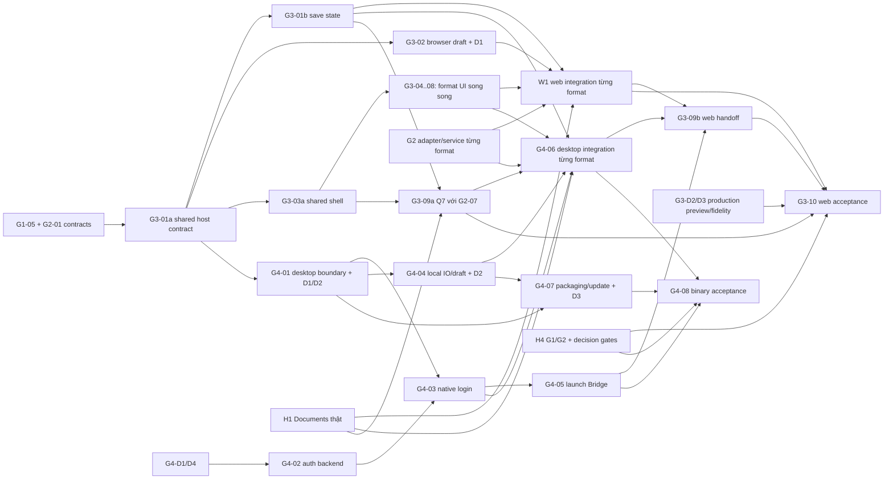

# UniWork Office G3/G4 - Pipeline triển khai web và desktop

> **Trạng thái:** in-progress - plan v1.2, cập nhật 2026-09-29; đã reconcile baseline G1/G2 đã merge, handoff evidence và web host harness; chưa khởi chạy implementation hoặc nghiệm thu sản phẩm.

**Issue tài liệu:** UNI-819, parent UNI-437, Roadmap C-01.
**Issue triển khai:** G3 UNI-659 (C-01), G4 UNI-636 (C-16).
**Thiết kế đầu vào:** [G3 v1.2](../specs/2026-09-27-office-g3-web-editors-design.md)
và [G4 v1.2](../specs/2026-09-27-office-g4-desktop-design.md).

## 1. Cách đọc và phạm vi được phép

**G3/G4 làm song song được với G1/G2.** Điều kiện là mỗi consumer nhận đúng contract
có revision và không tự sửa implementation của provider. Có thể dựng shell, state
machine, format UI, desktop boundary và test trước API thật. Ghép từng format khi
API/adapter tương ứng sẵn sàng; không phải chờ sáu format cùng xong. Nghiệm thu đầy đủ
vẫn cần H4 của G1/G2 và acceptance của từng host.

Người dùng đã yêu cầu chuyển sang plan chi tiết. Các lựa chọn G3-D1..D3 và G4-D1..D4
còn mở được đưa thành gate ở §2, không mặc định đã duyệt. Plan không khởi chạy worker,
đổi issue thành đang triển khai, tạo PR hoặc cấp quyền phát hành. File này là pipeline
và hợp đồng bàn giao; trạng thái sống nằm ở UniAI.

Khi thực thi: đọc `UNIAI_COORDINATION.md` tại workspace, `CLAUDE.md`,
`docs/engineering/UNIAI_TRACKING.md`, issue và comments; gửi start qua coordinator.
Guide của máy này ở `D:/.Vietants_Project/uniwork-workspace/UNIAI_COORDINATION.md`.
Worker dùng branch mang issue, một người ghi từng vùng file. Chỉ coordinator ghi
tracker; chỉ con người đặt done sau merge và DoD.

### 1.1 Baseline và đầu vào

| Đầu vào | Cách dùng |
| --- | --- |
| Checkout tài liệu `develop` tại `c6b567f0` | Baseline lịch sử dùng để đối chiếu G0; không phải SHA tích hợp hiện tại |
| G1/G2 đã merge vào checkout này tại `469607fcd610498f7f7c93f56a9ca81cfbb0923f` | Plan `docs/superpowers/plans/2026-09-18-documents-office-g1-g2.md`, C-01 §14, ADR 0024, FS-C1 alignment, G2-07 handoff và evidence đã có trong baseline; H4 vẫn cần acceptance packet cuối |
| [G0](../specs/2026-09-16-documents-office-g0-design.md), [FE G0](../specs/2026-09-16-documents-office-fe-design.md), [ADR 0021](../../adr/0021-runtime-engine-office-da-dinh-dang.md) | Q1-B sáu format và runtime theo từng operation; evidence lab không là nghiệm thu sản phẩm |
| [C-01](../specs/2026-09-08-documents-design.md), [FS-C1](../specs/2026-09-24-file-service-contract.md) | Documents giữ quyền/metadata/version; FileService giữ byte/intent/GC; khi tích hợp dùng C-01 có §14 tại dependency đã duyệt |
| [DOC-005](../../office/g0/login-sync-contract.md), [handoff](../../office/g0/handoff-map.md) | Auth, Bridge, Q7/Q8 và các nghĩa vụ bàn giao; auth endpoint mới vẫn cần G4-D4 |
| [Capability matrix](../../office/g0/capability-matrix.md), [ngưỡng](../../office/g0/acceptance-thresholds.md), [ước lượng DOC-006](../../office/g0/m1-m2-estimate.md) | Mỗi capability có oracle/owner; giữ giới hạn chưa đo, không suy effort từ số task |
| `DOCUMENTS_OFFICE_CHECKLIST.md` ở workspace, UNI-655 | DOC-030..038 và DOC-040..045; autosave Office cũ bị thay theo quyết định 27/09; OCR/Linux không tự thêm vào mốc Q2-A/Q3-B |

G1/G2 code và handoff đã được merge vào checkout hiện tại, nhưng evidence provider vẫn
phân biệt task đã merge với H4/full six-format acceptance. `docs/office/g1-g2-evidence.md`
ghi rõ các capability còn `not_bound` và các hàng cần Tester/Advisor chạy lại. Trước mỗi
lần ghép, nhận SHA/provider evidence và contract revision thật; không suy H1/H3/H4 từ
HEAD hoặc từ việc issue đã có. Không chép tài liệu hoặc sửa worktree đang chạy của
provider.

U-1..U-4 giữ nguyên: layout G1/G2, FileService owner byte/intent/GC, C-01 §14,
PDF web dùng codec ảnh Node ở G2-05. Không tạo package engine hoặc save API thứ hai.

### 1.2 Các bất biến phải giữ trong mọi task

- [ ] Office file chỉ ghi đích/cloud khi người dùng chọn Lưu, menu hoặc Ctrl/Cmd+S.
  Timer, idle, blur, rời trang, đóng app, logout, update và reconnect không tạo save intent.
- [ ] Checkpoint 2 giây chỉ bảo vệ nháp local; lỗi checkpoint phải được báo. Nháp
  không vào FileService, không tính quota cloud và không là offline queue G5.
- [ ] Lần lưu N chụp snapshot cố định; vẫn cho gõ N+1 nhưng chặn mọi lệnh Lưu mới,
  không queue. N+1 cần thao tác Lưu mới sau khi outcome N xác định.
- [ ] Upload chưa phải saved. Chỉ receipt commit khớp identity/generation/intent mới
  đổi base; retry cùng key/snapshot không tạo version trùng. Không sửa mà bấm Lưu
  không tạo upload/commit mới.
- [ ] Lỗi lưu giữ bản sửa; timeout/cancel là outcome chưa rõ cho tới khi reconcile
  intent cũ. Không tự đổi base khi conflict, không export nháp blocked để né quyền.
- [ ] FE G0 §4.2/§5.4 autosave được thay cho file Office theo G3 §1.1; page JSON G1 giữ nguyên.
- [ ] G3/G4 dùng cùng save labels/i18n keys và core state; host chỉ khác adapter.
- [ ] Không nhận full Q1-B từ sáu happy paths; từng hàng capability bắt buộc phải
  có bằng chứng. G5 full sync/offline library, G6 AI, ADV-001 coauthoring ngoài đợt.

## 2. Quyết định mở và gate provider

### 2.1 Gate quyết định: chỉ chặn phần liên quan

| Gate | Việc phải chốt / owner trách nhiệm | Chặn implementation hoặc acceptance | Phần vẫn làm được |
| --- | --- | --- | --- |
| G3-D1 | Browser ciphertext/key wrapping/unlock, rotation/recovery, threat model và auth endpoint nếu cần; G3-02 + chủ auth trình người dùng | Protected browser store production và Q8 web | Core recovery interface, fake lỗi IO/ACL, shell, editor UI |
| G3-D2 | Preview origin, CSP, asset limit, deployment cloud/on-premise; G3-08 + OPS/G2 trình | HTML preview/asset acceptance production | Source editor, parser/manifest tests, sandbox harness |
| G3-D3 | Reviewer có tên và tolerance/oracle render theo format; G3-10 + QA trình | Kết luận fidelity/pilot | Thu fixture và đo render diff, không tự ghi pass |
| G4-D1 | Identity/scheme, namespaces/channel, chủ domain/update host; G4-01/07 + OPS trình | Scheme đăng ký thật, redirect allowlist và installer identity | Inventory, manifest đề xuất, validators/fake |
| G4-D2 | Electron/reuse fork, thư viện OS credential/draft store, ACL/lock/recovery/key lifetime; G4-01/03/04 trình | Nền host và native secrets/draft được nhận production | Kiểm kê fork, contract/test harness, build thử có nhãn |
| G4-D3 | OS tối thiểu/arch, signing/notarization, feed/channel và máy kiểm; G4-07 + G7 trình | Signed distribution, auto-update thật và nghiệm thu platform đầy đủ | Unsigned dev build có nhãn, verifier/migration tests |
| G4-D4 | Auth/Bridge wire API, TTL, session-family/revoke, tenant exemption và policy audit/transaction/outbox theo từng command; G4-02/05 + chủ auth trình | Migration và tích hợp auth/Bridge production | Draft DTO/schema, fake và test vectors |

G4-D2 cho Windows đề xuất DPAPI + restricted file ACL, macOS Keychain; G3-D1 không
được coi raw key nằm cạnh ciphertext là đủ bảo vệ. Quyết định chưa có không được
giải quyết bằng plaintext fallback. Mỗi gate lưu quyết định, owner, revision và
evidence trong issue; giá trị proposal không trở thành production default ngầm.

### 2.2 Provider handoff cần nhận

| Provider | Đầu ra cần có | Consumer / điểm chờ |
| --- | --- | --- |
| G1-05 / UNI-679 | SDI/SDO, error class/code/HTTP, core schema/query/mutation, response samples và fake có revision | G3-01a viết consumer; HTTP thật của G3-01b/G4-06 cần H1 |
| G1-02/03/04a + G1-05a, H1 | Go + DB + FileService thật, ACL, upload/download/assets, commit/version/restore, idempotency | Cloud save/recovery/Bridge integration; không cần đợi tree/comments đầy đủ |
| G1-06/08 / UNI-680/682 | Documents route/detail/editor slot, rename và panels, library/search/recent | G3-03b và G4-06; có thể ghép editor harness trước route sản phẩm |
| G2-01 / UNI-684 | Source pin, contracts/schema, browser/node/desktop facade, capability registry, build/fixture runner | G3-01, các editor và G4-01; pin imports, không deep-import vendor |
| G2-02 / UNI-685 | Go-proxied engine jobs, serialize/export/convert service, progress/cancel, native runtime và provider-output | Operation service ở XLSX/PDF/format khác; không để browser gọi địa chỉ engine riêng |
| G2-03 / UNI-686 | DOCX/PPTX adapter, typed open errors, password-save policy, slides transform | G3-04/06, G4-06 theo từng format |
| G2-04 / UNI-687 | XLSX adapter và native recalc đúng runtime | G3-05, G4-06 XLSX |
| G2-05 / UNI-688 | PDF adapter, Node image codec, two-save/annotation support theo build | G3-07, G4-06 PDF |
| G2-06 / UNI-689 | Markdown/HTML serializer, asset manifest/capability | G3-08, G4-06 Markdown/HTML |
| G2-07 / UNI-690 | Public Office API, blank/copies, version negotiation, Q7 provider và samples | G3-09a, G4-06; conversion UI không thay engine còn thiếu |
| H3/H4 G1/G2 | H3 sáu adapter đạt matrix; H4 Go/DB/FileService/engine thật qua integration | Gate cuối W2/D3; thử từng format trước H4 không đổi định nghĩa H4 |
| UNI-671 + G7 UNI-661 | Mac/Safari thật, platform/release evidence và hạ tầng phát hành | G3-10, G4-07/08; thiếu thiết bị/signing ghi blocked, không thay bằng WebKit |

**Tối thiểu mỗi handoff:** SHA, contract/protocol/engine revision, public import/API,
fixture/hash, code/class errors, sample request/response từ test, lệnh/kết quả,
known limits và owner sửa. Khi wire contract đổi: provider sửa schema/fake/tests,
consumer nâng theo cùng revision; fake không được tự lệch API để làm test xanh.

## 3. Pipeline và các nhóm song song

### 3.0 Trạng thái G1/G2 tối thiểu để phát lệnh start

Bảng này gom điều kiện đã rải ở §2.2, §3.1 và dòng "Phụ thuộc" của từng task,
để coordinator biết G1/G2 phải giao tới đâu thì task nào bắt đầu được. Cách kiểm
cho mọi mức: provider ghi SHA + contract/protocol/engine revision trong comment
issue của họ theo "Tối thiểu mỗi handoff" ở §2.2; HEAD nhánh hoặc PR đang mở
không phải bằng chứng đã giao.

| Mức | G1/G2 phải giao | Task G3/G4 bắt đầu được | Chưa được nhận là gì |
| --- | --- | --- | --- |
| S0 - không cần gì | Không | G4-01a kiểm kê fork; G4-02a thiết kế auth/Bridge contract; G3-02 thiết kế khóa/recovery (D1); G3-10a/G4-08a dựng ma trận acceptance | Không có acceptance nào |
| S1 - contract có revision | G1-05: SDI/SDO, error class/code/HTTP, core schema/fake. G2-01: contracts/schema, facade browser/node/desktop, capability registry, boundary checker | G3-01a/01b, G3-03a, G3-04..08 phần UI và unit/contract tests, G4-01b IPC host, G4-03a, G4-04a, G4-05a, G4-07a | Cloud save thật, recovery theo live ACL, mọi acceptance G3-A/G4-A |
| S2 - H1 của G1 | Go + DB + FileService thật: ACL, upload/download/assets, commit/version/restore, idempotency | Nghiệm thu G3-01b; G3-02 acceptance Q8 web; G3-09a (cùng G2-07); G4-05b; G4-06 open/save cloud; G4-04b recovery | Nghiệm thu từng format khi chưa có adapter tương ứng |
| S3 - adapter G2 của một format | G2-03 DOCX/PPTX, G2-04 XLSX (+G2-02 recalc), G2-05 PDF (+codec Node), G2-06 Markdown/HTML, G2-07 Q7/copies/blank | Vòng open/edit/manual-save/fresh-reopen thật của đúng format đó trên web (G3-04..08) và desktop (G4-06); từng format riêng, không chờ đủ sáu | Q1-B đầy đủ, fidelity/pilot |
| S4 - G1-06/08 | Route/detail Documents, editor slot, rename, panels, library/search/recent | G3-03b gắn shell vào route sản phẩm; G4-06 library | Không chặn editor harness hay format UI |
| S5 - H4 | Go + DB + FileService + engine thật qua six-format suite; H3 sáu adapter đạt matrix | G3-10c, G4-08c, bàn giao W2/D3 cho G5/G7 | Pilot vẫn do G7 quyết |

Đủ S1 là đủ để phát lệnh start cho đợt P0/P1 ở §3.2. S2..S4 mở từng lát tích hợp
theo lần giao của provider; S5 chỉ chặn nghiệm thu cuối. Decision gates G3-D1..D3
và G4-D1..D4 (§2.1) là điều kiện độc lập với các mức này.

### 3.1 Mốc bàn giao

| Mốc | Điều kiện | Mở khóa |
| --- | --- | --- |
| P0 / W0-D0 | G3-01a host contract nhận từ G1/G2; desktop boundary/auth proposal và các gate có owner | Core/shell/format UI, desktop/auth/draft harness song song |
| P1 / nền host | Logic G3-01b và G3-03a qua contract tests; G4-01b IPC host; từng quyết định cần thiết đã chốt | UI từng editor, native auth/storage, packaging dev; chưa đóng cloud acceptance của G3-01b trước H1 |
| P2 / W1-D2 từng format | H1 + API/adapter operation của format + host UI tương ứng | Open/edit/manual-save/fresh-reopen thật của format đó |
| D1 auth/local | G4-02/03/04 qua auth/OS store/local I/O thật | Cloud transport, recovery và deep link; không cần đợi mọi engine |
| P3 / ghép đủ | Các format + Q7/handoff, G3/G4 state parity, fault/race suite | Kiểm tổng hợp với H4 và binary/real browser |
| P4 / W2-D3 | H4 + tất cả acceptance bắt buộc của host, quyết định/tài nguyên cần thiết đủ | Bàn giao G5/G7; dev handoff có giới hạn không là pilot acceptance |

### 3.2 Các đợt công việc

Đợt là cửa sổ dependency, không phải sprint bằng nhau hoặc barrier chờ cả hàng.
Hậu tố a/b là lát bàn giao của cùng issue. Các cột song song khi khác owner/file;
nếu một người kiêm hai cột thì lập lịch tuần tự cho người đó.

| Đợt | Core / shell web | Format UI | Desktop / auth | QA / OPS | G1/G2 vẫn chạy |
| --- | --- | --- | --- | --- | --- |
| P0 nhận contract | G3-01a; G3-02 thiết kế key/recovery | Map capability/fixture/test intent G3-04..08 | G4-01a inventory; G4-02a auth/Bridge contract phối hợp G4-05a | G3-10a/G4-08a dựng ma trận, G4-07a kiểm build/signing inputs | G1-05 schema; G2-01 facade, các provider khác tiếp tục |
| P1 nền độc lập | G3-01b unit/contract, G3-02 theo G3-D1, G3-03a theo 01a | G3-04/05/06/07/08a theo 01a+03a và adapter contract | G4-01b; G4-02b; G4-03a/04a dùng contract; G4-07a sau 01b | Unit/contract/fault fixtures và import-graph checks | G1 commit/API, G2 service/adapters; không đợi G3/G4 |
| P2 ghép tăng dần | G3-03b với route G1; G3-09a conversion khi G2-07 đủ | Mỗi format chạy thật riêng khi W1 đủ; HTML deployment sau G3-D2 | G4-03b auth thật; G4-04b recovery; G4-05b tickets/deep link; G4-06 theo từng editor | Browser/OS tests và perf theo format/build | H1 và adapter tương ứng cung cấp từng lát; không cần H4 trước thử |
| P3 liên host | G3-09b web handoff; core fixes về đúng owner | Đóng capability rows còn thiếu; không gom tất cả lỗi cho QA | G4-06 đủ sáu format; G4-07b upgrade/update/rollback | G3-10b/G4-08b fault, permission, account switch, two-save, fidelity | G2-07/H4 chạy song song với consumer integration |
| P4 bàn giao | G3-10c web acceptance/runbook/flags | Reviewer ký từng format sau oracle đạt | G4-08c binary acceptance; G4-07c signed artifacts khi D3 đủ | Full checks, real platform, evidence/readiness cho G7 | H4 là điều kiện nền đã xác nhận, không tự tick hộ provider |

### 3.3 DAG các dependency chính



DAG là bản rút gọn; dependency đầy đủ nằm ở task. G4-06 không đợi G3-10 nghiệm thu
web hoặc G4-05 deep link để mở tài liệu từ library. G3-04..08 không đợi nhau;
G3-09a conversion không đợi G4 auth. G3-D1 chưa chốt không chặn OS draft G4-04.
Module shared của G3-04..08 được giao sau contract/unit và adapter proof của nó;
desktop có thể nhận module đó trước khi toàn task web đạt browser/Q8 acceptance.
Mũi tên DI -> handoff là gate kiểm xuyên hai host, không chặn viết UI G3-09b.

**Ưu tiên mở đường:** G3-01a, G3-03a, G4-01a và G4-02a trước; ghép một format có
adapter thật sớm nhất để kiểm save/recovery seam, rồi mở rộng các format. Không
quy định DOCX luôn đi trước: chọn theo bằng chứng provider. Sau vòng đầu vẫn phải
đóng toàn bộ Q1-B, không chuyển format khó thành ngoài phạm vi.

### 3.4 Nhóm trách nhiệm và file dùng chung

| Nhóm | Chủ ghi / trách nhiệm | Công việc có thể song song |
| --- | --- | --- |
| FE-CORE | G3-01/02: `packages/core/office/`, browser draft adapter | FE-SHELL và auth/backend theo interface đã bàn giao |
| FE-SHELL | G3-03/09: `packages/views/office/` phần shell/actions/dialog; i18n Office | Các nhóm format chỉ sửa thư mục riêng |
| FE-FORMAT | G3-04 DOCX, 05 XLSX, 06 PPTX, 07 PDF, 08 Markdown/HTML | Năm task độc lập; Markdown/HTML cùng issue nhưng source/sandbox có thể chia trách nhiệm |
| BE-AUTH | G4-02 và phần server G4-05; cùng chủ auth hiện hữu | Desktop consumer dùng schema/fake; migration/router tích hợp tuần tự |
| DESKTOP-HOST | G4-01/03/04: main/preload/session/credential/local I/O | G4-06 renderer tích hợp shared UI; chỉ dùng IPC đã duyệt |
| DESKTOP-INTEGRATION | G4-05 consumer + G4-06 library/editor host | Format UI G3 và provider G1/G2 |
| QA | G3-10/G4-08 sở hữu acceptance harness, evidence và reviewer matrix | Dựng fixture/oracle sớm; mỗi feature vẫn tự giao unit/contract tests |
| OPS/RELEASE | G4-07, preview deployment G3-08, runtime/CI với G2/G7 | Dev packaging/provenance sớm; signing thật chờ đúng owner/input |

Không đồng thời chỉnh root barrel, registry, catalog hoặc lockfile từ từng format.
G2-01 giữ `pnpm-workspace.yaml`, `pnpm-lock.yaml` và engine exports; G3-01 tích hợp
core exports; G3-03 tích hợp shared views exports/i18n. G1-05 giữ Documents endpoints,
query keys và transport error_class; G1-06/08 giữ route/detail/panels. G4-02 nhận
slot auth router/middleware từ chủ auth, phối hợp G1-05 khi đụng root wiring.
Migration lấy số mới khi tích hợp, không đặt số cố định trong các nhánh.

G2-01 giữ checker `scripts/office/check-boundaries.mjs`; G3-01/G4-01 gửi bổ sung
browser/core/renderer rules vào cùng checker, không tạo import-graph gate thứ hai.
G2-01 phối hợp owner CI tích hợp `scripts/check.sh`; từng task vẫn phải chứng minh
checker/test mới được chạy từ required checks. BE-AUTH giữ audit actions/coverage
và event catalogue delta của G4-02/05 theo thứ tự PR; `.env.example`/deployment
config và `CLAUDE.md`/ADR cũng chỉ một owner ghi mỗi lượt.

G4-01 giữ bootstrap/preload contract; G4-03/04/05 thêm module riêng và gửi yêu cầu
wiring qua owner. G4-07 giữ package scripts/build config desktop sau handoff từ
G4-01, không hai task sửa package.json cùng lúc. QA/OPS gửi CI delta cho owner
workflow hiện tại. Nếu cần thay shared file, ghi owner/PR thứ tự nhận vào issue.

## 4. Task map và cách nhận việc

Mỗi task lớn có một sub-issue dưới đúng G3/G4. Suffix a/b/c là điểm bàn giao trong
cùng issue, không đánh dấu toàn task hoàn tất khi mới giao interface. Coordinator
đã xác nhận request `office-g3-g4-plan:sub_issue:8`: 18 issue dưới đây đều `todo`,
assignee `mtruong.dev` khi lập plan. Chưa có lệnh triển khai trong phiên này.

| Task | Issue | Parent | Đầu ra chính |
| --- | --- | --- | --- |
| G3-01 | UNI-820 | UNI-659 | Contract shared host và save/error coordinator |
| G3-02 | UNI-821 | UNI-659 | Protected browser draft/recovery |
| G3-03 | UNI-822 | UNI-659 | Shared shell, web host và UI states |
| G3-04 | UNI-823 | UNI-659 | DOCX editor |
| G3-05 | UNI-824 | UNI-659 | XLSX editor |
| G3-06 | UNI-825 | UNI-659 | PPTX editor |
| G3-07 | UNI-826 | UNI-659 | PDF editor |
| G3-08 | UNI-827 | UNI-659 | Markdown/HTML và isolated preview |
| G3-09 | UNI-828 | UNI-659 | Q7 conversion và web handoff |
| G3-10 | UNI-829 | UNI-659 | Web QA, fidelity và rollout handoff |
| G4-01 | UNI-830 | UNI-636 | Fork inventory, desktop scaffold và IPC |
| G4-02 | UNI-831 | UNI-636 | Auth backend, device sessions |
| G4-03 | UNI-832 | UNI-636 | Native login, credentials và transport |
| G4-04 | UNI-833 | UNI-636 | Local file I/O, draft/recovery |
| G4-05 | UNI-834 | UNI-636 | Launch Bridge và deep links |
| G4-06 | UNI-835 | UNI-636 | Cloud library và sáu editor desktop |
| G4-07 | UNI-836 | UNI-636 | Build/installer/update/rollback |
| G4-08 | UNI-837 | UNI-636 | Binary QA và bàn giao G5/G7 |

### 4.1 Quy ước file và verification của các task

Đường dẫn ghi **tạo** là đề xuất mới; không khẳng định file đã tồn tại. Sau khi
nhận dependency, kiểm inventory, tái dùng implementation đã có thay vì tạo bản
trùng. Tên file theo `docs/conventions.md`; shared views không import Next/Electron,
core không đọc storage/OS trực tiếp. G2 owns engine schema, G3 chỉ owns host/UI state.
Zustand trong `packages/core/office/store.ts` chỉ giữ UI/session state như tab,
selection, identity tham chiếu và dirty generation; Document/version metadata
server vẫn do TanStack Query quản lý. Engine giữ working snapshot; không chép
Document/version records vào store làm nguồn dữ liệu hoặc lịch sử thứ hai.

Test ở task là việc cần viết/chạy khi implementation, không là kết quả của plan.
Mỗi bước hành vi bắt đầu bằng ca thất bại tái hiện rủi ro, implement tối thiểu,
rồi chạy suite tương ứng §7. Không thêm test chỉ so chuỗi hoặc mock lại chính code.
Sau pass sửa hẹp, chạy kiểm tích hợp khi dependency đổi; không lặp toàn suite cho
mỗi thay đổi tài liệu. Không nhận fake-only, skipped hoặc no-tests-found là đạt.

## 5. G3 - Tasks triển khai web/shared UI

### G3-01 - Shared host contract và save coordinator

**Owner:** FE-CORE; phối hợp G1-05, G2-01/07, G4. **Issue:** UNI-820.
**Bắt đầu:** nhận schemas G1/G2 có revision; không cần H1 để viết state tests.
**Tạo:** `packages/core/office/{host-contract,save-coordinator,error-state,store}.ts`,
tests cùng chỗ; `docs/office/g3g4/host-contract.md` và provider handoff matrix.
**Sửa:** core package exports; G1/G2 owners tích hợp thay đổi seam của họ.

`packages/office-contracts` và `packages/office-engine` đã là boundary/engine seam của
G2. G3-01 chỉ thêm product-level session/save contract ở `packages/core/office/`,
import type từ boundary đã giao; không tạo host-port hoặc registry thứ hai trong core.
`packages/core/documents/save-state.ts` tiếp tục phục vụ autosave page JSON của G1;
không tái sử dụng machine đó cho file Office vì Office yêu cầu manual-save và chặn
lệnh N+1 trong lúc N đang chạy.

- [ ] **01a:** Chốt identity/deployment/account/org/ws/doc, generation, base version
  và revision string; EditorHandle, draft adapter, save intent/receipt và capability
  interface. Version schemas/fakes; seed dữ liệu không dùng PII/file doanh nghiệp.
- [ ] Phối hợp G1-05 phát hành seam inject transport cho core endpoint dùng ở hai
  host; browser vẫn auth transport hiện có, desktop qua main allowlist. Test client
  schema/error/malformed response ở cả hai, không chuyển token main sang renderer
  hoặc fork toàn core HTTP. Provider owns sửa `packages/core/api/http.ts` khi cần.
- [ ] Map toàn bộ G3 §4.4 tới provider code/class; `unauthorized` 401 baseline phải
  hoạt động. Không đòi `token_expired`/`draft_recovery_locked` là HTTP đã có.
- [ ] Mở rộng `scripts/office/check-boundaries.mjs` do G2-01 giao để kiểm browser/core;
  G4-01 bổ sung renderer/preload sau handoff, provider G2-01 tích hợp tuần tự. Dùng
  chung traversal/rules; test wrapper riêng nếu cần chỉ gọi checker này và negative
  fixtures, không tạo checker song song. Nếu provider chưa giao script thì giữ gate
  boundary pending, không coi fake/import smoke là boundary acceptance.
- [ ] Xác nhận Q-BOUNDARY và test wrapper mới được gọi trong `scripts/check.sh`/CI
  cùng PR tích hợp; baseline `node --test` liệt kê file tường minh, không tự nhận
  `scripts/*.test.mjs` mới. Negative fixture có forbidden import phải làm gate fail.
- [ ] **01b:** Viết ca state machine cho explicit Save, stable snapshot không cắt IME,
  dirty/ready/saving/error/conflict/blocked, progress/cancel. N vẫn cho gõ N+1;
  mọi nút/menu/shortcut/dialog dùng một action guard, không có pending-save queue.
- [ ] Dùng G1 mutation/core endpoint: serialize qua G2, upload hoặc provider-output,
  rồi commit `{upload_id, base_revision}` + `Idempotency-Key`. Không gọi transport
  từ view/store, không tự ghi version hoặc endpoint `/versions/file`.
- [ ] Persist liên kết intent/snapshot để recovery phân biệt outcome chưa rõ.
  Retry cùng fingerprint/key, có backoff hữu hạn; key khác payload dừng. Upload
  hết hạn cần reconcile cũ trước thao tác Save mới. Không tự đổi base ở 409.
- [ ] Receipt N không clear/delete N+1; saved chỉ khi receipt khớp và không dirty
  mới. Response malformed hoặc stale account generation không biến thành saved.
  Realtime refetch không overwrite model đang dirty; clear plaintext khi mất quyền.
- [ ] Kiểm quyền/capability/engine mismatch ở thao tác và xử lý revoke giữa chừng;
  client không thay server authorization. H1 integration phải qua thật trước nhận 01b.

**Kiểm:** Q-CORE, Q-BOUNDARY; core integration qua HTTP thật ở H1 và fault matrix
§7.2, G3-A02/A03/A04/A10. Browser adapter tests nối thêm khi G3-02 có harness.
**Xong khi:** G3/G4 dùng cùng coordinator; 10 phút không Save không tạo upload/commit,
retry đúng một version, N+1 tồn tại sau mọi receipt/cancel/error.

### G3-02 - Browser draft và recovery Q8

**Owner:** FE-CORE/browser; chủ auth duyệt phần unlock backend. **Issue:** UNI-821.
**Phụ thuộc:** 01a cho contract/tests; G3-D1 cho store thật; H1/live ACL cho acceptance.
**Tạo:** `apps/web/platform/office/draft-store.ts`, `draft-key-provider.ts` và tests;
`packages/core/office/draft-recovery.ts`, shared adapter behavior suite.
**Sửa có owner:** `packages/core/drafts/cleanup-registry.ts`, auth/logout integration
nếu cần; endpoint unlock mới chỉ sau quyết định D1 và phát hành schema bởi chủ auth.

- [ ] Mở rộng web host test harness hiện có tại `apps/web/vitest.config.ts` và script
  `test`: thêm các office-host suites, giữ `coverageThresholds(...)` với bốn số nguyên
  và nối các file mới vào gate canonical. Không tạo runner hay Vitest config thứ hai;
  G3-03/08 tái dùng harness. Fake IndexedDB unit không thay browser durability tests.
- [ ] Config coverage V8 dùng `coverageThresholds(...)` từ `scripts/coverage-gate.ts`
  với bốn thresholds số nguyên (statements/branches/functions/lines), chốt từ baseline
  đo được và chỉ tăng về sau; include/exclude có lý do, không bỏ source để làm xanh.
  Package test script chạy `vitest run --coverage`; kiểm fast/standard/strict theo
  policy, không hạ floor hoặc gate. Cập nhật knip entries/config cho host tests nếu
  cần, không ignore cả package; `pnpm knip` phải qua trên nhánh tích hợp.
- [ ] Ghi phương án D1 được duyệt, attacker assumptions, key rotation/loss, endpoint
  owner và recovery after logout/restart. Không bắt đầu production store với raw-key fallback.
- [ ] Ghi snapshot/checksum/generation nguyên tử vào IndexedDB, namespace theo
  deployment/account/org/ws/doc/base pair; ciphertext và metadata tối thiểu.
- [ ] Nhịp 2 giây chỉ ghi draft ổn định; IO/quota/private-mode/eviction báo lỗi thật,
  không hiển đã bảo vệ nếu transaction chưa xác nhận; không bảo đảm phím chưa checkpoint.
- [ ] Tách clear-memory và delete-durable: logout/account switch reset plaintext,
  revoke object URLs và callback; không đăng ký vào policy xóa global task/chat drafts.
- [ ] Recovery list metadata; lấy payload sau session đúng account + live edit ACL
  + base revision/version. Base đổi thành conflict; mất quyền thành blocked,
  không export/copy/clipboard. Sai key/corrupt không ghi store rỗng thay byte cũ.
- [ ] Commit chỉ tiêu snapshot N; discard có xác nhận chỉ xóa đúng draft. Hai tab,
  bản base khác nhau, login A/B và late checkpoint không được ghi đè nhầm.

**Kiểm:** Q-CORE, Q-WEB-HOST, Q-WEB-E2E trên browser thật, Q-COVERAGE;
G3-A04 và Q8.
**Xong khi:** restart/login đúng account khôi phục checkpoint, account khác không
đọc/list payload; cloud lỗi + local IO lỗi được báo riêng và không mất bản cũ.

### G3-03 - Shared shell và browser host

**Owner:** FE-SHELL. **Issue:** UNI-822.
**Phụ thuộc:** 01a cho 03a; 01b/02 + G1-06/08 editor slot cho 03b sản phẩm.
**Tạo:** `packages/views/office/{office-shell,editor-slot,save-status,leave-dialog}.tsx`,
`apps/web/platform/office/editor-host.tsx`, tests.
**Sửa:** views exports, locale vi/en; Documents detail/routes do G1 owner nối slot.

- [ ] **03a:** Shared header/toolbar/action slots, panel phải duy nhất, tab/fullscreen,
  lazy load theo format. Dùng `BreadcrumbHeader`, `PAGE_TOOLBAR` hiện có; không viết
  lại panels history/comments/access-log hoặc Query cache G1.
- [ ] Capability unknown/unavailable/read-only, loading/error/password cancel có
  UI thật; open fail không dựng tài liệu trống. Rename không reset identity/dirty.
- [ ] Cùng labels vi/en G4 §7.2: checkpoint, saved-local, saved-cloud, chưa gửi,
  quyền/conflict. Mỗi trạng thái có action phù hợp, alert/focus và correlation id.
- [ ] **03b:** Hook coordinator/draft browser thật; leave dialog Save/keep durable
  draft/discard/stay; `beforeunload` chỉ cảnh báo, không upload. Save lỗi hoặc có
  N+1 sau receipt không tự rời. Shortcut trong source/formula không bị nuốt `/`/`@`.
- [ ] Permission/account switch dispose worker/listener/object URL và plaintext;
  owned Document đúng breadcrumb, không vào recent/library chung hoặc share riêng.
- [ ] 360/375/768/1280 px, drawer khi thiếu chỗ, hai theme/zoom/IME/keyboard; canvas
  không 0 px. Theme chỉ đổi chrome, không sửa file; mobile unsupported edit báo rõ.

**Kiểm:** Q-VIEWS, Q-WEB-HOST, Q-WEB-E2E; G3-A01/A03/A10/A11.
**Xong khi:** shell thật gắn G1 mà không ảnh hưởng page JSON; bộ shared views dùng
được từ desktop và control Lưu không bypass guard khi đang lưu.

### G3-04 - DOCX editor

**Owner:** FE-FORMAT DOCX. **Issue:** UNI-823.
**Phụ thuộc:** 01a/03a để dựng UI; G2-03, 01b/02/03b, H1 để đóng loop thật.
**Tạo:** `packages/views/office/docx/` và test; fixture/evidence mới ở
`docs/office/g3g4/`/E2E, không sửa fixture pin G0 để che lỗi.

- [ ] Lập map từng capability DOCX Q1-B tới command/toolbar/engine build/oracle;
  text/paragraph, table, image, layout/header/footer không được nhận từ paragraph demo.
- [ ] Mount adapter public G2, state/cancel/dispose/selection và undo/redo; mọi Save
  đi coordinator. Không gọi API byte từ toolbar hoặc tự dùng filesystem upstream.
- [ ] P3: corrupt/password cancel/unsupported mở lỗi có lý do, không blank document
  hoặc nút Save; tiếp tục mở file hợp lệ được mà không cần reload toàn app.
- [ ] P2: font nhúng thật không có trên máy/bundle không báo thiếu giả; phối hợp
  fixture F1 của UNI-666. P5: re-encrypt qua provider hoặc từ chối Save rõ ràng.
- [ ] Create blank dùng API G2-07/G1, edit/save/fresh reopen; bảo toàn parts không sửa,
  extraction/object oracle và render diff theo G3-D3, không chỉ screenshot.

**Kiểm:** Q-VIEWS + Q-WEB-E2E DOCX + Q-FIXTURE; G3-A01/A05/A06/A12.
**Xong khi:** DOC-031 và toàn hàng bắt buộc DOCX có evidence thật; engine defect
về G2-03, UI defect thuộc task này, không fork serializer để né provider.

### G3-05 - XLSX editor

**Owner:** FE-FORMAT XLSX. **Issue:** UNI-824.
**Phụ thuộc:** 01a/03a; G2-04 + G2-02 native recalc, 01b/02/03b, H1 cho acceptance.
**Tạo:** `packages/views/office/xlsx/` và tests.

- [ ] Map sheets/cells/ranges/formula/format/chart theo inventory; toolbar/action
  chỉ bật capability đúng build. Không tự thu hẹp thành grid text-only.
- [ ] Nối native recalc qua G2/Go; giữ progress/cancel và giá trị/formula identity,
  không giả kết quả từ số cũ hoặc gọi native từ browser.
- [ ] Edit/undo/redo, selection, clipboard và keyboard theo quyền; formula/source
  không bị shortcuts ứng dụng làm biến đổi nội dung; checkpoint ngoài gesture/IME.
- [ ] P4 XLSB/parse failure hiển lỗi typed, không grid rỗng/có Save; Q7 nếu provider
  conversion sẵn sàng, không đổi đuôi file để nhận XLSX.
- [ ] Tạo/mở/sửa/lưu/reopen kiểm formula result, multi-sheet/chart và parts untouched;
  sheet lớn có đo resource/progress, không treo shell rồi báo đã lưu.

**Kiểm:** Q-VIEWS + Q-WEB-E2E XLSX + Q-FIXTURE; G3-A01/A06/A12.
**Xong khi:** DOC-032 đạt trên recalc thật, lỗi/timeout không làm mất model đang sửa.

### G3-06 - PPTX editor

**Owner:** FE-FORMAT PPTX. **Issue:** UNI-825.
**Phụ thuộc:** 01a/03a; G2-03, 01b/02/03b, H1 cho acceptance.
**Tạo:** `packages/views/office/pptx/` và tests.

- [ ] Map slide/textbox/image/shape/layout/presenter theo capability; tách command
  UI khỏi engine transform. Tái dùng serializer G2 cùng DOCX owner nhưng file UI riêng.
- [ ] Gesture qua `host:slides-edit-transform` đã phát hành, hoặc báo unavailable
  tường minh; không mô phỏng thay CSS rồi nhận shape đã sửa trong file.
- [ ] Undo/redo và snapshot đợi gesture kết thúc; presenter/fullscreen không tạo
  editor session thứ hai hoặc làm mất selection/dirty; kiểm keyboard/focus.
- [ ] Create/open/edit/save/reopen kiểm text/image/shape thực và object không sửa;
  giữ layout/font/media liên quan và cảnh báo lossy đúng Q7.

**Kiểm:** Q-VIEWS + Q-WEB-E2E PPTX + Q-FIXTURE; G3-A01/A11/A12.
**Xong khi:** DOC-033 có object/render oracle, không dùng ảnh preview thay file output.

### G3-07 - PDF editor

**Owner:** FE-FORMAT PDF. **Issue:** UNI-826.
**Phụ thuộc:** 01a/03a; G2-05/G2-02 codec Node, 01b/02/03b, H1 cho acceptance.
**Tạo:** `packages/views/office/pdf/` và tests; two-save regression fixture mới.

- [ ] Map edit existing text/image và page operations theo capability/build;
  annotation không thay sửa nội dung, OCR scan vẫn ngoài mốc Q2-A.
- [ ] P1 parse error có tên/lý do vi/en; P2 embedded fonts kiểm face thật; valid
  file kế tiếp mở được. Reuse typed failure G2, không swallow rồi tạo trang rỗng.
- [ ] Image edit đi codec Node U-4 qua provider G2; browser không import native/Node.
  Kiểm annotation removal/`excludeAnnots` theo build đã port.
- [ ] F1: sau Save N model đang mở giữ đúng sửa mới; sửa tiếp rồi Save N+1 và fresh
  reopen đúng cả hai. Nếu lỗi nằm ở editor sửa ở đây, serializer defect trả G2-05.
- [ ] F2: mọi output đi Documents commit, không thư mục nội bộ upstream; extraction
  và render độc lập trước/sau chứng minh nội dung/ảnh/page đã đổi đúng.

**Kiểm:** Q-VIEWS + Q-WEB-E2E PDF + Q-FIXTURE; G3-A05/A07/A12.
**Xong khi:** DOC-034 và two-save pass trên output thật; không fallback cloud tới path local.

### G3-08 - Markdown/HTML, assets và isolated preview

**Owner:** FE-FORMAT text + OPS preview. **Issue:** UNI-827.
**Phụ thuộc:** 01a/03a, G2-06 contract; G1 assets/H1 + 01b/02/03b cho save thật;
G3-D2 cho preview production. **Tạo:** `packages/views/office/{markdown,html}/`,
`apps/web/platform/office/preview-host.ts`, sandbox/asset tests và deployment guide.

- [ ] **08a:** Source/preview editors giữ raw Markdown/frontmatter/table/code và
  HTML source/parts chưa render. Không normalize âm thầm làm mất nội dung.
- [ ] Asset manifest dùng path chuẩn hóa -> asset id, không bucket/key/path OS.
  Upload/authorize assets cần thiết trước commit đúng snapshot; asset lỗi không báo saved.
- [ ] **08b:** Triển khai preview origin riêng theo D2, sandbox opaque, CSP/headers
  thật; không `allow-same-origin`, app cookie/Bearer hoặc API bridge trong frame.
- [ ] Khai báo preview origin/CSP/asset policy trong config/deployment đúng owner,
  validate scheme/origin và missing/invalid values. Biến được Go server đọc phải
  có trong `.env.example` và qua `scripts/env-example.test.mjs`; cấu hình web/proxy
  ghi tại template/runbook tương ứng và có tests, không giả guard Go quét được chúng.
- [ ] Asset broker validate frame/session/manifest, không arbitrary URL, traversal,
  symlink, redirect escape hoặc tracking fetch; không dùng same app origin chỉ để
  chữa relative links. Script chỉ chạy nếu runtime policy đã cho phép.
- [ ] Test HTML cố đọc session/app API/top-navigation/clipboard/download/IPC,
  file URL và tài nguyên ngoài manifest đều không vượt quyền; test qua proxy production.
- [ ] Round-trip source + asset trên web và cung cấp host-neutral view cho G4;
  khi preview không đủ runtime vẫn báo unavailable, không tạo preview giả.

**Kiểm:** Q-VIEWS, Q-WEB-HOST, Q-WEB-E2E Markdown/HTML, Q-FIXTURE, Q-CONFIG;
G3-A01/A08/A12. **Xong khi:** DOC-035/036 đạt cả source và isolation; thiếu D2 chỉ
bàn giao 08a, không nhận HTML preview production.

### G3-09 - Conversion Q7 và web-to-desktop handoff

**Owner:** FE-SHELL/integration. **Issue:** UNI-828.
**Phụ thuộc:** 01b/03a cho shared UI; web thật cần 03b. 09a cần G2-07 + H1;
09b cần G4-05b. Hai lát độc lập; desktop dùng 09a qua host adapter mà không đợi
browser draft store hoặc 09b.
Nghiệm thu handoff rồi sửa/lưu trên desktop cần G4-06 của format được kiểm; có thể
viết UI/contract tests 09b trước khi có output đó.
**Tạo:** `packages/views/office/{conversion-dialog,desktop-open-action}.tsx`, tests;
web scheme binding tại `apps/web/platform/office/`.

- [ ] **09a:** Hiển capability/fidelity loss từ G2 trước consent. Cancel không tạo
  Document/version; Accept gọi copies `consent: "copy"`, chờ receipt mới chuyển view.
- [ ] Same-format lossy output cũng qua copy path; source hash/history không đổi,
  provenance/ACL/owner giữ đúng server. Owner chưa có resolver/copy path thì unavailable,
  không tạo free Document hoặc tự nâng creator từ edit thành manage.
- [ ] **09b:** Nút mở desktop có ba lựa chọn khi dirty: Save rồi mở, mở bản đã lưu,
  hủy. Không mặc định save khi bấm nút; Save thất bại/N+1 chưa lưu không tự handoff.
- [ ] Ticket gắn đúng version đã chọn; không đặt byte/title/token/path vào deep link.
  App chưa cài, callback lỗi hoặc expired ticket giữ editor/nháp và hướng dẫn rõ.
- [ ] Chạy web -> desktop -> manual Save -> web refetch committed version; đây là
  handoff/open/save online, không nhận G5 automatic cross-device sync.

**Kiểm:** Q-VIEWS, Q-WEB-E2E + Q-DESKTOP-SYSTEM phần handoff;
G3-A09 và G4-A04/A15. **Xong khi:** Q7 thật và hai kiểu mở desktop giữ đúng version,
không lộ nháp hoặc mất sửa khi rời host.

### G3-10 - Web acceptance, fidelity và rollout handoff

**Owner:** QA + FE/OPS. **Issue:** UNI-829.
**Phụ thuộc:** 10a sau 01a; 10b chạy tăng dần; 10c cần G3-01..09, H4 và gate tương ứng.
**Tạo:** `e2e/office-web.spec.ts`, `e2e/office-faults.spec.ts`,
`e2e/office-handoff.spec.ts`, `docs/office/g3g4/{acceptance,evidence-index,runbook}.md`.

- [ ] **10a:** Ma trận 12 acceptance G3 + 95 capability rows theo inventory revision,
  fixture hashes, negative cases, test data isolated và reviewer G3-D3; không sửa pin G0.
- [ ] **10b:** Chạy fault matrix §7.2 với stack thật, six-format oracle, P1-P5/two-save,
  Q7/Q8 và scope/owner/public-view tests; defect về task/owner thực, không giảm assertion.
- [ ] Kiểm theme/locale parity, keyboard/IME, viewport/zoom/focus/contrast theo spec;
  nội dung file không đổi theo theme; canvas accessibility dùng hỗ trợ thật của engine.
- [ ] Đo open/save/RAM/CPU/bundle theo format/build và replay baseline; tolerance
  render có reviewer ký, còn chưa đo ghi rõ. Chrome/Edge/Safari thật theo Q3-B/UNI-671.
- [ ] **10c:** Full checks, feature flags qua owner flag registry, default tắt tới
  acceptance; runbook lỗi cloud/nháp, rollback giữ committed byte và recovery. Phối hợp
  reconcile FE/DOC-030/docs/roadmap/tracker bằng quyết định mới, không tick sản phẩm sớm.

**Kiểm:** Q-WEB-E2E, Q-FIXTURE, Q-FULL, G3-A01..12.
**Xong khi:** W2 có evidence đúng SHA/host, các hạn chế được ghi; thiếu Safari/required
capability thì chỉ dev handoff có giới hạn, không tuyên bố đủ pilot G7.

## 6. G4 - Tasks triển khai desktop

### G4-01 - Fork inventory, shell và IPC boundary

**Owner:** DESKTOP-HOST + G2/OPS. **Issue:** UNI-830.
**Phụ thuộc:** G2-01 source/build và G3-01a; G4-D1/D2 cho lựa chọn host/identity thật.
**Tạo:** `apps/office-desktop/{main,preload,renderer}/`, package/build scaffold,
`docs/office/g3g4/desktop-inventory.md`; tên package đề xuất `@uniwork/office-desktop`.

- [ ] **01a:** Kiểm fork hiện có: repo/SHA/license/build/main/preload/engine modules/
  dependencies/native artifacts/patch delta. Quyết định reuse hay dựng từ G2 source
  pin, ghi lý do và boundary; không mặc định fork đang build được.
- [ ] G4-D1 identity manifest nhất quán brand/app id/scheme/user-data/internal origin;
  dev namespace riêng, cài cạnh upstream không dùng chung cache/key/feed/locks.
- [ ] **01b:** Clean dev build theo D2; main/preload/renderer tách, renderer sandbox,
  contextIsolation on/Node off. Inject core/runtime/navigation/transport qua host.
- [ ] Khi G4-D2 đã chốt, ghi ADR cho host desktop/Electron hoặc giải pháp được chọn,
  giải thích main/preload/renderer, shared packages và quyền OS. Nhận số ADR mới
  tại integration, cập nhật `docs/adr/README.md` và status accepted sau quyết định;
  không ghi proposal chưa duyệt thành accepted chỉ để vượt governance.
- [ ] Cùng PR host xuất hiện, cập nhật Project Shape trong `CLAUDE.md` thay mệnh đề
  "Web is the only host today", nêu desktop/shared/OS boundaries, commands và guard
  thực tế; thêm hướng dẫn phạm vi `apps/office-desktop/` nếu cần. Chạy governance
  cho ADR/status/index/path; test không tự xác minh được toàn bộ lời mô tả kiến trúc.
- [ ] IPC allowlist typed và schema/size/sender/frame/origin/session validation ở
  main; chỉ opaque handle/operation, không generic fs/exec/http proxy. Chặn external
  navigation/window-open; URL ngoài chỉ protocol/host allowlist qua browser hệ thống.
- [ ] Import graph renderer/browser mở rộng checker G2-01 dùng chung theo G3-01;
  IPC/credential behavior tests riêng không là import checker thứ hai. Script package
  unit/build/system harness có tài liệu, log không chứa token/content. Giao bootstrap
  và wiring slots cho 03/04/05, package config cho 07 theo owner handoff.
- [ ] Desktop Vitest config có coverage V8/include/exclude, bốn thresholds số nguyên
  qua `coverageThresholds(...)` của `scripts/coverage-gate.ts`; test script bật
  `--coverage`, floor theo baseline thật và không giảm. Nối package vào Turbo/required
  checks, khai knip entries cho main/preload/renderer/test đúng thực tế và chạy
  `pnpm knip`; không blanket-ignore Electron/native dependency để bỏ lỗi.

**Kiểm:** Q-DESKTOP-UNIT, Q-DESKTOP-BUILD, Q-BOUNDARY, Q-COVERAGE, Q-CONTRACT;
G4-A13 và DOC-040.
**Xong khi:** binary dev sạch chạy shell/IPC boundary thật; chưa gọi đó là sáu editor
hoặc login cloud đã đạt khi chỉ scaffold/fake.

### G4-02 - Auth backend và device sessions

**Owner:** BE-AUTH, phối hợp chủ auth hiện hữu. **Issue:** UNI-831.
**Phụ thuộc:** 02a thiết kế độc lập G1/G2; 02b cần G4-D1/D4 và auth contract duyệt.
**Tạo đề xuất:** `server/internal/{service,handler}/desktop_auth.go`,
`server/internal/handler/dto/{sdi,sdo}/desktop_auth.go`, queries/device session tests.
UI consent tại `packages/views/auth/desktop-consent.tsx`; web route theo D4,
host chỉ binding/navigation. Cập nhật path builder/reserved slug nếu thêm route gốc.
**Sửa:** auth/router/middleware/token/session service, migrations/sqlc,
`server/migrations/lint_test.go`, `docs/office/g0/login-sync-contract.md` khi phát hành contract.
Audit actions/coverage ở `server/internal/audit/actions.go` và
`server/internal/service/audit_coverage_test.go`; config/env example theo phần bên dưới.

- [ ] **02a:** Schema/fake/SDI/SDO/OpenAPI có revision cho start/exchange/refresh/logout/
  device list/revoke. Chốt quan hệ session-family/token minter hiện có, TTL, rate limit,
  consent và native/web auth separation với G4-03/05; không có client secret trong app.
- [ ] Trong G4-D4 lập bảng audit cho từng command device-session/credential: action,
  actor/resource, account hay org scope, transaction, failure semantics và domain
  event/consumer nếu có. Đối chiếu `recordAuth` tại `server/internal/service/auth.go`:
  baseline dùng `audit.NoOrganization`, audit best-effort và không emit outbox cho
  credential events. Đây là policy hiện hữu cần chủ auth chốt phạm vi áp dụng,
  không mặc định mọi device command được miễn luật business transaction.
- [ ] Command đổi business state gọi `audit.Recorder.Record(ctx, q, Entry, emit...)`
  với `q` cùng transaction mutation; domain event đã khai báo đi outbox cùng transaction,
  không direct insert/publish. Credential exception chỉ áp sau khi policy được chốt
  và ghi rõ; không phát topic không consumer hoặc gán organization giả cho account.
  Thêm actions và cases cho command mới trong `audit_coverage_test.go`; kiểm rollback/
  retry/no-duplicate audit theo policy, lọc token/code/verifier khỏi mọi payload.
- [ ] Sửa DOC-005 §2: client main sinh verifier/state, server nhận/kiểm challenge/state
  theo §2.2. Giữ evidence model cũ có provenance; không sửa record để giả runtime đã ship.
- [ ] **02b:** Server code single-use hashed gắn account/client/challenge/redirect/expiry,
  atomic redeem/rotation/reuse detection. GET start không phát code/approve; login/MFA
  hiện hữu và consent POST CSRF. Response no-store, URL/log/referrer không lộ secrets.
- [ ] Browser consent view hiển đúng app/device/account, cho đồng ý hoặc hủy sau
  login/MFA; approval POST chống CSRF, login redirect/prefetch không tự approve.
  Core auth endpoint/schema và vi/en parity thuộc cùng task, không để backend
  auth pass nhưng không có màn hình hoàn tất flow người dùng.
- [ ] Device sessions account-level được chốt trước migration. Nếu không organization_id,
  thêm đúng tên và lý do vào `tenantExemptTables`; chạy hai tenant guard tests, không
  mở exemption cho business tables. Cấp migration number ở lúc tích hợp và regenerate sqlc.
- [ ] Config redirect/client allowlist, TTL và mọi env Go mới có validation và dòng
  tương ứng trong `.env.example`; chạy `scripts/env-example.test.mjs`. Thiếu/invalid
  config phải fail closed, không tự nhận redirect rộng. Cấu hình build/native ghi
  đúng template riêng, không đưa secrets vào public web runtime config.
- [ ] Thu hồi chặn request cloud kế tiếp khi access token chưa hết hạn; middleware
  thực kiểm device status theo contract. Revoke một desktop không logout browser khác;
  revoke-all/password reset bao phủ native theo policy. Quyền org/ws/Document vẫn do G1.
- [ ] Kiểm code replay/expired/wrong redirect/verifier, consent prefetch/CSRF, refresh
  concurrency, token persistence/reuse và malformed response. Giữ `unauthorized` tương
  thích; chỉ thêm `token_expired` nếu contract thật cần và docs/schema đồng bộ.

**Kiểm:** Q-AUTH-GO, Q-AUDIT, Q-MIGRATION, Q-CONTRACT, Q-CONFIG, Q-FULL backend;
G4-A01..03/A09.
**Xong khi:** auth flow thật, revoke hiệu lực ngay và regression web login/MFA/session
qua; đây không phải phát minh cơ chế auth Documents hoặc kho quyền thứ hai.

### G4-03 - Native login, credential store và transport

**Owner:** DESKTOP-HOST. **Issue:** UNI-832.
**Phụ thuộc:** G4-01b, G4-02a cho consumer tests; 02b + G4-D2 cho auth thật.
**Tạo:** `apps/office-desktop/main/{auth,credentials,transport}/` và tests;
preload session metadata bridge, renderer login screen sử dụng adapter.

- [ ] **03a:** Main tạo verifier CSPRNG/RFC7636, S256 base64url, state và attempt
  độc lập; dùng browser hệ thống với login/MFA hiện có. Renderer không nhập password.
- [ ] Callback exact redirect/state/deadline/client/deployment, reject query trùng,
  replay/near-miss/no-attempt; restart mất verifier thì login lại, không redeem mò.
- [ ] **03b:** Exchange/refresh token chỉ main qua TLS, OS secure store đã chọn;
  một refresh đang chạy mỗi session, atomic-persist token trước auth ready. Store
  locked/failed thì locked/login-required, không raw token trong renderer hoặc fallback file.
- [ ] Host transport chỉ endpoint/method allowlist, gắn đúng session/account/scope,
  đáp ứng core transport contract qua seam có owner. Không expose arbitrary URL proxy
  hoặc cấp Bearer token cho renderer để reuse core browser HTTP tiện hơn.
- [ ] Switch deployment/account tăng generation, cancel operations, clear Query cache
  và plaintext trước render account mới; late callbacks bị bỏ. Logout revoke token
  nhưng giữ khóa nháp riêng do G4-04. Không enable device-code fallback khi chưa có backend.

**Kiểm:** Q-DESKTOP-UNIT + Q-DESKTOP-SYSTEM login/OS-store; G4-A01..03/A09.
**Xong khi:** binary đăng nhập thật, không lộ secrets qua IPC/log/crash diagnostics;
key-store failure và account switching đều có đường xử lý kiểm chứng.

### G4-04 - File local, protected draft và recovery

**Owner:** DESKTOP-HOST storage. **Issue:** UNI-833.
**Phụ thuộc:** G4-01b + G3-01a + G4-D2; G4-03b/live ACL cho recovery cloud thật.
**Tạo:** `apps/office-desktop/main/{files,drafts}/`, tests của adapter và OS faults.

- [ ] **04a:** OS picker/open event cấp opaque handles; validate path/symlink/external
  modification/locks, không nhận arbitrary path từ renderer. Local Save/Save As ghi
  temp cạnh đích, atomic replace, giữ bản cũ khi lỗi; không âm thầm overwrite bản ngoài sửa.
- [ ] Draft encrypted/authenticated, AAD identity/base, generation/checksum và atomic
  durability; account/deployment namespace, khóa riêng refresh token. Checkpoint 2 giây
  không ghi file đích, không upload; plaintext temp bị giới hạn và dọn theo lifecycle.
- [ ] **04b:** Chạy shared Q8 suite: logout giữ ciphertext/key, account B không thấy
  payload A; login A kiểm live ACL/base pair mới recover. Disk-full/key lost/corrupt
  không tạo empty draft thay thế, blocked draft không export/copy/clipboard.
- [ ] Một guard cho local và cloud Save: N chạy chặn menu/button/shortcut/dialog,
  không queue N+1. Đóng app/logout/update có Save/keep-draft/discard/stay; keep chỉ
  thành công khi write bền xác nhận. Crash chỉ phục hồi tới checkpoint xác nhận.
- [ ] Local file không có Document/version giả. Import vào cloud do G4-06/G1; không
  đổi cloud draft thành local unrestricted khi cloud lỗi. Snapshot commit/discard
  chỉ tiêu bản được chọn, N+1 và các base khác được giữ.

**Kiểm:** Q-DESKTOP-UNIT, Q-DESKTOP-SYSTEM filesystem/crash/Q8;
G4-A06/A10/A11/A13. **Xong khi:** restart/IO error không làm mất bản cũ; local/cloud
đúng badge/state, không có autosave target hoặc export bypass quyền.

### G4-05 - Launch Bridge và deep link

**Owner:** BE-AUTH/bridge + DESKTOP-INTEGRATION. **Issue:** UNI-834.
**Phụ thuộc:** 05a cùng G4-02a/G3-01a; 05b cần G4-02b/03b, H1 và G4-D1/D4.
**Tạo:** `server/internal/{service,handler}/office_launch.go`, DTO/query/tests,
`apps/office-desktop/main/deep-links/`, core endpoint schemas qua owner G1-05.

- [ ] **05a:** Phát hành contract launch sessions/exchange cho G3-09 trước code;
  opaque ticket single-use/hash/expiry gắn account/org/ws/doc/operation/version.
  Không trộn login authorization code với launch ticket.
- [ ] **05b:** Web tạo ticket sau ACL; main exchange bằng device-auth đúng account/
  deployment, atomic redeem và recheck ACL. Ticket bị chép không đủ để đọc Document.
- [ ] Map create/redeem/revoke launch-ticket commands vào policy G4-D4, nêu rõ
  command nào thay business state và credential-only exception nào được duyệt.
  Với business mutation, `audit.Recorder.Record(ctx, q, Entry, emit...)` dùng cùng
  transaction tạo/tiêu/thu hồi ticket; domain events có consumer đi outbox cùng tx.
  Thêm action/cases vào `server/internal/service/audit_coverage_test.go`, test atomic
  rollback/replay và không phát trùng. Không áp ngầm best-effort `recordAuth` cho
  ticket gắn Document; audit chỉ ids/metadata được phép, không ticket/code/token.
- [ ] Event mới nếu có phải vào `server/internal/outbox/catalogue.go`,
  `packages/core/types/events.ts` và `docs/events/CATALOGUE.md`, đúng audience và
  payload policy. Phối hợp owner G4-02/G1, không broadcast credential/session data
  tới cả workspace hoặc tạo topic chỉ để đủ số outbox rows.
- [ ] Scheme cold/warm start đúng instance/namespace, không metadata trong URL;
  không nhận arbitrary server_url, path/title/bytes/refresh token. Sai account báo
  login đúng, không tự đổi account hoặc hiện metadata trước auth.
- [ ] Mở version lịch sử read-only, muốn sửa qua restore/copy có quyền. Download
  descriptor/Range qua Go, kiểm checksum/length, không presigned storage URL.
- [ ] Ticket/code expired hoặc mất response không redeem để tạo phiên thừa; yêu cầu
  ticket/attempt mới bằng flow có chủ đích. Test app chưa cài/upstream coexistence,
  revoke sau ticket/download, cancel/switch-account và callback đến muộn.

**Kiểm:** Q-AUTH-GO, Q-AUDIT, Q-CONTRACT, Q-DESKTOP-SYSTEM + Q-WEB-E2E handoff;
G4-A04/A08/A09. **Xong khi:** API thật và deep-link consumer trên binary qua test,
đã giao sample/revision cho G3-09; không đợi UI G3-09 nghiệm thu để phát hành 05b.
Không tạo API lưu phiên bản thứ hai hoặc bỏ qua permission check nhờ ticket.

### G4-06 - Cloud library và sáu editor desktop

**Owner:** DESKTOP-INTEGRATION + shared UI owners. **Issue:** UNI-835.
**Phụ thuộc:** G4-03/04; G3-01b/03a; module G3-04..08 và G2 adapter tương ứng;
G1 library/H1, G3-09a cho Q7. Không đợi G3-10, browser draft acceptance hoặc Bridge
để mở trực tiếp từ library; chưa có 09a vẫn ghép ordinary open/save từng format.
**Tạo:** `apps/office-desktop/renderer/{library,office}/`, host bindings;
shared view delta gửi G3 owner, không clone UI browser thành desktop fork.

- [ ] Chọn deployment/account/org/ws, list/recent/search từ G1 Query/mutation;
  metadata account cũ không lóe lên, Work Product không lọt vào library chung.
- [ ] Nhận từng format theo adapter/build proof, mount shared shell/editor qua host
  injection; đủ sáu format phải có capability matrix riêng desktop, không lấy web pass.
- [ ] Save dùng G3 coordinator -> G2 serialize -> G1 upload/commit, một intent/key;
  native menu gọi cùng action. Engine service/runtime theo ADR0021; local-file native
  adapter phải được G2 chứng minh và G4 packaging đúng OS/arch trước khi nhận capability.
- [ ] Import local vào workspace có quyền qua create-file API; receipt mới thiết lập
  cloud binding. Cloud export/copy theo quyền/Q7; import lỗi không mất file local.
- [ ] HTML preview renderer/process/origin riêng, không preload/Node/app session;
  asset broker validate manifest/identity/handle, không generic file:// hoặc URL fetch.
- [ ] Q7 consent/copy, Q8 recovery, two-save PDF và P1-P4 chạy trên binary; giữ cùng
  vi/en/action semantics G3. Engine down vẫn cho committed library/download theo quyền.
- [ ] Online invalidation/refetch không overwrite dirty và không được gọi là full
  sync; G5 nhận seam identity/intent/draft/session events, không nhận queue chưa có.

**Kiểm:** Q-DESKTOP-UNIT, Q-DESKTOP-SYSTEM, Q-FIXTURE;
G4-A05..09/A12/A15/A16. **Xong khi:** sáu editor trên host thật mở/lưu/reopen đúng
Documents; từng capability có evidence, local-file support không suy từ cloud harness.

### G4-07 - Packaging, installer, update và rollback

**Owner:** OPS/RELEASE + DESKTOP-HOST, phối hợp G7. **Issue:** UNI-836.
**Phụ thuộc:** 07a sau G4-01b; 07b cần G4-04 store contract; 07c cần D1/D2/D3,
G4-03/06 và G7 release inputs. **Tạo:** desktop build/installer/update configs,
`apps/office-desktop/main/updates/`, CI jobs/runbook; scripts thống nhất với 01.

- [ ] **07a:** Reproducible clean checkout build, engine/native assets đúng OS/arch,
  LICENSE/NOTICE/source pin/patch inventory/font redistribution. Không `../genoffice`,
  private symlink hoặc feed/auth/telemetry upstream; `/ee` scan theo policy.
- [ ] App/bundle/executable/scheme/user-data/key namespace từ một manifest D1;
  About/diagnostics có app/engine/contract/protocol version, không content/secrets.
- [ ] Update feed/channel/publisher config khai trong build/runtime desktop hoặc
  deployment template đúng nơi đọc, có validation/test missing/invalid/wrong-channel
  và runbook; không mặc định chúng là server env. Nếu Go đọc biến mới thì bổ sung
  `.env.example` và qua `scripts/env-example.test.mjs`; signing secrets ở secret
  store/CI, không vào bundle/config public.
- [ ] **07b:** Update kiểm TLS/signature/publisher/app/channel/hash/compatibility.
  Test invalid signature/wrong channel/down-level engine đều bị từ chối. Không feed
  hoặc signing thật thì chỉ artifact dev có nhãn, không bật unsigned auto-update.
- [ ] Restart update phải checkpoint và xác nhận nháp; IO failure dừng update.
  Migration/rollback đọc draft cũ/mới theo support matrix, không xóa ciphertext hoặc
  đổi namespace làm mất nháp. Auto-update không là auto-save cloud/file gốc.
- [ ] **07c:** Signed Windows/macOS artifacts theo D3/G7; cài mới/nâng cấp/uninstall/
  reinstall/coexistence giữ user drafts, dọn dữ liệu chỉ khi người dùng chọn.
  Không cam kết Linux hoặc arch chưa duyệt từ tên config có sẵn upstream.

**Kiểm:** Q-DESKTOP-BUILD, Q-DESKTOP-SYSTEM installer/update/rollback, Q-BOUNDARY, Q-CONFIG;
G4-A14. **Xong khi:** artifact và channel được verify trên platform đã cam kết;
thiếu Mac/signing ghi hạn chế bàn giao dev, chưa ký nhận release.

### G4-08 - Binary acceptance và bàn giao G5/G7

**Owner:** QA + OPS + DESKTOP. **Issue:** UNI-837.
**Phụ thuộc:** 08a sớm sau contract; 08b tăng dần; 08c cần G4-01..07, H4 và gates.
**Tạo:** `apps/office-desktop/tests/system/`, desktop evidence trong
`docs/office/g3g4/`, runbook login/save/recovery/revoke/update và G5 handoff.

- [ ] **08a:** Harness khởi binary đóng gói, fixture account/tenant/ACL và system-browser
  login; fake chỉ unit, không dùng browser-only harness để nhận OS/keychain/IPC.
- [ ] **08b:** 16 acceptance G4, bốn Bridge invariants: idempotency, stale-base conflict,
  revoke trước commit, tenant isolation. Six-format structure/render/extraction oracle
  cùng G3 nhưng record host/build riêng; test local/cloud và web-handoff hai chiều.
- [ ] Fault network/engine/storage/quota, timeout after commit, retry/backoff, cancel/
  completion, crash/restart, locked store/disk full, new edits N+1, logout A/login B.
  Chỉ retry intent đã yêu cầu; reconnect không quét dirty store hoặc tự upload.
- [ ] Kiểm sandbox HTML/IPC/credential exfil, malformed deep links, upgrade/recovery,
  signer/update compatibility và uninstall giữ nháp. Regression auth web/Document
  ACL vẫn phải qua cùng integration branch.
- [ ] **08c:** G5 nhận identity/base/intent/receipt/draft migration/session revoke
  contracts có revision; G7 nhận platform artifacts/source/license/metrics/runbook
  và open blockers. Reconcile UNI-636/roadmap sáu format, không kế thừa claim GO2C
  đã đạt sản phẩm từ mô tả ba format cũ; tracker chỉ coordinator cập nhật.

**Kiểm:** Q-DESKTOP-SYSTEM, Q-FIXTURE, Q-AUTH-GO, Q-FULL;
G4-A01..16. **Xong khi:** D3 đủ evidence trên binary/OS thật; dev handoff có giới hạn
được phân biệt với production release, G5 sync và G7 pilot vẫn là scope tiếp theo.

## 7. Verification và ma trận nghiệm thu

### 7.1 Lệnh khi implementation

Đây là lệnh dự kiến chạy trong checkout task, **chưa chạy như verification runtime
ở phiên viết plan**. Node 22 và pnpm/Go theo repo pin, DB/Redis/FileService/engine
của checkout; không migrate hoặc dùng dữ liệu production. Windows cần môi trường
make/bash và Go race có C compiler; thiếu thì dùng CI/máy phù hợp, báo rõ giới hạn.

| ID | Lệnh / bằng chứng |
| --- | --- |
| Q-CORE | `pnpm --filter @uniwork/core exec vitest run office drafts/cleanup-registry.test.ts api/http.test.ts` |
| Q-VIEWS | `pnpm --filter @uniwork/views exec vitest run office documents` |
| Q-WEB-HOST | `pnpm --filter @uniwork/web exec vitest run platform/office` trên harness hiện có; G3-02 bổ sung office-host tests và wiring/gate, không tạo config thứ hai |
| Q-CONTRACT | `node --test scripts/governance.test.mjs scripts/catalog-check.test.mjs scripts/events-catalogue.test.mjs` và contract suites của G2 đã bàn giao; gồm ADR/index/CLAUDE guards khi thêm host |
| Q-BOUNDARY | `node scripts/office/check-boundaries.mjs` do G2-01 giao, G3-01/G4-01 mở rộng cùng checker; wrapper tests nếu có kiểm checker chung, không tạo ruleset thứ hai |
| Q-COVERAGE | `pnpm --filter @uniwork/web test`; `pnpm --filter @uniwork/office-desktop test` sau harness tương ứng được tạo, scripts bật `--coverage` với thresholds qua coverage-gate; kiểm chế độ gate và `pnpm knip` trên package mới |
| Q-CONFIG | `node --test scripts/env-example.test.mjs` cho Go env; config validation tests và template/deployment smoke tại đúng web/proxy/desktop owner |
| Q-AUDIT | `go -C server test ./internal ./internal/audit ./internal/service ./internal/outbox -count=1` với test DB; gồm `audit_coverage_test.go`, transaction/rollback và architecture guards; event catalogue qua Q-CONTRACT |
| Q-AUTH-GO | `go -C server test ./internal/auth ./internal/middleware ./internal/service ./internal/handler/... -count=1` với DB/Redis test đủ env; thêm race theo make test-go |
| Q-MIGRATION | `make sqlc`; `go -C server test ./migrations -count=1`; migrate up/down DB test mới; kiểm `TestNewTablesCarryOrganizationID` và `TestTablesWithoutOrganizationIDAreTheKnownDebt` |
| Q-WEB-E2E | `pnpm --filter @uniwork/e2e exec playwright test office-web.spec.ts office-faults.spec.ts office-handoff.spec.ts` sau G3-10 tạo suite |
| Q-FIXTURE | Runner G2 `node scripts/office/replay-fixtures.mjs --formats docx,xlsx,pptx,pdf,md,html --runtime all --evidence-dir .uniwork-dev/office-evidence`; kèm UI oracle G3/G4, runner một mình không chứng minh UI |
| Q-DESKTOP-UNIT | `pnpm --filter @uniwork/office-desktop test` do G4-01 tạo; gồm IPC/auth/draft/file/update modules theo task |
| Q-DESKTOP-BUILD | `pnpm --filter @uniwork/office-desktop build`; `pnpm --filter @uniwork/office-desktop package` do G4-01/07 tạo, chạy trên đúng OS/arch |
| Q-DESKTOP-SYSTEM | `pnpm --filter @uniwork/office-desktop test:system` do G4-08 tạo; chạy binary artifact đã hash và backend thật; OS-specific cases phải có runner phù hợp |
| Q-FULL | `make check`, `make test-go`, `pnpm knip`; E2E/fixture replay và binary suite vẫn bắt buộc nếu gate fast bỏ qua |

Tên script/file mới chỉ có hiệu lực sau task sở hữu tạo và document trong package.
`make check` gọi `scripts/check.sh`: baseline chạy `pnpm test` rồi danh sách
`node --test` tường minh. Package harness phải có `test` script được Turbo chạy;
repo test `.test.mjs` mới phải được thêm vào danh sách này/CI. Checker `.mjs` không
phải node:test chạy bằng lệnh CLI riêng trong gate, hoặc wrapper gọi nó; chỉ một
đường gate canonical, không quét glob mơ hồ hoặc chạy trùng ruleset. Task tạo guard
chịu trách nhiệm wiring và negative-case evidence, owner scripts/CI tích hợp PR.
Q-CORE/Q-VIEWS/Q-WEB-HOST là lệnh chọn test lúc lặp; coverage acceptance dùng package
test scripts/Q-COVERAGE và Q-FULL, không suy coverage pass từ `vitest run` không coverage.
Không coi lệnh exit 0 do no-tests-found/skipped thiếu DB là pass. Mỗi feature viết
test cần thiết trước hành vi, task QA bổ sung system matrix. Required checks của
PR chạy trên SHA sau cùng; nếu root provider web thay đổi, E2E hai lần theo CLAUDE.md.

### 7.2 Ma trận save/error bắt buộc cho cả hai host

| Kịch bản | Oracle cần chứng minh | Task chính |
| --- | --- | --- |
| Gõ/idle 10 phút, blur/reconnect không Save | Local checkpoint có; không upload/commit/version/file/quota cloud tăng do editor | G3-01/02, G4-04/06 |
| N đang lưu, gõ N+1, gọi Save mọi entry point | Gõ tiếp được; Save mới bị chặn, không lệnh chờ; N receipt không clear N+1 | G3-01/03, G4-04/06 |
| Double-click/retry cùng key/snapshot | Một version logic; no-op Save không upload thêm | G3-01, G4-06 |
| Timeout sau server commit, mất response, cancel/complete | Reconcile cùng intent; lấy receipt cũ, không đổi key/tạo version mới khi chưa biết outcome | G3-01, G4-06 |
| Upload hết hạn hoặc cùng key khác payload | Typed error; giữ draft, reconcile trước Save mới; không retry vô hạn | G3-01, G4-06 |
| Quota 403, file lớn 413, storage 503/engine down | Đúng error class và action; chưa saved; bản server không bị thay bởi commit thất bại | G3-01/03, G4-06 |
| Unauthorized/refresh lỗi, đổi account/deployment | Lock/login-required, ciphertext còn; token/cache/late response không sang scope mới | G3-02/03, G4-02/03/04 |
| Hai tab/thiết bị cùng base | Conflict 409 cho file, giữ hai bản, không tự rebase binary hoặc silent overwrite | G3-01, G4-06 |
| Revoke sau upload trước commit | Server từ chối; draft blocked, không export/copy/clipboard; access token revoke cũng hiệu lực | G3-01/02, G4-02/04/05/06 |
| Logout/restart/login A/B, base thay, key lost/corrupt | Chỉ đúng A/live ACL/base được recovery; conflict/locked tường minh; không overwrite draft cũ | G3-02, G4-04 |
| Local checkpoint cũng lỗi | Báo chưa bảo vệ; keep-draft rồi rời không giả thành công; không hứa bảo toàn phím chưa ghi | G3-02/03, G4-04 |
| Close/logout/update khi dirty | Save/keep durable draft/discard/stay; chỉ Save ghi đích; error/N+1 ngăn auto-close sau Save | G3-03, G4-04/07 |
| Local external edit/lock/symlink/disk-full | Không overwrite sai file hoặc mất bản cũ; temp/replace đúng OS | G4-04 |
| Malformed response, old callback, incompatible engine | Không saved giả/cập nhật sai document, không bật edit từ fallback | G3-01/03, G4-03/06 |

### 7.3 Coverage yêu cầu và acceptance

| Yêu cầu | Tasks chịu trách nhiệm | Acceptance spec |
| --- | --- | --- |
| DOC-030 shell, lưu, handoff | G3-01/03/09 | G3-A01/A02/A10/A11 |
| DOC-031 DOCX | G3-04, G4-06 | G3-A01/A05/A06/A12; G4-A05 |
| DOC-032 XLSX | G3-05, G4-06 | G3-A01/A06/A12; G4-A05 |
| DOC-033 PPTX | G3-06, G4-06 | G3-A01/A11/A12; G4-A05 |
| DOC-034 PDF | G3-07, G4-06 | G3-A05/A07/A12; G4-A05 |
| DOC-035 Markdown | G3-08a, G4-06 | G3-A01/A12; G4-A05 |
| DOC-036 HTML và preview cách ly | G3-08a/08b, G4-06 | G3-A01/A08/A12; G4-A12 |
| DOC-037 hành vi chung/error/Q8 | G3-01/02/03/09 | G3-A02/A03/A04/A09/A10 |
| DOC-038 accessibility/theme/vi-en/resource | G3-03/10, mọi format | G3-A11/A12 |
| DOC-040 desktop fork/sáu editor | G4-01/06 | G4-A05/A12/A13/A16 |
| DOC-041 login/device/revoke | G4-02/03 | G4-A01/A02/A03/A08/A09 |
| DOC-042 library/search/recent | G4-06 | G4-A05/A09, owned-document fixtures |
| DOC-043 deep link/local/import | G4-04/05/06, G3-09 | G4-A04/A11/A15 |
| DOC-044 save/isolation/recovery | G3-01, G4-03/04/06 | G4-A06/A07/A08/A09/A10 |
| DOC-045 install/update/rollback | G4-07/08 | G4-A14/A16 |

G3-10 và G4-08 tổng hợp toàn bộ bảng; coverage test không chỉ là link tới spec.
Q1-B map từng capability id/operation/host/build tới task và oracle; required row
chưa chạy là blocked. UI fallback unavailable là hành vi đúng khi runtime thiếu,
không tự làm requirement đó được nghiệm thu.

### 7.4 Bằng chứng bàn giao một task

```text
Task / issue / owner:
Branch / HEAD / PR nếu đã mở:
Dependency SHAs + contract/protocol/engine revision:
Decision gates nhận từ issue comments:
Commands + actual outcomes, môi trường/DB/runtime:
Fixture id/checksum + capability rows + browser/OS/arch/binary SHA:
Receipt/version/checksum và object/extraction/render oracles:
Fault/recovery results, review findings đã sửa:
Known limits/blockers + người xử lý:
Artifact paths + UniAI evidence comment:
```

Không ghi tokens/password/title/file doanh nghiệp/byte vào issue hoặc telemetry.
Metric theo format/build/error class/correlation, không label theo document/user.
Screenshot không chứng minh được transaction, ACL, idempotency hoặc key isolation.

## 8. Rollout, rollback và tiêu chí kết thúc

### 8.1 Thứ tự tích hợp và phát hành

1. Nhận contract G1/G2 và quyết định đúng scope; merge shared interface/core và
   auth migrations theo owner; giữ flags/capability production tắt.
2. Ghép editor web đầu tiên và auth/local desktop trong môi trường test; chạy
   cloud-save fault/Q8 trước khi mở rộng format. Không đợi toàn bộ UI mới thử timeout.
3. Ghép từng format với provider đã đạt, bổ sung evidence; ghép Q7 và Bridge khi
   đầu vào riêng đủ. Khi chưa đủ Q1-B, demo nội bộ ghi rõ còn thiếu.
4. Nhận H4 rồi chạy full W2/D3 theo §7; G7 nhận artifact/signer/platform evidence,
   mở pilot theo capability/flag cho tổ chức nghiệm thu. Flag không cấp thêm quyền.
5. Giữ G5 sync/offline và G6 AI theo pipeline riêng; handoff chỉ cung cấp contracts,
   không tick DOC-050..065 vì G3/G4 đã có nút Save hoặc Query invalidation.

### 8.2 Recovery khi rollout có vấn đề

- Tắt Office edit/write capability theo host/format, giữ Documents committed read/
  history/download theo quyền. Engine rollback chỉ khi đọc được versions đã tạo;
  không tương thích thì chặn edit, không mất byte hoặc silently convert.
- Giữ draft ciphertext/key namespace/store migration; không xóa nháp để rollback
  sạch. Có path đọc format draft mới hoặc dừng rollback và hướng dẫn recovery.
- Auth rollout giữ web session tương thích; rollback không khôi phục device đã
  revoke hoặc dùng refresh token cũ đã rotate. Có runbook thu hồi/session errors.
- Update failure giữ app/bản file cũ và nháp; không forced restart khi checkpoint
  lỗi. Tách disable-update với disable-cloud-write; không tắt recovery vì kill switch.
- Không down migration/purge blob production như cách rollback. FileService giữ
  staged/claim/GC; G3/G4 không tạo cleanup daemon riêng cho cloud storage.

### 8.3 Điều kiện hoàn tất đợt triển khai

- [ ] 18 task có issue, owner, PR/evidence thực; đúng dependency nhận từ provider.
- [ ] H4, G3-A01..12, G4-A01..16 và toàn capability bắt buộc có outcome đúng host.
- [ ] Quyết định G3-D1..D3/G4-D1..D4 liên quan acceptance được chốt; không có plaintext,
  unsigned update hoặc fake API được dùng làm cách vượt gate.
- [ ] Cloud-failure/recovery/N+1/no-autosave được kiểm thật; auth/tenant/owned
  permissions, browser sandbox và IPC boundary không regression.
- [ ] Required checks đúng SHA, platform/installer/fidelity có reviewer và artifact;
  Mac/Safari/signing còn thiếu phải giữ blocker, không ký full readiness.
- [ ] Docs/FE references/roadmap/UNI-636 được reconcile qua đúng owner; bằng chứng
  GO2C cũ được phân biệt với runtime hiện tại. Không đánh dấu G5/G7 đã xong.
- [ ] Coordinator ghi review/evidence; người dùng quyết định done sau merge/DoD.
  Plan chỉ đổi shipped khi implementation thực sự đạt, không khi viết xong tài liệu.

### 8.4 Lập lịch theo năng lực thực

Chưa gán số ngày hoặc ngày phát hành: [DOC-006](../../office/g0/m1-m2-estimate.md)
có R2/R3 cho tích hợp/xác minh editor, R6/R7/R8 cho host/release/brand, R9 cho Q7/Q8;
đó là giả định toàn chương trình, không cộng lại máy móc thành lịch 18 task này.
Các số sơ bộ 50-80/12-18 ngày trong checklist cũ không thay bằng chứng đo mới.

Nếu nguồn lực ít, ưu tiên shared contract/save, một format loop thật, auth/local
desktop rồi lần lượt các format. Nếu đủ người, năm task format chạy song song với
auth/desktop storage và QA/OPS. Integrator/reviewer là năng lực riêng; không chia
tổng effort cho số worker để hứa ngày hoàn tất. Sau vòng format đầu, cập nhật
throughput, integration defects và platform wait time vào issue/plan.

## 9. Trạng thái bản plan

Plan v1.2 phản ánh yêu cầu ngày 27/09 và baseline merge ngày 29/09: triển khai chi tiết theo pipeline và nhóm song
song với G1/G2. UNI-819 đã được coordinator xác nhận mở rộng scope planning qua
request `office-g3-g4-plan:ensure_issue:7`. Task mapping xác nhận qua request
`office-g3-g4-plan:sub_issue:8`, evidence comment
`54f8235f-b2d3-44eb-89db-f075aeb88a96`; việc có issue không phải lệnh start.

Lượt v1.2 bổ sung reconciliation sau merge: cập nhật SHA/handoff evidence, giữ H4 là
gate cần acceptance packet cuối, và dùng harness Vitest web đã có thay vì tạo runner mới.
Lượt v1.1 bổ sung review trước dispatch: dùng chung boundary checker G2-01 và wiring
required checks; state ownership Query/Zustand; coverage thresholds/knip của hai host;
config/env đúng nơi đọc; ADR/CLAUDE khi desktop xuất hiện; audit coverage và policy
auth/launch transaction/outbox theo G4-D4. Giữ nguyên 18 task/issue, DAG và bảy gate
quyết định; không phê duyệt Electron hay auth exception chỉ bằng cập nhật plan.

Chưa chạy runtime hoặc dispatch worker; các câu lệnh/task checkboxes là yêu cầu
cho đợt thực thi. Khi nhận lệnh triển khai, đọc trạng thái UniAI và provider handoff
mới nhất, chọn task đủ đầu vào ở P0/P1 rồi tiến theo dependency của từng task.
