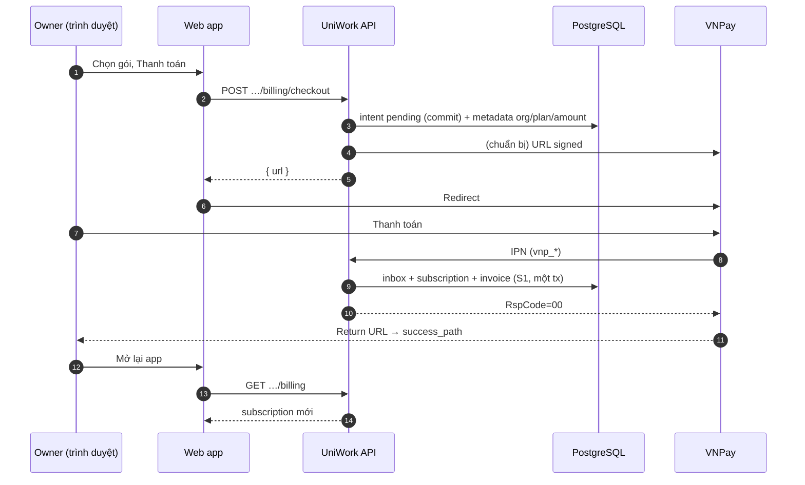

# C-04 · Hướng dẫn tích hợp VNPay cho billing tổ chức

> **Trạng thái:** in-progress (MVP VNPay sandbox + job lapse kỳ; còn schedule downgrade, QueryDr)
> **Issue:** UNI-440 · **Spec:** `docs/superpowers/specs/2026-09-04-tenant-subscription-entitlement-design.md` (§4.5–4.6, §5)
> **Nền tảng đã ship:** F-02 / UNI-425 — gói, subscription, entitlement, tab Thanh toán, `POST …/billing/checkout` (provider còn stub)

Tài liệu này mô tả **cách UniWork gắn VNPay**, **luồng xử lý khi người dùng thanh toán**, và **việc cần làm trên server / VNPay Merchant**. Phần **Còn lại** ở cuối §10 là hạng mục chưa ship trong repo.

---

## 1. Vai trò VNPay trong sản phẩm

| Thành phần | Vai trò |
|------------|---------|
| **Organization** | Chủ thể thuê bao; một org một subscription sống |
| **Plan** | Gói + giá (`price_amount` VND); gói trả phí **không** đổi bằng `PATCH …/billing/plan` — API trả `checkout_required` |
| **VNPay** | Cổng redirect + **IPN** (Instant Payment Notification): xác nhận giao dịch server-to-server |
| **`billing.Provider` (`vnpay`)** | Tạo URL thanh toán, verify chữ ký IPN, chuẩn hóa sự kiện — **không** ghi DB |
| **`BillingService`** | **Duy nhất** ghi `subscriptions`, `invoices`; xử lý sự kiện sau IPN |
| **`webhook_inbox` + worker** | Hàng đợi bền, retry, dedupe — cùng pattern LiveKit meeting webhook |

VNPay **không** có subscription recurring kiểu Stripe. Mỗi lần nâng gói / gia hạn kỳ = **một giao dịch Pay URL**; IPN thành công → gia hạn `current_period_*` và đổi `plan_id` nếu đang checkout gói mới.

---

## 2. Kiến trúc tóm tắt

```
packages/views (billing tab)
       │  useCreateCheckout / useSubscription / useInvoices
       ▼
POST /api/v1/orgs/{org}/billing/checkout
       │
       ▼
BillingService.Checkout ──► billing_payment_intents (pending, commit trước URL)
       │                      │
       ▼                      │
billing.VNPay.CreateCheckout ─┘  (vnp_TxnRef = intent id)
       │
       ▼
   URL VNPay (redirect)

VNPay ──IPN──► GET|POST /api/v1/billing/webhooks/vnpay
       │              │
       │              ▼
       │         verify HMAC → HandleProviderWebhook (S1: ApplyProviderEvent trong tx)
       │              │         webhook_inbox dedupe
       │              ▼
       │         RspCode=00 khi apply OK
       │
       │    (worker billing: retry inbox; ticker ~1 phút: cancel_at → gói mặc định, hết kỳ → past_due)
       └──────────────► subscriptions + invoices + audit + outbox
```

**Đã ship (C-04 MVP):** `vnpay.go`, `billing_payment_intents`, IPN handler S1, `ApplyProviderEvent`, worker retry inbox, `GET …/billing/invoices` + tab Hóa đơn, poll Return URL, chặn hạ gói trả phí (`downgrade_not_allowed`), metric `uniwork_billing_webhook_dead_total`, runbook `docs/runbooks/BILLING_VNPAY_WEBHOOK.md`.

**Chưa ship:** schedule downgrade kiểu Cursor; QueryDr reconcile; alert Prometheus gắn runbook.

---

## 3. Chuẩn bị trước khi tích hợp

### 3.1 Tài khoản VNPay

1. Đăng ký merchant (sandbox: [sandbox.vnpayment.vn](https://sandbox.vnpayment.vn)).
2. Lấy **TMN Code** (`VNPAY_TMN_CODE`) và **Hash Secret** (`VNPAY_HASH_SECRET`).
3. Cấu hình trên portal VNPay:
   - **IPN URL** (bắt buộc): URL công khai HTTPS tới UniWork, ví dụ  
     `https://<api-host>/api/v1/billing/webhooks/vnpay`
   - **Return URL**: do UniWork truyền từng lần checkout (`vnp_ReturnUrl`), thường là trang Settings billing của org trên web app.

IPN phải gọi được từ internet tới server (local dev: tunnel ngrok/cloudflared tới cổng API).

### 3.2 Biến môi trường server

Thêm vào `.env` (và `.env.example` khi implement — `scripts/env-example.test.mjs`):

| Biến | Mô tả |
|------|--------|
| `BILLING_PROVIDER` | `vnpay` để bật adapter (mặc định hiện tại: `manual`) |
| `VNPAY_TMN_CODE` | Mã website merchant |
| `VNPAY_HASH_SECRET` | Chuỗi bí mật ký HMAC |
| `VNPAY_PAYMENT_URL` | Sandbox: `https://sandbox.vnpayment.vn/paymentv2/vpcpay.html` — production: URL do VNPay cung cấp |
| `FRONTEND_ORIGIN` | Origin web app (đã có); dùng ghép `success_path` / `cancel_path` từ checkout |

Không log secret, TMN, hash raw; log chỉ id nội bộ (`organization_id`, `intent id`, `vnp_TxnRef`).

### 3.3 Dữ liệu gói trên UniWork

- Gói trả phí: `plans.price_amount` > 0, `price_currency = VND`.
- Owner org mở **Cài đặt → Thanh toán**, chọn gói, bấm thanh toán.

---

## 4. Luồng khi người dùng dùng (happy path)

### 4.1 Ai làm gì

| Bước | Người dùng / hệ thống | Hành vi |
|------|------------------------|---------|
| 1 | Owner org | Mở tab Thanh toán, chọn gói trả phí |
| 2 | Frontend | `POST /api/v1/orgs/{orgId}/billing/checkout` với `plan_code`, `success_path`, `cancel_path` (path tương đối; server ghép `FRONTEND_ORIGIN`) |
| 3 | Server | Kiểm tra quyền owner, gói tồn tại, không vi phạm downgrade quota (B4) |
| 4 | Server | Tạo `billing_payment_intents` trạng thái `pending`, `provider_txn_ref` = ULID (dùng làm `vnp_TxnRef`) |
| 5 | VNPay adapter | Ký tham số (HMAC-SHA512), trả URL redirect |
| 6 | Frontend | Chuyển hướng owner sang VNPay |
| 7 | Owner | Thanh toán trên cổng VNPay (thẻ / ví / … theo merchant) |
| 8 | VNPay | Gọi **IPN** tới UniWork (có thể **trước** khi browser quay về Return URL) |
| 9 | Webhook handler (S1) | Verify chữ ký → `webhook_inbox` + `ApplyProviderEvent` **cùng tx** → `RspCode=00` chỉ khi apply OK |
| 10 | Worker (dự phòng) | Claim inbox billing (`vnpay`) retry nếu có row PENDING không xử lý trên handler |
| 11 | BillingService | Khóa subscription, so amount, `ApplyPaidSubscriptionFromProvider`, invoice `paid`, intent `completed`, audit + outbox |
| 12 | VNPay | Redirect browser về `Return URL` (success) |
| 13 | Frontend | Trang success: hiển thị “Đang xác nhận…”; refetch billing hoặc đợi realtime `subscription.changed` |
| 14 | Owner | Thấy gói mới, kỳ hiện tại, quota theo entitlement |

### 4.2 Sơ đồ thời gian



### 4.3 Nguồn sự thật

| Sự kiện | Tin ai? |
|---------|---------|
| Giao dịch **thành công** | **IPN** đã verify + worker `ApplyProviderEvent` |
| Return URL query string | Chỉ UX (hiển thị thông báo); **không** đổi gói từ handler Return |
| Tab billing sau realtime | `subscription.changed` invalidate cache React Query |

---

## 5. Luồng kỹ thuật chi tiết (server)

### 5.1 Tạo checkout

**Endpoint:** `POST /api/v1/orgs/{orgID}/billing/checkout`  
**Auth:** session + org owner (platform admin không thay thế checkout trả phí cho owner trừ khi product đổi quy tắc).

**Input (SDI):**

- `plan_code` — mã gói đích  
- `success_path`, `cancel_path` — path tương đối (vd. `/acme/main/settings?tab=billing&checkout=success`)

**Xử lý (`BillingService.Checkout`):**

1. `requireOwner`
2. Load plan; nếu free → có thể từ chối hoặc bắt dùng `changePlan` (giữ như F-02)
3. Transaction:
   - `LockLiveSubscription(org)`
   - `fitsUnder` (B4 — usage snapshot không vượt gói đích)
   - Insert intent: `amount = plan.price_amount`, `expires_at = now + 15m` (gợi ý)
4. `provider.CreateCheckout` với `OrganizationID`, `PlanCode`, email owner, Return/Cancel URL đầy đủ
5. Trả `201 { url }`

**Tham số VNPay điển hình (v2):**

- `vnp_Version`, `vnp_Command=pay`, `vnp_TmnCode`
- `vnp_Amount` = số tiền × 100 (VND)
- `vnp_TxnRef` = id intent
- `vnp_OrderInfo` = mô tả ngắn (không PII)
- `vnp_ReturnUrl` (IPN URL **cấu hình trên portal VNPay**, không gửi `vnp_IpnUrl` trong Pay URL hiện tại)
- `vnp_IpAddr` (IP client khi tạo checkout)
- `vnp_CreateDate`, `vnp_CurrCode=VND`, `vnp_Locale=vn`
- `vnp_SecureHash` = HMAC-SHA512(sorted params, secret)

### 5.2 IPN (webhook)

**Endpoint:** `POST /api/v1/billing/webhooks/vnpay` *(theo spec; VNPay thường GET query — handler nên hỗ trợ cả hai nếu merchant yêu cầu)*  
**Auth:** không session — chỉ **chữ ký VNPay**

**Handler:**

1. `billing.VNPay.ParseWebhook(r)` → `Event` + raw payload
2. Nếu chữ ký sai → `401`
3. Insert `webhook_inbox`:
   - `provider = vnpay`
   - `provider_event_id = vnp_TransactionNo` (hoặc composite ổn định nếu sandbox thiếu)
   - `payload` = JSON chuẩn hóa
4. Trả body VNPay theo **quy tắc §6.2** (không mặc định `RspCode=00` nếu chưa apply xong — xem bảng IPN).

**Worker (`ProcessBillingWebhookInbox`):**

1. Poll `webhook_inbox` **chỉ** `provider IN ('vnpay', …)` — **không** dùng worker LiveKit/meeting cho row billing (payload khác).
2. `BillingService.ApplyProviderEvent(ctx, event)`
3. Mark processed / DEAD sau N lần lỗi; metric `uniwork_billing_webhook_dead_total`
4. Job reconcile (khuyến nghị): intent `pending` quá hạn + tra cứu VNPay theo `TxnRef`, hoặc replay inbox `DEAD_LETTER` sau khi sửa lỗi.

### 5.3 ApplyProviderEvent (idempotent)

**Input chuẩn hóa:**

- `ProviderTxnRef` → load `billing_payment_intents`
- `vnp_ResponseCode == 00` → nhánh **paid**; mã khác → nhánh **failed** (§6.5), không đổi subscription
- So khớp: `amount`, `organization_id`, `plan_id`, `vnp_TmnCode`; intent `pending` (hoặc `expired` trong grace — §6.11)

**Transaction:**

1. Nếu event paid đã xử lý (inbox hoặc intent `completed`) → return nil  
2. Lock subscription org (`LockLiveSubscription`)  
3. **`ApplyPaidPlanFromProvider`** (query/sqlc **mới**) — **không** dùng `ChangeSubscriptionPlan` hiện tại vì query đó luôn set `provider = 'manual'` và `current_period_end = NULL`  
4. Set `provider = vnpay`, `status = active`, `current_period_start/end` theo `plan.billing_period`, xóa `cancel_at` nếu đang gia hạn  
5. Insert invoice `paid`; intent → `completed`  
6. `audit` với actor **`system`** + outbox `subscription.changed` (owner/admin)

**Sự kiện domain:** `subscription.changed` — payload ids only; FE invalidate `billingKeys.current(orgId)`.

---

## 6. Xử lý các trường hợp trong thanh toán

Mục này là **hợp đồng hành vi** khi implement C-04: mỗi tình huống phải map tới xử lý server, trạng thái dữ liệu và UX. Test integration nên có ít nhất một case cho từng dòng **bắt buộc** trong bảng §6.1.

### 6.1 Ma trận tóm tắt

| # | Tình huống | Subscription đổi? | Intent | Invoice | FE |
|---|------------|-------------------|--------|---------|-----|
| A | Checkout thành công, chưa trả | Không | `pending` | Không | Redirect VNPay |
| B | IPN paid (`00`) | Có | `completed` | `paid` | Gói mới / poll |
| C | Hủy trên cổng VNPay | Không | `pending`→`expired` | Không | Quay billing, gói cũ |
| D | IPN lỗi (`!= 00`) | Không | `failed` | Không | Thông báo thất bại |
| E | IPN trùng (retry) | Không (idempotent) | `completed` | Không thêm | Không đổi |
| F | Số tiền / TMN sai | Không | `failed` | Không | Liên hệ support |
| G | Trả tiền, worker DEAD | Không *(lỗi vận hành)* | `pending`/`completed`? | — | Support + reconcile |
| H | Nhiều checkout pending | Không tới khi paid đúng intent | Một `completed`, còn lại `expired` | Một `paid`/intent | — |
| I | Downgrade quota vượt (B4) | Không | Không tạo / `failed` | Không | `quota_exceeded` |
| J | Gói free / manual | Có (không VNPay) | — | — | `changePlan` |
| K | Gia hạn kỳ (checkout lại) | Có (kỳ mới) | `completed` | `paid` mới | — |
| L | `past_due` + thanh toán | `active` + kỳ mới | `completed` | `paid` | Quota hoạt động lại |
| M | Return URL success, IPN chưa tới | Chưa | `pending` | Chưa | “Đang xác nhận…” + poll |
| N | Đóng tab sau khi trả | Có (khi IPN tới) | `completed` | `paid` | Lần sau mở billing |
| O | Platform admin đổi gói tay | Có | — | — | Không qua VNPay |

### 6.2 IPN: khi nào trả `RspCode=00` (bắt buộc chốt)

VNPay coi **00 = đã nhận xử lý xong**. Nếu trả 00 rồi worker fail vĩnh viễn → **mất tiền, không lên gói**.

| Chiến lược | Mô tả | Khi nào dùng |
|------------|--------|--------------|
| **S1 — Đồng bộ (khuyến nghị MVP)** | Trong handler IPN: verify → `ApplyProviderEvent` trong tx → thành công mới `RspCode=00` | Sandbox/production VNPay; traffic billing thấp |
| **S2 — Hàng đợi + retry VNPay** | Chưa apply xong thì **không** 00; trả mã khiến VNPay gửi lại (theo tài liệu merchant) | Khi handler phải cực nhanh |
| **S3 — 00 + reconcile** | Enqueue + 00 ngay; job tra `QueryDr` / portal VNPay + replay DEAD | Chỉ nếu bắt buộc async; **bắt buộc** alert `uniwork_billing_webhook_dead_total` |

Implement mặc định **S1** trừ khi đo latency IPN vượt timeout VNPay.

**Chữ ký IPN sai / thiếu tham số:** HTTP `401`, **không** ghi inbox, **không** 00.

**Method GET vs POST:** VNPay thường gửi **query GET** — handler đọc `r.URL.Query()`; nếu merchant cấu hình POST thì đọc cả body. Sai method → 404/405, IPN không vào → user stuck ở M (reconcile).

### 6.3 Trước redirect (API checkout)

| Tình huống | Điều kiện | Xử lý server | HTTP / mã |
|------------|-----------|--------------|-----------|
| Không phải owner | `requireOwner` fail | Từ chối | 403 |
| Gói không tồn tại / inactive | `GetPlanByCode` | 404 | |
| Gói “liên hệ” (giá NULL) | `price_amount` invalid hoặc ≤ 0 cho checkout | Từ chối checkout; dùng manual/admin | 400 / `checkout_not_available` |
| Gói free | `price_amount == 0` | Bắt `PATCH …/plan`, không checkout | 400 |
| Downgrade vượt quota (B4) | `fitsUnder` fail | Không tạo intent | 403 `quota_exceeded` |
| Provider tắt / stub | `ErrProviderUnavailable` | | 503 `billing_provider_unavailable` |
| Checkout mới khi đã có pending | Cùng org | **Expire** intent pending cũ (hoặc mark `superseded`); tạo intent mới | 201 |
| Commit intent | Trước khi trả URL | Tx: insert intent `pending` **commit** rồi mới build URL | Tránh IPN tới sớm (§6.10) |
| `success_path` / `cancel_path` lạ | Không bắt đầu bằng `/`, hoặc chứa `//` | Từ chối | 400 |
| Hai owner cùng lúc | Hai intent pending | Mỗi giao dịch một TxnRef; chỉ intent được paid hợp lệ apply (§6.8) | |

**Dev local:** VNPay không gọi được `localhost` — tunnel (`ngrok http <api-port>`), IPN portal = `https://<tunnel>/api/v1/billing/webhooks/vnpay`, `API_PUBLIC_URL` cùng host tunnel, restart server.

**Hạ gói trả phí:** không `ChangePlan` / checkout xuống gói rẻ hơn → `downgrade_not_allowed`; về Starter = **Ngừng gói** cuối kỳ (§6.9). Job áp Starter khi hết kỳ *(chưa code)*.

### 6.4 Trên cổng VNPay & Return URL (trình duyệt)

| Tình huống | Server mutate từ Return? | Xử lý |
|------------|-------------------------|--------|
| User bấm **Hủy / Back** | **Không** | Redirect `cancel_path`; subscription giữ nguyên; intent → `expired` (lazy/cron) |
| User thanh toán xong, Return **success** | **Không** (chỉ UX) | FE: query `?checkout=success` → toast + poll `GET …/billing` 3–5 lần / 15s |
| Return success nhưng IPN **fail** | Không đổi gói | FE: sau poll hết → “Chưa nhận xác nhận; thử refresh hoặc liên hệ support” + hiển thị correlation nếu có |
| Return kèm query `vnp_*` | **Không** dùng để đổi gói | Có thể hiển thị “đang chờ xác nhận” only; verify hash optional cho UX, không thay IPN |
| Session hết hạn khi quay lại | — | User đăng nhập lại → billing tab đọc subscription thật (IPN có thể đã chạy) |

### 6.5 IPN: mã thanh toán & hậu quả

| `vnp_ResponseCode` (ví dụ) | Ý nghĩa thường gặp | Server |
|----------------------------|-------------------|--------|
| `00` | Thành công | `ApplyProviderEvent` nhánh paid (§5.3) |
| Khác `00` | Hủy, từ chối, timeout bank, … | Ghi inbox (dedupe); intent → `failed`; **không** đổi subscription |
| Paid nhưng intent không tồn tại | TxnRef lạ / typo | Inbox DEAD hoặc skip; log alert; reconcile |
| Paid nhưng intent `expired` | Trả chậm | Policy: **chấp nhận** trong N ngày nếu amount+plan khớp (§6.11) hoặc từ chối + support hoàn tiền thủ công |

Luôn verify: **SecureHash**, `vnp_TmnCode`, `vnp_Amount/100 == intent.amount`, `vnp_CurrCode=VND`.

### 6.6 Trùng lặp, race & thứ tự

| Tình huống | Xử lý |
|------------|--------|
| VNPay gửi IPN **2+ lần** cùng `TransactionNo` | Unique `(provider, provider_event_id)`; lần 2 no-op |
| Hai IPN khác `TransactionNo`, cùng `TxnRef` | Chỉ một paid hợp lệ; cái thứ hai intent đã `completed` → no-op subscription |
| IPN paid **trước** khi intent commit | Hiếm; S1 retry IPN hoặc worker retry; intent phải commit trước URL (§6.3) |
| IPN và `ChangePlan` manual đồng thời | `LockLiveSubscription`; một tx thắng; tx kia 409 / version conflict |
| Worker billing vs worker meeting | **Tách** claim theo `provider`; meeting không parse payload VNPay |

### 6.7 Lỗi tài chính & vận hành (support)

| Tình huống | Triệu chứng | Hành động |
|------------|-------------|-----------|
| Amount mismatch | IPN paid, amount ≠ plan | Intent `failed`; không đổi gói; support đối chiếu VNPay portal |
| Tiền vào, gói không đổi | User khiếu nại | Tra `billing_payment_intents` + `webhook_inbox` theo TxnRef; replay DEAD sau fix; hoặc admin `ChangePlan` + ghi audit |
| Inbox `DEAD_LETTER` | Metric tăng | Runbook: xem `last_error`, sửa code/data, replay row |
| Gói đổi giá giữa pending và paid | Intent amount cũ | So amount intent lúc tạo; lệch → `failed` + support |
| Hoàn tiền trên VNPay (refund) | Ngoài MVP | **Không** tự downgrade; manual admin + spec sau C-04 |

### 6.8 Nhiều intent pending (cùng org)

1. Checkout lần 2 → mark intent cũ `expired` (chỉ một `pending` active).  
2. User thanh toán URL **cũ** (email/bookmark): IPN khớp intent cũ đã `expired` → §6.11 (grace) hoặc từ chối.  
3. User thanh toán **hai lần** hai URL: mỗi IPN một invoice; subscription = plan của giao dịch **paid hợp lệ cuối** (cùng policy product) hoặc từ chối giao dịch thứ hai nếu đã `completed` cùng kỳ — **MVP:** giao dịch thứ hai vẫn gia hạn thêm một kỳ / credit manual (product chốt).

### 6.9 Nghiệp vụ gói (không qua VNPay)

| Tình huống | Luồng |
|------------|--------|
| Gói free ↔ free | `PATCH …/billing/plan`, `row_version` |
| Gói trả phí | Bắt buộc checkout; `checkout_required` nếu gọi PATCH |
| Platform admin | `ChangePlan` mọi gói, `provider` có thể giữ `manual` |
| Owner hủy thuê bao (`cancel`) | `cancel_at = period_end`; vẫn dùng gói đến hết kỳ; gia hạn VNPay sau đó cần checkout mới |
| Resume cancel | Xóa `cancel_at` |

### 6.10 Gia hạn, nâng gói, kỳ billing

| Tình huống | Hành vi MVP |
|------------|-------------|
| Hết kỳ, chưa trả lại | Worker `ProcessSubscriptionLapse` (~1 phút): `active` + gói trả phí → `past_due`; entitlement grace 7 ngày rồi fail-closed (B3) |
| `cancel_at` ≤ now | Cùng worker: revert `plan_id` → gói mặc định, xóa kỳ/`cancel_at`, `provider=manual` |
| Checkout gia hạn **cùng gói** | IPN paid → `current_period_start = now()`, `period_end` += 1 tháng/năm |
| Nâng gói giữa kỳ | IPN paid → plan mới, kỳ **reset từ now** (không proration) — thông báo UX trước khi trả |
| Hạ gói qua VNPay | Chỉ khi `fitsUnder`; nếu không → chặn ở checkout (§6.3) |

Meter **accumulate** (`ai.tokens`, phút họp) gắn `usage_counters.period_start = subscription.current_period_start` — khi đổi kỳ, counter kỳ mới tách bucket tự nhiên.

### 6.11 Intent `expired` nhưng IPN paid (trả chậm)

**Policy đề xuất:** chấp nhận nếu: IPN trong **72h** sau `expires_at`, amount/plan/org khớp, subscription vẫn sống. Ngược lại: intent `failed`, ticket support + tra VNPay hoàn tiền/chuyển khoản bù.

### 6.12 Frontend — copy & trạng thái hiển thị

| Trạng thái user thấy | Điều kiện | UI (gợi ý i18n key) |
|----------------------|-----------|---------------------|
| Đang chuyển cổng | Sau 201 checkout | Loading full-page |
| Đang xác nhận | Return success, subscription chưa đổi | `settings.billing.checkout.confirming` + spinner |
| Thành công | `subscription.changed` hoặc plan_code đổi | Toast success + refresh usage |
| Thất bại / hủy | cancel_path hoặc poll timeout | `settings.billing.checkout.failed` / `.cancelled` |
| Cổng chưa cấu hình | 503 | `settings.billing.provider_unavailable` |
| Quota / checkout | 403 fields | Toast + link billing (F-02) |

Không hiển thị số thẻ / token VNPay; không promise “đã kích hoạt” chỉ vì Return URL.

### 6.13 Checklist test theo tình huống

- [ ] B: mock IPN `00` → plan + invoice + intent completed  
- [ ] C: không IPN → intent expired, sub giữ  
- [ ] D: IPN `24` (hoặc mã fail sandbox) → intent failed  
- [ ] E: gửi IPN duplicate → một invoice  
- [ ] F: amount sai → sub không đổi  
- [ ] I: checkout downgrade quota → 403  
- [ ] M: Return success trước IPN → FE poll rồi B  
- [ ] 6.3: path `//evil` → 400  
- [ ] Worker: row `vnpay` không đi qua meeting handler  

---

## 7. Trạng thái dữ liệu (tham chiếu)

### 7.1 `billing_payment_intents` *(bảng mới)*

| status | Ý nghĩa |
|--------|---------|
| `pending` | URL đã tạo, chờ IPN |
| `completed` | IPN paid, subscription đã cập nhật |
| `failed` | IPN lỗi / amount mismatch |
| `expired` | Quá hạn không thanh toán |

### 7.2 `subscriptions`

| Trường | Sau VNPay thành công |
|--------|----------------------|
| `plan_id` | Gói đã checkout |
| `provider` | `vnpay` |
| `status` | `active` (trừ logic trial/past_due riêng) |
| `current_period_start/end` | Kỳ mới theo `billing_period` |
| `row_version` | Tăng 1 (optimistic lock FE) |

### 7.3 `invoices`

| status | Khi nào |
|--------|---------|
| `paid` | IPN thành công |
| `open` / `draft` | *(tuỳ implement hóa đơn trước IPN — MVP có thể tạo thẳng `paid`)* |

---

## 8. Frontend (khi dùng)

| Thành phần | Hành vi |
|------------|---------|
| `billing-tab.tsx` | Gói trả phí → `useCreateCheckout` → `window.location = url` |
| Return query `checkout=success` | Toast + refetch subscription; optional polling 2–3 lần nếu IPN chậm |
| Realtime | `subscription.changed` → invalidate billing query |
| Hóa đơn | `GET …/billing/invoices` + tab Cài đặt **Hóa đơn** (`?tab=invoices`) |
| Lỗi `billing_provider_unavailable` | Provider chưa cấu hình — nhắc liên hệ admin / đổi gói manual |

Owner **không** cần biết VNPay: chỉ thấy redirect và trạng thái gói.

---

## 9. Bảo mật & tuân thủ repo

- Verify HMAC mọi IPN; không tin Return URL để mutate state.
- Webhook **không** qua `RequireMember`; cô lập tenant khi apply bằng intent đã gắn `organization_id`.
- Mọi thay đổi subscription: audit + outbox cùng transaction (ADR 0009, 0012).
- Route billing org vẫn qua isolation matrix khi thêm invoice/list.
- Không lưu PAN/thẻ; VNPay giữ PCI.

---

## 10. Checklist triển khai cho developer

### Backend

- [x] Migration `billing_payment_intents` + sqlc
- [x] `server/internal/billing/vnpay.go` + tests chữ ký
- [x] `config`: biến VNPay; `FromConfig("vnpay")`
- [x] `BillingService`: checkout persist intent; `ApplyProviderEvent`; `ListInvoices`
- [x] Handler webhook S1 + router; worker retry + lapse kỳ + `main.go` chờ shutdown
- [x] Metric `uniwork_billing_webhook_dead_total`
- [x] `.env.example` cập nhật
- [x] Job hết kỳ / `past_due` / áp `cancel_at` → gói mặc định (`billing_lapse.go`, sqlc batch)
- [ ] QueryDr reconcile (§6.7)

### Frontend

- [x] Return URL / poll xác nhận + banner timeout
- [x] `listInvoices` + UI Hóa đơn
- [x] i18n checkout + invoices (vi/en)

### Vận hành

- [ ] IPN URL production trên portal VNPay (`unicomhub` API)
- [x] Runbook `docs/runbooks/BILLING_VNPAY_WEBHOOK.md`
- [ ] Sandbox test card theo tài liệu VNPay (checklist §6.13 đủ case)

### Kiểm thử

- [x] Unit adapter + ApplyProviderEvent idempotent
- [x] Service: IPN paid → subscription + invoice
- [ ] Handler integration §6.13 đầy đủ (amount sai, duplicate IPN, …)
- [ ] `make test-go` / `pnpm test` trước merge

---

## 11. Liên hệ spec & quyết định sản phẩm

| Tài liệu | Nội dung |
|----------|----------|
| Spec entitlement §4.5 | Interface `Provider`, event types, worker inbox |
| OPEN_QUESTIONS B2 | Đã chốt **PayOS**; task UNI-440 của bạn dùng **VNPay** — thêm provider `vnpay` song song stub `payos`, không đổi schema |
| OPEN_QUESTIONS B3/B4 | Grace 7 ngày; không downgrade khi usage vượt gói đích |
| UNI-425 plan | Phần Stripe/PayOS/webhook/invoice ban đầu defer C-04 |

---

## 12. Tài liệu VNPay bên ngoài

- Tài liệu tích hợp Payment Gateway v2 (VNPay merchant portal — **Thanh toán Pay**, IPN, mã lỗi `vnp_ResponseCode`).
- Sandbox: đăng ký test merchant, cấu hình IPN trùng URL deploy dev (tunnel).

Khi implement, đối chiếu **chính xác** thuật toán hash và tên tham số với bản PDF/API version merchant đang ký — không copy từ bản nháp plan cũ nếu VNPay đổi spec.

---

*Tài liệu này là hướng dẫn tích hợp và luồng vận hành; cập nhật trạng thái sang **shipped** khi UNI-440 slice VNPay merge và sandbox pass.*
