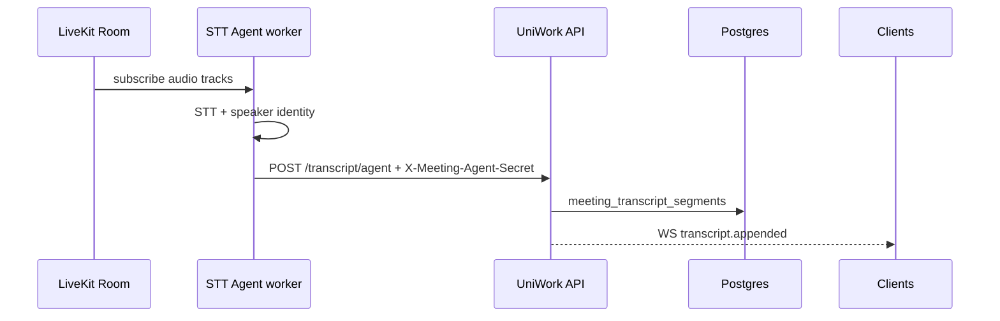

# Meeting STT — đánh giá LiveKit Agents (server-side)

> **Trạng thái:** shipped — ingestion API + worker skeleton trong `deploy/meeting-stt-agent/`.

Ngày: 2026-09-08. Bổ sung cho D08b §2 (transcript) và gap analysis Meeting/LiveKit.

## Vấn đề hiện tại

Client Web Speech (`meeting-captions.tsx`) chỉ nhận diện **mic local**, không diarization toàn phòng, phụ thuộc Chrome/Edge/Safari, độ chính xác tiếng Việt hạn chế. Điểm khác biệt product (AI biên bản → task) cần transcript đa người nói.

## Hướng đề xuất: LiveKit Agents + STT provider

### Đã ship (control plane)

- `MEETING_STT_AGENT_SECRET` + `GET /workspaces/{id}/meeting-capabilities` → `server_stt: true`
- `POST /meetings/{id}/transcript/agent` — body `{ participant_identity, speaker_name?, text, spoken_at? }`
- UI ẩn Web Speech khi `server_stt` bật (tránh transcript trùng)

### Bước tiếp theo (worker)

1. **Agent process** (Python/Node LiveKit Agents SDK): join room `uw_mtg_{id}` với service token; subscribe audio; gọi Deepgram/AssemblyAI (vi + en).
2. **Dispatch**: một agent instance / meeting IN_PROGRESS (hoặc shared pool + room filter).
3. **Fallback**: giữ Web Speech khi `server_stt` tắt (dev/local).
4. **Chi phí & quota**: meter qua entitlement tương tự `meeting_summarization`.

## So sánh phương án

| Phương án | Ưu | Nhược |
| --- | --- | --- |
| Web Speech (hiện tại) | Không server, chạy ngay | Chỉ local mic, 1 browser |
| LiveKit Agents + STT | Toàn phòng, diarization, vi/en | Infra + chi phí STT |
| LiveKit native Transcription | Ít code agent | Vendor lock, ít tùy biến speaker → participant |

**Khuyến nghị:** LiveKit Agents + STT provider; endpoint agent đã sẵn sàng cho worker.

## Kiểm chứng

- Go: `TestTranscriptAndSummaryToTasks` (agent segment), `TestSetParticipantPublish`
- FE: `proactiveTokenRefreshDelayMs`, capabilities `server_stt`
- E2E LiveKit: `e2e/meetings-livekit.spec.ts` khi `E2E_LIVEKIT=1`
