# UniWork — Documents + UniWork Office: yêu cầu frontend cho G0

> **Trạng thái:** in-progress — bản 1a (phạm vi, yêu cầu FE, wireframe/state map,
> brand, phạm vi pilot) viết ngày 2026-09-16 theo spec G0 đã chốt. Chưa triển khai
> UI sản phẩm; bước 1b (ADR thay thế, C-01, roadmap, issue) còn mở.

**Issue:** UNI-665 (DOC-001) · **Parent:** UNI-656 · **Roadmap:** C-01, liên quan C-15/C-16.
**Spec nguồn:** `Documents + Office G0` — file nguồn nằm ở workspace tổng:
`dev-uniwork/docs/superpowers/specs/2026-09-16-documents-office-g0-design.md`.
File này **không** có trong worktree/branch `docs/UNI-665-office-scope-fe`
(kiểm bằng `git ls-tree` và `git log --all`: không tồn tại), nên link tương đối
ở bản 1a **không** phân giải được trong branch này; phải đọc bản ở workspace tổng.
**Plan nguồn:** `dev-uniwork/docs/superpowers/plans/2026-09-16-documents-office-g0.md`
(Task 1) — cùng lý do, cũng không nằm trên branch này.
**C-01 nền:** [Documents design](2026-09-08-documents-design.md) §1–§13.
**Checklist:** `DOCUMENTS_OFFICE_CHECKLIST.md` tại workspace tổng (UNI-655).

**Giới hạn bằng chứng.** Tài liệu này là thiết kế và yêu cầu; không phải bằng chứng
đã chạy editor. Mọi khả năng đã nêu đều là yêu cầu phải kiểm chứng ở DOC-003/004.
Con số, tên định danh và hợp đồng dữ liệu nào chưa có bằng chứng đều được ghi rõ
"chưa chốt".

---

## 1. Mục tiêu và ranh giới

Chốt hợp đồng phạm vi và UI để G1/G2/G3/G4 có thể bắt đầu: màn hình nào tồn tại,
luồng nào phải chạy, trạng thái nào phải có, và phần nào đổi so với tài liệu đã
duyệt. Bước 1a này **không** dựng UI, không tick checkbox G0, không đổi C-01/roadmap
(đó là 1b sau khi có bằng chứng DOC-003/004/005).

### 1.1 Hiện trạng mã đã kiểm tra (đọc source, không chạy)

Đối chiếu tại `develop` `97b4fa59`. Đây là bằng chứng đọc source để yêu cầu dưới
đây không mô tả thứ đã có sẵn.

| Điều đã có | Vị trí | Ảnh hưởng tới yêu cầu |
| --- | --- | --- |
| TipTap editor dùng chung + preview tệp đính kèm | `packages/views/editor/` (`ContentEditor`, `ReadonlyContent`, `AttachmentPreviewModal`, `useDownloadAttachment`, `FileDropOverlay`) | Tái sử dụng cho trang; editor Office là thành phần **khác**, không nhét vào `ContentEditor` |
| Khung màn hình chung | `packages/views/layout/`: `CollectionPageHeader`, `CollectionPageState`, `BreadcrumbHeader`, `PageHeader`, `PAGE_TOOLBAR`, `PAGE_LEADING_ICON`, `module-tones.ts` | Dùng đúng khung này; không dựng chrome thứ hai |
| Tint module Documents | `MODULE_TONES.documents = "orange"` | Giữ; chỉ là định danh module, không phải màu trạng thái |
| Chưa có mục nav Documents | `packages/views/layout/app-sidebar.tsx` (home/inbox/tasks/my_tasks/projects/meetings/chat/people) | Phải thêm mục, sau feature flag |
| Chưa có khoá i18n `documents.*` / `nav.documents` | `packages/core/i18n/locales/{vi,en}.json` | Phải thêm vi trước en; parity test bắt buộc |
| Chưa có route/builder tài liệu | `packages/core/paths/paths.ts`; `server/internal/service/reserved_slugs.json` thiếu `documents`, `share` | Phải thêm builder + reserved slug trước khi có route |
| Chưa có feature flag `documents` | `server/internal/featureflags/keys.go` | Phải khai báo flag (public) theo C-01 §2 #14 |
| Khả năng nền tảng đã có mô hình | `packages/core/capabilities/` (`WorkManagementCapability`, `capabilityState`) + `packages/ui/components/common/capability-banner.tsx` | Tái dùng cách suy giảm "unknown → unavailable"; mở rộng cho Office theo DOC-004 |

### 1.2 Ranh giới

- **Documents là kho.** Mọi tệp, phiên bản, quyền, nhật ký nằm ở Documents (ADR 0016).
  Web và desktop dùng **cùng** kho, cùng lịch sử; không có kho phiên bản riêng cho Office.
- **UniWork Office là công cụ soạn thảo**, không phải một kho. Nó mở nội dung của
  Document và ghi ngược lại Document qua API Documents.
- **Tài liệu thuộc Work Product** giữ nguyên cơ chế C-01 §13: không đứng trong cây,
  không chia sẻ riêng, mọi màn hình trong tài liệu này phải tôn trọng ủy quyền đó.
- **G0 không dựng UI sản phẩm.** Các đường dẫn dưới đây là **vị trí dự kiến**, chưa
  phải file đã tạo.

---

## 2. Bảng thay thế yêu cầu (1a.1)

Mỗi hàng: một mệnh đề còn hiệu lực trái phạm vi mới → yêu cầu thay thế, nguồn quyết
định, mục tài liệu phải sửa ở 1b, và nhóm nhận triển khai.

| # | Mệnh đề cũ (nguồn) | Yêu cầu mới | Nguồn | Mục tài liệu đổi ở 1b | Nhóm nhận |
| --- | --- | --- | --- | --- | --- |
| R-01 | "Phạm vi đợt này **chỉ DOCX**. XLSX, PPTX, PDF bàn sau" (ADR 0018 §Quyết định 6) | Sáu nhóm lõi DOCX/XLSX/PPTX/PDF/Markdown/HTML đều trong phạm vi; định dạng khác/legacy phải được kiểm kê, không hứa trước khi có bằng chứng | SCOPE-01, Q1-B, checklist §2; DOC-002/003 | ADR thay thế 0018 (1b.1), README ADR, C-01 §1 | G2 (UNI-658), G3 (UNI-659) |
| R-02 | "Trình duyệt không đua sửa DOCX giữ nguyên định dạng… sửa tay định dạng nặng thì mở UniWork Office" (ADR 0018 §Hệ quả) | Web sửa được cả sáu định dạng ở mức ma trận Q1-B; desktop cũng sửa; khác biệt chỉ còn ở nơi chạy engine, không ở "được sửa hay không" | Q1-B; DOC-003/004 | ADR thay thế, C-01 §7, roadmap C-15 | G3, G4 (UNI-636) |
| R-03 | "Preview file/PDF và bình luận còn bị hoãn; giao diện file chủ yếu tải về" (C-01 §1 ngoài phạm vi, §7.1, §12.5) | Preview nằm trong editor cho định dạng đã hỗ trợ; PDF có lớp chữ sửa được nội dung (Q2-A); chỉ-annotation không tính là sửa PDF | Q2-A; checklist DOC-014/DOC-030–038 | C-01 §1, §7.1 `document-file-view`, §12.5 | G3 |
| R-04 | "Bình luận trên tài liệu ở đợt sau, chờ F-05" (C-01 §1, §12.3) | Bình luận lưu thật theo document, có nhắc tên + thông báo, dùng **một** cơ chế bình luận chung với task | Checklist DOC-019; C-01 §12.3 | C-01 §1, §12.3, §7.1 | G1 (UNI-657) |
| R-05 | "C-15: nhập DOCX…; web không làm trình soạn thảo khối" (roadmap C-15) | C-15 mở rộng sang đa định dạng; AI đề xuất có người duyệt theo từng engine; web vẫn có editor chứ không chỉ đọc | Q1-B; checklist DOC-060–063 | Roadmap C-15, ADR thay thế; issue UNI-635 | G6 (UNI-635) |
| R-06 | "C-16: Office Bridge DOCX, lưu ngược thành `document_versions`, 409 khi lệch phiên bản" (roadmap C-16) | C-16 thành hợp đồng đa định dạng cho UniWork Office trên web + desktop, giữ 409/lệch phiên bản nhưng thêm change feed, tombstone, sync | Q5-A, Q7-B; DOC-050–058 | Roadmap C-16; issue UNI-636 | G4 |
| R-07 | C-01 chỉ mô tả `revision_conflict` 422 cho trang; C-16 ghi 409 cho Office, chưa có bảng lỗi chung (§9.2) | Một phân loại xung đột dùng chung cho trang và Office; client xử lý theo **loại lỗi**, không đọc text thông báo; hai mã HTTP có thể giữ để tương thích | Q5-A, Q7-B; spec G0 §9.2 | C-01 §9.2, §5.5 | G1, G5 (UNI-660) |
| R-08 | "Đồng soạn thảo thời gian thực ở lát cắt 3 với Go relay" (C-01 §2 #6, §12.1) | Giữ nguyên cho trang (CRDT page). Cộng tác **nhiều người cùng gõ trong file Office** là lát cắt riêng ADV-001, không suy ra từ sync file | Checklist ADV-001; spec G0 §2 | C-01 §12.1, roadmap ADV-001 | ADV-001 (UNI-662) |
| R-09 | "Trần tệp 50 MiB" và không preview (C-01 §2 #11, §12.7) | **Giữ nguyên** trần upload ≤50 MiB/file và quota `storage.bytes` hiện có; quota lưu trữ không được mặc định thành 50 MiB (C-01 §2 #11 vẫn áp cho multipart và file), **không** thay bằng dải đo; tách hẳn khỏi "dải đo ban đầu chủ yếu dưới 50 MiB" (Q9-A) và khỏi giới hạn engine đo được ở DOC-003/004. Ca biên phải có lỗi rõ và giữ bản gốc/bản sửa | Q9-A | C-01 §12.7 (giữ trần), DOC-074 | G1, G7 (UNI-661) |
| R-10 | C-01 §13: tài liệu thuộc Work Product ủy quyền quyền, không chia sẻ riêng | **Giữ nguyên**, không nới. C-15/C-16 tạo bản sao/chuyển đổi cho tài liệu thuộc sở hữu phải qua cơ chế chủ sở hữu, không sinh bản sao có chia sẻ rộng hơn | C-01 §13; ADR 0016 | C-01 §13 (chỉ tham chiếu, không sửa luật) | G1, G6, G4 |

Ghi chú: R-01…R-10 là nội dung 1b ghi vào C-01/roadmap/ADR. **Cập nhật 2026-09-25 (candidate 1b, DOC-001):** ADR [0021](../../adr/0021-runtime-engine-office-da-dinh-dang.md) đã được ban hành (0018 chuyển `superseded by 0021`), roadmap C-15/C-16 cùng dòng ngoài phạm vi đã sửa, C-01 đã có luật HTML, và §4.3/§7 dưới đây đã đối chiếu với DOC-004 (runtime theo thao tác) và DOC-005 (trạng thái/lỗi).

---

## 3. Screen map (1a.2)

Mọi màn hình nằm trong workspace shell hiện có. Cột "Trạng thái" nói màn hình đã
có gì và còn phải làm gì; **không** màn hình nào được dựng ở bước 1a.

### 3.1 Web — Workspace

| Màn hình | Route dự kiến | Nội dung | Trạng thái |
| --- | --- | --- | --- |
| Danh sách tài liệu | `/{org}/{ws}/documents` | `CollectionPageHeader` (icon Documents, tint orange, đếm, nút "Trang mới" + "Tải tệp"); tab Tất cả / Gần đây / Được chia sẻ với tôi / Lưu trữ; cây bên trái + danh sách bên phải | Mới |
| Chi tiết tài liệu (vỏ) | `/{org}/{ws}/documents/{id}` | `BreadcrumbHeader` (cây › tiêu đề) + `PAGE_TOOLBAR`; vùng canvas; panel phải; trạng thái lưu | Mới |
| Editor `page` | trong chi tiết | `ContentEditor` (TipTap) đã có | Tái sử dụng |
| Editor `file` Office | trong chi tiết | UniWork Office canvas theo định dạng; chọn theo khả năng engine | Mới (G3) |
| Thẻ tệp không có engine | trong chi tiết | Icon theo MIME, kích thước, phiên bản, nút Tải về / Tải phiên bản mới, banner "chưa sửa được trong web" | Mới |
| Lịch sử phiên bản | panel phải (sheet/drawer) | Danh sách phiên bản, xem, khôi phục (confirm), đặt tên mốc | Mới |
| Chia sẻ | dialog từ header | Visibility, thêm người/workspace/tổ chức + mức, danh sách share sống + thu hồi, mục Liên kết | Mới |
| Nhật ký truy cập | panel phải | Ai (badge agent/anonymous), hành động, phiên bản, qua đâu, khi nào | Mới |
| Trung tâm đồng bộ | popover từ trạng thái lưu | Thiết bị, lần thành công cuối, hàng đợi, lỗi, retry (G5) | Mới (G5) |
| Trang chia sẻ công khai | `/share/{token}` | Chỉ đọc, không shell, watermark "Chia sẻ bởi {org}", hết hạn → thông báo | Mới |
| Màn chi tiết Kết quả công việc | `/{org}/{ws}/projects/{id}` (C-14) | Danh sách **biểu diễn** của deliverable; mở từng biểu diễn vào editor tương ứng | C-14 sở hữu; tài liệu này chỉ chốt điểm nối |
| Search palette | ⌘K | Nhóm "Tài liệu": gần đây + kết quả theo `q` (debounce 250ms) | Mở rộng file có sẵn |
| Settings tổ chức | `/{org}/{ws}/settings` | Bật/tắt liên kết công khai, hạn mặc định, dung lượng đã dùng/hạn mức (thật) | Mới |

### 3.2 Web — Desktop-only bề mặt (điểm nối, không dựng ở đây)

| Màn hình | Bề mặt | Nội dung |
| --- | --- | --- |
| Thư viện cloud desktop | UniWork Office Home | Danh sách tài liệu từ **cùng** API Documents; mở bằng editor local; ghi ngược thành phiên bản mới |
| Đăng nhập desktop | browser hệ thống | Login UniWork hiện có (MFA, Google), callback về app; xem §7.4 |
| About / Settings desktop | UniWork Office | Tên `UniWork Office`, phiên bản, provenance; xem ma trận brand |

### 3.3 Trạng thái tài liệu → màn hình

`kind` + khả năng engine quyết định màn hình chi tiết hiển thị gì:

| `kind` + khả năng | Bề mặt |
| --- | --- |
| `page` | `ContentEditor` (TipTap) |
| `file`, engine có editor web | UniWork Office canvas theo định dạng |
| `file`, engine chỉ xem được | Trình xem trong app (PDF/ảnh) + banner giới hạn |
| `file`, engine chưa hỗ trợ | Thẻ tệp + tải về; nói rõ vì sao chưa sửa được |
| bất kỳ, `owner_kind = work_product` | Không xuất hiện ở cây/danh sách; chỉ vào từ trang Kết quả công việc |
| bất kỳ, không có quyền `edit` | Chế độ chỉ đọc, toolbar ẩn hành động ghi, banner lý do |

---

## 4. Wireframe và state map của luồng chung (1a.3)

### 4.1 Khung chi tiết tài liệu

```text
┌──────────────────────────────────────────────────────────────────────────────┐
│ PageHeader (h-12, border-b)                                                   │
│  [☰]  Tài liệu › Q3 kế hoạch          [Đã lưu 10:32] [Chia sẻ] [⋯]          │
├──────────────────────────────────────────────────────────────────────────────┤
│ PAGE_TOOLBAR (h-12, border-b)   ← chỉ khi có editor đang hoạt động            │
│  [chọn editor] [B I U ▾] [căn lề ▾] [bảng ▾] …   [⌘S mốc] [◱ toàn màn hình] │
├───────────────────────────────┬──────────────────────────────────────────────┤
│ Cây tài liệu (xl+)            │ Canvas                                        │
│ hoặc sheet dưới xl            │  • page: ContentEditor                        │
│  ▸ Q3 kế hoạch                │  • file Office: UniWork Office canvas         │
│    ▸ Biên bản                 │  • file không editor: thẻ tệp                 │
│                               │                                              │
├───────────────────────────────┴──────────────────────────────────────────────┤
│ Panel phải (tùy chọn: Phiên bản | Nhật ký | Bình luận | Sync)                 │
└──────────────────────────────────────────────────────────────────────────────┘
```

Quy tắc bắt buộc của khung:

- **Breadcrumb luôn là chuỗi chứa**: mỗi tổ tiên là link (`BreadcrumbHeader` đã
  làm đúng); leaf không click. Tài liệu thuộc Work Product: breadcrumb là
  `Kết quả công việc › {tên} › {định dạng}`, **không** có mắt xích cây tài liệu.
- **Toolbar là của editor đang hoạt động**, không phải của tài liệu. Đổi editor thì
  đổi nội dung toolbar; không hiển thị nút engine không hỗ trợ.
- **Trạng thái lưu nằm ở header**, một chỗ duy nhất, cùng chỗ với bất kỳ tài liệu nào.
- **Canvas là vùng dữ liệu**: màu/font **bên trong file** không đổi theo theme
  chrome. Theme chỉ áp cho khung, toolbar, panel (spec §2.1).
- Panel phải là **một** panel đổi nội dung, không mở nhiều panel chồng nhau.

### 4.2 State map — trạng thái bắt buộc

```mermaid
stateDiagram-v2
    [*] --> loading
    loading --> empty: thư viện/cây chưa có tài liệu
    empty --> loading: tạo trang hoặc tải tệp xong
    loading --> ready: tải xong, có quyền edit
    loading --> readonly: tải xong, chỉ có view
    loading --> ready_foreign: tài liệu thuộc Work Product đủ quyền
    loading --> error: 403/404/lỗi mạng
    ready --> dirty: người dùng sửa
    dirty --> saving: autosave / ⌘S
    saving --> saved: commit thành công
    saving --> save_error: lỗi mạng / 5xx / quota
    saving --> readonly: edit lost while view remains; draft stays protected
    saving --> conflict: base version đã đổi (422/409)
    save_error --> saving: retry only after rechecking current edit
    save_error --> readonly: edit lost while view remains; draft stays protected
    save_error --> recovery: giữ bản sửa, chờ khôi phục
    conflict --> recovery: xem khác biệt / giữ bản của tôi
    recovery --> saved: commit được bản đã chọn
    recovery --> readonly: edit lost before recovery while view remains; draft stays protected
    saved --> readonly: mất quyền sửa, còn quyền đọc
    ready --> readonly: mất quyền sửa, còn quyền đọc
    dirty --> readonly: mất quyền sửa khi đang sửa (giữ bản sửa theo Q8)
    saved --> revoked: mất quyền đọc
    ready --> revoked: mất quyền đọc
    readonly --> revoked: mất quyền đọc
    dirty --> revoked: mất quyền đọc khi đang sửa
    saving --> revoked: mất quyền đọc khi đang lưu
    recovery --> revoked: mất quyền đọc khi đang chờ khôi phục
    readonly --> [*]: đóng
    revoked --> [*]: đóng
    error --> [*]: đóng
```



| Trạng thái | Người dùng thấy | Hành động cho phép | Ghi chú |
| --- | --- | --- | --- |
| `empty` | Empty state thật, hai nút (tạo trang / tải tệp); không dữ liệu hay số dung lượng giả | Tạo trang, tải tệp | Chỉ ở thư viện/cây, không ở khung chi tiết; §5.1 |
| `loading` | Skeleton đúng khung (≤500ms có cảm giác tải); không spinner toàn màn hình | Điều hướng cây | PRODUCT: spinner là trạng thái lỗi |
| `ready` | Không có chỉ báo lưu (đã sạch) | Sửa, chia sẻ, phiên bản, tải | Không hiện "Đã lưu" khi chưa từng sửa |
| `dirty` | "Chưa lưu" nhạt | Sửa, ⌘S | Không chặn điều hướng rời trang ngầm |
| `saving` | "Đang lưu…" | Sửa tiếp | Autosave debounce, không ghi mỗi phím |
| `saved` | "Đã lưu HH:mm" | Tất cả | Mốc chỉ tạo khi người dùng đặt tên / khôi phục / sau 10 phút yên |
| `save_error` | Báo rõ lưu chưa xong + nút thử lại | Chỉ thử lại sau khi kiểm tra quyền `edit` hiện tại; xem trạng thái nháp; không copy/xuất/clipboard payload | Không báo đã lưu khi chưa commit; `forbidden` khóa thao tác nháp; lỗi mạng/quota chỉ retry khi còn `edit` |
| `conflict` | Dialog "Người khác vừa lưu" với hai lựa chọn | Giữ bản của tôi thành phiên bản mới, hoặc nạp bản mới | Xem §6.3 |
| `readonly` | Chỉ hiển bản server đã commit khi còn `view`; nháp riêng vẫn được bảo vệ | Xem/tải byte đã commit; không copy, xuất, clipboard payload nháp hay share khi mất edit | `readonly` do quyền là còn `view`, mất `edit`; `manage` bao gồm `edit`; Work Product theo quyền owner |
| `revoked` | Ẩn nội dung server và preview khi không còn `view`; byte nháp vẫn được bảo vệ và không thể truy cập | Đóng tab hoặc xin quyền; không lộ payload nháp | Tài liệu còn tồn tại bị từ chối (403) là blocked; 404 bảo toàn riêng tư vẫn là `not_found`; chỉ 410 mới là deleted |
| `recovery` | Trạng thái nháp chưa gửi gắn với tài khoản | Chỉ khôi phục để sửa khi còn `edit`, cùng account/scope, khớp `baseRevision` + `baseVersion`; vẫn cho phép bỏ nháp có chủ đích | Còn `view` nhưng mất `edit`: tài liệu có thể readonly, nháp DOC-005 blocked; không xuất/copy/clipboard payload nháp |
| `error` | `CollectionPageState` (role=alert) + việc tiếp theo | Quay lại danh sách, thử lại | 403/404 không lộ tồn tại id |

**Bắt buộc trên mọi trạng thái:** focus ring luôn hiển thị, Tab đi hết dialog,
tương phản AA ở cả hai theme, responsive tới ≥ 360px (cây thu vào sheet; toolbar
≥44px chạm), và vi/en đủ khoá.

**Phím tắt không được nuốt ký tự thường:** `⌘S` (tạo mốc) và `⌘⇧H` (lịch sử) là
phím tắt **host-aware** (Ctrl trên Windows/Linux, ⌘ trên macOS) và mỗi hành động
**bị vô hiệu theo quyền/trạng thái** (`revoked`/`readonly` không sửa, `saving`
không tạo mốc, `conflict` chờ quyết định). `/` (menu block) và `@` (mention)
**chỉ** kích hoạt trong ngữ cảnh rich-text được hỗ trợ; ở HTML/Markdown source,
công thức bảng tính, đường dẫn và ô nhập thường, hai ký tự này **giữ nguyên văn**
và không bung menu.

### 4.3 Đối chiếu với bảng trạng thái của DOC-005 (§4.1)
**Quyền hiện tại:** Kiểm tra ACL khi lưu, retry và khôi phục. Mất `edit` nhưng còn `view` thì chỉ hiển bản đã commit dưới `readonly`; nháp cục bộ riêng rẽ là `blocked`. Mất `view` thì ẩn nội dung đã commit và giữ nháp không thể truy cập. Không có nhánh mất quyền nào cho phép copy/xuất/clipboard payload nháp; network/quota chỉ retry sau khi kiểm tra lại `edit`.

DOC-005 §4.1 chốt bảng trạng thái cho FE và yêu cầu "yêu cầu FE của task 1 (DOC-001)
phải nói cùng ngôn ngữ này". Bảng ở §4.2 là **bề mặt** (nhiều trạng thái hơn, vì có
thư viện, nháp và Work Product); dưới đây là ánh xạ một-một để hai tài liệu không
lệch tên. Tên ở cột DOC-005 là **yêu cầu** (DOC-005 đã nghiệm thu ở mức G0 ngày 2026-09-25, model tham chiếu; tên cột vẫn là yêu cầu cho G1/G3/G4).

| §4.2 | DOC-005 §4.1 | Ghi chú |
| --- | --- | --- |
| `loading` | `loading` | cùng nghĩa; `token_expired` giữ nháp |
| `ready` | `ready` | |
| `ready_foreign` | `ready` | tài liệu Work Product đủ quyền; chỉ khác điểm vào |
| `dirty` | `dirty` | |
| `saving` | `saving` | `idempotency_in_flight` là retry có backoff |
| `saved` | `saved` | |
| `conflict` | `conflict` | `revision_conflict` + `document_version_conflict`, cùng `errorClass` |
| `readonly` | `blocked` | Còn `view` thì chỉ hiển/tải bản server đã commit; nháp chưa gửi riêng rẽ vẫn bị bảo vệ khi mất `edit`; không copy/xuất/clipboard payload nháp. `manage` bao gồm `edit`; Work Product theo quyền owner. |
| `revoked` | `blocked` | Tài liệu còn tồn tại bị từ chối (403) không phải là deleted: ẩn byte đã commit, giữ nháp gắn với tài khoản không thể truy cập. 404 bảo toàn riêng tư vẫn là `not_found`, không xác nhận tồn tại. |
| `save_error` | — / `quota-blocked` (413) | lỗi mạng/5xx không có tên riêng ở DOC-005 (vẫn là `save_error`, retry sau khi kiểm lại `edit`); `quota_exceeded` 413 (`errorClass = quota`) map thành `quota-blocked` |
| `error` | `not_found` / `deleted` / `blocked` | 404 `not_found` không lộ tồn tại; 410 `document_deleted` map thành `deleted`; 403 `forbidden` map thành blocked access. Không suy ra deleted từ 403 hay lộ hơn phản hồi của server. |
| `recovery` | — | khôi phục nháp, DOC-005 §6 (§4.1 không có dòng riêng) |
| `empty` | — | trạng thái thư viện/cây, ngoài phạm vi bảng editor của DOC-005 |

**Lỗi → trạng thái, một đường duy nhất (DOC-005 §4, đã nghiệm thu ở mức G0 ngày 2026-09-25).** Client đọc
`errorClass` chứ không đọc mã HTTP hay text thông báo: `conflict` (`revision_conflict` 422,
`document_version_conflict`/`idempotency_*`/`owner_requires_copy`/`copy_consent_required`/`draft_recovery_locked` 409)
→ `conflict`; `quota` (`quota_exceeded` 413) → `quota-blocked`; `permission` (`forbidden` 403) → `blocked`/`readonly`;
`incompatible` (`engine_incompatible` 409) → `incompatible`; `gone` (`document_deleted` 410, `change_cursor_expired`
410) → `deleted`/`resyncing`; `session` (`token_expired` 401, `authorization_code_*` 400) → giữ nháp và làm mới phiên;
`missing` (`not_found` 404) → `error` không xác nhận tồn tại. Ba bất biến của DOC-005 §4.1 vẫn giữ: không trạng thái
nào tự xoá nội dung người dùng, không báo "đã lưu" khi server chưa commit, `blocked` không có đường xuất.

**Còn thiếu ở §4.2, phải bổ sung khi vào G3/G5** (DOC-005 §4.1 có, bản 1a chưa có):

| Trạng thái DOC-005 | Nguồn | Pha |
| --- | --- | --- |
| `quota-blocked` | `quota_exceeded` (413) | M1/G2 |
| `incompatible` | `engine_incompatible` (409) | G3/G4 |
| `deleted` | `document_deleted` (410) | M1/G5 |
| `resyncing` | `change_cursor_expired` (410) | G5 |

Ba bất biến DOC-005 §4.1 áp cho mọi trạng thái ở `readonly`/`revoked`/`save_error`:
không trạng thái nào tự xoá nội dung người dùng; không báo "đã lưu" khi server chưa
commit; `readonly`/`revoked` **không** có đường xuất hay sync sang tài khoản khác.

**Ngoại lệ có chủ đích của 1a.** Bất biến thứ ba nói `readonly` không có đường xuất; bản
1a ở bảng §4.2 vẫn cho **tải về** và chia sẻ nếu có `manage`, nên hàng `readonly` ở bảng
ánh xạ trên ghi rõ khác biệt đó. G3/G4 phải đối chiếu trước khi coi bất biến 3 là đã áp
đủ; đừng đọc riêng dòng bất biến mà bỏ qua ngoại lệ.

---

## 5. Yêu cầu FE theo bề mặt (1a.2)

### 5.1 Thư viện và cây tài liệu

- Cây 5 cấp bằng `parent_id`, kéo thả đổi cha, bàn phím ←→↑↓, chặn vòng lặp.
- Danh sách lọc theo tab; tìm theo tên; lọc loại/ngày; phân trang; **chỉ trả kết quả
  được phép đọc**.
- Tài liệu `owner_id IS NOT NULL` **không** xuất hiện ở cây, danh sách, "gần đây",
  sidebar (C-01 §13.5). Tìm nội dung của biểu diễn trả về **Kết quả công việc**, không
  trả tài liệu trần.
- Empty state thật, hai nút (tạo trang / tải tệp), không dữ liệu giả, không số dung
  lượng giả.
- Không có màn hình nào hiển thị tài liệu mà người dùng không có quyền đọc, kể cả
  qua đếm hay gợi ý gần đây.

### 5.2 Tạo và tải lên

- "Trang mới" tạo `kind = page` rồi mở thẳng editor; không tạo hai bước thừa.
- "Tải tệp" nhận cả sáu nhóm lõi + định dạng khác; sau upload mới đối chiếu khả
  năng engine và hiển thị bề mặt đúng (§3.3).
- Kiểm ở server (không tin client); quota `storage.bytes` báo lỗi rõ, không cắt im lặng.
- Upload lỗi giữa chừng: nói phần nào chưa lên, cho thử lại; không tạo tài liệu ma.

### 5.3 Vỏ chi tiết và chọn editor theo khả năng

- Chọn editor theo (`kind`, MIME, extension, khả năng engine đã kiểm kê ở DOC-002).
- Khả năng chưa có bằng chứng → UI **không** hứa; dùng ngôn ngữ "chưa sửa được trong
  web" + đường tải về, và ghi lý do ổn định cho telemetry.
- Ánh xạ khả năng dùng lại mô hình `capabilityState` (suy giảm an toàn
  `unknown → unavailable`), không tự bịa trạng thái "available".
- Mở file lớn: có tiến trình đo được; huỷ được; huỷ không tạo phiên bản.

### 5.4 Tab / toàn màn hình / rời trang

- Tab: mở nhiều tài liệu trong workspace; tab giữ trạng thái lưu riêng; đóng tab có
  thay đổi chưa lưu thì hỏi.
- Toàn màn hình: ẩn sidebar và panel, giữ header tối thiểu (breadcrumb + trạng thái
  lưu + lối thoát). Thoát bằng Esc.
- **Bền hoá trong lúc sửa (bắt buộc):** autosave đã debounce **và** ghi nháp/dữ
  liệu/asset **bền** trong quá trình sửa và **trước** khi đóng/đăng xuất có kiểm
  soát (`pagehide`, đổi workspace, logout). Nháp Q8 được ghi trước thời điểm
  teardown, không dựa vào việc kịp ghi trong lúc rời trang.
- Điều hướng đi: `beforeunload` + `keepalive` chỉ là **best-effort cuối có giới
  hạn** (không được bảo đảm, thân `keepalive` ~64 KiB, không thể giả định kịp
  serialize/ghi nháp nhị phân khi unload); **không** thay cho bước bền hoá ở trên.
- Nếu bản sửa mới nhất **chưa** được bắt bền, phải **chặn hoặc hỏi xác nhận** khi
  điều hướng có kiểm soát (đóng tab, thoát, logout), thay vì hứa "không mất chữ".

### 5.5 Chuyển web ↔ desktop

- **Cùng tài khoản, cùng tài liệu, cùng lịch sử phiên bản.** Desktop mở bằng deep link
  `{scheme}://document/{id}` (giá trị cụ thể chốt ở DOC-004/005).
- Web có nút "Mở bằng UniWork Office" khi client đã cài; nếu chưa cài, hiện cách cài
  chứ không chết lặng.
- Desktop có nút "Mở trên web" cho tài liệu cùng quyền.
- Nếu tài liệu đã đổi giữa hai nơi: bên mở sau nhận **conflict**, không ghi đè (§6.3).
- Chuyển nơi mở **không** tạo phiên bản chỉ vì đổi thiết bị.

### 5.6 Thư viện cloud desktop

- Danh sách lấy từ API Documents (không có kho riêng), phân trang theo change cursor.
- Chọn tài liệu tải về để dùng offline thuộc G5; pilot chỉ online (Q5-A).
- Đăng xuất ở desktop thu hồi phiên, ẩn nháp trong app, tài khoản khác không thấy nháp.

### 5.7 Chia sẻ, phiên bản, nhật ký

- Ba mức `view`/`edit`/`manage`; mức không có hành vi thì không hiện.
- Danh sách share là **danh sách quyền thật đang có** (không suy diễn, không ước lượng).
- Khôi phục phiên bản **không** xóa lịch sử: tạo phiên bản mới; confirm trước khi khôi phục.
- Tài liệu thuộc Work Product: ẩn chia sẻ/liên kết công khai; nếu người dùng cố vào
  bằng URL cũ, trả 409 `document_owned_by_work_product` và UI giải thích quyền theo
  Kết quả công việc.

### 5.8 Trạng thái lưu và sync (bề mặt)

- Một chỗ hiển thị trạng thái cho tất cả editor, kể cả Office.
- Trung tâm sync (G5) đọc được: thiết bị, lần thành công cuối, hàng đợi, lỗi, retry;
  chưa làm ở pilot nhưng UI đã có chỗ và không hứa tính năng.

---

## 6. Flow chi tiết (1a.2)

Ba flow dưới đây bắt buộc có **từng bước**, quyền, nút hành động, đường hủy, lỗi và
kết quả dữ liệu — không chỉ tên màn hình.

### 6.1 Q7-B — File vượt khả năng bảo toàn

**Kích hoạt:** engine mở được file nhưng thao tác sửa/lưu có thể mất thành phần hoặc
đổi bố cục (kết quả ma trận DOC-002/003).

1. Trước khi vào chế độ sửa, UI hiện hộp thoại: **thành phần nào có thể đổi/mất**,
   định dạng đích, và việc sẽ tạo **bản sao** (Document mới) chứ không sửa bản gốc.
2. Người dùng chọn:
   - **Tiếp tục xem/tải bản gốc** → không tạo gì; quay lại chế độ chỉ đọc/tải.
   - **Tạo bản sao để sửa** → chạy luồng chuyển đổi.
   - **Hủy** → không tạo gì; giữ nguyên.
3. Khi tạo bản sao: kiểm quyền đọc nguồn **và** quyền tạo kết quả. Tài liệu thuộc
   Work Product tạo qua cơ chế chủ sở hữu (§6.4), không sinh bản sao có chia sẻ rộng hơn.
4. Bản sao là **Document riêng**, có liên kết nguồn: document nguồn, phiên bản nguồn,
   engine/phiên bản engine đã chuyển đổi — kể cả khi cùng phần mở rộng.
5. Chỉ **mở bản sao để sửa sau khi tạo thành công**. Thất bại: hiện lỗi thật, **không**
   đổi bản hiện hành hoặc lịch sử của nguồn.
6. Không tự chuyển đổi khi mở file hoặc trong autosave. Không dùng một cảnh báo chung
   để cho phép lưu một file đã hỏng.

**Kết quả dữ liệu:** nguồn bất biến; bản sao có id, nguồn gốc, quyền riêng. Không có
đường nào để bản sao có quyền rộng hơn nguồn.

### 6.2 Q8-A — Logout khi còn bản sửa chưa sync

1. Người dùng đăng xuất hoặc đổi tài khoản khi autosave đang lỗi / chưa gửi được.
2. Hệ thống **cho đăng xuất**; thu hồi phiên; **không** xóa bản nháp.
3. Nháp được bảo vệ theo (account, organization, workspace, document, base version)
   bằng bộ nhớ bền phù hợp host; ẩn khỏi UI ở trạng thái đăng xuất.
4. Tài khoản khác **không** thấy, không gửi, không mở được nháp đó.
5. Đăng nhập lại **đúng tài khoản**: trước khi mở lại/gửi, kiểm quyền hiện tại, trạng
   thái tài liệu và base version.
   - Còn quyền, base chưa đổi → mở nháp trong app với hành động Khôi phục / Bỏ nháp.
   - Mất **quyền sửa** (còn quyền đọc) → `readonly`: **khóa thao tác** trong app;
     không tự export, nhân bản hay upload sang workspace khác; nháp vẫn giữ.
   - Mất **quyền đọc** → `revoked`: khóa cả xem/tải/xuất/phục hồi, **không** mở nháp
     trong app (nháp vẫn được giữ bảo vệ theo tài khoản); chỉ **mở khóa sau khi kiểm
     lại quyền** thành công, không tự export/nhân bản/upload.
   - Bị thu quyền nói chung → không tự export, nhân bản hay upload sang workspace khác.
   - Base đã đổi → giữ **cả hai** bản, đi qua conflict (§6.3).
6. Chỉ dọn nháp sau khi server **xác nhận đã lưu**, hoặc người dùng **chủ động** xác
   nhận bỏ nháp. Không dọn theo thời gian chưa chốt.
7. Dọn cache có thể tải lại **không** được xóa dữ liệu nền/asset cần để phục hồi nháp.

**Phạm vi:** phục hồi **sau lỗi lưu / logout** thuộc pilot. Thư viện offline và hàng
đợi đồng bộ đầy đủ vẫn ở G5 trước M2 (Q5-A). Đây **không** phải offline web.

### 6.3 Xung đột phiên bản

1. Lúc commit, server phát hiện base version cũ → không ghi đè im lặng.
2. UI mở dialog "Người khác vừa lưu", hiển thị hai lựa chọn:
   - **Giữ bản của tôi** → **nạp và hiển thị base hiện tại của server** để người
     dùng xác nhận rõ rồi mới commit, **không** lưu ngay từ dialog. Commit dùng
     **base mong đợi hiện tại** đó cùng **quyền hiện tại**; nếu có người lưu chen
     giữa lúc dialog mở, lần commit này **quay lại `conflict`** và **giữ cả hai
     bản**, không ghi đè bản chưa xem. Chi tiết protocol thuộc DOC-005.
     Sau khi commit thành công mới nạp bản mới nhất của server để hiển thị.
   - **Nạp bản mới** → bỏ thay đổi cục bộ **sau khi** đã cảnh báo rõ; không xóa ngầm.
   - Khi engine hỗ trợ xem khác biệt → có thêm lối xem khác biệt.
3. Không tự merge nhị phân khi chưa có bằng chứng đúng (spec §9.2).
4. Khi không hỗ trợ xem khác biệt: giữ **bản xung đột có nguồn gốc rõ** (không mất dữ
   liệu), UI nói rõ bản nào là bản nào.
5. **Phân loại lỗi dùng chung** cho trang và Office: client quyết định theo **loại**
   (`errorClass`), không đọc text; hai mã HTTP (C-01 422, C-16 409) có thể giữ để
   tương thích (R-07). Tên mã đã có hợp đồng: `revision_conflict` (422) và
   `document_version_conflict` (409), **cùng một** `errorClass = conflict` — xem
   DOC-005 §4. Bản 1a trước ghi `stale_base`; mã đó **không tồn tại** trong
   DOC-005/C-01 (`git grep stale_base` chỉ thấy chính tài liệu này), nên đã bỏ.
   DOC-005 đang in-progress: tên mã là **yêu cầu** phải khớp, chưa phải hợp đồng
   đã nghiệm thu; đổi tên ở DOC-005 thì đổi ở đây trong cùng PR.
6. Hết phiên / thu quyền / hết quota **không** được báo "đã lưu"; giữ bản sửa chưa gửi
   theo Q8-A.

### 6.4 Tài liệu thuộc Work Product (điểm nối, không đổi luật)

- Chỉ vào từ trang Kết quả công việc, dưới dạng danh sách **biểu diễn**.
- Mọi hành động trên biểu diễn đi qua quyền của Kết quả công việc; tài liệu này chỉ
  nêu yêu cầu UI, không định nghĩa lại cơ chế (C-01 §13).
- Tạo biểu diễn mới (bản sao Q7, import, chuyển đổi) phải nằm trong cùng luồng nghiệp
  vụ của chủ sở hữu; không tạo tài liệu tự do rồi gắn sau.

---

## 7. Khác biệt cần thiết giữa sáu editor (1a.3)

Phần chung đã chốt ở §4. Dưới đây chỉ ghi phần **khác** phải có, và điều phải giữ giống. Cột "Bằng chứng cần" nối sang DOC-003; cột runtime theo DOC-004 (ADR [0021](../../adr/0021-runtime-engine-office-da-dinh-dang.md)) — chỉ sáu chu trình `E-*-CYCLE` được gọi là `proven`, mọi thao tác khác có runtime candidate + hành vi G0 từ chối + tên test.

| Định dạng | Toolbar/canvas khác | Trạng thái riêng | Bằng chứng cần (DOC-003) | Runtime (DOC-004) |
| --- | --- | --- | --- | --- |
| DOCX | Trang theo trang (page canvas), đầu/chân trang, bảng; ruler tùy chọn | Cảnh báo thành phần chưa bảo toàn (VML, metafile, field) | Sửa đoạn/bảng/ảnh; phần không sửa + đầu/chân trang/font đối chiếu sau mở lại | Editor ở trang host (renderer thật) + adapter tiêm; engine chỉ chạy ngoài trang khi có hàng chứng minh |
| XLSX | Lưới ô, thanh công thức, sheet tab, vùng chọn | Tính lại công thức: hiển thị kết quả expected, thiếu recalculation là blocker | Sửa ô, công thức liên sheet đúng sau mở lại; giữ sheet/định dạng | Editor ở trang host; **recalc là tiến trình native trong service nội bộ**, không phải WASM |
| PPTX | Slide canvas, panel slide, hình/shape, trình chiếu | Cảnh báo bố cục/đối tượng có thể đổi | Sửa chữ/ảnh/shape, mở lại/trình chiếu, so bố cục | Editor ở trang host + engine ở service nội bộ; gesture shape cần channel `host:slides-edit-transform` |
| PDF | Trang, lớp chữ, thao tác trang | **Chỉ sửa nội dung có lớp chữ** (Q2-A); scan = xem/quản lý, OCR ở mốc sau | Thay chữ/ảnh có sẵn trong nội dung; extraction/render chứng minh; annotation **không** đủ | Editor ở trang host qua adapter tiêm cho chữ/ảnh có sẵn; ảnh phụ thuộc Electron ở upstream → G2/G4 |
| Markdown | Source ⇄ preview, bảng/code/Unicode | Asset và liên kết tương đối phải còn dùng được | Source đúng sau save; preview cách ly | Không engine: editor giữ source, adapter chỉ I/O file |
| HTML | Source ⇄ preview cách ly | Preview **không** đọc được phiên app và không thoát origin | Source/asset đúng; kiểm cách ly script | Không engine: editor giữ source; preview **chỉ** trong iframe sandbox không `allow-same-origin` trên host khác |

**Phải giống nhau ở cả sáu:** một vị trí trạng thái lưu, một ngữ nghĩa conflict, một
đường tải về, một panel phiên bản/nhật ký, một bộ phím tắt cơ bản, và cùng bộ lối
vào từ Documents. Sáu editor khác nhau ở nội dung canvas, không khác ở chrome.

---

## 8. Brand UniWork Office — phần frontend (1a.5)

Ma trận đầy đủ (gồm desktop packaging, identity, update) ở
[`docs/office/g0/uniwork-office-integration-brand.md`](../../office/g0/uniwork-office-integration-brand.md).
Phần FE chốt ở đây:

- **Tên hiển thị:** `UniWork Office`. **Slug kỹ thuật:** `uniwork-office`. `GenOffice`
  chỉ còn là tên nguồn upstream trong provenance/LICENSE/NOTICE và metadata kỹ thuật.
- **Trên web:** Documents là mục nav riêng; khi mở file Office, tiêu đề vùng soạn thảo
  ghi rõ đang mở bằng UniWork Office; About/phiên bản (nếu có trên web) dùng tên này.
- **i18n:** thêm khoá cho tên hiển thị; giữ `UniWork` và `UniWork Office` **không dịch**
  (như `UniWork`, `UNICOM` trong `docs/conventions.md` §2). vi trước en, parity test bắt buộc.
- **Trạng thái:** dùng `tint-orange` cho Documents (đã có trong `module-tones.ts`); trạng
  thái lỗi/lưu dùng **signal** token, không dùng tint.
- **Không đổi nội dung file:** theme chrome không đổi màu/font/logo bên trong tài liệu
  người dùng; đây là yêu cầu có phép kiểm, không phải khuyến nghị.
- **Attribution:** giữ LICENSE/NOTICE và dòng provenance; không thay chuỗi hàng loạt
  trong license, tài liệu người dùng hoặc metadata tác giả.

Các mục cần tên/định danh cụ thể (app id, scheme, update feed, keychain namespace)
thuộc DOC-004/005 và task 2 (inventory) — tài liệu này không tự chốt giá trị.

---

## 9. Phạm vi pilot và ADR draft (1a.4)

### 9.1 Điều kiện pilot (theo quyết định đã chốt)

| Điều kiện | Nội dung | Nguồn |
| --- | --- | --- |
| Q1-B | Toàn bộ khả năng GenOffice đã kiểm kê/xác minh phải có trên **web và desktop**; sáu chu trình cơ bản chỉ là mức tối thiểu | Q1-B |
| Q2-A | PDF sửa nội dung có lớp chữ; OCR scan ở mốc sau (ngoại lệ của Q1-B) | Q2-A |
| Q3-B | Windows/macOS + Chrome/Edge/Safari. **QA-01:** kiểm Mac thật ở backlog UNI-671; Windows và WebKit **không** thay Safari | Q3-B, QA-01 |
| Q4-A | Engine ở browser/worker hoặc hạ tầng nội bộ; không gửi file cho nhà cung cấp Office/OCR ngoài | Q4-A |
| Q5-A | Pilot sync **online**; thư viện offline + hàng đợi đầy đủ ở G5 trước M2 | Q5-A |
| Q6 | Nhóm tự xây bộ mẫu bao phủ; mẫu doanh nghiệp là bổ sung | Q6 |
| Q7-B | Chuyển đổi mất mát → cảnh báo + tạo bản sao chủ động; giữ bản gốc/lịch sử/quyền | Q7-B |
| Q8-A | Giữ nháp chưa sync theo tài khoản sau logout; khôi phục cần đúng tài khoản/quyền/base | Q8-A |
| Q9-A | Dải đo ban đầu chủ yếu dưới 50 MiB/file; không tự đổi trần/quota | Q9-A |

### 9.2 ADR runtime (đã chấp nhận)

Bản nháp `docs/adr/drafts/documents-office-runtime.md` đã được chấp nhận thành
[`docs/adr/0021-runtime-engine-office-da-dinh-dang.md`](../../adr/0021-runtime-engine-office-da-dinh-dang.md)
ngày 2026-09-25 (DOC-001 bước 1b.1): 0018 chuyển `superseded by 0021` và `docs/adr/README.md`
có dòng chỉ mục 0021. Runtime theo từng thao tác nằm ở bảng của 0021 và
`docs/office/g0/module-runtime-map.json`; thao tác chưa chứng minh giữ `blocker` + tên test
và **không** được gọi là "đã chọn".

---

## 10. Phép kiểm cho giai đoạn này (1a)

1a là tài liệu, nên phép kiểm là **tính nhất quán của tài liệu**, không phải test UI runtime.

| Kiểm | Cách làm | Trạng thái |
| --- | --- | --- |
| Không còn mệnh đề cũ có hiệu lực trái phạm vi mới | §2 phủ ADR 0018, C-01 §1/§7/§12, roadmap C-15/C-16, §13 | Đạt ở mức tài liệu 1a |
| Mỗi màn/flow có nguồn yêu cầu và nơi thực thi | §3 cột "Trạng thái", §5, §6 nêu nhóm nhận | Đạt ở mức tài liệu 1a |
| Đường chia sẻ/phục hồi không vượt quyền | §5.7, §6.1 bước 3, §6.2 bước 5, §6.4 | Đạt ở mức tài liệu 1a |
| BRAND-01 có ma trận riêng, gồm desktop packaging | File brand riêng, cột owner + phép kiểm | Đạt ở mức tài liệu 1a |
| Link/ADR number/status/plan status | `node --test scripts/governance.test.mjs` | 15/15 pass tại commit 1a; chạy lại khi mở PR |
| Checklist workspace không bị tick trước | Không sửa `DOCUMENTS_OFFICE_CHECKLIST.md` ở 1a | Đạt |
| ADR 0021 hợp lệ và được chỉ mục | `node --test scripts/governance.test.mjs` trên replica có patch 1b | 15/15 pass, exit 0 (2026-09-25, Node 25.8.0) |
| Link tương đối của spec/plan nguồn | `git ls-tree`/`git log --all` trên branch này | **Không phân giải được ở branch này** — spec/plan G0 nằm ở workspace tổng; đã ghi rõ đường dẫn thật ở đầu tài liệu thay vì link chết |
| Tên mã lỗi khớp DOC-005 | `git grep stale_base` + DOC-005 §4 | `stale_base` bị bỏ (không tồn tại trong DOC-005/C-01); dùng `revision_conflict` / `document_version_conflict` |
| Bảng trạng thái khớp DOC-005 §4.1 | §4.3 ánh xạ từng dòng | Đã thêm §4.3; các trạng thái còn thiếu được liệt kê kèm pha |
| Câu trích DOC-004 còn đúng | Đọc lại `RUNTIME-CONCLUSION.md` / `module-runtime-map.json` theo tên section trước khi mở PR | 2026-09-25: DOC-004 đã được nghiệm thu — 87/87 thao tác có runtime + hành vi khi chưa chứng minh; `chosen: true` **chỉ** cho sáu chu trình `E-*-CYCLE`; bảng runtime của ADR 0021 lấy từ đây |

**Không đòi:** test UI runtime cho wireframe chưa có code; bằng chứng chạy editor; tick
DOC-001..006.

---

## 11. Trạng thái bàn giao 1a

Đã viết: bảng thay thế yêu cầu (1a.1), screen map + yêu cầu FE theo bề mặt (1a.2),
wireframe/state map + khác biệt sáu editor (1a.3), phạm vi pilot + ADR draft (1a.4),
brand FE (1a.5). **Cập nhật 2026-09-25 (candidate 1b):** ADR 0021 + dòng chỉ mục `docs/adr/README.md` + `0018 superseded by 0021` đã có; C-01 và roadmap đã sửa; đồng bộ issue UNI-635/UNI-636 cùng mapping G1–G7 nằm ở `COORDINATOR-SYNC.md` của slice doc001-adr (đề xuất — coordinator áp dụng và xác nhận). DOC-001 chỉ đóng khi Advisor nghiệm thu 1b.

Nhánh `docs/UNI-665-office-scope-fe` đã đẩy lên `origin`. Bản 1a trước ghi "máy này
không có `gh`"; kiểm lại 2026-09-21 thì `gh` **có** và đã đăng nhập (`gh auth status`),
nên câu đó không còn đúng — PR do người sở hữu hoặc worker mở được.
Theo dõi ở UNI-665; chỉ người mới đặt `done`.

### 11.1 Trạng thái phụ thuộc 1b (cập nhật 2026-09-25)

`DOC-001b` (ADR thay thế + C-01/roadmap) không còn chờ bằng chứng DOC-003/004/005; trạng thái hiện tại:

| Việc 1b cần | Trạng thái bằng chứng hiện có |
| --- | --- |
| Số ADR trống, `superseded by NNNN` cho 0018, bảng chỉ mục | **Xong ở mức candidate:** 0021 là số trống kế tiếp tại HEAD 232634fc; 0018 → `superseded by 0021`; README có dòng 0021; governance test 15/15 trên replica |
| Runtime cuối cho từng định dạng/thao tác (O-01..O-03) | **Đã trả lời cho sáu chu trình `E-*-CYCLE`**; mọi thao tác khác có runtime candidate + blocker + tên test trong `docs/office/g0/module-runtime-map.json` (DOC-004 nghiệm thu g119) |
| Hợp đồng login desktop + đơn vị version/xung đột (O-04) | **Đã nghiệm thu ở mức G0**: `docs/office/g0/login-sync-contract.md` §4/§4.1; auth/device thật thuộc G4 UNI-636 |
| Sửa C-01/roadmap C-15/C-16 + đồng bộ UNI-635/UNI-636 | C-01/roadmap **đã sửa trong candidate 1b**; readback issue + mapping G1–G7 ở `COORDINATOR-SYNC.md` (chờ coordinator áp dụng và xác nhận) |

**Giới hạn đọc bằng chứng (không được nâng cấp).** Các kết quả đã được nghiệm thu trong
E/ đều **bounded**, và không cái nào chống lưng cho claim runtime/pilot:

- `cursor-xlsx-metadata-r31-review.md`: SOURCE + FOCUSED EVIDENCE **accept**, nhưng rõ
  ràng "Native / sidecar / served bundle: UNPROVEN", "no UI, native, G0, or pilot claim".
- PDF r25 (acceptance JSON + `cursor-pdf-recapture-r25-review.md`): chỉ accept **build và
  initial load**; "no edit/save/reopen or native/G0 acceptance".
- `cursor-evidence-floor-review-r3.md`: 34/34 floor tests (được tin, không chạy lại), và ghi
  rõ: "Do not treat 34/34, or a synthetic `go=true`, as G0 or real-adapter acceptance."
  (`:24`); H4/H6 còn pending.
- `cursor-source-safety-review-r2.md`: an toàn copy/workspace, **không** phải
  reproducibility/rebuild pass.
- `cursor-protocol-binding-review-r7.md`: accept **bounded** cleanup/discard slice;
  "does not certify production tenancy or remaining protocol work".

⇒ Không dòng nào ở §3, §5, §7 được đổi thành "đã đạt"; §10 vẫn đứng ở mức tài liệu.
