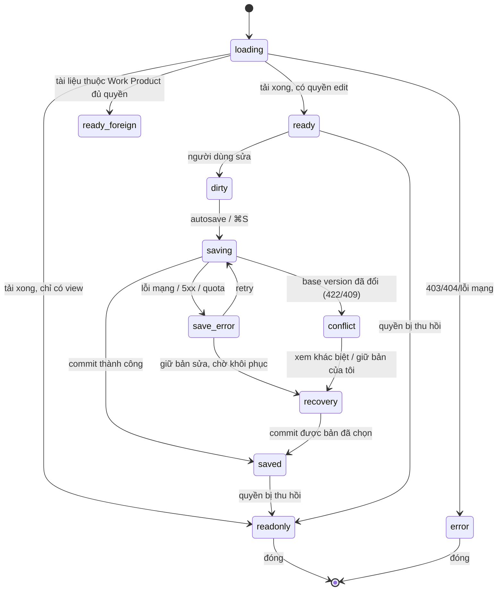

# UniWork — Documents + UniWork Office: yêu cầu frontend cho G0

> **Trạng thái:** in-progress — bản 1a (phạm vi, yêu cầu FE, wireframe/state map,
> brand, phạm vi pilot) viết ngày 2026-09-16 theo spec G0 đã chốt. Chưa triển khai
> UI sản phẩm; bước 1b (ADR thay thế, C-01, roadmap, issue) còn mở.

**Issue:** UNI-665 (DOC-001) · **Parent:** UNI-656 · **Roadmap:** C-01, liên quan C-15/C-16.
**Spec nguồn:** [Documents + Office G0](2026-09-16-documents-office-g0-design.md)
(cùng nằm trên nhánh tài liệu `docs/UNI-656-documents-office-g0-spec`).
**Plan nguồn:** `../plans/2026-09-16-documents-office-g0.md` (Task 1).
**C-01 nền:** [Documents design](2026-09-08-documents-design.md) §1–§13.
**Checklist:** `DOCUMENTS_OFFICE_CHECKLIST.md` tại workspace tổng (UNI-655).

**Giới hạn bằng chứng.** Tài liệu này là thiết kế và yêu cầu; không phải bằng chứng
đã chạy editor. Mọi khả năng đã nêu đều là yêu cầu phải kiểm chứng ở DOC-003/004.
Con số, tên định danh và hợp đồng dữ liệu nào chưa có bằng chứng đều được ghi rõ
"chưa chốt".

---

## 1. Mục tiêu và ranh giới

Chốt hợp đồng phạm vi và UI để G1/G2/G3/G4 có thể bắt đầu: màn hình nào tồn tại,
luồng nào phải chạy, trạng thái nào phải có, và phần nào đổi so với tài liệu đã
duyệt. Bước 1a này **không** dựng UI, không tick checkbox G0, không đổi C-01/roadmap
(đó là 1b sau khi có bằng chứng DOC-003/004/005).

### 1.1 Hiện trạng mã đã kiểm tra (đọc source, không chạy)

Đối chiếu tại `develop` `97b4fa59`. Đây là bằng chứng đọc source để yêu cầu dưới
đây không mô tả thứ đã có sẵn.

| Điều đã có | Vị trí | Ảnh hưởng tới yêu cầu |
| --- | --- | --- |
| TipTap editor dùng chung + preview tệp đính kèm | `packages/views/editor/` (`ContentEditor`, `ReadonlyContent`, `AttachmentPreviewModal`, `useDownloadAttachment`, `FileDropOverlay`) | Tái sử dụng cho trang; editor Office là thành phần **khác**, không nhét vào `ContentEditor` |
| Khung màn hình chung | `packages/views/layout/`: `CollectionPageHeader`, `CollectionPageState`, `BreadcrumbHeader`, `PageHeader`, `PAGE_TOOLBAR`, `PAGE_LEADING_ICON`, `module-tones.ts` | Dùng đúng khung này; không dựng chrome thứ hai |
| Tint module Documents | `MODULE_TONES.documents = "orange"` | Giữ; chỉ là định danh module, không phải màu trạng thái |
| Chưa có mục nav Documents | `packages/views/layout/app-sidebar.tsx` (home/inbox/tasks/my_tasks/projects/meetings/chat/people) | Phải thêm mục, sau feature flag |
| Chưa có khoá i18n `documents.*` / `nav.documents` | `packages/core/i18n/locales/{vi,en}.json` | Phải thêm vi trước en; parity test bắt buộc |
| Chưa có route/builder tài liệu | `packages/core/paths/paths.ts`; `server/internal/service/reserved_slugs.json` thiếu `documents`, `share` | Phải thêm builder + reserved slug trước khi có route |
| Chưa có feature flag `documents` | `server/internal/featureflags/keys.go` | Phải khai báo flag (public) theo C-01 §2 #14 |
| Khả năng nền tảng đã có mô hình | `packages/core/capabilities/` (`WorkManagementCapability`, `capabilityState`) + `packages/ui/components/common/capability-banner.tsx` | Tái dùng cách suy giảm "unknown → unavailable"; mở rộng cho Office theo DOC-004 |

### 1.2 Ranh giới

- **Documents là kho.** Mọi tệp, phiên bản, quyền, nhật ký nằm ở Documents (ADR 0016).
  Web và desktop dùng **cùng** kho, cùng lịch sử; không có kho phiên bản riêng cho Office.
- **UniWork Office là công cụ soạn thảo**, không phải một kho. Nó mở nội dung của
  Document và ghi ngược lại Document qua API Documents.
- **Tài liệu thuộc Work Product** giữ nguyên cơ chế C-01 §13: không đứng trong cây,
  không chia sẻ riêng, mọi màn hình trong tài liệu này phải tôn trọng ủy quyền đó.
- **G0 không dựng UI sản phẩm.** Các đường dẫn dưới đây là **vị trí dự kiến**, chưa
  phải file đã tạo.

---

## 2. Bảng thay thế yêu cầu (1a.1)

Mỗi hàng: một mệnh đề còn hiệu lực trái phạm vi mới → yêu cầu thay thế, nguồn quyết
định, mục tài liệu phải sửa ở 1b, và nhóm nhận triển khai.

| # | Mệnh đề cũ (nguồn) | Yêu cầu mới | Nguồn | Mục tài liệu đổi ở 1b | Nhóm nhận |
| --- | --- | --- | --- | --- | --- |
| R-01 | "Phạm vi đợt này **chỉ DOCX**. XLSX, PPTX, PDF bàn sau" (ADR 0018 §Quyết định 6) | Sáu nhóm lõi DOCX/XLSX/PPTX/PDF/Markdown/HTML đều trong phạm vi; định dạng khác/legacy phải được kiểm kê, không hứa trước khi có bằng chứng | SCOPE-01, Q1-B, checklist §2; DOC-002/003 | ADR thay thế 0018 (1b.1), README ADR, C-01 §1 | G2 (UNI-658), G3 (UNI-659) |
| R-02 | "Trình duyệt không đua sửa DOCX giữ nguyên định dạng… sửa tay định dạng nặng thì mở UniWork Office" (ADR 0018 §Hệ quả) | Web sửa được cả sáu định dạng ở mức ma trận Q1-B; desktop cũng sửa; khác biệt chỉ còn ở nơi chạy engine, không ở "được sửa hay không" | Q1-B; DOC-003/004 | ADR thay thế, C-01 §7, roadmap C-15 | G3, G4 (UNI-636) |
| R-03 | "Preview file/PDF và bình luận còn bị hoãn; giao diện file chủ yếu tải về" (C-01 §1 ngoài phạm vi, §7.1, §12.5) | Preview nằm trong editor cho định dạng đã hỗ trợ; PDF có lớp chữ sửa được nội dung (Q2-A); chỉ-annotation không tính là sửa PDF | Q2-A; checklist DOC-014/DOC-030–038 | C-01 §1, §7.1 `document-file-view`, §12.5 | G3 |
| R-04 | "Bình luận trên tài liệu ở đợt sau, chờ F-05" (C-01 §1, §12.3) | Bình luận lưu thật theo document, có nhắc tên + thông báo, dùng **một** cơ chế bình luận chung với task | Checklist DOC-019; C-01 §12.3 | C-01 §1, §12.3, §7.1 | G1 (UNI-657) |
| R-05 | "C-15: nhập DOCX…; web không làm trình soạn thảo khối" (roadmap C-15) | C-15 mở rộng sang đa định dạng; AI đề xuất có người duyệt theo từng engine; web vẫn có editor chứ không chỉ đọc | Q1-B; checklist DOC-060–063 | Roadmap C-15, ADR thay thế; issue UNI-635 | G6 (UNI-635) |
| R-06 | "C-16: Office Bridge DOCX, lưu ngược thành `document_versions`, 409 khi lệch phiên bản" (roadmap C-16) | C-16 thành hợp đồng đa định dạng cho UniWork Office trên web + desktop, giữ 409/lệch phiên bản nhưng thêm change feed, tombstone, sync | Q5-A, Q7-B; DOC-050–058 | Roadmap C-16; issue UNI-636 | G4 |
| R-07 | C-01 chỉ mô tả `revision_conflict` 422 cho trang; C-16 ghi 409 cho Office, chưa có bảng lỗi chung (§9.2) | Một phân loại xung đột dùng chung cho trang và Office; client xử lý theo **loại lỗi**, không đọc text thông báo; hai mã HTTP có thể giữ để tương thích | Q5-A, Q7-B; spec G0 §9.2 | C-01 §9.2, §5.5 | G1, G5 (UNI-660) |
| R-08 | "Đồng soạn thảo thời gian thực ở lát cắt 3 với Go relay" (C-01 §2 #6, §12.1) | Giữ nguyên cho trang (CRDT page). Cộng tác **nhiều người cùng gõ trong file Office** là lát cắt riêng ADV-001, không suy ra từ sync file | Checklist ADV-001; spec G0 §2 | C-01 §12.1, roadmap ADV-001 | ADV-001 (UNI-662) |
| R-09 | "Trần tệp 50 MiB" và không preview (C-01 §2 #11, §12.7) | 50 MiB là **dải đo ban đầu** của G0, không phải giới hạn sửa của mọi engine; ca biên phải có lỗi rõ và giữ bản gốc/bản sửa | Q9-A | C-01 §12.7, DOC-074 | G1, G7 (UNI-661) |
| R-10 | C-01 §13: tài liệu thuộc Work Product ủy quyền quyền, không chia sẻ riêng | **Giữ nguyên**, không nới. C-15/C-16 tạo bản sao/chuyển đổi cho tài liệu thuộc sở hữu phải qua cơ chế chủ sở hữu, không sinh bản sao có chia sẻ rộng hơn | C-01 §13; ADR 0016 | C-01 §13 (chỉ tham chiếu, không sửa luật) | G1, G6, G4 |

Ghi chú: R-01…R-10 là nội dung 1b sẽ ghi vào C-01/roadmap/ADR. Ở 1a, chúng chỉ là
đầu vào thiết kế; chưa thay thế tài liệu chính thức.

---

## 3. Screen map (1a.2)

Mọi màn hình nằm trong workspace shell hiện có. Cột "Trạng thái" nói màn hình đã
có gì và còn phải làm gì; **không** màn hình nào được dựng ở bước 1a.

### 3.1 Web — Workspace

| Màn hình | Route dự kiến | Nội dung | Trạng thái |
| --- | --- | --- | --- |
| Danh sách tài liệu | `/{org}/{ws}/documents` | `CollectionPageHeader` (icon Documents, tint orange, đếm, nút "Trang mới" + "Tải tệp"); tab Tất cả / Gần đây / Được chia sẻ với tôi / Lưu trữ; cây bên trái + danh sách bên phải | Mới |
| Chi tiết tài liệu (vỏ) | `/{org}/{ws}/documents/{id}` | `BreadcrumbHeader` (cây › tiêu đề) + `PAGE_TOOLBAR`; vùng canvas; panel phải; trạng thái lưu | Mới |
| Editor `page` | trong chi tiết | `ContentEditor` (TipTap) đã có | Tái sử dụng |
| Editor `file` Office | trong chi tiết | UniWork Office canvas theo định dạng; chọn theo khả năng engine | Mới (G3) |
| Thẻ tệp không có engine | trong chi tiết | Icon theo MIME, kích thước, phiên bản, nút Tải về / Tải phiên bản mới, banner "chưa sửa được trong web" | Mới |
| Lịch sử phiên bản | panel phải (sheet/drawer) | Danh sách phiên bản, xem, khôi phục (confirm), đặt tên mốc | Mới |
| Chia sẻ | dialog từ header | Visibility, thêm người/workspace/tổ chức + mức, danh sách share sống + thu hồi, mục Liên kết | Mới |
| Nhật ký truy cập | panel phải | Ai (badge agent/anonymous), hành động, phiên bản, qua đâu, khi nào | Mới |
| Trung tâm đồng bộ | popover từ trạng thái lưu | Thiết bị, lần thành công cuối, hàng đợi, lỗi, retry (G5) | Mới (G5) |
| Trang chia sẻ công khai | `/share/{token}` | Chỉ đọc, không shell, watermark "Chia sẻ bởi {org}", hết hạn → thông báo | Mới |
| Màn chi tiết Kết quả công việc | `/{org}/{ws}/projects/{id}` (C-14) | Danh sách **biểu diễn** của deliverable; mở từng biểu diễn vào editor tương ứng | C-14 sở hữu; tài liệu này chỉ chốt điểm nối |
| Search palette | ⌘K | Nhóm "Tài liệu": gần đây + kết quả theo `q` (debounce 250ms) | Mở rộng file có sẵn |
| Settings tổ chức | `/{org}/{ws}/settings` | Bật/tắt liên kết công khai, hạn mặc định, dung lượng đã dùng/hạn mức (thật) | Mới |

### 3.2 Web — Desktop-only bề mặt (điểm nối, không dựng ở đây)

| Màn hình | Bề mặt | Nội dung |
| --- | --- | --- |
| Thư viện cloud desktop | UniWork Office Home | Danh sách tài liệu từ **cùng** API Documents; mở bằng editor local; ghi ngược thành phiên bản mới |
| Đăng nhập desktop | browser hệ thống | Login UniWork hiện có (MFA, Google), callback về app; xem §7.4 |
| About / Settings desktop | UniWork Office | Tên `UniWork Office`, phiên bản, provenance; xem ma trận brand |

### 3.3 Trạng thái tài liệu → màn hình

`kind` + khả năng engine quyết định màn hình chi tiết hiển thị gì:

| `kind` + khả năng | Bề mặt |
| --- | --- |
| `page` | `ContentEditor` (TipTap) |
| `file`, engine có editor web | UniWork Office canvas theo định dạng |
| `file`, engine chỉ xem được | Trình xem trong app (PDF/ảnh) + banner giới hạn |
| `file`, engine chưa hỗ trợ | Thẻ tệp + tải về; nói rõ vì sao chưa sửa được |
| bất kỳ, `owner_kind = work_product` | Không xuất hiện ở cây/danh sách; chỉ vào từ trang Kết quả công việc |
| bất kỳ, không có quyền `edit` | Chế độ chỉ đọc, toolbar ẩn hành động ghi, banner lý do |

---

## 4. Wireframe và state map của luồng chung (1a.3)

### 4.1 Khung chi tiết tài liệu

```text
┌──────────────────────────────────────────────────────────────────────────────┐
│ PageHeader (h-12, border-b)                                                   │
│  [☰]  Tài liệu › Q3 kế hoạch          [Đã lưu 10:32] [Chia sẻ] [⋯]          │
├──────────────────────────────────────────────────────────────────────────────┤
│ PAGE_TOOLBAR (h-12, border-b)   ← chỉ khi có editor đang hoạt động            │
│  [chọn editor] [B I U ▾] [căn lề ▾] [bảng ▾] …   [⌘S mốc] [◱ toàn màn hình] │
├───────────────────────────────┬──────────────────────────────────────────────┤
│ Cây tài liệu (xl+)            │ Canvas                                        │
│ hoặc sheet dưới xl            │  • page: ContentEditor                        │
│  ▸ Q3 kế hoạch                │  • file Office: UniWork Office canvas         │
│    ▸ Biên bản                 │  • file không editor: thẻ tệp                 │
│                               │                                              │
├───────────────────────────────┴──────────────────────────────────────────────┤
│ Panel phải (tùy chọn: Phiên bản | Nhật ký | Bình luận | Sync)                 │
└──────────────────────────────────────────────────────────────────────────────┘
```

Quy tắc bắt buộc của khung:

- **Breadcrumb luôn là chuỗi chứa**: mỗi tổ tiên là link (`BreadcrumbHeader` đã
  làm đúng); leaf không click. Tài liệu thuộc Work Product: breadcrumb là
  `Kết quả công việc › {tên} › {định dạng}`, **không** có mắt xích cây tài liệu.
- **Toolbar là của editor đang hoạt động**, không phải của tài liệu. Đổi editor thì
  đổi nội dung toolbar; không hiển thị nút engine không hỗ trợ.
- **Trạng thái lưu nằm ở header**, một chỗ duy nhất, cùng chỗ với bất kỳ tài liệu nào.
- **Canvas là vùng dữ liệu**: màu/font **bên trong file** không đổi theo theme
  chrome. Theme chỉ áp cho khung, toolbar, panel (spec §2.1).
- Panel phải là **một** panel đổi nội dung, không mở nhiều panel chồng nhau.

### 4.2 State map — trạng thái bắt buộc



| Trạng thái | Người dùng thấy | Hành động cho phép | Ghi chú |
| --- | --- | --- | --- |
| `loading` | Skeleton đúng khung (≤500ms có cảm giác tải); không spinner toàn màn hình | Điều hướng cây | PRODUCT: spinner là trạng thái lỗi |
| `ready` | Không có chỉ báo lưu (đã sạch) | Sửa, chia sẻ, phiên bản, tải | Không hiện "Đã lưu" khi chưa từng sửa |
| `dirty` | "Chưa lưu" nhạt | Sửa, ⌘S | Không chặn điều hướng rời trang ngầm |
| `saving` | "Đang lưu…" | Sửa tiếp | Autosave debounce, không ghi mỗi phím |
| `saved` | "Đã lưu HH:mm" | Tất cả | Mốc chỉ tạo khi người dùng đặt tên / khôi phục / sau 10 phút yên |
| `save_error` | Câu nói rõ **không** lưu được + nút Thử lại | Thử lại, xem nháp, sao chép nội dung | Không bao giờ báo "đã lưu" |
| `conflict` | Dialog "Người khác vừa lưu" với hai lựa chọn | Giữ bản của tôi thành phiên bản mới, hoặc nạp bản mới | Xem §6.3 |
| `readonly` | Banner lý do (`CapabilityBanner` cho quyền; banner riêng cho engine/khả năng) | Xem, tải, chia sẻ nếu có `manage` | Không ẩn nội dung |
| `recovery` | "Còn thay đổi chưa gửi từ {thời điểm}" | Khôi phục, bỏ nháp | Q8-A: nháp bảo vệ theo tài khoản |
| `error` | `CollectionPageState` (role=alert) + việc tiếp theo | Quay lại danh sách, thử lại | 403/404 không lộ tồn tại id |

**Bắt buộc trên mọi trạng thái:** thao tác bàn phím (`⌘S` tạo mốc, `⌘⇧H` lịch sử,
`/` menu block, `@` mention, Tab đi hết dialog), focus ring luôn hiển thị, tương
phản AA ở cả hai theme, responsive tới ≥ 360px (cây thu vào sheet; toolbar ≥44px
chạm), và vi/en đủ khoá.

---

## 5. Yêu cầu FE theo bề mặt (1a.2)

### 5.1 Thư viện và cây tài liệu

- Cây 5 cấp bằng `parent_id`, kéo thả đổi cha, bàn phím ←→↑↓, chặn vòng lặp.
- Danh sách lọc theo tab; tìm theo tên; lọc loại/ngày; phân trang; **chỉ trả kết quả
  được phép đọc**.
- Tài liệu `owner_id IS NOT NULL` **không** xuất hiện ở cây, danh sách, "gần đây",
  sidebar (C-01 §13.5). Tìm nội dung của biểu diễn trả về **Kết quả công việc**, không
  trả tài liệu trần.
- Empty state thật, hai nút (tạo trang / tải tệp), không dữ liệu giả, không số dung
  lượng giả.
- Không có màn hình nào hiển thị tài liệu mà người dùng không có quyền đọc, kể cả
  qua đếm hay gợi ý gần đây.

### 5.2 Tạo và tải lên

- "Trang mới" tạo `kind = page` rồi mở thẳng editor; không tạo hai bước thừa.
- "Tải tệp" nhận cả sáu nhóm lõi + định dạng khác; sau upload mới đối chiếu khả
  năng engine và hiển thị bề mặt đúng (§3.3).
- Kiểm ở server (không tin client); quota `storage.bytes` báo lỗi rõ, không cắt im lặng.
- Upload lỗi giữa chừng: nói phần nào chưa lên, cho thử lại; không tạo tài liệu ma.

### 5.3 Vỏ chi tiết và chọn editor theo khả năng

- Chọn editor theo (`kind`, MIME, extension, khả năng engine đã kiểm kê ở DOC-002).
- Khả năng chưa có bằng chứng → UI **không** hứa; dùng ngôn ngữ "chưa sửa được trong
  web" + đường tải về, và ghi lý do ổn định cho telemetry.
- Ánh xạ khả năng dùng lại mô hình `capabilityState` (suy giảm an toàn
  `unknown → unavailable`), không tự bịa trạng thái "available".
- Mở file lớn: có tiến trình đo được; huỷ được; huỷ không tạo phiên bản.

### 5.4 Tab / toàn màn hình / rời trang

- Tab: mở nhiều tài liệu trong workspace; tab giữ trạng thái lưu riêng; đóng tab có
  thay đổi chưa lưu thì hỏi.
- Toàn màn hình: ẩn sidebar và panel, giữ header tối thiểu (breadcrumb + trạng thái
  lưu + lối thoát). Thoát bằng Esc.
- Điều hướng đi: autosave đã debounce; `beforeunload` + `keepalive` cho lần rời cuối
  (đúng như C-01 §7.3); nếu không kịp gửi thì vào nháp Q8, không mất chữ.

### 5.5 Chuyển web ↔ desktop

- **Cùng tài khoản, cùng tài liệu, cùng lịch sử phiên bản.** Desktop mở bằng deep link
  `{scheme}://document/{id}` (giá trị cụ thể chốt ở DOC-004/005).
- Web có nút "Mở bằng UniWork Office" khi client đã cài; nếu chưa cài, hiện cách cài
  chứ không chết lặng.
- Desktop có nút "Mở trên web" cho tài liệu cùng quyền.
- Nếu tài liệu đã đổi giữa hai nơi: bên mở sau nhận **conflict**, không ghi đè (§6.3).
- Chuyển nơi mở **không** tạo phiên bản chỉ vì đổi thiết bị.

### 5.6 Thư viện cloud desktop

- Danh sách lấy từ API Documents (không có kho riêng), phân trang theo change cursor.
- Chọn tài liệu tải về để dùng offline thuộc G5; pilot chỉ online (Q5-A).
- Đăng xuất ở desktop thu hồi phiên, ẩn nháp trong app, tài khoản khác không thấy nháp.

### 5.7 Chia sẻ, phiên bản, nhật ký

- Ba mức `view`/`edit`/`manage`; mức không có hành vi thì không hiện.
- Danh sách share là **danh sách quyền thật đang có** (không suy diễn, không ước lượng).
- Khôi phục phiên bản **không** xóa lịch sử: tạo phiên bản mới; confirm trước khi khôi phục.
- Tài liệu thuộc Work Product: ẩn chia sẻ/liên kết công khai; nếu người dùng cố vào
  bằng URL cũ, trả 409 `document_owned_by_work_product` và UI giải thích quyền theo
  Kết quả công việc.

### 5.8 Trạng thái lưu và sync (bề mặt)

- Một chỗ hiển thị trạng thái cho tất cả editor, kể cả Office.
- Trung tâm sync (G5) đọc được: thiết bị, lần thành công cuối, hàng đợi, lỗi, retry;
  chưa làm ở pilot nhưng UI đã có chỗ và không hứa tính năng.

---

## 6. Flow chi tiết (1a.2)

Ba flow dưới đây bắt buộc có **từng bước**, quyền, nút hành động, đường hủy, lỗi và
kết quả dữ liệu — không chỉ tên màn hình.

### 6.1 Q7-B — File vượt khả năng bảo toàn

**Kích hoạt:** engine mở được file nhưng thao tác sửa/lưu có thể mất thành phần hoặc
đổi bố cục (kết quả ma trận DOC-002/003).

1. Trước khi vào chế độ sửa, UI hiện hộp thoại: **thành phần nào có thể đổi/mất**,
   định dạng đích, và việc sẽ tạo **bản sao** (Document mới) chứ không sửa bản gốc.
2. Người dùng chọn:
   - **Tiếp tục xem/tải bản gốc** → không tạo gì; quay lại chế độ chỉ đọc/tải.
   - **Tạo bản sao để sửa** → chạy luồng chuyển đổi.
   - **Hủy** → không tạo gì; giữ nguyên.
3. Khi tạo bản sao: kiểm quyền đọc nguồn **và** quyền tạo kết quả. Tài liệu thuộc
   Work Product tạo qua cơ chế chủ sở hữu (§6.4), không sinh bản sao có chia sẻ rộng hơn.
4. Bản sao là **Document riêng**, có liên kết nguồn: document nguồn, phiên bản nguồn,
   engine/phiên bản engine đã chuyển đổi — kể cả khi cùng phần mở rộng.
5. Chỉ **mở bản sao để sửa sau khi tạo thành công**. Thất bại: hiện lỗi thật, **không**
   đổi bản hiện hành hoặc lịch sử của nguồn.
6. Không tự chuyển đổi khi mở file hoặc trong autosave. Không dùng một cảnh báo chung
   để cho phép lưu một file đã hỏng.

**Kết quả dữ liệu:** nguồn bất biến; bản sao có id, nguồn gốc, quyền riêng. Không có
đường nào để bản sao có quyền rộng hơn nguồn.

### 6.2 Q8-A — Logout khi còn bản sửa chưa sync

1. Người dùng đăng xuất hoặc đổi tài khoản khi autosave đang lỗi / chưa gửi được.
2. Hệ thống **cho đăng xuất**; thu hồi phiên; **không** xóa bản nháp.
3. Nháp được bảo vệ theo (account, organization, workspace, document, base version)
   bằng bộ nhớ bền phù hợp host; ẩn khỏi UI ở trạng thái đăng xuất.
4. Tài khoản khác **không** thấy, không gửi, không mở được nháp đó.
5. Đăng nhập lại **đúng tài khoản**: trước khi mở lại/gửi, kiểm quyền hiện tại, trạng
   thái tài liệu và base version.
   - Còn quyền, base chưa đổi → mở nháp trong app với hành động Khôi phục / Bỏ nháp.
   - Bị thu quyền → **khóa thao tác** trong app; không tự export, nhân bản hay upload
     sang workspace khác.
   - Base đã đổi → giữ **cả hai** bản, đi qua conflict (§6.3).
6. Chỉ dọn nháp sau khi server **xác nhận đã lưu**, hoặc người dùng **chủ động** xác
   nhận bỏ nháp. Không dọn theo thời gian chưa chốt.
7. Dọn cache có thể tải lại **không** được xóa dữ liệu nền/asset cần để phục hồi nháp.

**Phạm vi:** phục hồi **sau lỗi lưu / logout** thuộc pilot. Thư viện offline và hàng
đợi đồng bộ đầy đủ vẫn ở G5 trước M2 (Q5-A). Đây **không** phải offline web.

### 6.3 Xung đột phiên bản

1. Lúc commit, server phát hiện base version cũ → không ghi đè im lặng.
2. UI mở dialog "Người khác vừa lưu", hiển thị hai lựa chọn:
   - **Giữ bản của tôi** → lưu thành phiên bản mới có tác giả là tôi (nhãn "Bản của
     tôi lúc HH:mm" nếu cần), rồi nạp bản mới nhất của server.
   - **Nạp bản mới** → bỏ thay đổi cục bộ **sau khi** đã cảnh báo rõ; không xóa ngầm.
   - Khi engine hỗ trợ xem khác biệt → có thêm lối xem khác biệt.
3. Không tự merge nhị phân khi chưa có bằng chứng đúng (spec §9.2).
4. Khi không hỗ trợ xem khác biệt: giữ **bản xung đột có nguồn gốc rõ** (không mất dữ
   liệu), UI nói rõ bản nào là bản nào.
5. **Phân loại lỗi dùng chung** cho trang và Office: client quyết định theo **loại**
   (`revision_conflict` / `stale_base`), không đọc text; hai mã HTTP (C-01 422, C-16
   409) có thể giữ để tương thích (R-07).
6. Hết phiên / thu quyền / hết quota **không** được báo "đã lưu"; giữ bản sửa chưa gửi
   theo Q8-A.

### 6.4 Tài liệu thuộc Work Product (điểm nối, không đổi luật)

- Chỉ vào từ trang Kết quả công việc, dưới dạng danh sách **biểu diễn**.
- Mọi hành động trên biểu diễn đi qua quyền của Kết quả công việc; tài liệu này chỉ
  nêu yêu cầu UI, không định nghĩa lại cơ chế (C-01 §13).
- Tạo biểu diễn mới (bản sao Q7, import, chuyển đổi) phải nằm trong cùng luồng nghiệp
  vụ của chủ sở hữu; không tạo tài liệu tự do rồi gắn sau.

---

## 7. Khác biệt cần thiết giữa sáu editor (1a.3)

Phần chung đã chốt ở §4. Dưới đây chỉ ghi phần **khác** phải có, và điều phải giữ
giống. Cột "Bằng chứng cần" nối sang DOC-003.

| Định dạng | Toolbar/canvas khác | Trạng thái riêng | Bằng chứng cần (DOC-003) |
| --- | --- | --- | --- |
| DOCX | Trang theo trang (page canvas), đầu/chân trang, bảng; ruler tùy chọn | Cảnh báo thành phần chưa bảo toàn (VML, metafile, field) | Sửa đoạn/bảng/ảnh; phần không sửa + đầu/chân trang/font đối chiếu sau mở lại |
| XLSX | Lưới ô, thanh công thức, sheet tab, vùng chọn | Tính lại công thức: hiển thị kết quả expected, thiếu recalculation là blocker | Sửa ô, công thức liên sheet đúng sau mở lại; giữ sheet/định dạng |
| PPTX | Slide canvas, panel slide, hình/shape, trình chiếu | Cảnh báo bố cục/đối tượng có thể đổi | Sửa chữ/ảnh/shape, mở lại/trình chiếu, so bố cục |
| PDF | Trang, lớp chữ, thao tác trang | **Chỉ sửa nội dung có lớp chữ** (Q2-A); scan = xem/quản lý, OCR ở mốc sau | Thay chữ/ảnh có sẵn trong nội dung; extraction/render chứng minh; annotation **không** đủ |
| Markdown | Source ⇄ preview, bảng/code/Unicode | Asset và liên kết tương đối phải còn dùng được | Source đúng sau save; preview cách ly |
| HTML | Source ⇄ preview cách ly | Preview **không** đọc được phiên app và không thoát origin | Source/asset đúng; kiểm cách ly script |

**Phải giống nhau ở cả sáu:** một vị trí trạng thái lưu, một ngữ nghĩa conflict, một
đường tải về, một panel phiên bản/nhật ký, một bộ phím tắt cơ bản, và cùng bộ lối
vào từ Documents. Sáu editor khác nhau ở nội dung canvas, không khác ở chrome.

---

## 8. Brand UniWork Office — phần frontend (1a.5)

Ma trận đầy đủ (gồm desktop packaging, identity, update) ở
[`docs/office/g0/uniwork-office-integration-brand.md`](../../office/g0/uniwork-office-integration-brand.md).
Phần FE chốt ở đây:

- **Tên hiển thị:** `UniWork Office`. **Slug kỹ thuật:** `uniwork-office`. `GenOffice`
  chỉ còn là tên nguồn upstream trong provenance/LICENSE/NOTICE và metadata kỹ thuật.
- **Trên web:** Documents là mục nav riêng; khi mở file Office, tiêu đề vùng soạn thảo
  ghi rõ đang mở bằng UniWork Office; About/phiên bản (nếu có trên web) dùng tên này.
- **i18n:** thêm khoá cho tên hiển thị; giữ `UniWork` và `UniWork Office` **không dịch**
  (như `UniWork`, `UNICOM` trong `docs/conventions.md` §2). vi trước en, parity test bắt buộc.
- **Trạng thái:** dùng `tint-orange` cho Documents (đã có trong `module-tones.ts`); trạng
  thái lỗi/lưu dùng **signal** token, không dùng tint.
- **Không đổi nội dung file:** theme chrome không đổi màu/font/logo bên trong tài liệu
  người dùng; đây là yêu cầu có phép kiểm, không phải khuyến nghị.
- **Attribution:** giữ LICENSE/NOTICE và dòng provenance; không thay chuỗi hàng loạt
  trong license, tài liệu người dùng hoặc metadata tác giả.

Các mục cần tên/định danh cụ thể (app id, scheme, update feed, keychain namespace)
thuộc DOC-004/005 và task 2 (inventory) — tài liệu này không tự chốt giá trị.

---

## 9. Phạm vi pilot và ADR draft (1a.4)

### 9.1 Điều kiện pilot (theo quyết định đã chốt)

| Điều kiện | Nội dung | Nguồn |
| --- | --- | --- |
| Q1-B | Toàn bộ khả năng GenOffice đã kiểm kê/xác minh phải có trên **web và desktop**; sáu chu trình cơ bản chỉ là mức tối thiểu | Q1-B |
| Q2-A | PDF sửa nội dung có lớp chữ; OCR scan ở mốc sau (ngoại lệ của Q1-B) | Q2-A |
| Q3-B | Windows/macOS + Chrome/Edge/Safari. **QA-01:** kiểm Mac thật ở backlog UNI-671; Windows và WebKit **không** thay Safari | Q3-B, QA-01 |
| Q4-A | Engine ở browser/worker hoặc hạ tầng nội bộ; không gửi file cho nhà cung cấp Office/OCR ngoài | Q4-A |
| Q5-A | Pilot sync **online**; thư viện offline + hàng đợi đầy đủ ở G5 trước M2 | Q5-A |
| Q6 | Nhóm tự xây bộ mẫu bao phủ; mẫu doanh nghiệp là bổ sung | Q6 |
| Q7-B | Chuyển đổi mất mát → cảnh báo + tạo bản sao chủ động; giữ bản gốc/lịch sử/quyền | Q7-B |
| Q8-A | Giữ nháp chưa sync theo tài khoản sau logout; khôi phục cần đúng tài khoản/quyền/base | Q8-A |
| Q9-A | Dải đo ban đầu chủ yếu dưới 50 MiB/file; không tự đổi trần/quota | Q9-A |

### 9.2 ADR draft (không đóng dấu accepted)

Đề xuất thay thế ADR 0018 nằm ở
[`docs/adr/drafts/documents-office-runtime.md`](../../adr/drafts/documents-office-runtime.md),
trạng thái `proposed`. Nó dùng INT-01 làm **hướng thử**, ghi rõ runtime còn chờ bằng
chứng DOC-003/004. Bước **1b.1** mới lấy số ADR trống, đổi 0018 thành
`superseded by NNNN` khi quyết định được chấp nhận, và thêm chỉ mục.

Ở 1a này **không** sửa ADR 0018 và **không** sửa chỉ mục ADR.

---

## 10. Phép kiểm cho giai đoạn này (1a)

1a là tài liệu, nên phép kiểm là **tính nhất quán của tài liệu**, không phải test UI runtime.

| Kiểm | Cách làm | Trạng thái |
| --- | --- | --- |
| Không còn mệnh đề cũ có hiệu lực trái phạm vi mới | §2 phủ ADR 0018, C-01 §1/§7/§12, roadmap C-15/C-16, §13 | Đạt ở mức tài liệu 1a |
| Mỗi màn/flow có nguồn yêu cầu và nơi thực thi | §3 cột "Trạng thái", §5, §6 nêu nhóm nhận | Đạt ở mức tài liệu 1a |
| Đường chia sẻ/phục hồi không vượt quyền | §5.7, §6.1 bước 3, §6.2 bước 5, §6.4 | Đạt ở mức tài liệu 1a |
| BRAND-01 có ma trận riêng, gồm desktop packaging | File brand riêng, cột owner + phép kiểm | Đạt ở mức tài liệu 1a |
| Link/ADR number/status/plan status | `node --test scripts/governance.test.mjs` | Chạy khi mở PR 1a |
| Checklist workspace không bị tick trước | Không sửa `DOCUMENTS_OFFICE_CHECKLIST.md` ở 1a | Đạt |

**Không đòi:** test UI runtime cho wireframe chưa có code; bằng chứng chạy editor; tick
DOC-001..006.

---

## 11. Trạng thái bàn giao 1a

Đã viết: bảng thay thế yêu cầu (1a.1), screen map + yêu cầu FE theo bề mặt (1a.2),
wireframe/state map + khác biệt sáu editor (1a.3), phạm vi pilot + ADR draft (1a.4),
brand FE (1a.5). Chưa làm, thuộc 1b và các task khác: ADR thay thế chính thức +
`docs/adr/README.md`, sửa C-01/roadmap, đồng bộ issue UNI-635/UNI-636, và mọi
bằng chứng runtime. DOC-001 chỉ đóng khi 1b xong.
