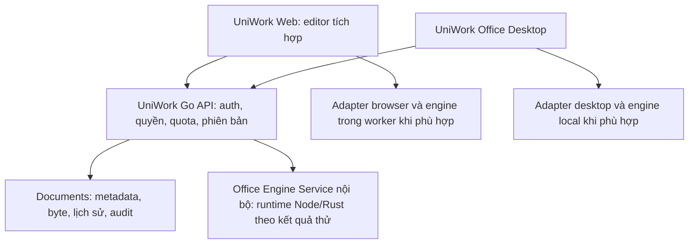

# UniWork — G0: đặc tả kiến trúc Documents và UniWork Office đa định dạng

> **Trạng thái:** Phạm vi đã chốt để lập plan (2026-09-16). Người dùng yêu cầu
> chuyển sang plan theo spec đã chốt; lựa chọn runtime/protocol và ngưỡng đo còn
> được kiểm chứng trong G0, chưa phải kết quả triển khai.
> **Issue:** UNI-656 · Parent UNI-437 · Roadmap C-01, liên quan C-15/C-16.
> **Phạm vi đã xác nhận:** task 1 là toàn bộ G0, DOC-001 đến DOC-006.
> **Giới hạn bằng chứng:** bản này là spec và kế hoạch thử nghiệm; chưa chạy editor,
> đo hiệu năng hoặc chứng minh đồng bộ. Viết spec không hoàn tất các checkbox G0.

## 1. Kết quả cần đạt

G0 phải trả lời bằng thiết kế và bằng chứng: sáu nhóm DOCX, XLSX, PPTX, PDF,
Markdown và HTML có thể được mở, sửa, lưu và mở lại bằng editor trên browser
đến mức nào; web, server và UniWork Office desktop chia trách nhiệm ra sao;
đăng nhập và sync dùng cùng kho Documents như thế nào; phần nào đủ điều kiện
đưa vào pilot, với công sức và phụ thuộc cụ thể.

Đầu ra gồm bộ quyết định phạm vi, ma trận năng lực, báo cáo thử nghiệm có thể
tái lập, hợp đồng engine/storage/auth/sync và kế hoạch pilot được ước lượng lại.
Các spike là mã thử nghiệm có giới hạn; chúng không thay thế G1-G7 hoặc chứng
minh tính năng đã sẵn sàng phát hành.

Nguồn yêu cầu là `DOCUMENTS_OFFICE_CHECKLIST.md` ở workspace tổng, lập dưới
UNI-655. Người dùng xác nhận toàn bộ G0 trong cuộc trao đổi ngày 2026-09-16.
Coordinator xác nhận tái sử dụng UNI-656 cho việc hỏi yêu cầu và soạn spec;
bình luận bằng chứng `0eefd9f7-71f3-467d-9fa5-fe4b66248d91`.

## 2. Những yêu cầu đã có, không cần hỏi lại

- Sáu nhóm định dạng đều nằm trong phạm vi sản phẩm, có editor trực tiếp trên web.
  Định dạng bổ sung và legacy phải được kiểm kê; không suy ra khả năng sửa từ
  việc hệ điều hành hoặc upstream mở được file.
- Documents sở hữu định danh, file, phiên bản, quyền và nhật ký. Web và desktop
  lưu cùng một tài liệu vào cùng một lịch sử; không có kho phiên bản riêng cho Office.
- Work Product tham chiếu Document. Tài liệu thuộc Work Product dùng quyền ủy quyền
  của C-01 §13; không có đường chia sẻ, công khai hoặc vòng đời riêng để đi vòng quyền.
- UniWork Office dùng danh tính UniWork, có đồng bộ hai chiều và bảo toàn thay đổi
  khi gặp xung đột. Đồng bộ file không đồng nghĩa nhiều người cùng gõ trực tiếp.
- AI đề xuất, người duyệt, service thực thi theo quyền; runtime AI không ghi thẳng
  bảng nghiệp vụ. G0 không triển khai bộ tính năng AI của G6.
- File gốc được giữ; khôi phục tạo phiên bản mới; không âm thầm ghi đè bản mới hơn,
  làm mất thành phần chưa hỗ trợ, hoặc thay file gốc bằng bản chuyển đổi.
- Multica là nguồn tái sử dụng chính; GenOffice cung cấp engine/editor; UniDigital
  là nguồn đối chiếu nghiệp vụ. Những phần UniWork đã có phải được kiểm tra trước khi port.

### 2.1 Tích hợp GenOffice và thương hiệu UniWork Office

Người dùng xác nhận và chỉnh cách viết ngày 2026-09-16: GenOffice phải được tích
hợp vào UniWork, tên hiển thị là **UniWork Office**, tên kỹ thuật/slug là **`uniwork-office`**.
GenOffice là tên nguồn upstream; UniWork Office là tên bộ công cụ Office của UniWork trên web và
desktop. Web mở editor trong luồng Documents; desktop dùng tài khoản UniWork,
cùng API, quyền, phiên bản và audit. Việc mở một ứng dụng GenOffice độc lập chưa
đáp ứng yêu cầu tích hợp.

DOC-001 lập requirement thương hiệu cùng requirement FE, dùng token, typography,
shadcn/Base UI của UniWork. Bao phủ tên hiển thị, logo/icon/favicon, menu/title,
màn hình khởi động, About/Settings, thông báo và bản dịch; desktop thêm tên ứng
dụng/bộ cài, shortcut và file association. DOC-002 kiểm kê từng vị trí source,
asset và metadata đang dùng GenOffice/Genspark để đưa vào kế hoạch chuyển đổi.

DOC-004/005 chốt product/app identity, deep link/callback, đường dẫn dữ liệu và
kênh cập nhật của UniWork Office: không dùng identity hoặc update feed upstream gây
ghi đè bản GenOffice đang cài, mất nháp, hoặc nhận lại binary mang brand cũ.
App/bundle ID, scheme và đường dẫn cụ thể dùng tên `uniwork-office` theo quy ước
UniWork sau khảo sát; không tự suy ra tên miền hoặc publisher đã được cấp.
Tên brand đã chốt không phải câu hỏi cần hỏi lại. Các đường tích hợp AI,
telemetry, trợ giúp và liên kết ra ngoài được kiểm kê, cấu hình theo chính sách
UniWork đã chốt.

Giữ LICENSE/NOTICE, attribution bắt buộc và provenance upstream. Tên gói/import
nội bộ có thể giữ nếu cần truy vết/nâng cấp và không hiện thành brand sản phẩm;
không thay chuỗi hàng loạt trong license, tài liệu người dùng hoặc metadata tác
giả. Theme và rebrand chỉ tác động phần giao diện ứng dụng, không đổi màu, font,
logo hay nội dung bên trong file người dùng.

G0 bàn giao ma trận đổi brand với vị trí hiện tại, đích mới, nhóm phụ trách và
cách kiểm. G2/G3/G4/G7 thực thi theo phần việc; pilot phải kiểm cả luồng Documents
web và UniWork Office desktop, bộ cài, mở file/deep link, About và update. Mọi brand
upstream còn xuất hiện ngoài attribution/nguồn được phép đều phải được xử lý;
scan chuỗi phải đi cùng kiểm UI/bộ cài thật, không chỉ tìm không thấy chữ cũ.

## 3. Hiện trạng và mâu thuẫn phải xử lý

Đối chiếu tài liệu/source tại checkout UniWork `97b4fa59`; đây là bằng chứng
đọc source, không phải kết quả chạy thực tế.

| Nguồn | Điều quan sát được | Việc G0 phải làm |
| --- | --- | --- |
| [ADR 0018](../../adr/0018-engine-office-chay-o-sidecar-node.md) | Chỉ DOCX; sidecar Node; sửa định dạng nặng ở desktop | Gỡ giới hạn phạm vi theo yêu cầu mới; phân công runtime theo từng engine sau thử nghiệm |
| [C-01](2026-09-08-documents-design.md) §1, §7.1, §12 | Preview file/PDF và bình luận còn bị hoãn; giao diện file chủ yếu tải về | Đối chiếu DOC-019, DOC-030..038; phân kỳ mới phải nói rõ nội dung thay thế và nội dung giữ lại |
| [C-01](2026-09-08-documents-design.md) §2, §3, §13 | Có thiết kế page/file, phiên bản và ủy quyền Work Product | Kế thừa thiết kế; không suy ra schema/service tương ứng đã triển khai |
| [Roadmap](../../roadmap/FEATURE_ROADMAP.md) C-15/C-16 và mục hoãn | C-15 còn DOCX-only; C-16 chủ yếu Office Bridge; các engine khác còn ở danh sách hoãn | Cập nhật đồng bộ với phạm vi chính thức của UNI-635/UNI-636 qua coordinator |
| `server/internal/handler/router/auth.go` | Có login, MFA, refresh/logout và Google callback cho web | Chưa có bằng chứng từ file này về luồng cấp phiên desktop; phải khảo sát và thiết kế thêm |
| `../unidigiwork/src/lib/api/office-genoffice.server.ts` | Engine DOCX nhúng ghi commit `d24c964a3e693a52d9fece4fef03a4de34d0d853` | Không dùng kết quả bản cũ để chứng nhận một commit khác |
| Checklist PRE-03 | Upstream khảo sát là `a4d8e1a0a3a232685e8f430339b58ea153467ad1`; Sheets có native Rust | Pin một nguồn thử nghiệm; xác nhận chênh lệch phiên bản, đường chạy browser và giấy phép |
| Checkout GenOffice người dùng cung cấp ngày 2026-09-16 | `D:/.Vietants_Project/uniwork-workspace/genoffice`, HEAD `09485f884dc845cf3bf27fb7edfe489f9d457aad`, worktree sạch lúc đọc; có lockfile nhưng chưa có `node_modules` | Dùng làm đầu vào khảo sát; kiểm license/dependency, so với nguồn cũ rồi pin ở DOC-002. Chưa xác nhận build hoặc runtime |

Cùng một họ engine không bảo đảm web và desktop render giống nhau: phiên bản,
font, runtime, bộ giải mã ảnh và adapter đều phải ghi trong kết quả thử.

Theo `docs/adr/README.md`, ADR đã accepted giữ nội dung lịch sử. DOC-001 chuẩn
bị ADR thay thế, lấy số trống khi thực thi và đổi trạng thái 0018 thành
`superseded by NNNN` khi quyết định mới được chấp nhận. Không viết đè ADR 0018
để làm như phạm vi cũ chưa từng tồn tại. Kết luận runtime từ DOC-004 quay lại
hoàn thiện quyết định này trước khi đóng DOC-001.

## 4. Câu hỏi và kết quả làm rõ

Đã chốt **Q1-B, Q2-A, Q3-B, Q4-A, Q5-A, Q7-B, Q8-A, Q9-A**. Q6 được làm rõ thành yêu cầu về
bao phủ kiểm thử; việc xây bộ mẫu thuộc trách nhiệm triển khai, không yêu cầu
người dùng chọn một tập file nhỏ để giới hạn sản phẩm. Kết quả ghi ở §5;
những chi tiết kỹ thuật còn đề xuất phải được thử và review trước cam kết pilot.

### Q1. Ngưỡng tính năng của pilot

**Cần quyết:** bản đầu dùng thử phải sửa đến đâu trên cả sáu định dạng.

- **A — Bộ thao tác cơ bản được kiểm chứng kỹ, đề xuất.** Cả sáu đều mở → sửa → lưu
  → mở lại trên web. DOCX có chữ/bảng/ảnh; XLSX nhiều sheet và công thức cơ bản;
  PPTX chữ/ảnh/shape; PDF sửa nội dung trong giới hạn đã kiểm; Markdown/HTML có
  nội dung và asset. Công thức cụ thể, thao tác cụ thể và giới hạn nằm trong ma trận.
  Tính năng nâng cao vẫn có trong phạm vi đầy đủ, nhưng không mặc định chặn pilot.
- **B — Các khả năng upstream đã hỗ trợ và đã kiểm kê.** Pilot chỉ đạt khi toàn bộ
  tập thao tác GenOffice thực sự hỗ trợ trong ma trận đã có trên cả web và desktop.
  Khối lượng port lớn hơn; không hứa tương đương Microsoft Office hoặc đoán lịch
  trước thử nghiệm.

**Ảnh hưởng:** số dòng phải đạt trong ma trận, bộ fixture và mốc M1. Cả hai phương
án đều giữ sáu nhóm lõi, không biến pilot thành DOCX-only.

**Đã chốt ngày 2026-09-16: B.** Pilot phải có toàn bộ khả năng GenOffice được kiểm
kê và xác minh trên cả web và desktop trong các nền tảng được chọn. Chu trình cơ
bản sáu loại chỉ là mức chứng minh tối thiểu của G0, không đủ để nghiệm thu pilot.

### Q2. PDF có chữ và PDF scan

**Cần quyết:** PDF scan có bắt buộc sửa được trong pilot hay chưa.

- **A — PDF có lớp chữ, đề xuất.** Sửa chữ/ảnh và thao tác trang trong khả năng được
  kiểm; PDF scan được xem, lưu và tải, OCR ở mốc sau. Chỉ thêm ghi chú chưa đủ để
  nghiệm thu yêu cầu sửa nội dung PDF.
- **B — Thêm OCR cho scan.** Nhận diện tiếng Việt để tìm kiếm, sao chép hoặc tạo bản
  có chữ sửa được. Chuyển đổi có thể làm đổi bố cục; giữ bản scan gốc và ghi nguồn
  của bản phát sinh. Phải quyết ngưỡng chính xác trên bộ mẫu trước nghiệm thu.
- **C — OCR và tái tạo bố cục.** Bao gồm B, đồng thời cần giữ bảng, cột, ảnh và vị trí
  gần bản scan. Phải thử engine và chốt sai số được chấp nhận; không mặc định
  GenOffice đã đáp ứng. Đây là phương án có công kiểm chứng cao nhất.

**Ảnh hưởng:** dịch vụ OCR, font, tài nguyên, license, dữ liệu thử và estimate PDF.

**Đã chốt ngày 2026-09-16: A.** Pilot sửa PDF có lớp chữ, chữ/ảnh và thao tác trang
theo engine được kiểm; scan chỉ xem/quản lý, OCR ở mốc sau. Đây là ngoại lệ được
chốt cho ngưỡng Q1-B: nếu upstream có OCR thì vẫn kiểm kê và giữ trong phạm vi mốc
sau, không coi OCR là điều kiện pilot. Chỉ annotation không đủ nghiệm thu PDF.

### Q3. Nền tảng bắt buộc ở pilot

- **A — Windows + Chrome/Edge trên máy tính, đề xuất.** Mobile web kiểm xem/tải và
  điều hướng. macOS/Linux, Safari/Firefox chưa được chứng nhận pilot; còn trong
  kế hoạch khảo sát/phát hành tiếp theo.
- **B — Windows/macOS + Chrome/Edge/Safari.** Thêm kiểm font, đóng gói, đăng nhập,
  deep link và sync trên macOS; kiểm các tổ hợp browser/OS có công bố hỗ trợ.
- **C — Windows/macOS/Linux + Chrome/Edge/Firefox/Safari.** Phát hành rộng ngay
  pilot; cần đủ môi trường, người thử và đường đóng gói cho từng nền tảng.

**Ảnh hưởng:** ma trận kiểm thử, bộ cài, ký ứng dụng và thời gian phát hành. Việc
chọn desktop OS không tự quyết OS của server/on-premise.

**Đã chốt ngày 2026-09-16: B.** Pilot gồm UniWork Office Windows/macOS và web
Chrome/Edge/Safari. DOC-006 phải ghi phiên bản OS/browser, kiến trúc CPU của bộ
cài và các tổ hợp kiểm thử; không ngầm nhận mọi phiên bản từ trước tới nay.

**Cập nhật QA-01 ngày 2026-09-16:** người dùng xác nhận team có thiết bị Mac,
nhưng chuyển kiểm thử thực tế trên Mac sang backlog UNI-671. G0 tiếp tục phần
dev và các phép kiểm Windows sẵn có. Kết quả macOS/Safari phải ghi chưa nghiệm
thu cho đến khi UNI-671 có bằng chứng; không dùng WebKit thay Safari thật hoặc
coi việc bàn giao dev là đã đạt đầy đủ ma trận nền tảng của pilot.

### Q4. Nơi được phép xử lý nội dung

**Cần quyết:** ranh giới xử lý file; Documents vẫn là kho lưu chung ở mọi phương án.

- **A — Browser và dịch vụ nội bộ UniWork, đề xuất.** Native engine, OCR/chuyển đổi
  có thể chạy trong hạ tầng UniWork hoặc bộ cài on-premise. Không chuyển file sang
  dịch vụ Office/OCR bên thứ ba.
- **B — Engine chỉ chạy trên thiết bị người dùng.** Server chỉ lưu và quản lý quyền,
  phiên bản; browser phải dùng worker/WASM hoặc khả năng tương đương. Nếu native
  Rust/OCR không port được thì phải ghi blocker và điều chỉnh kế hoạch, không
  lén chuyển sang xử lý server. Nguồn AI/tìm kiếm cũng cần đối chiếu lại phạm vi.
- **C — Cho phép nhà cung cấp ngoài theo cấu hình tổ chức.** Có thể bổ sung năng lực
  thiếu qua dịch vụ được chọn, nhưng phải chốt nhà cung cấp, chi phí, dữ liệu được
  gửi và retention trước tích hợp. Chọn C chưa phải phê duyệt gửi file bất kỳ.

**Ảnh hưởng:** phương án DOC-004, bộ cài E-01, độ trễ, vận hành và chi phí.

**Đã chốt ngày 2026-09-16: A.** Browser và dịch vụ engine nội bộ của UniWork;
khả năng xử lý server phải có trong bộ cài on-premise tương ứng. Không gửi file
sang nhà cung cấp Office/OCR ngoài. Phạm vi này không tự thay đổi chính sách AI
qua gateway của dự án; G6 phải tuân cấu hình và quyền AI được quyết riêng.

### Q5. Offline cần từ mốc nào

Offline đầy đủ nghĩa là mở tài liệu đã lưu trên thiết bị, sửa không có mạng,
giữ hàng đợi qua restart và xử lý xung đột khi nối lại; không chỉ giữ nháp trên tab.

- **A — Pilot online; offline desktop ở mốc sau, đề xuất theo M1 hiện tại.** Pilot
  vẫn phải giữ thay đổi khi lỗi lưu và báo xung đột. Thư viện offline/hàng đợi bền
  được hoàn tất ở G5 trước M2.
- **B — Offline desktop ngay pilot.** Tài liệu đã chọn tải về phải mở/sửa được khi
  mất mạng, giữ qua restart; các ca này là điều kiện chặn M1.
- **C — Offline đầy đủ cho cả web và desktop.** Thêm kho browser, quota, hàng đợi,
  nâng cấp cache và phục hồi dữ liệu; mở rộng phạm vi pilot hiện tại.

**Ảnh hưởng:** thứ tự G4/G5, protocol ngay từ G0 và khối lượng ca lỗi. Không thể
thu hồi byte mà người dùng đã tải; thu quyền phải chặn các lần truy cập/save tiếp theo.

**Đã chốt ngày 2026-09-16: A.** Pilot sync online hai chiều, giữ thay đổi khi lỗi
lưu và xử lý xung đột. Offline đầy đủ trên desktop, chọn tài liệu tải về và hàng
đợi bền qua restart thuộc G5 trước M2. Offline đầy đủ trên browser chưa được nhận
vào phạm vi. G0 vẫn thiết kế protocol để bổ sung offline mà không đổi định danh
hoặc tạo một kho phiên bản khác.

### Q6. Bộ mẫu chứng minh khả năng xử lý file

**Làm rõ ngày 2026-09-16:** người dùng nhấn mạnh bộ công cụ phải hỗ trợ đầy đủ
các loại file và định dạng nội dung, không chỉ một vài mẫu được chọn. Câu hỏi cũ
về nguồn mẫu dễ bị hiểu thành chọn phạm vi file được hỗ trợ, nên bỏ yêu cầu chọn
A/B/C. Không ghi người dùng đã chọn một trong ba phương án khi chưa có lựa chọn.

Phạm vi sản phẩm được xác lập từ yêu cầu và năng lực upstream ở Q1, cùng ngoại
lệ OCR ở Q2. Bộ mẫu dùng để **kiểm chứng** phạm vi đó. Ví dụ, một DOCX chỉ có chữ
không chứng minh engine giữ được bảng gộp, ảnh, mục lục, font hoặc đầu/chân trang;
một XLSX chỉ có số không chứng minh công thức liên sheet và biểu đồ còn đúng sau save.

Trách nhiệm triển khai:

- Kiểm kê đầy đủ phần mở rộng và tính năng nội dung theo DOC-002. Với sáu nhóm
  lõi, bao phủ chữ/font, bảng, ảnh, bố cục, công thức, biểu đồ và các thành phần
  liên quan đến từng định dạng; không thu hẹp theo vài file người dùng sẵn có.
- Tự xây bộ mẫu tổng hợp/công khai có quyền sử dụng, kèm kết quả chuẩn; mỗi tính
  năng trong ma trận phải liên kết đến ca kiểm thử. Thêm ca kết hợp nhiều tính
  năng, ca biên và hồi quy từ lỗi thực tế, không chỉ một file đơn giản mỗi loại.
- Bổ sung mẫu nghiệp vụ đã ẩn dữ liệu khi có để kiểm nhu cầu thực tế. Không chờ
  người dùng cung cấp file mới bắt đầu khảo sát hoặc dựng bộ kiểm thử.
- Giữ mục chưa đạt trong ma trận và kế hoạch khắc phục. Không biến thiếu mẫu
  thành quyền bỏ tính năng; không ghi “đã hỗ trợ đầy đủ” khi chưa có bằng chứng.

Cách tổ chức bộ mẫu là quyết định triển khai của bản nháp, không phải thay đổi
phạm vi đã chọn. Quy mô file ban đầu theo Q9-A. Các thông tin môi trường bổ sung:
độ phức tạp thực tế, font bắt buộc, hạn pilot, người nghiệm thu và
vị trí bản fork UniWork Office nếu có. Mẫu của riêng doanh nghiệp là đầu vào bổ
sung; khi chưa có thì báo rõ chưa xác minh trên dữ liệu riêng đó.

### Q7. File có thành phần chưa bảo toàn được

**Câu hỏi:** khi engine mở được file nhưng thao tác sửa/lưu có thể làm mất một
thành phần hoặc đổi bố cục, chỉ cho đọc hay cho tạo bản sao để chỉnh sửa?

- **A — Chỉ xem/tải bản gốc.** Chặn lưu bằng editor chưa xử lý đúng, nêu rõ giới hạn.
- **B — Tạo bản sao sau cảnh báo.** Người dùng chủ động chấp nhận chuyển đổi;
  bản gốc và lịch sử của nó giữ nguyên, kết quả có định danh và nguồn gốc riêng.

**Đã chốt ngày 2026-09-16: B.** Trước khi chuyển đổi, hiển thị các thành phần có
thể thay đổi hoặc mất, định dạng đích và thao tác tạo bản sao. Người dùng có thể
hủy để tiếp tục xem/tải bản gốc. Không tự chuyển đổi khi mở file hoặc autosave.
Nếu engine chưa xác định được cách chuyển đổi an toàn và đầu ra hợp lệ thì
giữ chế độ xem/tải, không dùng một cảnh báo chung để cho phép lưu file hỏng.

Bản sao luôn là Document riêng, kể cả khi vẫn cùng phần mở rộng; ghi Document
nguồn, phiên bản nguồn và engine chuyển đổi. Kiểm quyền đọc nguồn và tạo kết
quả; tài liệu thuộc Work Product vẫn tạo qua cơ chế của chủ sở hữu, không sinh
bản sao có chia sẻ rộng hơn để đi vòng quyền. Chỉ mở bản sao để sửa sau khi tạo
thành công; thất bại không đổi bản hiện hành hoặc lịch sử của nguồn.

Q7-B là cách xử lý file vượt khả năng đã kiểm chứng. Một tính năng đã thuộc
cam kết Q1-B nhưng port chưa đạt vẫn là lỗi/việc còn thiếu; không được nghiệm
thu tính năng đó chỉ vì có đường chuyển đổi thành bản sao.

### Q8. Đăng xuất khi còn bản sửa chưa sync

**Câu hỏi:** khi người dùng chủ động đăng xuất/chuyển tài khoản trong lúc lưu
thất bại, giữ bản nháp riêng hay bắt xử lý hết thay đổi trước khi đăng xuất?

- **A — Giữ bản nháp riêng trên thiết bị.** Cho đăng xuất, bảo vệ bản nháp theo
  tài khoản; đăng nhập lại đúng tài khoản và kiểm quyền trước khi khôi phục/sync.
- **B — Xử lý trước khi đăng xuất.** Người dùng chọn lưu lại, xuất bản sao nếu
  còn quyền hoặc xác nhận bỏ thay đổi trước khi hoàn tất đăng xuất.

**Đã chốt ngày 2026-09-16: A.** Bản nháp chưa sync dùng bộ nhớ bền phù hợp host,
được bảo vệ và gắn account/organization/workspace/document/base version. Logout
thu hồi phiên và ẩn bản nháp trong app; tài khoản khác không thấy hoặc gửi được
chúng. Không tự xóa bản chưa sync do logout hoặc theo thời gian chưa được chốt.
Việc dọn cache có thể tải lại không được xóa dữ liệu nền/asset cần khôi phục nháp.

Sau khi đăng nhập lại cùng tài khoản, kiểm quyền hiện tại, trạng thái tài liệu
và base version trước khi mở lại/gửi. Nếu bị thu quyền, tiếp tục khóa thao tác
trong app; không tự export, nhân bản hoặc upload vào workspace khác. Giữ cả
hai bản khi version đã đổi. Chỉ dọn bản nháp sau khi xác nhận server đã lưu
thành công hoặc người dùng chủ động xác nhận bỏ bản nháp.

Khả năng phục hồi thay đổi sau lỗi lưu/logout thuộc pilot. Đây là phần bảo vệ
bản sửa đang có; thư viện tài liệu offline và hàng đợi đồng bộ đầy đủ vẫn theo
Q5-A, thuộc G5 trước M2. Không hứa xóa được bản sao ngoài ứng dụng khi thu quyền.

### Q9. Quy mô file cho kiểm thử ban đầu

**Câu hỏi:** file cần xử lý tốt chủ yếu dưới 50 MiB, thường 50-200 MiB, hay trên
200 MiB/tài liệu đặc biệt phức tạp? Đây là đầu vào đo hiệu năng, không phải
danh sách định dạng được hỗ trợ.

**Đã chốt ngày 2026-09-16: A — chủ yếu dưới 50 MiB/file.** Bộ thử G0 bao phủ file
nhỏ đến sát 50 MiB cùng các mức độ phức tạp; số trang, sheet, công thức, ảnh và
đối tượng được ghi riêng vì file ít byte vẫn có thể xử lý nặng. Có ca tại/vượt
giới hạn cấu hình để kiểm lỗi rõ ràng và giữ bản gốc/bản sửa.

Q9-A không tự đặt lại trần upload, quota lưu trữ hoặc giới hạn sửa của tất cả
engine. DOC-003 đo tài nguyên, DOC-006 chốt ngưỡng theo định dạng và môi trường;
giới hạn hiện có của C-01 chỉ thay khi có quyết định phạm vi tương ứng.

## 5. Sổ quyết định

| ID | Trạng thái | Quyết định/nguồn |
| --- | --- | --- |
| SCOPE-01 | Đã xác nhận | Toàn bộ G0 DOC-001..006; câu trả lời người dùng ngày 2026-09-16 |
| PLAN-01 | Đã xác nhận | Người dùng yêu cầu chuyển sang plan theo spec đã chốt ngày 2026-09-16; lượt này chỉ lập kế hoạch |
| SOURCE-01 | Đã cung cấp | Checkout GenOffice tại `D:/.Vietants_Project/uniwork-workspace/genoffice`; commit quan sát và trạng thái dependency ở §3, chưa là bản engine được nghiệm thu |
| BRAND-01 | Đã xác nhận | Người dùng yêu cầu tích hợp GenOffice vào UniWork và chốt tên hiển thị `UniWork Office`, tên kỹ thuật/slug `uniwork-office` ngày 2026-09-16; phạm vi và nghiệm thu tại §2.1 |
| INT-01 | Đã chọn hướng thử; runtime còn cần bằng chứng | Người dùng yêu cầu cập nhật mô hình tích hợp ngày 2026-09-16: module nội bộ trong monorepo, editor tích hợp vào UniWork, engine dùng chung qua adapter và service nội bộ cho phần cần xử lý phía server; chi tiết ở §8.1, kiểm/chốt qua DOC-002/003/004 |
| QA-01 | Đã xác nhận; kiểm Mac ở backlog | Người dùng yêu cầu tiếp tục dev, kiểm thực tế trên thiết bị Mac của team để backlog UNI-671; Q3 vẫn giữ Mac/Safari là nền tảng đích, chưa được nhận đã nghiệm thu |
| Q1 | Đã xác nhận | B — toàn bộ khả năng GenOffice được kiểm kê/xác minh trên web và desktop; người dùng chọn ngày 2026-09-16 |
| Q2 | Đã xác nhận | A — PDF có lớp chữ; scan xem/quản lý; OCR mốc sau; người dùng chọn ngày 2026-09-16 |
| Q3 | Đã xác nhận | B — Windows/macOS và Chrome/Edge/Safari; người dùng chọn ngày 2026-09-16 |
| Q4 | Đã xác nhận | A — browser và hạ tầng engine nội bộ; không dùng nhà cung cấp Office/OCR ngoài; người dùng chọn ngày 2026-09-16 |
| Q5 | Đã xác nhận | A — pilot online; offline desktop ở G5 trước M2; người dùng chọn ngày 2026-09-16 |
| Q6 | Đã làm rõ, cách kiểm thử do nhóm triển khai | Người dùng yêu cầu bao phủ đầy đủ loại file và nội dung; nhóm tự xây bộ mẫu theo ma trận, bổ sung mẫu thực tế khi có. Không ghi nhận lựa chọn A/B/C |
| Q7 | Đã xác nhận | B — cảnh báo và cho chủ động tạo bản sao để sửa; giữ bản gốc/lịch sử; người dùng chọn ngày 2026-09-16 |
| Q8 | Đã xác nhận | A — giữ bản nháp chưa sync riêng theo tài khoản sau logout, kiểm quyền khi khôi phục; người dùng chọn ngày 2026-09-16 |
| Q9 | Đã xác nhận | A — chủ yếu dưới 50 MiB/file, làm đầu vào kiểm thử/hiệu năng; người dùng chọn ngày 2026-09-16 |

Các đề xuất kỹ thuật ở §7-§9 còn phải kiểm chứng ở DOC-003. Khi đổi quyết định,
ghi ngày, nguồn, mục bị thay thế và ảnh hưởng tới checklist/issue/roadmap.

## 6. Hợp đồng đầu ra DOC-001..006

| ID | Công việc và đầu vào | Đầu ra bắt buộc | Điều kiện đạt |
| --- | --- | --- | --- |
| DOC-001 | Yêu cầu đã chốt, ADR/C-01/C-15/C-16 hiện tại | Bảng phạm vi; danh sách quyết định cũ bị thay thế; cập nhật tài liệu và mô tả issue tương ứng qua coordinator | Không còn mệnh đề DOCX-only, web chỉ đọc hoặc engine khác bị hoãn trái với phạm vi mới; giữ lịch sử quyết định, quyền Work Product và liên kết bằng chứng |
| DOC-002 | Commit upstream đã pin, Q1/Q2, kiểm kê entry point editor/import/export | Ma trận định dạng và thao tác; fixture và giới hạn từng ô | Mỗi ô nhận hỗ trợ có fixture và bằng chứng; phân biệt chưa thử, không hỗ trợ, chỉ xem, sửa có điều kiện; có danh sách legacy/định dạng thêm |
| DOC-003 | Ma trận, bộ mẫu, nền tảng Q3, ranh giới Q4, quy mô Q9 | Spike sáu editor chạy trong browser thật; báo cáo nội dung/cấu trúc/render, thời gian/bộ nhớ, native dependency | Cả sáu chạy chu trình mở-sửa-lưu-mở lại cho thao tác cơ bản đã chốt; kiểm đường tạo bản sao Q7; kết quả tái lập; không dùng screenshot UI làm bằng chứng save thành công |
| DOC-004 | Kết quả spike, license/runtime constraints | Sơ đồ trách nhiệm; contract engine/editor/storage; timeout/hủy/lỗi; manifest version và cách đóng gói | Mọi thao tác có nơi chạy, chủ thể kiểm quyền, đầu vào/ra, giới hạn tài nguyên và failure mode; không có đường gọi engine vượt quyền Documents |
| DOC-005 | C-01 §13, auth hiện tại, Q5/Q7/Q8 | Protocol login/session, version/save, cursor/tombstone, offline/conflict; mô hình page/file/conversion | Có sequence thành công và lỗi cho đăng nhập, mở, save, retry, stale base, mất mạng, thu quyền, đổi tài khoản và khôi phục nháp sau logout; rõ phần G0 mô phỏng và phần đã chạy thật |
| DOC-006 | Bằng chứng DOC-002..005, Q1..Q9 và nguồn lực thực tế | Phạm vi M1/M2, ngưỡng nghiệm thu, danh sách blocker, estimate theo nhóm và phụ thuộc | Chốt nền tảng và thao tác được cam kết; estimate có nguồn đo/giả định/dự phòng; coordinator xác nhận issue và phân công |

DOC-001 bắt đầu bằng việc ghi yêu cầu; các chi tiết runtime chỉ chốt sau DOC-003.
Không cần đợi mọi tài liệu sửa xong mới kiểm kê source. DOC-004/005 có thể có nháp
sớm, nhưng phải quay lại điều chỉnh theo thử nghiệm. DOC-006 tổng hợp sau cùng.

Nếu một nhóm lõi không hoàn thành chu trình cơ bản, ghi blocker và phương án thử
tiếp. Không đánh dấu DOC-003 hoàn tất hoặc âm thầm giảm còn năm loại. Báo cáo thử
nghiệm có thể hoàn tất việc ghi nhận thất bại, nhưng đó chưa phải bằng chứng đạt G0.

## 7. Ma trận năng lực và thử nghiệm

### 7.1 Một dòng ma trận

Mỗi dòng ứng với `định dạng × thao tác × runtime`, ghi:

- Phần mở rộng/MIME và cách kiểm nội dung; editor, engine, commit, dependency/license.
- Mở, xem, tạo, sửa, lưu, xuất, chuyển đổi, trích văn bản; không gộp thành một ô “hỗ trợ”.
- Web/desktop tương ứng; phụ thuộc filesystem, Electron IPC, native, OCR, font.
- Fixture ID và checksum đầu vào; thao tác sửa; đầu ra mong đợi; checksum đầu ra.
- Mức giữ nội dung, cấu trúc và bố cục; giới hạn password, macro, embedded object,
  external link và chữ ký số. Macro chưa được kiểm không được tự chạy.
- Trạng thái: `chưa thử`, `đạt có bằng chứng`, `đạt có giới hạn`, `không hỗ trợ`;
  lệnh chạy, môi trường, log/render/diff và người nghiệm thu.

Tách ba cột: năng lực upstream đã xác minh, yêu cầu phải port, và kết quả trên
UniWork. Theo Q1-B, thao tác upstream có hỗ trợ nhưng bản web chưa chạy được là
việc còn thiếu/blocker, không được xóa khỏi tập yêu cầu bằng cách đổi nhãn thành
“chưa hỗ trợ”. Ngoại lệ OCR của Q2-A được ghi riêng, có mốc nhận bàn giao. Phần
upstream không được cấp phép vẫn tuân ràng buộc license đã có trong checklist.

Không lấy phần mở rộng làm bằng chứng parser hiểu file. File sai nội dung/hỏng/
vượt giới hạn có ca kiểm tra riêng. Khả năng lưu/quản lý file chưa có editor phải
tuân chính sách loại file của sản phẩm, không tự cấp khả năng thực thi nội dung.

### 7.2 Bộ fixture khởi đầu đề xuất

Ít nhất ba nhóm mẫu mỗi định dạng: cơ bản, nghiệp vụ phức tạp và ca biên/lỗi.
Đây là cấu trúc khởi đầu, không phải giới hạn ba file. Số mẫu tăng theo ma trận
tính năng Q1 và các tổ hợp nội dung; mọi dòng cam kết phải có ca kiểm và kết quả
chuẩn. Kiểm riêng import, edit, save, export và khả năng giữ phần không sửa.

| Loại | Nội dung mẫu và thao tác thử |
| --- | --- |
| DOCX | Tiếng Việt/font, bảng gộp, ảnh, đầu/chân trang, ngắt trang; sửa một đoạn và một ô bảng |
| XLSX | Nhiều sheet, số/ngày, công thức nội sheet/liên sheet, định dạng, biểu đồ; sửa ô đầu vào và kiểm tính lại bằng kết quả chuẩn |
| PPTX | Textbox, ảnh, shape, theme/layout; sửa chữ/ảnh và mở trình chiếu; thành phần nâng cao theo ma trận |
| PDF | File có lớp chữ, ảnh, nhiều trang và bản scan; sửa nội dung/thứ tự trang; OCR theo Q2 |
| Markdown | Unicode, bảng, code fence, ảnh và liên kết tương đối; sửa và lưu đúng source/asset |
| HTML | Source, style, ảnh, liên kết và script không tin cậy; sửa theo khả năng cam kết, xem preview trong môi trường cách ly |

### 7.3 Chu trình đo và bằng chứng

1. Pin source, ghi engine/runtime/OS/browser/font và cấu hình máy; giữ fixture gốc.
2. Mở file, đợi editor tương tác được, đo thời gian/bộ nhớ theo cách có thể lặp lại.
3. Thực hiện thao tác sửa đã định; lưu; đóng editor và mở **file kết quả** ở phiên mới.
4. So sánh nội dung/cấu trúc với kết quả chuẩn; render trước/sau và kiểm vùng được sửa.
   Khi cần tương thích với Microsoft Office hoặc viewer khác, dùng công cụ tham chiếu
   và phiên bản được ghi rõ. Chưa chạy thì ghi chưa kiểm chứng.
5. Với OOXML, so sánh package parts cần bảo toàn. Checksum cả ZIP thường đổi sau save,
   nên checksum dùng chứng minh toàn vẹn truyền/lưu, không thay phép đo fidelity.
6. Thử save lặp, file hỏng, thiếu font, password, quá lớn, hủy và engine timeout.
   Phần không hỗ trợ phải được giữ hoặc từ chối/cảnh báo đúng trước thao tác có mất mát.
   Theo Q7-B, kiểm hủy chuyển đổi không tạo bản sao; xác nhận tạo đúng bản sao có
   nguồn gốc; nguồn không đổi; lỗi chuyển đổi không công bố đầu ra hỏng. Thử cả
   nguồn thuộc Work Product để chứng minh không có đường mở rộng quyền.
7. Báo riêng lần mở lạnh/lần mở lại, thời gian parse/render/save, upload/download và
   thời gian sync. Bộ đo sơ bộ đề xuất 10 lần lặp/mẫu; không gọi là p95 đáng tin từ
   vài lần chạy. Lỗi máy/môi trường được ghi, không bỏ có chọn lọc để làm đẹp số.

Theo Q9-A, G0 lấy dải file chủ yếu dưới 50 MiB làm baseline và đo thêm ca biên;
sau đó chốt ngưỡng pilot với người nghiệm thu ở DOC-006. Không biến giới hạn file
50 MiB của C-01 hoặc autosave page 2 giây thành mặc định cho mọi engine nhị phân
mà chưa đo.

## 8. Thiết kế engine/editor/storage cần kiểm chứng

### 8.1 Mô hình tích hợp ưu tiên — INT-01

G0 bắt đầu với mô hình kết hợp: giữ các module GenOffice cần dùng trong monorepo
UniWork, tích hợp editor vào giao diện sản phẩm và chạy phần xử lý cần thiết qua
Office Engine Service nội bộ. Đây là hướng thử ưu tiên đã được đưa vào plan;
DOC-003/004 vẫn phải chứng minh và chốt runtime theo từng định dạng/thao tác.
Quyết định này chưa thay thế ADR 0018 đã accepted; DOC-001 hoàn thiện ADR kế tiếp
từ bằng chứng G0 như quy định tại §3.

| Lớp | Trách nhiệm và cách tích hợp |
| --- | --- |
| Nguồn upstream | Nhập có chọn lọc source cùng dependency cần thiết, pin commit/checksum, giữ LICENSE/NOTICE và bản ghi patch; có thể dựng lại từ checkout sạch |
| Module engine dùng chung | Đọc/ghi/chuyển đổi theo khả năng được kiểm; API ổn định qua adapter, tách entry point browser khỏi Node/Electron/native; không chứa auth/ACL nghiệp vụ |
| Editor UniWork | Tái sử dụng canvas và thao tác chỉnh sửa; nối với Documents, toolbar, theme/i18n và brand UniWork Office. UI nghiệp vụ dùng `views -> core + ui`; API nền tảng đi qua host adapter |
| Backend Go | Quyết quyền, quota, phiên bản, commit, audit/outbox; cấp đầu vào và gọi engine nội bộ. Documents tiếp tục là kho dùng chung duy nhất |
| Office Engine Service | Chạy parse/serialize/render/conversion hoặc tác vụ native cần phía server; không sở hữu tài khoản, ACL hay kho phiên bản riêng |
| Host desktop | Dùng lại module/editor qua adapter desktop; filesystem, kho token và native process thuộc host; tài liệu cloud vẫn commit qua cùng API Documents |

**Quản lý source và dependency.** Ban đầu dùng module nội bộ trong cùng monorepo;
chưa yêu cầu repo, private registry hoặc chu kỳ phát hành npm riêng. Chỉ nhập
source được cấp phép cùng toàn bộ dependency cần để build; loại `/ee`. Phần chỉnh
sửa phục vụ UniWork nằm ở adapter hoặc patch có nguồn gốc rõ để cập nhật upstream
được. Checkout `../genoffice` là đầu vào khảo sát của G0; build sản phẩm phải có
đủ nguồn đã pin, không phụ thuộc symlink hay đường dẫn cá nhân tới checkout này.
DOC-004 chốt vị trí module sau khi biết dependency thực tế. React/TipTap, CSS và
bundle browser phải được kiểm tương thích với UniWork, không tự nâng catalog
toàn repo hoặc đưa Node/Electron/native vào bundle client để làm spike chạy.

**Phân công runtime.** Trạng thái tương tác và thao tác UI xử lý ở client; các
engine TypeScript đủ điều kiện được thử trong worker để tránh chặn giao diện.
Native Rust hoặc xử lý cần phía server đi qua adapter và service nội bộ; không
mặc định Rust đã chạy được bằng WASM. Desktop có thể chạy engine local phù hợp,
chuẩn bị cho offline theo Q5. Nhịp tính toán/lưu phụ thuộc phép đo và protocol;
không mặc định mỗi phím gõ đều tạo một request hoặc ghi một phiên bản server.

**Triển khai service.** Có thể chạy cùng máy với UniWork bằng process/container
riêng và đóng gói trong bộ on-premise; chưa bắt buộc một máy chủ vật lý riêng.
Client dùng API UniWork, không giữ credential hoặc gọi thẳng endpoint engine
nội bộ. Go cấp byte/tham chiếu có phạm vi và thời hạn cho từng job; engine trả
kết quả, còn Go kiểm lại quyền/base version trước commit. DOC-004 định nghĩa
timeout, cancel, resource limit, cleanup và mở rộng worker theo tải. Không tự
chuyển file ra dịch vụ ngoài khi engine nội bộ lỗi.

**Bằng chứng cần để chốt.** DOC-002 ghi source/dependency/patch; DOC-003 thử adapter
browser và các runtime cần thiết với file thật; DOC-004 chốt package layout,
entry point, API nội bộ và đóng gói. Chạy fixture theo engine/adapter version
trên từng môi trường; cùng nguồn engine chưa chứng minh fidelity giống nhau.
Khi nâng upstream phải chạy lại fixture, kiểm tương thích protocol và phục hồi
nháp khi rollback. Nếu mô hình thử thất bại, ghi nguyên nhân và phương án có
bằng chứng; hỏi lại khi phương án làm đổi phạm vi, chi phí hoặc chính sách đã chốt.

### 8.2 Contract và quyền sở hữu dữ liệu

Go là nơi quyết quyền và commit phiên bản. Engine trả kết quả tính toán; không
quyết định người dùng được xem gì và không ghi bảng nghiệp vụ. Dữ liệu tạm,
object đầu ra và việc dọn dẹp phải có chủ sở hữu, thời hạn và retry rõ ràng.

DOC-004 xác lập contract khái niệm trước khi chốt tên API cụ thể:

| Thao tác | Đầu vào chính | Đầu ra và điều kiện |
| --- | --- | --- |
| Capability | Loại file, engine/runtime version | Tập thao tác có hỗ trợ, giới hạn; dùng cùng trên web/desktop |
| Open/parse | Byte hoặc tham chiếu được cấp nội bộ, format đã kiểm | Mô hình editor và cảnh báo fidelity; không tự tạo phiên bản |
| Save/serialize | Bản nền, thay đổi, engine version | Byte kết quả, metadata/checksum, cảnh báo; chưa tự commit Document |
| Convert/export | Phiên bản nguồn, định dạng đích, lựa chọn xuất | Bản phát sinh có nguồn gốc và giới hạn rõ; không thay file nguồn |
| Cancel/error | ID tác vụ, thời hạn | Kết thúc có trạng thái xác định; không làm client hiểu nhầm đã lưu |

Phải xác định đường chạy XLSX Rust (WASM/worker, dịch vụ native hoặc phương án
được kiểm), PDF/OCR và các entry point đang phụ thuộc Electron. Không mặc định
mọi engine chạy trong cùng sidecar Node. Runtime chưa chạy được trên browser
không được ngụy trang bằng việc mở ứng dụng desktop.

Thông tin version gồm nguồn upstream, commit, adapter và schema/protocol liên
quan. Nâng engine phải chạy lại fixture trước rollout. Giữ LICENSE/NOTICE, kiểm
dependency transitively và loại phần không được cấp phép; không tự coi toàn bộ
upstream đều theo cùng giấy phép. Bề mặt Office dùng brand `UniWork Office` trong
hệ sản phẩm UniWork theo BRAND-01; attribution upstream vẫn được bảo toàn.

## 9. Hợp đồng auth, sync và phiên bản

Đây là thiết kế đề xuất để DOC-005 xác minh, không phải endpoint đã tồn tại.

### 9.1 Đăng nhập và đổi tài khoản

Ưu tiên browser hệ thống để đăng nhập UniWork, giữ MFA và chính sách tổ chức.
Khảo sát luồng authorization code + PKCE hoặc device authorization phù hợp hạ
tầng hiện tại; không giả định đã có OAuth server cho desktop. G0 phải chọn một
luồng chính và mô tả các bổ sung backend, callback/deep link và cấp phiên thiết bị.

Không mang access/refresh token trong URL. Kiểm state, callback allowlist, thời
hạn và chống dùng lại mã. Token desktop dùng kho bảo mật hệ điều hành. Phân tách
refresh/revoke thiết bị và logout; cache/hàng đợi luôn gắn account, organization,
workspace và document. Đổi tài khoản không phát lại save của tài khoản cũ.

### 9.2 Mở và lưu

1. Client mở Document qua service, kiểm quyền và nhận phiên bản nền.
2. Editor giữ thay đổi cùng định danh tài liệu, base version/revision và engine.
3. Save gửi thao tác có idempotency key, checksum và bản nền; server kiểm lại quyền,
   quota và version tại thời điểm commit, không chỉ khi bắt đầu upload.
4. Byte hoàn tất và được kiểm trước khi đổi bản hiện hành. Cập nhật metadata,
   phiên bản, audit và outbox cùng transaction nghiệp vụ; xử lý object mồ côi riêng.
5. Retry cùng thao tác nhận cùng kết quả, không tạo thêm phiên bản. Dùng lại key
   với payload khác phải bị từ chối.
6. Xung đột giữ cả bản server và thay đổi của client, có đường lưu bản sao/phục hồi.
   Không ghi đè im lặng và không tự merge nhị phân khi chưa có bằng chứng đúng.

Phân biệt `working revision`, mốc lịch sử và phiên bản object đã commit. Web/
desktop cùng tài liệu chia sẻ lịch sử; bản chuyển đổi sang định dạng khác là một
Document riêng có liên kết nguồn và phiên bản nguồn. Work Product có thể gom
nhiều biểu diễn; không tự sync nội dung page ↔ DOCX ↔ PDF hai chiều.
Theo Q7-B, chuyển đổi có thể mất thành phần ngay trong cùng định dạng cũng tạo
Document riêng sau cảnh báo và lựa chọn chủ động; không ghi thành phiên bản mới
đè lên Document nguồn. Các đường tạo bản sao đều qua kiểm quyền service.

C-01 đang ghi `revision_conflict` 422, C-16 roadmap ghi conflict 409. DOC-005 phải
chốt bảng lỗi: có thể giữ mã HTTP của từng API vì tương thích nhưng cùng phân
loại lỗi và cách client giữ bản sửa; không để client suy đoán từ text thông báo.

### 9.3 Đồng bộ và lỗi

- Sự kiện realtime giúp client phát hiện thay đổi; change cursor là đường bù khi
  bỏ lỡ sự kiện. G0 xác lập cursor scope, retention, phân trang và full resync.
- Đồng bộ cả nội dung và đổi tên/di chuyển/archive/restore/quyền. Tombstone ngăn
  file đã xóa xuất hiện lại từ hàng đợi cũ. File identity không phụ thuộc tên/path.
- Hàng đợi offline và cache theo Q5. Ghi file local atomic; restart không làm mất
  trạng thái đã nhận lưu cục bộ; retry/backoff/hủy có giới hạn và trạng thái nhìn thấy.
- Hết phiên, thu quyền hoặc quota đầy không được báo “đã lưu”. Giữ bản sửa chưa
  gửi theo chính sách đã chốt; chỉ dẫn phục hồi không được tự mở rộng quyền chia sẻ.
- Logout giữ bản nháp chưa sync theo Q8-A, thu hồi phiên và tách theo tài khoản.
  Khôi phục cần cùng tài khoản, quyền hiện tại và kiểm phiên bản nền. Thu quyền
  chặn thao tác trong app; không tự xóa bản sửa hoặc xuất sang nơi khác. Dọn cache
  không được mất asset/bản nền cần để phục hồi. Không hứa thu hồi byte ngoài app.
- File HTML preview cách ly khỏi origin/phiên app; asset tuân quyền cùng tài liệu.

DOC-005 cần một protocol harness với các ca stale base, save đồng thời, retry,
mất phản hồi sau commit, revoke giữa upload/commit và đổi tài khoản. Bổ sung ca
logout/restart khi có nháp: tài khoản B không thấy nháp A; A đăng nhập lại có
quyền thì phục hồi; mất quyền thì khóa; server đã có bản mới thì báo xung đột;
chỉ xóa nháp sau xác nhận commit hoặc hành động bỏ rõ ràng. Kết quả mock phải
ghi rõ là mô phỏng; E2E sản phẩm đầy đủ thuộc G5/G7.

## 10. Phân kỳ, điều kiện chuyển bước và bàn giao

| Bước | Điều kiện | Bàn giao |
| --- | --- | --- |
| Chốt yêu cầu | Q1..Q5 và Q7..Q9 có đáp án, Q6 có trách nhiệm kiểm thử rõ | Phạm vi và tập thao tác cần chứng minh; kết quả kỹ thuật được thử/review trong G0 |
| Khảo sát/thử | Pin nguồn; có môi trường, mẫu và cách đo | Ma trận, spike và báo cáo sáu loại; blocker và khả năng thay thế có chi phí |
| Chốt kiến trúc | Ranh giới runtime phù hợp bằng chứng | Contract cho G1 kho dữ liệu, G2 adapter, G3 editor, G4 login và G5 sync |
| Chốt pilot | Đủ bằng chứng nền tảng, dữ liệu và rủi ro | Bộ tiêu chí M1/M2, estimate cập nhật và phân công issue |

Các nhóm nhận đầu ra: G1 UNI-657, G2 UNI-658, G3 UNI-659, G4 UNI-636,
G5 UNI-660, G6 UNI-635, G7 UNI-661. Đồng soạn thảo nâng cao thuộc UNI-662;
DOC-001 phải đối chiếu riêng phần CRDT page đã có trong C-01, không lặng lẽ xóa
hoặc coi nó đã đáp ứng cộng tác cho cả sáu loại file.

M1 trong checklist cũ dự kiến kho chung, sáu editor cơ bản, đăng nhập desktop và
sync online. **Q1-B đã thay ngưỡng editor của M1:** toàn bộ khả năng GenOffice được
kiểm kê và xác minh phải có trên web và desktop; không hoãn một thao tác upstream
đã thuộc ma trận cam kết chỉ vì đó là tính năng nâng cao. **Ngoại lệ Q2-A:** OCR
cho PDF scan ở mốc sau, kể cả khi upstream đã có. DOC-002 ghi từng thao tác
cùng commit nguồn để tập yêu cầu không trôi theo các bản upstream phát hành sau.
Nền tảng pilot theo Q3-B: Windows/macOS và Chrome/Edge/Safari. Theo Q5-A, M1 sync
online; offline desktop và hàng đợi bền ở G5 trước M2. M2 vẫn chứa phạm vi G0-G7
gồm offline, AI, quyền và phát hành.
M1 có đường tạo bản sao sau cảnh báo Q7-B và giữ/khôi phục bản nháp sau logout
Q8-A; Q9-A là quy mô đo ban đầu, không thay cho kết luận hiệu năng.
Các thay đổi phải phản ánh trong checklist và mô tả issue/roadmap
qua coordinator khi cập nhật phạm vi chính thức ở DOC-001/DOC-006.

Ước lượng checklist G0 8-12 ngày công và toàn bộ 190-300 ngày công là baseline
lập kế hoạch, chưa được bản spec này xác nhận. DOC-006 ước lượng lại theo:
khối lượng tái sử dụng, adapter phải viết, native/OCR, fixture/fidelity, môi trường
phát hành, công review/QA, phụ thuộc bên ngoài và dự phòng. Không chia tổng ngày
công cho số người để suy ra lịch giao hàng.

## 11. Tiêu chí nghiệm thu G0

- [ ] Q1..Q9 và các quyết định chặn phát sinh từ thử nghiệm đã được ghi nguồn, ngày và người quyết.
- [ ] DOC-001 thống nhất tài liệu nguồn và phạm vi issue; không chỉ tạo thêm spec mới.
- [ ] BRAND-01 có ma trận tích hợp/đổi brand UniWork Office, identity/update/deep link và tiêu chí nghiệm thu giao cho G2/G3/G4/G7; giữ attribution và nội dung file.
- [ ] Ma trận có đủ sáu nhóm, phần mở rộng/legacy và bằng chứng cho mọi cam kết.
- [ ] Sáu luồng browser mở-sửa-lưu-mở lại đạt; giới hạn fidelity được người nghiệm thu chấp nhận.
- [ ] QA-01: bằng chứng macOS/Safari thật được team bổ sung qua UNI-671; dev có thể bàn giao trước với mục này ghi rõ còn chờ, pilot chưa được nhận đủ nền tảng.
- [ ] Contract engine/auth/storage/sync có luồng thành công, lỗi và phục hồi, cùng nguồn bằng chứng.
- [ ] INT-01 có source/dependency/patch tái lập, ranh giới browser/desktop/service, module layout và kết quả kiểm adapter; lựa chọn runtime cuối cùng có bằng chứng.
- [ ] Tạo bản sao theo Q7 giữ nguyên nguồn/quyền; nháp sau logout theo Q8 được bảo vệ và khôi phục đúng tài khoản/quyền/phiên bản.
- [ ] Nền tảng, font, file size, hiệu năng, engine version và đóng gói được chốt theo đo đạc.
- [ ] Có phạm vi M1/M2, estimate cập nhật, blocker còn lại và issue nhận bàn giao.
- [ ] PR/tài liệu/báo cáo có bằng chứng; coordinator ghi trạng thái thực tế, con người quyết định `done`.

Nếu chưa đủ bằng chứng, kết luận đúng là “chưa đủ điều kiện chuyển bước” kèm
ca thất bại và việc cần làm. Không dùng spec được duyệt thay cho thử nghiệm đạt.

## 12. Trạng thái và bàn giao sang plan

Đã đọc checklist, hướng dẫn dự án, UNI-655/656, ADR 0016/0018, C-01, roadmap,
router auth và adapter DOCX tham khảo. Đã xác nhận phạm vi toàn G0, Q1-B, Q2-A,
Q3-B, Q4-A, Q5-A, Q7-B, Q8-A và Q9-A. Q6 đã được giải thích và chuyển thành trách nhiệm xây bộ mẫu
bao phủ đầy đủ của nhóm triển khai; chưa có mẫu riêng của doanh nghiệp. Chưa sửa
ADR/C-01/roadmap thành phạm vi chính thức, chưa chạy spike hoặc kiểm thử sản phẩm.
Sáu checkbox DOC-001..006 vẫn mở. Người dùng đã chốt phạm vi spec để lập plan;
điều này không xác nhận các giả thuyết kỹ thuật hoặc tính năng đã chạy đạt.
Yêu cầu tích hợp/đổi brand UniWork Office đã được bổ sung theo BRAND-01.
Mô hình kết hợp đã bổ sung theo INT-01; chưa có kết quả runtime hoặc module sản
phẩm được tạo từ việc cập nhật tài liệu này.
Kế hoạch thực thi: [G0 Documents + UniWork Office](../plans/2026-09-16-documents-office-g0.md),
gồm sáu sub-issue UNI-665..UNI-670 do coordinator xác nhận dưới UNI-656.

Các câu hỏi sản phẩm đã nêu trong giai đoạn soạn spec đều có kết quả. Việc chọn
engine/runtime/protocol, ngưỡng đo và estimate là đầu ra khảo sát G0. Những đầu
vào môi trường chưa có được ghi rõ khi lập thử nghiệm; chỉ hỏi thêm nếu phát
hiện lựa chọn làm đổi phạm vi, chi phí hoặc chính sách người dùng đã chốt.
