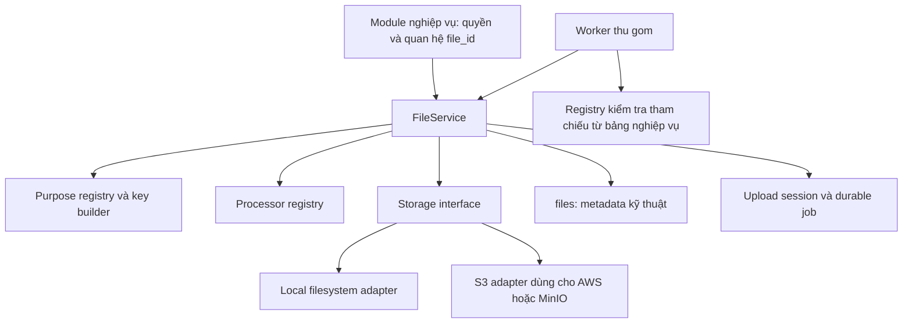
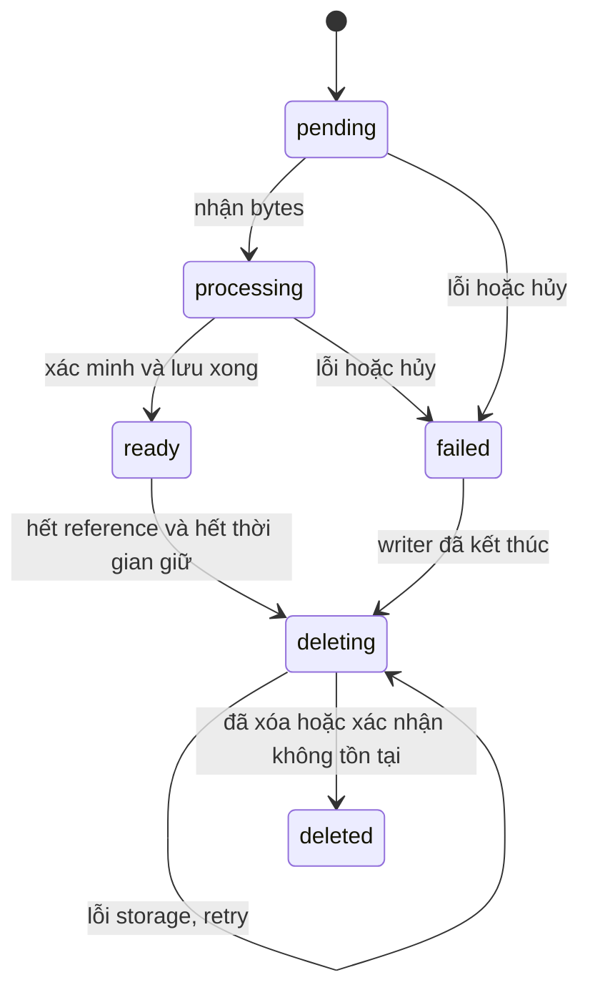

# UniWork - FileService dùng chung và vòng đời file

> **Trạng thái:** in-progress - Thiết kế dùng làm cơ sở lập plan theo yêu cầu ngày 2026-09-22; chưa triển khai.

**Ngày:** 2026-09-22

**Issue:** UNI-726

**Parent / Roadmap:** UNI-437 / C-01

**Phạm vi bàn giao hiện tại:** spec và [implementation plan](../plans/2026-09-22-shared-file-service.md), không migration, không thay API/runtime.

**Nguồn yêu cầu:** phiên thiết kế với người dùng ngày 2026-09-22.

**Quy tắc workspace:** `UNIAI_COORDINATION.md` ở thư mục workspace gốc (ngoài repo).

**Hợp đồng cho module tiêu thụ:** [FS-C1](2026-09-24-file-service-contract.md) (2026-09-24).

## 1. Mục tiêu và quyết định đã chốt

Xây một FileService dùng chung trong Go theo interface + composition. Các module nghiệp vụ gọi service này để xử lý file. Storage adapter và processor không tự triển khai lại quy tắc vòng đời.

Các quyết định người dùng đã chốt:

1. Một bảng `files` là nguồn metadata kỹ thuật và thông tin tenant của file. Bytes nằm ở storage.
2. `files` có `organization_id` làm ranh giới tenant theo T1-Q10; không có `task_id`, `room_id`, `document_id`, `workspace_id`, `purpose` hoặc owner nghiệp vụ.
3. Bảng nghiệp vụ giữ `file_id`; trường hợp nhiều file dùng bảng liên kết của chính module. Không tạo bảng quan hệ nghiệp vụ đa hình `media_usages`.
4. `UploadPurpose` là enum tập trung, ánh xạ sang thư mục storage. Rỗng, không biết hoặc không có ánh xạ đều bị từ chối trước khi đọc/xử lý bytes, ghi object hoặc tạo bản ghi file.
5. Tổ chức key thống nhất theo phạm vi, nghiệp vụ và file ID. Local và S3/MinIO dùng cùng quy tắc.
6. Backend kiểm quyền nghiệp vụ rồi resolve metadata + URL cho UI. API trả cả `file_id` và URL; DB/nội dung nghiệp vụ chỉ lưu ID.
7. Private storage dùng presigned GET ngắn hạn hoặc proxy có xác thực. UI không biết credential, bucket hoặc cách dựng key.
8. Trường chọn storage tên là `storage`, lưu code/type ngắn: `local`, `s3`, `minio`. `local` là filesystem của server; MinIO chạy trên localhost, Docker hay server từ xa đều là `minio`.
9. Không khai báo env chọn storage thì mặc định `minio`. Loại được cấu hình phải có adapter đã đăng ký và đủ tham số khởi tạo; cấu hình sai/thiếu hoặc chưa có implementation phải báo lỗi khi khởi động.
10. Triển khai nền tảng file và các consumer hiện tại trước; phần chuyển G0 Documents/Office sang FileService để backlog riêng. G0 editor/fidelity tiếp tục độc lập, không phải điều kiện nghiệm thu đợt đầu.
11. Cập nhật 2026-09-24, thay một phần mục 10: task cần service của task khác thì bên cung cấp giao hợp đồng trước, implement sau. FileService giao hợp đồng [FS-C1](2026-09-24-file-service-contract.md) trước tiên; Documents/Office G1-G2 code theo hợp đồng đó ngay, dùng `file_id` từ đầu và không dựng ledger object riêng. Backlog UNI-748 chỉ còn phần sửa tài liệu/harness G0.

Plan dùng các thiết kế owner/session, chống tranh chấp và thời hạn thu gom bên dưới làm baseline. Các giá trị vận hành cần được xác nhận trên môi trường triển khai; việc yêu cầu lập plan chưa cho phép chạy migration hoặc cleanup dữ liệu hiện hữu.

## 2. Hiện trạng và phạm vi

### 2.1 Hiện trạng xác minh từ code

- Task: `attachments` giữ object key/URL và metadata; file tạm có `expires_at` 24 giờ. Upload hiện ghi object trước, ghi DB sau; một số nhánh cleanup bỏ qua lỗi xóa.
- Chat: `chat_messages.metadata` giữ object key, MIME, size và filename hoặc duration. Handler gọi storage trực tiếp.
- Avatar: `users.avatar_url`; handler gọi storage rồi cập nhật user.
- Recording: `meeting_recordings`, `chat_voice_recordings` giữ URL và thông tin LiveKit Egress.
- Audit export: consumer outbox gọi storage trực tiếp; `audit_exports` giữ object_key và expiry 24 giờ, handler dựng ObjectURL. Cần tích hợp FileService cho bytes kết quả xuất; audit_events vẫn append-only.
- Có sẵn `storage.Storage` với Local/S3. Chưa có service chung quản lý upload session, tham chiếu và thu gom cho mọi module.
- Startup hiện chỉ kiểm `STORAGE_BACKEND == "s3"`; giá trị khác, kể cả thiếu/sai chính tả, đi vào nhánh filesystem local. Constructor S3 có thể trả nil khi thiếu bucket. Thiết kế mới phải thay hành vi này bằng validation tường minh, không fallback ngầm.
- Local có route `/uploads/*` phục vụ trực tiếp. Luồng private mới phải có đường phục vụ được bảo vệ, không kế thừa quyền public của route này.
- Documents đã có spec riêng về phiên bản, retention và quota. FileService là tầng kỹ thuật bên dưới Document, không tạo một kho nghiệp vụ thứ hai.

### 2.2 Trong phạm vi thiết kế

Upload, validate, xử lý kỹ thuật, storage, metadata, đăng ký output từ provider, resolve URL, claim file vào nghiệp vụ, bỏ liên kết, retry, xóa vật lý và reconcile. Đợt đầu tích hợp task/comment/editor, chat file/voice, avatar, recording và audit export. Hợp đồng FS-C1 sẵn cho Document/version/asset và Office; G1-G2 tiêu thụ nó từ Gate A0, còn phần sửa tài liệu/harness G0 ở UNI-748.

Giữ một pipeline chung; giới hạn có thể khác theo policy được khai báo tập trung. Sự khác biệt 2 MiB avatar, 25 MiB attachment hay 4 MiB voice là cấu hình, không phải mỗi module viết một pipeline.

### 2.3 Ngoài phạm vi

Không xây file manager độc lập, ACL/chia sẻ độc lập cho file, global content dedup, CDN mới, resumable/direct browser upload, engine Office, OCR hay pipeline transcode bắt buộc. LiveKit vẫn truyền media thời gian thực; FileService quản lý file recording sinh ra. Processor ban đầu có thể validate/trích metadata và giữ nguyên bytes; thêm biến thể phải có policy và bài kiểm tra riêng.

### 2.4 Ranh giới với G0 trong đợt đầu

Đợt đầu không sửa DOC-004/DOC-005, document_versions/assets, engine pipeline hoặc draft store G0. Giữ đường storage/cleanup của consumer chưa chuyển với ownership rõ; không dual-write cùng file bằng hai pipeline. Bật purpose Document chỉ sau khi quyền, policy và reference providers đầy đủ trong đợt tích hợp riêng.

GC mới chỉ quản lý object có intent hoặc mapping đã xác minh và đã được bàn giao ownership. Object G0/legacy chưa chuyển, nguồn không rõ hoặc locator còn được consumer chưa chuyển dùng đều không được xóa. Chuyển owner cleanup phải đồng bộ việc loại object khỏi worker cũ; không dựa prefix để đoán ownership.

Cập nhật 2026-09-24: G1 (UNI-657) dựng Documents trên FS-C1 từ đầu, nên không có ledger lưu URL ổn định nào cần chuyển: version/asset giữ file_id, commit gọi ClaimInTx, cleanup chỉ qua FileService. UNI-748 chỉ còn sửa DOC-004 §8.3/§11 và harness G0 cho khớp. G0 đang yêu cầu không lộ key/path storage cho client: presigned URL thường chứa host/path object, nên luồng Office dùng proxy nếu giữ contract này. Nháp desktop/browser không phải filesystem adapter `local` của API; không áp staged TTL lên nháp cần phục hồi.

Chi tiết phụ thuộc, task song song và điều kiện chuyển giao nằm trong [implementation plan](../plans/2026-09-22-shared-file-service.md).

## 3. Kiến trúc và ranh giới



| Thành phần | Sở hữu trách nhiệm |
| --- | --- |
| Module nghiệp vụ | Membership/ACL, quyền upload/read/attach/unlink, quan hệ file_id, quota theo scope, retention/khôi phục nghiệp vụ |
| FileService | Pipeline chung, metadata, trạng thái kỹ thuật, orchestration adapter/processor, đồng bộ claim với GC |
| Purpose registry | Enum, template key, policy ID, scope bắt buộc, processor profile |
| Processor | Kiểm tra nội dung và trích metadata theo loại file; không query bảng task/chat hoặc quyết quyền |
| Storage adapter | Put/Open/Head/Delete/Presign/Range theo capability; không chọn purpose, TTL nghiệp vụ hoặc ghi DB |
| Upload session | Người thực hiện và grant tạm trước khi có đối tượng nghiệp vụ; idempotency/lease |
| Reference registry | Tập đầy đủ nơi đang giữ file_id và các tham chiếu giữ lại vì retention |
| Worker | Reconcile, cleanup và retry bền vững; không xem lỗi DB/storage là bằng chứng file không được dùng |

Giữ layering `handler -> service -> pkg/db`. FileService đặt trong `server/internal/service`; type kỹ thuật và processor có thể ở `server/internal/files`; tái sử dụng/mở rộng `server/internal/storage`, không tạo storage abstraction thứ hai song song.

Các hợp đồng dự kiến: `Upload`, `RegisterProviderOutput`, `ResolveMany`, `ClaimInTx`, `CancelUpload`, `ScheduleCleanupInTx`. Tên cuối cùng xác định khi viết plan. Query dùng sqlc. API SDI/SDO, OpenAPI và client schema theo quy chuẩn repo.

Phác thảo hợp đồng Go (type chỉ minh họa, chưa phải code đã triển khai):

```go
type Storage interface {
    Put(ctx context.Context, locator ObjectLocator, body io.Reader, info WriteInfo) error
    Open(ctx context.Context, locator ObjectLocator, read ReadOptions) (io.ReadCloser, error)
    Stat(ctx context.Context, locator ObjectLocator) (ObjectInfo, error)
    Delete(ctx context.Context, locator ObjectLocator) error
}

type URLSigner interface {
    SignRead(ctx context.Context, locator ObjectLocator, opts SignOptions) (SignedURL, error)
}

type Processor interface {
    Inspect(ctx context.Context, source Source, limits ProcessingLimits) (Inspection, error)
}
```

Optional capability như ký URL hoặc byte range được khai báo tường minh; unsupported không trả URL rỗng giả thành công. FileService chọn fallback proxy hợp lệ. Xóa trả error để worker retry, không dùng hàm best-effort không có kết quả. Processor Inspect giữ nguyên original; thao tác tạo derivative là hợp đồng riêng có intent cho từng output.


Không có public endpoint chỉ cần một file ID bất kỳ là nhận URL hoặc xóa object. FileService là service nội bộ; cổng truy cập luôn có bằng chứng quyền từ module hoặc upload session còn hiệu lực.

### 3.1 Chọn storage và đối chiếu implementation

Giữ tên env hiện có `STORAGE_BACKEND`; tên cột DB vẫn là `storage`. Enum mô tả các code hợp lệ, còn registry chứa các adapter thực sự đã triển khai. Có constant hoặc DB CHECK không có nghĩa adapter đã tồn tại.

| Giá trị `STORAGE_BACKEND` | Hành vi khởi động |
| --- | --- |
| Không tồn tại trong env | Chọn `minio`, sau đó vẫn kiểm đủ cấu hình MinIO |
| Có khai báo nhưng rỗng/chỉ khoảng trắng | Lỗi `storage_config_invalid`, không áp default |
| Code hợp lệ sau trim/lowercase | Tìm factory theo code trong registry |
| Code ngoài enum | Lỗi `storage_type_unsupported` |
| Code thuộc enum nhưng chưa đăng ký factory | Lỗi `storage_adapter_not_implemented` |
| Có factory nhưng thiếu/sai cấu hình | Lỗi `storage_config_invalid` |

Phân biệt env vắng với env rỗng bằng `os.LookupEnv`. Không suy MinIO từ endpoint localhost và không thử adapter khác nếu adapter đã chọn lỗi. MinIO và S3 có thể dùng chung phần SDK, nhưng phải có factory/config theo từng code; factory `s3` không tự biến thành đăng ký `minio`.

Một config loader đọc env, tạo typed config và gom lỗi; composition root đối chiếu registry/capability rồi khởi tạo adapter. Factory trả `(Storage, error)`, không dùng nil để báo lỗi. Registry từ chối code đăng ký trùng, instance nil hoặc typed-nil nằm trong interface. Adapter nhận config đã validate, không tự đọc lại env với default khác nhau.

Storage mặc định chỉ quyết định nơi ghi file mới. Đọc, resolve, reconcile và xóa luôn dispatch theo `files.storage` và locator đã lưu. Trước khi sẵn sàng, đối chiếu cả code của file chưa deleted và job/session còn cần reconcile; thiếu adapter/config cho storage cũ phải báo lỗi, không chuyển sang default mới. Cấu hình sai hoặc thiếu implementation chặn startup trước khi nhận API nghiệp vụ/chạy worker.

Nhóm cấu hình provider khác được khai báo rõ cũng phải có implementation và được validate, dù không phải default upload. Một nhóm được coi là khai báo khi có ít nhất một giá trị riêng của provider không rỗng; nhóm hoàn toàn vắng/rỗng và không được chọn/không còn dữ liệu cần dùng thì không bắt buộc. Biến credential AWS dùng chung bởi dịch vụ khác không tự kích hoạt S3; `S3_BUCKET` xác định nhóm cấu hình S3 của FileService.

### 3.2 Tham số khởi tạo và comment cấu hình

Tên biến chi tiết dưới đây là đề xuất cho implementation. `.env.example` và config struct phải có comment tiếng Anh nêu ý nghĩa, bắt buộc/default, đơn vị và phạm vi áp dụng. Không ghi secret mẫu có thể dùng thật.

| Loại | Cấu hình | Quy tắc |
| --- | --- | --- |
| Chung | `STORAGE_BACKEND` | `local`, `s3`, `minio`; chỉ vắng biến mới default `minio` |
| MinIO | `MINIO_ENDPOINT` | Bắt buộc; URL HTTP(S) API S3 mà API/worker truy cập được; không phải cổng Console |
| MinIO | `MINIO_BUCKET` | Bắt buộc; tên bucket thuần, không phải URL hay prefix |
| MinIO | `MINIO_ACCESS_KEY_ID`, `MINIO_SECRET_ACCESS_KEY` | Bắt buộc đủ cặp, không rỗng; không fallback sang AWS credential chain hoặc credential mẫu |
| MinIO | `MINIO_REGION` | Bắt buộc; khớp region cấu hình trên server, ví dụ `us-east-1` nếu server dùng giá trị đó |
| MinIO private | `MINIO_PUBLIC_ENDPOINT` | Bắt buộc khi chọn presign cho browser; dùng để ký đúng host mà browser truy cập được. Có thể giống endpoint API; proxy không cần biến này |
| Filesystem | `LOCAL_UPLOAD_DIR` | Bắt buộc khi chọn `local`; root được resolve thành đường dẫn tuyệt đối và kiểm volume/quyền ghi. Không phải bucket hoặc địa chỉ MinIO |
| Amazon S3 | `S3_BUCKET`, `S3_REGION` | Bắt buộc khi chọn `s3`; bucket và region phải khớp |
| Amazon S3 | AWS credential | Hoặc đủ cặp static access/secret và session token khi dùng credential tạm, hoặc credential chain/IAM hợp lệ. Khai báo một nửa cặp là lỗi, không âm thầm bỏ qua |

Endpoint không chứa userinfo, query, fragment, bucket hoặc path tùy ý; adapter xác định rõ path-style/virtual-host-style. Với MinIO, đề xuất path-style. TLS kiểm chứng certificate bình thường; private CA dùng trust config. Env boolean, duration, size phải parse nghiêm ngặt và kiểm giới hạn; TTL/timeout không được âm/0. Credential chỉ kiểm thiếu/rỗng, không tự sửa/trim giá trị secret.

Ví dụ comment trong `.env.example` (chỉ minh họa, chưa sửa cấu hình runtime):

```dotenv
# Storage provider code, not deployment location. Unset defaults to minio; empty is invalid.
STORAGE_BACKEND=minio
# MinIO S3 API URL reachable by the API and workers, not the MinIO Console URL.
MINIO_ENDPOINT=http://minio:9000
# Required bucket and credentials. Empty placeholders must fail startup validation.
MINIO_BUCKET=uniwork
MINIO_ACCESS_KEY_ID=
MINIO_SECRET_ACCESS_KEY=
# Required region; must match the MinIO server configuration.
MINIO_REGION=us-east-1
# Required for browser presigning; omit when using an authenticated proxy.
# MINIO_PUBLIC_ENDPOINT=https://media.example.com
# local means the server filesystem; MinIO on localhost still uses minio.
```

Trong phiên bản này, mỗi code chỉ có một cấu hình đích: một MinIO deployment, một S3 account/đích tương ứng, một filesystem root; bucket của file nằm trong locator. Hai MinIO độc lập cùng code `minio` chưa biểu diễn được. Không đổi endpoint/account/root để trỏ sang dữ liệu khác khi vẫn còn file/job cần đích cũ; cần migration có đối soát. Việc hỗ trợ nhiều instance cùng loại cần thiết kế định danh riêng sau này.

### 3.3 Kiểm tra khởi động và lỗi trong vận hành

1. Parse/validate config và registry trước I/O. Báo cùng lúc tên các biến thiếu/sai cùng mã lỗi; không log giá trị secret, access token hoặc URL có signature.
2. Kiểm cấu hình cho adapter đang dùng và dữ liệu hiện hữu. Đối chiếu capability với luồng đã bật: presign, Range, provider output, version-aware deletion khi bucket có versioning. Chọn proxy hợp lệ nếu mode cho phép; mode bắt buộc presign mà adapter không hỗ trợ phải báo lỗi.
3. Preflight có deadline/retry hữu hạn: kiểm endpoint/TLS, credential, bucket và region; filesystem kiểm root/volume. Lỗi preflight khiến instance không sẵn sàng phục vụ và startup kết thúc với lỗi rõ ràng. Không tự tạo bucket, đổi ACL/public policy hay tắt TLS verification để vượt qua lỗi.
4. Khởi tạo client, ký được URL hoặc gọi được HeadBucket không chứng minh đủ quyền Put/Get/Delete. Kiểm tra tích hợp khi triển khai phải thực hiện các thao tác cần dùng trên object thử có kiểm soát, theo dõi và dọn output; thiếu quyền xóa không được coi là kiểm tra thành công. Browser/LiveKit có mạng riêng nên cần kiểm tra từ đúng consumer.
5. Sau startup, mất kết nối/credential hết hạn phải làm readiness phản ánh lỗi dependency bắt buộc; liveness vẫn độc lập. Request trả lỗi storage nhất quán, job giữ lại để retry có backoff; không đổi adapter, không mark ready/deleted giả và không restart-loop vì liveness phụ thuộc storage. Health probe dùng timeout riêng phù hợp, không thực hiện upload/delete mỗi lần probe.

Không tự reload đổi đích storage trong tiến trình. Rotation credential phải giữ nguyên đích và được kiểm tra; IAM/STS cần hỗ trợ refresh nếu adapter dùng credential tạm. Không thể chứng minh credential sẽ luôn hợp lệ chỉ bằng preflight lúc boot.

## 4. Dữ liệu: metadata và quan hệ nghiệp vụ

### 4.1 Bảng files

Một hàng tương ứng một object bất biến. Không ghi đè bytes của một file đã ready. Thay nội dung tạo file ID mới.

| Trường dự kiến | Ý nghĩa |
| --- | --- |
| `id TEXT` | ULID file |
| `organization_id TEXT NULL` | Tenant của file theo ADR 0008; bắt buộc có với file thuộc tổ chức. NULL chỉ dành cho avatar tài khoản cá nhân trong đợt đầu, không có nghĩa public hoặc tenant chưa xác định |
| `storage TEXT` | Cách lưu bytes: `local` = filesystem server, `s3` = Amazon S3, `minio` = MinIO ở mọi môi trường; không chứa endpoint hoặc secret |
| `bucket TEXT NULL` | Bucket đối với S3/MinIO, kể cả MinIO dựng local; chỉ filesystem `local` mới không có bucket |
| `object_key TEXT` | Key tương đối; immutable sau khi cấp |
| `object_version TEXT NULL` | Version ID của object khi backend hỗ trợ |
| `original_filename TEXT` | Tên nhận vào đã làm sạch lúc upload, dùng chung để hiển thị/tải tại mọi nơi tham chiếu file; không hỗ trợ đổi tên sau upload (T1-Q4) |
| `content_type TEXT NULL` | MIME xác minh từ nội dung; chưa biết ở bước cấp intent |
| `size_bytes BIGINT NULL` | Dung lượng thực tế; ready bắt buộc có |
| `checksum_sha256 TEXT NULL` | SHA-256 của bytes khi luồng yêu cầu và đã xác minh; mặc định NULL, không bắt buộc cho mọi file ready |
| `status TEXT` | pending, processing, ready, failed, deleting, deleted |
| `metadata JSONB` | Chỉ thuộc tính kỹ thuật có schema/version: width, height, duration_ms, page_count, codec... |
| `ready_at TIMESTAMPTZ NULL` | Thời điểm file sẵn sàng lần đầu; mốc tuổi file cho GC, giữ nguyên khi claim/cancel/unlink và sau khi dọn session |
| `created_at`, `updated_at`, `deleted_at` | Vòng đời bản ghi kỹ thuật |

**Quyết định T1-Q10 (2026-09-22):** bổ sung thông tin tenant vào `files`, dùng `organization_id` theo quy ước UniWork. Backend lấy tenant từ context đã kiểm membership/grant, không tin giá trị trong body hoặc suy từ object_key. Tenant được ghi từ lúc tạo intent và giữ nguyên trong vòng đời file; claim, resolve, tái sử dụng và thao tác theo tenant phải khớp organization_id của file với scope được cấp phép. Tenant là ranh giới cách ly, không tự cấp quyền đọc cho mọi thành viên tổ chức. Chuyển file sang tenant khác phải qua luồng copy được cấp phép, tạo file_id/object mới với tenant đích; không sửa tenant của file cũ.

Ngoại lệ để giữ luồng hiện tại: avatar tại `/me/avatar` thuộc tài khoản toàn hệ thống, không thuộc tổ chức đang mở. Cho phép organization_id NULL chỉ qua policy UserAvatar với user scope đã xác thực; query riêng phải kiểm quan hệ `users.avatar_file_id` hoặc phiên upload cá nhân và điều kiện NULL tường minh. Query file tổ chức luôn dùng `organization_id = tenant đã xác minh`, không thêm nhánh `OR organization_id IS NULL`. Không lấy một tổ chức bất kỳ của user để gắn tenant cho avatar, không coi NULL là public hoặc dùng để backfill file chưa rõ tenant. Các loại file tổ chức từ chối tenant thiếu/rỗng trước tạo intent/I/O. Thêm loại file ngoài tenant khác là thay đổi policy riêng.

**Quyết định T1-Q1 (2026-09-22):** người dùng chọn lưu thuộc tính riêng theo định dạng trong một cột `metadata JSONB`, ví dụ `{"schema_version":1,"width":1920,"height":1080}`. Các trường chung vẫn là cột riêng. Service validate schema/version, allowlist thuộc tính và kiểu dữ liệu; JSON không chứa owner, task_id hoặc dữ liệu nghiệp vụ tùy ý. Không tách width/height/duration/page_count/codec thành các cột nullable riêng ở đợt đầu.

**Quyết định T1-Q2 (2026-09-22):** giữ `checksum_sha256` là metadata kỹ thuật tùy chọn để G0 hoặc module khác có nhu cầu sử dụng. Mặc định không tính và không backfill checksum; NULL là hợp lệ cả khi file ready. Policy do module phía server chọn quyết định có tính/xác minh hay không, dùng cùng cơ chế xử lý giữa các storage adapter. Khi luồng yêu cầu checksum, phải hoàn tất tính/đối chiếu trước khi báo ready cho luồng đó; chỉ lưu giá trị đã xác minh, không lưu mù digest do client/provider khai. SQL không đặt điều kiện checksum NOT NULL cho mọi hàng ready. G0 giữ yêu cầu input/output checksum riêng của contract hiện tại; Documents/Office bật policy bắt buộc checksum khi dùng FileService (FS-C1 §3).

Go định nghĩa `StorageType` với các giá trị `local`, `s3`, `minio`; DB có CHECK tương ứng và service từ chối code chưa hỗ trợ. Mỗi code ánh xạ tới cấu hình server chứa endpoint/root, credentials và adapter. `s3` và `minio` có thể dùng chung implementation S3-compatible. Cấu hình đích của một code phải ổn định với file hiện hữu; đổi đích lưu cần chuyển dữ liệu có kiểm soát, không âm thầm trỏ file cũ sang storage khác.

`storage` mô tả cơ chế/provider lưu file, không mô tả môi trường dev/staging/production hoặc vị trí triển khai. Không suy code từ hostname, địa chỉ IP hoặc việc có dùng Docker. Cũng không liên quan tới `window.localStorage` trong trình duyệt.

| Cấu hình thực tế | Code lưu DB |
| --- | --- |
| Ghi file trực tiếp vào thư mục hoặc volume mà API server truy cập qua filesystem | `local` |
| MinIO chạy trên máy developer, ví dụ `http://localhost:9000` | `minio` |
| MinIO chạy trong Docker, mạng nội bộ hoặc server từ xa | `minio` |
| Amazon S3 | `s3` |

Khi triển khai, enum và từng constant phải có GoDoc mô tả rõ. Comment trong code dùng tiếng Anh theo quy tắc repo; phần giải thích spec giữ tiếng Việt:

```go
// StorageType identifies the storage mechanism/provider, not its deployment location.
type StorageType string

const (
    // StorageLocal stores bytes directly in the API server's configured filesystem root.
    // It does not mean browser localStorage or a locally hosted MinIO service.
    StorageLocal StorageType = "local"

    // StorageS3 stores objects in Amazon S3 using its API.
    StorageS3 StorageType = "s3"

    // StorageMinIO stores objects in MinIO using the S3-compatible API.
    // Use this code for every MinIO deployment: localhost, Docker, or a remote server.
    StorageMinIO StorageType = "minio"
)
```

Migration phải có `COMMENT ON COLUMN` cho các cột metadata, nêu ý nghĩa, đơn vị và trường hợp NULL khi có. Ví dụ cho bộ định vị file (chỉ minh họa, chưa chạy migration):

```sql
COMMENT ON COLUMN files.storage IS
  'Storage provider code: local = API server filesystem; s3 = Amazon S3; minio = MinIO at any deployment location. Not a deployment environment or browser localStorage.';
COMMENT ON COLUMN files.bucket IS
  'Object bucket for s3/minio, including locally hosted MinIO. NULL for local filesystem storage.';
COMMENT ON COLUMN files.object_key IS
  'Immutable object name within the bucket, or relative path beneath the configured filesystem root for local storage. Not a URL or an absolute filesystem path.';
COMMENT ON COLUMN files.organization_id IS
  'Immutable tenant organization ID supplied by an authorized server context. Required for organization files. NULL is reserved for account-level user avatars authorized through the identity flow; it does not mean public access or an unknown tenant.';
```

Ràng buộc unique vị trí object theo storage/bucket/object_key vẫn áp dụng toàn bảng, không thêm tenant vào unique để cho phép hai tenant cùng sở hữu một object; nullable bucket cần normalized expression phù hợp. Chặn organization_id rỗng; query/index truy cập tenant bắt đầu bằng organization_id khi phù hợp. Ngoài organization_id, không lưu signed URL, token, scope nghiệp vụ chi tiết, uploader/owner hay ref_count có thể lệch khỏi nguồn.

File legacy không có checksum tiếp tục để NULL; chỉ tính/backfill khi luồng cần kiểm tra yêu cầu. Không giả mạo checksum hay coi ETag S3 là SHA-256. Thiết kế chuyển đổi phải xác minh locator, object và reference/ownership riêng trước khi kích hoạt GC; checksum vắng không tự chứng minh dữ liệu lỗi hoặc cho phép xóa.

Nếu sinh preview/thumbnail, mỗi object phát sinh cũng có hàng trong `files`; quan hệ kỹ thuật có thể dùng `file_derivatives(source_file_id, file_id, variant, processor_version)`. Đây không phải quan hệ nghiệp vụ. Chưa bật sinh biến thể nếu chưa triển khai đầy đủ dependency, cleanup và kiểm tra của bảng này. Original chỉ có thể xóa khi cả các tham chiếu nghiệp vụ và dependency kỹ thuật đều cho phép.

### 4.2 Bảng nghiệp vụ

| Nơi sử dụng | Tham chiếu |
| --- | --- |
| Tài khoản | `users.avatar_file_id` |
| Task/comment | Bảng attachment của module giữ task_id/comment_id và file_id |
| Chat nhiều file | Bảng attachment của chat giữ message_id và file_id |
| Voice message | Quan hệ file_id của module chat; duration kỹ thuật lấy từ files |
| Meeting/call recording | Recording row giữ file_id, egress_id, trạng thái phiên và thời gian ghi |
| Audit export | `audit_exports.file_id`; phạm vi, người yêu cầu và expiry của kết quả xuất ở module audit |
| Document/version | `document_versions.file_id`; thông tin version, tác giả, quyền ở Document |
| Ảnh nhúng trong Document | `document_assets.file_id`, gắn quyền/retention vào tài liệu |

Tên file hiển thị thuộc metadata trong `files`, một `file_id` có một tên dùng chung ở mọi nơi tham chiếu. Không lưu alias tên file riêng cho từng attachment. Chú thích và thứ tự hiển thị của attachment vẫn thuộc quan hệ nghiệp vụ.

**Quyết định T1-Q3 (2026-09-22):** người dùng chọn dùng chung `file_id` và bytes khi tái sử dụng file trong cùng tổ chức, đồng thời làm rõ tên hiển thị cũng là tên chung của file. Mỗi nơi đính kèm có quan hệ và quyền độc lập. Bỏ attachment khỏi task không xóa bản trong chat; thay nội dung tạo file ID mới và chỉ đổi tham chiếu ở nơi thao tác. Người có quyền đọc tin nhắn đã nhận file đọc theo quyền chat, không phải có quyền vào task nguồn. Chỉ thu gom bytes khi hết mọi reference, lease và retention/hold. Các lượt upload riêng vẫn tạo file mới, không tự dedup theo checksum.

**Quyết định T1-Q4 (2026-09-22):** không triển khai chức năng đổi tên file sau upload. Giữ `original_filename` đã làm sạch lúc upload làm tên chung cho file ở mọi nơi hiển thị và tải xuống. Không bổ sung API, UI hoặc quyền đổi tên; đây không còn là điểm cần chốt trong T1. Tái sử dụng file giữ nguyên tên và object_key.

Nội dung rich text lưu tham chiếu bền vững `file_id` hoặc ID attachment nghiệp vụ resolve sang file_id. Mọi tham chiếu trong JSON/Markdown phải có hàng liên kết nghiệp vụ được đồng bộ cùng transaction; GC không dò text tùy ý để đoán file có đang được dùng. Không persist presigned URL hoặc blob URL. Xóa ảnh khỏi nội dung và xóa hàng liên kết phải cùng transaction; backend tính lại tập reference từ nội dung canonical, không tin danh sách client gửi thiếu.

### 4.3 Dữ liệu điều phối, không phải bảng metadata thứ hai

Cần thêm hai loại dữ liệu bền vững:

- `file_upload_sessions`: file_id, actor tạo phiên (`created_by` + `created_by_kind`), scope được backend xác minh, purpose, khóa idempotency, trạng thái phiên, thời hạn claim, lease ghi, generation và dấu thời gian. Không chứa metadata nội dung lặp lại và không làm ACL vĩnh viễn.
- `file_jobs`: file_id, operation, trạng thái, attempt, next_attempt_at, lease/generation, error_code, thời hạn không được xóa trước. Key/object lấy qua files; metadata multipart/provider operation tối thiểu để reconcile có thể nằm trong job.

`purpose` và scope chi tiết được lưu trong phiên điều phối để bảo vệ lượt upload/claim; tenant còn được lưu tại files.organization_id và phải khớp scope của session/job. Task/workspace/user grant không trở thành cột quyền nghiệp vụ trong files. Phiên đã claim hết quyền đọc tạm; dữ liệu chỉ giữ theo retention vận hành/audit.

Không lưu raw capability/token hoặc signed URL trong DB/log. Nếu dùng token claim thì lưu hash, ràng buộc actor/scope/purpose/expiry; token không thay thế membership hiện tại.

### 4.4 Tương thích quy tắc repo

`files` lưu organization_id theo ADR 0008 cho file tenant; không có owner nghiệp vụ. ADR bổ sung chỉ giải thích ngoại lệ avatar cá nhân khiến cột nullable và các bảng điều phối hỗ trợ user/org scope. Migration lint phải kiểm `files` có cột tenant, CHECK giá trị rỗng và comment; ngoại lệ với yêu cầu NOT NULL có tên/lý do và kiểm thử cho UserAvatar, không dùng exemption rộng để cho phép files bỏ cột tenant. Các luồng organization kiểm tenant bắt buộc ở service và query; không tắt kiểm tra cách ly toàn repo.

Các bảng nghiệp vụ vẫn có organization_id và workspace_id khi thuộc workspace; membership vẫn qua gate hiện tại. Không FK/REFERENCES/cascade theo quy tắc repo; transaction ở service chịu trách nhiệm quan hệ. Mỗi index CONCURRENTLY nằm trong migration riêng.

## 5. Có cần owner cho file không?

**Đề xuất: không có owner nghiệp vụ trong files; có người tạo phiên upload và phạm vi cấp phép tạm.**

| Khái niệm | Nằm ở đâu | Quyền mang lại |
| --- | --- | --- |
| Người upload/tác nhân hệ thống | Upload session + audit | Xem trạng thái/preview/hủy/claim file chưa gắn, còn hạn và đúng scope |
| Chủ sở hữu nghiệp vụ | Task/chat/document/user tương ứng | Quyền theo module, không theo ai upload bytes |
| Tenant/phạm vi | files.organization_id + bảng nghiệp vụ và upload session | Đối chiếu tenant, chống claim/đọc xuyên scope; không thay quyền nghiệp vụ |
| File metadata | files | Không tự cấp quyền |

Lý do cần phiên upload: trước khi task/tin nhắn tồn tại, chưa có quan hệ nghiệp vụ để bảo vệ file. Chỉ file ID là không đủ chứng minh ai được nhận hoặc hủy lượt upload.

Sau claim, người upload không giữ quyền đặc biệt. Rời tổ chức, bị vô hiệu hóa, xóa tài khoản hoặc mất quyền phòng chat không làm file của tập thể biến mất; cũng không được tiếp tục đọc nhờ uploader ID cũ. Tác nhân hệ thống/agent phải có grant đúng luồng, không tự claim bằng actor type.

Tái sử dụng file đã gắn cần quyền đọc nguồn và quyền gắn vào đích, kiểm cả hai tại thời điểm command cùng policy cho phép của các module. Theo T1-Q3/T1-Q10, đợt đầu dùng chung object giữa các nguồn cùng organization_id; chuyển sang tổ chức khác hoặc từ scope avatar cá nhân cần luồng copy được cấp phép, tạo file ID/object mới với organization_id đích. Không suy tenant từ object_key. Khi reference đích đã được lưu, quyền đọc ở đích độc lập với nguồn; xóa hoặc thu quyền ở nguồn không tự gỡ reference/quyền ở đích.

Gắn lại file đã ready vẫn phải đạt policy đích về MIME, size và checksum nếu luồng yêu cầu; không bỏ kiểm tra vì object đã tồn tại. Tạo reference mới trong transaction theo giao thức khóa chung, không dùng lại upload session đã consume làm bằng chứng quyền.

Nếu cần xóa toàn tổ chức, module nghiệp vụ gỡ/purge tham chiếu theo retention rồi gọi cleanup; phiên upload trong scope đó bị hủy. Không xóa hàng loạt chỉ vì prefix bắt đầu bằng org ID.

## 6. UploadPurpose và quy tắc key

### 6.1 Danh mục ban đầu

| Enum Go / giá trị | Nhánh dưới scope | Scope bắt buộc |
| --- | --- | --- |
| UserAvatar / user_avatar | avatars | user |
| TaskAttachment / task_attachment | tasks/attachments | organization + workspace |
| TaskDescriptionImage / task_description_image | tasks/description-images | organization + workspace |
| TaskCommentAttachment / task_comment_attachment | tasks/comments | organization + workspace |
| ChatAttachment / chat_attachment | chat/files | organization; workspace nếu phòng thuộc workspace |
| ChatVoice / chat_voice | chat/voice | organization; workspace nếu có |
| ChatCallRecording / chat_call_recording | chat/recordings | organization; workspace nếu có |
| MeetingRecording / meeting_recording | meetings/recordings | organization + workspace |
| AuditExport / audit_export | audit/exports | organization |
| DocumentFile / document_file | documents/files | organization + workspace |
| DocumentAsset / document_asset | documents/assets | organization + workspace |

Enum chưa được host/module hỗ trợ phải trả lỗi capability, không mở endpoint hoặc giả vờ upload đã khả dụng. Document và module tương lai chỉ kích hoạt khi quyền, policy và reference provider đã đăng ký đủ.

Go dùng named string type + constants + registry tường minh. Kiểm runtime bắt buộc vì ép chuỗi có thể tạo giá trị ngoài constants. Registry phải có test đủ enum, prefix không trùng ngoài chủ ý và scope/policy hợp lệ. Không có default purpose, thư mục miscellaneous hoặc fallback giữ raw input.

Endpoint nghiệp vụ chọn purpose; không tin purpose/path/scope do client tự khai. Trường hợp endpoint generic phục vụ nhiều purpose, purpose phải ở route/header để kiểm trước parse multipart; handler chỉ parse, service ánh xạ allowlist action và authorize scope trước khi gọi pipeline.

### 6.2 Key chuẩn

```text
v1/users/{userId}/{purposePrefix}/{YYYY}/{MM}/{fileId}/original
v1/orgs/{orgId}/workspaces/{workspaceId}/{purposePrefix}/{YYYY}/{MM}/{fileId}/original
v1/orgs/{orgId}/{purposePrefix}/{YYYY}/{MM}/{fileId}/original
```

Đề xuất object basename không cần phần mở rộng: Content-Type và tên tải từ metadata. Cách này cho phép ghi nhận key trước khi đọc bytes và xác định MIME, tránh dùng đuôi file do client cung cấp. Nếu chọn thêm phần mở rộng khi duyệt, phải ghi intent cho key cuối trước Put, không đổi key sau khi object đã lưu.

ID là segment opaque đã kiểm; thời gian UTC do server cấp; không dùng tên/email/tên phòng hoặc đường dẫn tùy ý. Không path traversal. Prefix chọn một lần, không di chuyển khi tái sử dụng file. S3 prefix và local directory có cùng ngữ nghĩa.

Với T1-Q3, file upload vào task rồi được dùng ở chat vẫn giữ key/prefix của lần upload đầu. Phân loại tại mỗi nơi theo quan hệ nghiệp vụ, tên file đọc chung từ files; prefix không liệt kê mọi nơi đang dùng và không quyết quyền/cleanup.

## 7. Upload, claim và hủy

Trạng thái file và trạng thái phiên upload là hai vòng đời khác nhau. File ready chỉ nói bytes/metadata sẵn sàng, không có nghĩa đã được nghiệp vụ nhận.



Phiên upload đi qua receiving -> staged -> claimed; receiving/staged có thể chuyển canceled hoặc expired. Cả hủy và claim đều kiểm lại dưới lock. Sau cancel/expiry file ready có thể vẫn còn bytes trong khoảng đệm nhưng không còn grant đọc/claim của phiên đó.

**Quyết định T1-Q5 (2026-09-22):** file upload chưa gắn vào đối tượng nghiệp vụ có thời hạn claim 24 giờ từ lúc file ready và phiên chuyển staged. Hết hạn thì từ chối claim/cấp URL mới qua phiên; việc từ chối không phụ thuộc worker đã chạy hay chưa. Quét dọn rác một lần mỗi ngày, chọn file chưa gắn đã quá 24 giờ để xử lý cleanup theo §9; không cần tác vụ chạy riêng đúng thời điểm từng file hết hạn. Xóa vật lý vẫn phải kiểm đủ điều kiện reference, lease và retention/hold. File đã claim thành công không còn chịu TTL này. Mở tab, preview hoặc thử lưu lại không tự gia hạn; upload/recording đang ghi chưa áp TTL staged.

File upload xong nhưng người dùng hủy trước khi lưu nghiệp vụ cũng là file rác của T1-Q5, dùng chung lượt quét và ngưỡng quá 24 giờ từ ready/staged. Hủy thu hồi quyền claim/cấp URL mới qua phiên ngay; không đặt khoảng đệm riêng hoặc tính lại tuổi file từ lúc hủy.

### 7.1 Upload file thông thường

**Quyết định T1-Q8 (2026-09-22):** dùng idempotency key cho lượt upload. Client tạo một key cho một lượt upload logic và giữ nguyên khi thử lại; upload mới hoặc đổi file dùng key mới. Backend ràng buộc key với actor + scope + purpose, kiểm quyền hiện tại khi retry. Cùng key và tham số command trả trạng thái/kết quả của lượt đã nhận; đang xử lý không mở writer thứ hai, đã thành công không đọc/ghi lại body để thay file. Cùng key nhưng tham số command khác trả conflict. Không kéo dài hạn phiên hoặc hồi sinh phiên canceled/expired khi replay. Key không thay checksum và không chứng minh hai stream có cùng bytes; luồng cần đối chiếu bytes bật policy checksum theo T1-Q2. Attempt kỹ thuật cho kết quả ghi chưa xác định vẫn theo §9.4 và chỉ có một kết quả thành công được công bố cho lượt logic.

1. Module kiểm quyền hiện tại qua gate chuẩn; xác định purpose/scope/policy.
2. FileService từ chối enum/scope/policy sai trước đọc bytes, tạo files/session hoặc gọi adapter. Giới hạn request được đặt trước parse multipart.
3. Kiểm idempotency theo T1-Q8 trước khi mở writer: actor + scope + purpose + key và các tham số command đã xác định. Retry cùng lượt trả trạng thái/kết quả của lượt đó; key trùng nhưng tham số khác trả conflict. Lượt đang chạy không mở writer thứ hai; replay lượt đã thành công không thay bytes. Khi không tính checksum, metadata/fingerprint command không chứng minh hai stream có cùng bytes; không hứa phát hiện mọi thay đổi nội dung có cùng metadata.
4. Tạo file_id/key, files(pending, organization_id đã xác minh), upload session và intent trước thao tác storage; UserAvatar dùng nhánh cá nhân tường minh theo T1-Q10. Quota/reservation theo scope nếu module có quota; reserve cần chống upload đồng thời vượt hạn.
5. Đọc stream có giới hạn thực tế; xác minh MIME bằng signature/parser phù hợp, tên sạch và số bytes. Chỉ tính/đối chiếu checksum khi policy của luồng yêu cầu theo T1-Q2. Không tin Content-Type/extension/Content-Length của client; OOXML cần nhận diện container hợp lệ. Không đọc toàn bộ file nhiều lần vào RAM.
6. Processor xử lý theo profile thống nhất; cần seek thì dùng file tạm có giới hạn và lifecycle quản lý. Không có processor/policy phù hợp thì từ chối, không âm thầm chuyển sang loại khác.
7. Adapter lưu bằng key đã cấp. Local dùng staging + atomic commit; S3 theo Put/multipart có intent để abort/reconcile khi lỗi. Mọi object phát sinh phải có intent trước khi ghi.
8. Xác nhận bytes/metadata, cập nhật ready và phiên staged. Chỉ khi ready mới trả kết quả có thể claim. File chưa gắn chỉ có URL preview qua phiên được cấp phép.
9. Nếu lỗi, mark failed và enqueue cleanup bền vững. Không xóa hàng files trước khi hoàn tất xóa object.

Byte cap, MIME allowlist và lỗi phải giống nhau giữa Local và S3. Preserve giới hạn hiện hành khi cutover; sửa lệch frontend 100 MiB/backend 25 MiB bằng policy chung. Tăng giới hạn hoặc bật chuyển đổi nội dung là quyết định riêng.

### 7.2 Lưu đối tượng nghiệp vụ và claim

UI gửi file_id cùng đối tượng cần lưu. Module không chấp nhận ID tùy ý chỉ vì file ready.

Trong cùng transaction:

1. Kiểm quyền đích và revision/idempotency của command.
2. Khóa các files theo thứ tự ID, sau đó session/job theo thứ tự thống nhất; khóa luôn cả file cũ và mới nếu thay thế.
3. Với file staged: kiểm actor/grant, purpose, scope, tenant của file khớp session/đích, hạn claim, ready và phiên chưa canceled/claimed. Nhánh avatar cá nhân kiểm user scope và organization_id NULL tường minh.
4. Với file đã có tham chiếu: kiểm nguồn/đích theo §5; không dùng upload session cũ làm quyền.
5. Ghi đối tượng nghiệp vụ + các quan hệ file_id.
6. Consume phiên staged; đánh dấu job cleanup cũ không còn đủ điều kiện. Ghi audit/outbox cùng transaction theo module.

Rollback nghiệp vụ rollback cả claim; file vẫn staged để người dùng thử lưu lại cho đến khi hết hạn. Không đánh dấu claimed bằng HTTP request riêng sau khi đã lưu đối tượng.

Mất response sau commit: retry command bằng cùng idempotency key trả lại kết quả đã commit. Không hủy file chỉ vì UI không nhận được response. Với một lần lưu nhiều file, toàn bộ quan hệ/claim commit hoặc rollback cùng nhau.

### 7.3 Người dùng hủy hoặc bỏ file khỏi draft

- File chỉ mới chọn nhưng chưa upload: frontend hủy reader/request, bỏ local preview.
- Upload đang chạy: gửi cancel nếu có session, abort reader/writer/provider operation; cancel là best effort phía browser, server giữ trạng thái bền vững.
- File staged, chưa gắn: CancelUpload xác minh actor/grant, khóa file/session, mark canceled, enqueue cleanup. File là rác và được dọn trong lượt quét hằng ngày khi quá 24 giờ từ ready/staged theo T1-Q5; không có khoảng đệm riêng sau cancel. Request lặp lại cho cùng lượt hủy trả kết quả tương đương.
- File đã claim do lượt save chạy đồng thời: cancel upload không được xóa nó; trả trạng thái already_claimed. Muốn bỏ phải qua command unlink của nghiệp vụ.
- Đóng tab/mất mạng/ứng dụng crash: không phụ thuộc beforeunload/sendBeacon; worker xử lý expiry.
- Save validation fail hoặc revision conflict: giữ staged để sửa và thử lại; chỉ hủy khi người dùng bỏ draft hoặc hết hạn.
- UI gỡ một file trong nhiều file staged: hủy đúng phiên file đó, không hủy cả draft.

### 7.4 Output từ LiveKit hoặc worker khác

Cấp intent + file_id + expected key trước khi gọi provider, gắn operation với phiên recording đã được authorize. Provider ghi đúng storage/bucket/object_key được server cấp.

Webhook phải xác thực, idempotent, đối chiếu operation/expected key. Chỉ mark ready sau khi xác minh object và metadata. Nếu policy yêu cầu checksum, xác minh bằng cơ chế hỗ trợ hoặc worker đọc stream có giới hạn; mặc định không tạo lượt đọc toàn bộ recording chỉ để tính checksum. Không lấy ETag làm SHA-256 và không fetch URL tùy ý do client/webhook khai để import.

Nếu provider vẫn ghi, session có lease/provider operation còn active và GC không xóa. Timeout không có nghĩa writer đã dừng: phải stop/abort và xác minh trạng thái cuối; chưa xác minh được thì giữ/quarantine và retry. Crash giữa start provider và lưu ACK phải reconcile operation/key trước khi start lại.

Recording row giữ trạng thái nghiệp vụ riêng. Khi file ready, cập nhật file_id/recording và audit/outbox nhất quán. Webhook đến muộn sau cancel không được hồi sinh file hoặc gắn lại recording.

Output từ worker nội bộ như audit export dùng cùng pipeline với purpose/grant do domain cấp. Claim file và complete-export trong cùng transaction; outbox retry không ghi đè file ready hoặc tạo hai kết quả đã gắn. Expiry nghiệp vụ của export giữ 24 giờ theo hiện trạng; hết hạn gỡ reference và enqueue cleanup bytes, không sửa/xóa audit_events append-only.

## 8. Đọc file và URL private

**Quyết định T1-Q7 (2026-09-22):** thời hạn URL ký là 12 giờ, giới hạn bởi grant/credential nếu chúng hết hạn sớm hơn. UI không tự lấy URL mới khi sắp hết hạn hoặc đã hết hạn, kể cả khi phát media gặp lỗi expiry. Lần tải dữ liệu mới vẫn kiểm quyền và resolve theo luồng bình thường; expiry không tự kích hoạt timer hoặc retry để cấp URL mới.

1. Module đọc đối tượng theo quyền hiện tại, xác nhận file_id thuộc đúng quan hệ và organization_id của file khớp tenant đã xác minh. Avatar cá nhân đi qua luồng identity riêng theo T1-Q10.
2. Gom ID và gọi ResolveMany; query metadata theo lô, ký URL với concurrency hữu hạn. Không query DB N+1.
3. Response chỉ chứa metadata cần UI, file_id, URL đọc/tải và url_expires_at. Không trả object_key, credential, scope phiên hoặc lỗi storage chi tiết.
4. Presigned GET chỉ cho đúng object + method + disposition. TTL 12 giờ theo T1-Q7; không vượt thời hạn quyền chia sẻ/guest/phiên upload đang dùng hoặc credential ký tạm thời. Đồng hồ server phải đồng bộ để tránh URL chưa có hiệu lực/đã hết hạn do clock skew.
5. Nếu storage không reachable từ browser hoặc cần kiểm quyền từng request, dùng proxy. Proxy kiểm quyền ở mỗi request, hỗ trợ HEAD/Range cho audio/video, stream và đóng reader đúng hạn.
6. UI dùng hook media chung để hiển thị URL được trả cùng dữ liệu; không tự làm mới URL theo thời gian hoặc retry resolve khi URL hết hạn. Không ghi URL vào nội dung. Preview và download có Content-Disposition phù hợp.

Cache metadata/URL ở backend và frontend phải ràng buộc principal, reference nghiệp vụ và mode truy cập; không dùng file_id làm khóa duy nhất cho response đã authorize. Xóa cache khi logout/đổi tài khoản và không cache URL private vào shared CDN. Mỗi lần tải dữ liệu/resolve mới vẫn kiểm quyền hiện tại; không có luồng tự làm mới URL do expiry.

Proxy URL cần hoạt động với native img/audio/video: ưu tiên cùng origin với session cookie HttpOnly theo cơ chế auth host. Nếu chỉ có Bearer header, UI dùng authenticated blob fetch cho file nhỏ hoặc đổi lấy access ticket ngắn hạn, ràng buộc session/user + file + reference + mode. Proxy ticket vẫn phải kiểm session/quyền hiện tại mỗi request; ticket không được trở thành bearer URL bypass quyền như presign.

Ví dụ DTO đọc sau khi module đã kiểm quyền:

```json
{
  "file": {
    "id": "01K5FILEEXAMPLE",
    "filename": "bao-cao.pdf",
    "content_type": "application/pdf",
    "size_bytes": 245760,
    "status": "ready",
    "url": "https://storage.example/signed-object",
    "url_expires_at": "2026-09-22T10:15:00Z"
  }
}
```

ID/URL trên chỉ minh họa contract. Upload staged trả thêm upload_session_id và claim_expires_at; đây là dữ liệu lượt upload, không ghi vào đối tượng nghiệp vụ. URL proxy ổn định có url_expires_at null nếu cơ chế auth không dùng ticket ngắn hạn.

Người cầm presigned URL có thể dùng đến lúc hết hạn. Unlink/mất quyền chặn cấp URL mới ngay, không bảo đảm thu hồi URL đã phát. Xóa object không thu hồi bytes đã tải hoặc cache; yêu cầu thu hồi chặt chọn proxy và cache private phù hợp.

File pending/failed/deleting/deleted không được cấp URL mới. File ready nhưng staged chỉ resolve qua upload session hợp lệ; file ready không có tham chiếu/session không đọc được qua API.

MIME/filename phục vụ từ metadata đã xác minh, có nosniff; file chủ động như HTML/SVG không render inline cùng origin nếu chưa có sandbox policy được duyệt. Không log query signature/ticket. URL chưa ký tới object private không phải fallback hợp lệ.

Không trả object_key thành field riêng không có nghĩa presigned URL che locator: URL thường chứa host/path object. Module có contract ẩn locator, như Office G0, phải dùng proxy qua API; UI vẫn nhận file_id và URL hiển thị nhưng không cần hiểu storage.

Endpoint nội bộ như `http://minio:9000` hoặc `localhost` của container không mặc nhiên dùng được từ browser/LiveKit. Ký trực tiếp bằng endpoint dành cho consumer; không thay host, scheme hoặc path sau khi ký. Reverse proxy phải giữ các thành phần tham gia signature. UI HTTPS cần media HTTPS; fetch/canvas và các response header cần cấu hình CORS phù hợp. Nếu chọn proxy, browser dùng URL của API và storage chỉ cần reachable từ API/worker; provider ghi recording vẫn cần cấu hình endpoint mà chính provider truy cập được.

## 9. Xóa, thay thế và file rác

### 9.1 Phân biệt các thao tác

**Quyết định T1-Q6 (2026-09-22):** file bị gỡ và không còn nơi nào tham chiếu cũng là file rác. Dùng cùng lượt quét 1 lần/ngày và điều kiện file quá 24 giờ từ ready; không bắt chờ thêm 24 giờ từ lúc gỡ reference cuối hoặc đặt lại tuổi file. Reference của version cũ, soft delete còn được khôi phục và retention vẫn được tính là nơi dùng. Trước xóa vẫn kiểm writer/lease/hold và ownership của GC; file đang được giữ không bị xóa chỉ vì đã biến mất trên UI.

| Thao tác | Kết quả |
| --- | --- |
| Hủy upload chưa claim | Hủy grant tạm, lên lịch dọn object |
| Unlink attachment | Xóa quan hệ nghiệp vụ được phép; chưa chắc xóa bytes |
| Thay avatar/file | Gắn file mới và bỏ liên kết cũ atomically; cleanup file cũ sau commit |
| Soft delete đối tượng | Quyền đọc theo module; giữ reference trong thời gian có thể restore |
| Purge đối tượng hết retention | Gỡ mọi reference thuộc đối tượng, enqueue kiểm tra file |
| Xóa vật lý | Chỉ worker sau khi chứng minh hết mọi reference/lease/hold |

Không mở API public DeleteFile(file_id) để bypass domain. Uploader không được xóa bytes của file đang được người khác hoặc phiên bản lịch sử dùng.

### 9.2 Registry tham chiếu bắt buộc

Không có media_usages và không đặt ref_count vào files. Nguồn sự thật là cột file_id trong bảng nghiệp vụ và dependency kỹ thuật.

Mọi module đăng ký ReferenceProvider: truy vấn theo batch ID, biết active reference và reference phải giữ vì soft delete, lịch sử version, retention hoặc hold. Module cung cấp query qua service/sqlc đúng layering; FileService không import ngược task/chat implementation. Composition root lắp registry.

Worker toàn hệ thống có thể quét nhiều tenant bằng query nội bộ chuyên biệt, sau đó đối chiếu organization_id của file với session/job và các reference. Query nghiệp vụ của tenant luôn có điều kiện tenant; avatar NULL dùng provider identity riêng. Nếu phát hiện một file được reference từ tenant khác thì giữ/quarantine và báo lỗi dữ liệu, không coi thiếu reference trong tenant hiện tại là đủ để xóa. Tenant không thay thế kiểm reference, writer/lease hoặc hold.

Guard tĩnh/catalogue kiểm mọi cột/quan hệ lưu file_id đều có provider; provider mới phải có kiểm thử retention/isolation. Chưa đăng ký đủ hoặc một provider query lỗi thì GC dừng cho batch đó. Feature flag tắt không được gỡ provider của dữ liệu vẫn còn.

`document_versions` cũ vẫn là reference dù không phải bản hiện hành. Snapshot nghiệp vụ chứa file phải có quan hệ chuẩn hóa giữ file tương ứng. Không scan chỉ các hàng active trên UI. Migration chưa hoàn tất thì GC chưa được phép xử lý nhóm legacy đó.

### 9.3 Chống tranh chấp giữa claim và GC

Mọi command thêm/bỏ reference và GC cùng tuân giao thức khóa files row; lock theo ID tăng dần trước khi sửa reference. Không có đường ghi trực tiếp bỏ qua helper.

Worker dùng hai giai đoạn:

1. Nhận job bằng lease; trong transaction khóa files row, kiểm lại deadline, session/writer lease, mọi provider và dependency. PostgreSQL READ COMMITTED và query reference sau khi lấy lock để thấy commit vừa hoàn tất. Có reference/hold thì hoãn hoặc kết thúc candidate job.
2. Nếu thực sự không còn giữ: chuyển status sang deleting và commit trước khi gọi storage. Đây là hàng rào; mọi claim/resolve mới phải từ chối.
3. Xóa object ngoài transaction, xóa multipart/temp/variant được quản lý theo thứ tự dependency.
4. Đã xác minh object/phiên bản cần xóa không còn tồn tại: transaction mark deleted và ghi kết quả job. Lỗi: giữ deleting, lưu lỗi và retry; không báo deleted. Xem thêm trường hợp versioning/Object Lock bên dưới.

Nếu attach thắng lock trước, GC thấy reference và bỏ qua. Nếu GC đã chuyển deleting trước, attach thất bại rõ ràng; UI upload lại. Không tự hồi sinh deleting/deleted hoặc tái sử dụng key.

Cancel/expiry cũng lấy khóa theo giao thức trên. Thời hạn xét theo đồng hồ DB. Không giữ DB transaction mở trong lúc upload/stream storage.

### 9.4 Worker, retry và reconcile

- Theo T1-Q5/T1-Q6, quét cleanup một lần mỗi ngày theo lịch cấu hình của hệ thống, có batch/concurrency giới hạn. Chọn file không còn tham chiếu có ready_at trước thời điểm quét hơn 24 giờ, gồm upload chưa lưu/đã hủy và file từng được dùng rồi bị gỡ hết reference. Không dùng created_at của intent hoặc updated_at làm mốc, không quét xóa mọi object chỉ theo tuổi. Lease của lượt chạy và lease/generation của job tránh các replica chạy trùng. Đăng ký startup/shutdown theo main hiện tại.
- Job cleanup lỗi được lưu bền vững và thử lại ở lượt quét hằng ngày tiếp theo đủ next_attempt_at, có backoff, giới hạn tốc độ và cảnh báo theo số lần/tuổi job. Không tạo vòng quét cleanup mỗi phút. Hết ngưỡng cảnh báo vẫn giữ job để retry hoặc vận hành xử lý; không bỏ mất ý định xóa.
- Not-found của đúng object/phiên bản cần xóa là thành công idempotent, với điều kiện đã kiểm versioning bên dưới. Timeout/permission denied không phải not-found.
- DB intent tạo trước Put cho phép tìm object mồ côi khi process chết. Put thành công nhưng ready chưa commit: reconcile object/version, size và operation; kiểm checksum nếu policy yêu cầu. Hoàn tất hoặc dọn theo session, không tạo hàng metadata thứ hai.
- Late writer: hết lease chưa đủ để xóa. Phải bảo đảm thao tác ghi đã kết thúc/abort; stale completion không được cập nhật ready nhờ generation check. Tombstone và reconcile theo key vẫn được giữ để phát hiện object ghi muộn. Không retry Put bằng key/file_id đã terminal: retry kỹ thuật sau thất bại không xác định tạo attempt với file ID/key mới, liên kết cùng operation idempotent; attempt cũ vẫn được theo dõi để dọn.
- Local temp và multipart upload dang dở phải được dọn theo intent. Bucket lifecycle chỉ hỗ trợ abort multipart/staging; không đặt TTL xóa tự động trên prefix file final đang có thể được tham chiếu.
- Đối chiếu storage inventory với DB là job riêng, read/report trước. Object không có intent có thể là legacy: quarantine/đánh dấu, không xóa tự động toàn bucket dựa vào tuổi.
- Không xóa tombstone/session/job trước khi hết cửa sổ reconcile được duyệt. Khi backend cũ mất cấu hình, giữ metadata và job; không chuyển xóa sang backend đang mặc định.

Với bucket bật versioning, DeleteObject không chỉ định version có thể chỉ tạo delete marker; HEAD key trả not-found chưa chứng minh bytes đã được thu gom. Adapter phải xóa đúng `object_version` và reconcile các phiên bản do attempt được quản lý tạo ra; không đụng phiên bản không xác định nguồn. Chưa có capability này thì cấu hình bucket versioned không được đưa vào sử dụng. Object Lock/retention/legal hold của storage có thể chặn xóa dù nghiệp vụ đã bỏ mọi reference: giữ trạng thái/job, ghi lý do và lịch retry phù hợp, không bypass hold hoặc báo đã giải phóng dung lượng.

### 9.5 Giá trị mặc định và trạng thái chốt

| Tham số | Giá trị / trạng thái | Ý nghĩa |
| --- | --- | --- |
| Claim TTL upload staged | 24 giờ, đã chốt T1-Q5 | Từ lúc ready/staged; không tự gia hạn; đã claim thành công không chịu TTL này |
| Upload xong rồi hủy trước khi lưu | Cùng quy tắc file rác T1-Q5 | Thu hồi grant tạm ngay; quét 1 lần/ngày, dọn khi quá 24 giờ từ ready/staged, không tính lại tuổi từ lúc hủy |
| Sau unlink reference cuối | Cùng quy tắc file rác T1-Q6 | Không còn reference thì là file rác; quét hằng ngày khi tuổi file quá 24 giờ, không tính lại tuổi từ lúc unlink |
| Quét dọn rác | 1 lần/ngày, đã chốt T1-Q5/T1-Q6 | File không còn tham chiếu và đã quá 24 giờ từ ready được xét dọn; upload bị bỏ thường còn trên storage khoảng 24-48 giờ nếu lịch chạy thành công và không bị hold/lỗi |
| Presigned URL | 12 giờ, đã chốt T1-Q7 | Giới hạn bởi grant/credential expiry; UI không tự lấy URL mới khi hết hạn |
| Tombstone/job/session vận hành | Đề xuất ít nhất 30 ngày sau kết thúc | Cho replay, reconcile và truy nguyên; audit có retention riêng |

Lease ghi phải gắn timeout storage và heartbeat server. Recording dài có lease theo provider activity; không áp TTL upload staged lên recording đang chạy. Nếu cần draft bền vững nhiều ngày, module tạo thực thể draft và reference có retention riêng; không biến upload tạm thành kho cá nhân vô hạn.

## 10. Ma trận lỗi bắt buộc

| Tình huống | Hành vi |
| --- | --- |
| Enum rỗng/lạ/thiếu mapping | 400 unsupported_upload_purpose; không đọc bytes/ghi file |
| Thiếu `STORAGE_BACKEND` | Default minio rồi validate đầy đủ; thiếu MinIO config vẫn lỗi startup |
| Selector rỗng/sai code hoặc factory chưa có | Lỗi cấu hình/implementation ở startup; không fallback local |
| MinIO config thiếu/sai hoặc credential chỉ có một nửa | Báo tên biến và mã lỗi, không log secret; chặn startup |
| Storage của file/job cũ chưa có adapter/config | Chặn startup; giữ dữ liệu để khôi phục cấu hình, không dispatch bằng default |
| Thiếu scope hợp lệ | Từ chối trước cấp intent; không ghép key từ input chưa authorize |
| Quá size/sai MIME | 413/415; lỗi thống nhất giữa adapter, intent có rồi thì cleanup |
| Storage không khả dụng | Lỗi có thể retry; không tạo ready/reference |
| DB lỗi trước intent | Không Put |
| Put xong nhưng DB finalize lỗi | Có intent, reconcile; không trả thành công giả |
| Upload xong, save nghiệp vụ lỗi | Giữ staged đến TTL; cho save retry |
| Save commit, response bị mất | Retry trả đối tượng/file cũ; không upload/claim hai lần |
| Cancel và save đồng thời | Lock quyết định; không xóa file đã claim |
| GC và attach đồng thời | Một bên thắng; không có reference tới object đã được GC chấp nhận xóa |
| Xóa một trong nhiều reference | Giữ object còn được dùng |
| File trong version cũ hoặc soft delete | Giữ theo retention module |
| DeleteObject lỗi nhiều lần | Giữ deleting/job, cảnh báo; không đánh dấu deleted |
| Versioning/Delete marker hoặc storage hold | Kiểm phiên bản/retention thực tế; chưa xóa bytes thì chưa hoàn tất cleanup |
| Worker chết sau xóa storage | Retry, xác minh đúng object/phiên bản đã mất rồi hoàn tất DB |
| Webhook/Put hoàn tất muộn | Không hồi sinh; reconcile dọn theo intent/generation |
| Người upload mất quyền sau upload | Không claim/preview bằng session cũ; file đã gắn vẫn thuộc nghiệp vụ |
| Reference provider lỗi/chưa đủ | Fail closed GC; giữ file |
| URL hết hạn | UI không tự lấy URL mới; lần tải dữ liệu mới kiểm quyền và resolve lại theo luồng bình thường |

Mã lỗi cuối cùng theo mapServiceError và chuẩn API repo. Với ID không có quyền, dùng 403/404 theo quy ước module, không tiết lộ object tồn tại.

### 10.1 Edge case vận hành cần kiểm tra

| Edge case | Cách xử lý |
| --- | --- |
| Env chưa inject, env rỗng, typo hoặc khác hoa/thường | Quy tắc §3.1; tuyệt đối không rơi về filesystem ngầm |
| SDK constructor thành công nhưng sai credential/quyền/bucket | Preflight có timeout, kiểm thao tác thực tế khi triển khai; lỗi runtime vẫn phải được xử lý |
| API truy cập được MinIO nhưng browser/provider không được | Endpoint theo consumer; kiểm host ký URL, TLS, proxy và CORS theo §8 |
| Thêm adapter đọc được nhưng không xóa/ký/Range được | Capability phải khớp luồng đã bật; reject hoặc chọn proxy được hỗ trợ trước khi nhận upload |
| Đổi default storage nhưng vẫn còn file cũ | Dispatch theo locator của file, giữ adapter/config cũ đến hết reconcile |
| Local chạy nhiều replica với disk riêng, mất volume, hết disk/read-only | Chỉ dùng shared durable volume đã kiểm tính nhất quán hoặc một instance có volume bền vững; lỗi ghi phải cleanup intent/temp. Không dùng local disk riêng cho nhiều replica |
| Path traversal/symlink hoặc key từ filename người dùng | Key do backend sinh; filesystem bảo đảm thao tác nằm trong root kể cả symlink; không ghép raw filename vào đường dẫn |
| Credential tạm/URL hết hạn, clock lệch, video tải lâu | Giới hạn TTL theo credential/grant; đồng bộ clock; UI không tự resolve lại khi request tiếp theo hết hạn, proxy cho yêu cầu phù hợp |
| Storage bị xóa object ngoài ứng dụng hoặc lifecycle rule xóa nhầm | Không resolve thành công giả; cảnh báo file còn reference nhưng mất bytes và dùng quy trình phục hồi. Không coi đây là lệnh xóa quan hệ nghiệp vụ |
| Versioning/Object Lock hoặc writer ghi muộn | Không suy bytes đã xóa từ HTTP 2xx/HEAD 404; reconcile theo intent/version/generation và giữ job chưa hoàn tất |

## 11. Audit, quan sát và quota

Command nghiệp vụ attach/unlink/replace/purge ghi audit/outbox cùng transaction với quan hệ. Actor dùng Human/Agent/System đúng đường gọi; upload session lưu attribution dạng cặp. Worker technical transition ghi operational event/job; tenant lấy từ files.organization_id và đối chiếu scope session/command, không giả tenant cho avatar cá nhân hoặc audit. Có scope hợp lệ thì audit theo scope đó; audit append-only không bị dọn cùng file.

Client-visible events chứa ID, không có URL ký hoặc nội dung file. Event durable đi qua outbox. Worker không chỉ dựa event: reconcile đọc trạng thái DB để bắt lỗi giao nhận.

Metrics tối thiểu: upload success/failure theo purpose/backend, bytes/time, staged quá hạn, backlog và tuổi cleanup lâu nhất, delete retries, missing-object referenced, orphan inventory, latency và lỗi resolve. Log correlation/file/job IDs, không bytes, filename nhạy cảm hay signature.

**Quyết định T1-Q9 (2026-09-22):** cùng một file_id trỏ tới cùng bytes chỉ tính dung lượng một lần trong tổ chức, không nhân theo số reference. Ví dụ một file 100 MB dùng tại ba task và một chat vẫn tính 100 MB. Các lượt upload riêng tạo file_id/object riêng tiếp tục tính riêng theo T1-Q3; không suy có dedup chỉ vì nội dung giống nhau.

Quota tổ chức nhóm theo files.organization_id, đối chiếu tham chiếu/session có scope và tính mỗi file_id một lần; không parse key. Avatar cá nhân NULL không tự tính vào tổ chức đang mở. Nếu module áp quota, reserve upload và release reservation phải idempotent; tạo thêm reference của cùng file không reserve/cộng bytes lần nữa. Việc metering chi phí storage vật lý và dung lượng nghiệp vụ là hai phép đo riêng. Thời điểm trả dung lượng quota khi gỡ reference hoặc chờ GC xóa bytes cần thuộc policy quota nếu bật.

Phạm vi áp dụng quota tổng dung lượng trong đợt đầu còn cần chốt; chưa tự bật hạn mức hoặc coi đã được duyệt. Hiện catalog billing có `storage.bytes`, nhưng chưa có consumer storage trong `wiredFeatures` của EntitlementService. Quota tổng dung lượng khác giới hạn size của từng lần upload; giới hạn từng file hiện tại vẫn được giữ.

## 12. Chuyển đổi từ hiện trạng

Đây là yêu cầu của đợt implementation sau duyệt, không thực hiện trong task viết tài liệu. Documents/Office không có dữ liệu cần chuyển: G1 dùng file_id từ đầu theo FS-C1 (§2.4); UNI-748 chỉ còn sửa tài liệu/harness G0. Nền tảng và consumer đợt đầu cutover theo §2.4.

1. Bổ sung ADR làm rõ FileService là hạ tầng metadata/bytes. Document vẫn sở hữu version, quyền và nhật ký; Work Product vẫn đi qua Document theo ADR 0016.
2. Trong G1-01/G1-03 (UNI-675/677), đối chiếu spec Documents đã duyệt: document_versions/assets dùng file_id ngay từ migration đầu; giữ retention, quota, public-link policy của Document. Không coi bản spec này tự động sửa các tài liệu đã duyệt hoặc chặn cutover consumer đợt đầu.
3. Lập inventory các nguồn file hiện tại, kể cả URL trong Markdown/JSON, avatar external và recording URL. Không tự tải avatar Google/URL ngoài vào storage hoặc xóa nội dung ngoài quyền sở hữu.
4. Backfill files cho object nội bộ đã xác minh, organization_id từ quan hệ nghiệp vụ tin cậy và file_id ở bảng nghiệp vụ. Avatar cá nhân đã xác minh dùng nhánh NULL riêng; không suy tenant từ URL/prefix. URL legacy thiếu key/backend hoặc tenant đáng tin phải giữ unresolved trong inventory và chặn cleanup, không chèn files với tenant NULL giả avatar.
5. Backfill mọi reference chuẩn hóa và đăng ký provider. Cùng object legacy được nhiều hàng cùng tenant dùng thì ánh xạ về cùng file ID bằng locator đã xác minh; không dedup theo hash giữa tenant. Locator đang dùng chung giữa nhiều tenant phải giữ ngoài GC và tách qua copy có kiểm soát thành file/object riêng cho từng tenant trước cutover; không tạo nhiều hàng khác tenant trỏ cùng object.
6. Đối soát số reference, số object, locator, MIME/size và kết quả quyền trước cutover; checksum chỉ kiểm khi luồng yêu cầu hoặc có giá trị nguồn đã xác minh để đối chiếu. Không bắt buộc backfill checksum toàn bộ. Giữ backup và báo cáo mapping; không tuyên bố đã chứng minh bytes giống hệt chỉ bằng size/MIME.
7. Cutover writer theo đợt kiểm soát; đợt migration có thể cần cửa sổ dừng ghi ngắn. Không tạo dual-write nội bộ lâu dài. Rollback phải bảo toàn file mới và reference đã tạo, không chỉ hạ schema.
8. Giữ tương thích API theo quy tắc repo; endpoint cũ có thể gọi FileService phía sau trong thời gian chuyển client. Không giữ hai nguồn metadata chuẩn.
9. GC chạy dry-run trước, chỉ bật destructive cleanup khi reference coverage, inventory và ownership chứng minh đủ cho tập đã chuyển. Nhóm legacy chưa rõ, G0 chưa chuyển và object dùng chung với consumer chưa chuyển giữ nguyên; không mở rộng dọn theo bucket/prefix.
10. Đường /uploads public cũ và CDN cache cần kế hoạch chuyển riêng: object private mới không nằm dưới webroot phục vụ công khai; đóng truy cập cũ sau khi cập nhật consumer hợp lệ. Không tuyên bố đã thu hồi bytes từng public.
11. Chuyển cấu hình deploy/CI/dev cùng đợt cutover: MinIO hiện dùng `STORAGE_BACKEND=s3` và các biến AWS/S3 phải chuyển sang `minio`/nhóm MinIO tường minh; locator backfill dựa trên provider đã xác minh. Chuẩn hóa alias `AWS_S3_BUCKET`/`S3_BUCKET`, `AWS_REGION`/`S3_REGION`; giá trị xung đột phải báo lỗi, không ưu tiên ngầm. Deploy đang dựa vào selector vắng để dùng local phải khai báo `local` và root trước khi đổi default. Cập nhật `.env.example`, secret provisioning và hướng dẫn startup; không mặc nhiên coi env mẫu đã có credential hợp lệ.

## 13. Tiêu chí nghiệm thu khi triển khai

- Một pipeline cho upload/resolve/cleanup; task/chat/avatar/recording/audit export không gọi storage trực tiếp ngoài adapter/provider seam được cho phép.
- Config suite: selector vắng default minio; selector rỗng/typo/code chưa có factory, registration trùng/nil/typed-nil và capability thiếu đều lỗi rõ ràng. Nhóm chưa dùng không bắt buộc; nhóm khai báo hoặc storage còn file/job phải được validate.
- MinIO thiếu từng biến/credential rỗng, endpoint Console/sai schema, bucket/region sai, credential một nửa; constructor thành công nhưng preflight thất bại phải chặn startup. Log không lộ secret và SDK không âm thầm dùng AWS credential cho MinIO.
- Timeout startup hữu hạn; outage sau boot làm readiness lỗi, liveness còn sống; phục hồi dependency/credential thì request và durable job hoạt động lại. Kiểm quyền Put/Get/Delete thực tế trên storage thử, không chỉ mock constructor/HeadBucket.
- Đổi default không đổi locator file cũ; thiếu adapter cũ không fallback. MinIO ở Docker vẫn lưu code minio; signed URL dùng đúng host consumer, không rewrite sau ký; private proxy hoạt động khi storage chỉ có mạng nội bộ.
- Bucket versioned/Object Lock: delete marker không được báo đã thu gom bytes; xóa đúng version hoặc giữ job bị hold. Filesystem nhiều replica/volume lỗi và symlink không được làm ghi ngoài root hoặc mất file im lặng.
- files có organization_id và metadata kỹ thuật, không chứa liên kết nghiệp vụ/owner/purpose/signed URL; metadata có schema validation.
- T1-Q10: file tổ chức từ chối tenant thiếu/rỗng/giả mạo trước I/O; hai tenant không claim/resolve/reuse file của nhau dù đoán đúng ID. Tenant bất biến, copy sang tenant khác tạo object mới. Avatar cá nhân có NULL chỉ đi qua identity grant/provider, không bị cấp quyền bởi query tổ chức hoặc bị xóa khi user rời một tổ chức. Backfill tenant chưa rõ không dùng NULL và không bật GC; locator chung xuyên tenant được giữ đến khi tách an toàn.
- Mọi enum có mapping/policy/scope; enum lạ không đọc reader, không gọi processor/storage và không insert files.
- Contract suite chạy cùng case trên Local và S3-compatible: kết quả nghiệp vụ, limit, lỗi, idempotency và cleanup giống nhau.
- Kiểm MIME giả, extension giả, OOXML, tên/path không hợp lệ, request chunked vượt cap và stream hỏng. Default cho phép ready với checksum NULL và không tự chạy tác vụ tính checksum; policy yêu cầu checksum phải chặn giá trị thiếu/sai trước ready. Cùng policy có cùng kết quả trên mọi adapter.
- Hai actor/hai tổ chức: không đọc/claim/cancel/delete file của nhau; mất membership sau upload được kiểm lại; uploader cũ không có quyền đọc file đã gắn.
- Failure injection ở trước/sau Put, trước/sau commit nghiệp vụ và trước/sau Delete; không mất file hợp lệ và không bỏ job cleanup.
- Race bằng barrier/transaction thật: save-cancel, claim-GC, replace-GC, hai worker, retry webhook và stale writer.
- Hai reference, version cũ, soft delete/restore, retention hold và feature flag tắt vẫn giữ file đúng.
- T1-Q3: task và chat dùng cùng file_id và cùng tên file; unlink/replace ở một nơi không đổi nơi kia. Người chỉ có quyền chat đọc được attachment đã gửi vào chat; người chưa có quyền nguồn hoặc quyền gắn đích không được tạo reference mới. Cross-scope vẫn theo luồng copy được phép, không tự dedup các upload riêng.
- TTL dùng clock điều khiển được; staged expiry, cancel, URL expiry và provider lease có kiểm thử riêng. T1-Q5 kiểm trước/đúng/sau hạn 24 giờ từ ready/staged: hết hạn từ chối claim/cấp URL mới dù worker chưa chạy; file đã claim không bị TTL staged thu gom, retry/preview không kéo dài hạn. Quét cleanup một lần/ngày chỉ chọn file không còn tham chiếu đã quá 24 giờ; kiểm file chưa đủ tuổi được giữ đến lượt sau, chống lượt quét trùng giữa replica và lỗi xóa được retry ở lượt đủ hạn. T1-Q6 kiểm file cũ vừa mất reference cuối được xét ngay ở lượt kế tiếp, không chờ thêm 24 giờ từ unlink; file còn version/retention reference được giữ.
- T1-Q7: URL có TTL 12 giờ hoặc ngắn hơn do grant/credential; timer/media error không tự phát request resolve mới khi hết hạn. T1-Q8: retry cùng key không tạo writer trùng hoặc thay bytes của kết quả thành công; cùng key khác command conflict, khác actor/scope không đọc được kết quả và replay không hồi sinh phiên đã hủy/hết hạn.
- T1-Q9: thống kê dung lượng một file dùng nhiều reference trong cùng tổ chức không nhân bytes; nếu áp quota thì thêm reference không reserve lại và bỏ một reference khi nơi khác còn dùng không hoàn trả toàn bộ bytes.
- Presign/private proxy: unauthorized bị chặn; URL hết hạn; HEAD/Range/seek; local không lộ object qua route public.
- Migration dry-run có đối soát và rollback; thiếu reference provider làm kiểm tra fail, query provider lỗi không được xóa.
- Control objects G0/legacy và locator dùng chung với consumer chưa chuyển không bị GC xóa; không hai worker cùng giữ quyền quyết định xóa một object. Document purposes vẫn disabled cho tới khi ReferenceProvider của Documents qua test ở G1-03.
- Audit export retry không nhân đôi file đã claim, download kiểm quyền hiện tại, expiry chỉ thu gom kết quả xuất; audit_events append-only giữ nguyên.
- Client có schema malformed fallback, ID bền vững, submit chờ upload và retry không nhân đôi; một batch metadata không N+1.
- Khi triển khai: kiểm Go/race, contract Local + MinIO/S3, frontend và E2E liên quan; make check theo repo trước tuyên bố hoàn tất.

Đối với task hiện tại chỉ kiểm tài liệu, tham chiếu và diff; không coi danh sách này đã chạy hoặc tính năng đã có.

## 14. Baseline cho implementation plan

| Điểm | Đề xuất của spec |
| --- | --- |
| Metadata theo định dạng | T1-Q1 đã chốt: `metadata JSONB` có schema/version và validation; các trường chung vẫn là cột riêng |
| Checksum | T1-Q2 đã chốt: giữ `checksum_sha256` nullable; mặc định không tính, module cần thì bật tính/xác minh; Documents/Office bật policy bắt buộc checksum theo FS-C1 §3 |
| Owner file | Không có trong files; owner thuộc nghiệp vụ |
| Tenant file | T1-Q10 đã chốt: có organization_id, bắt buộc cho file tổ chức; avatar tài khoản có ngoại lệ NULL qua identity scope, không phải file public |
| Cấu hình storage | Giữ `STORAGE_BACKEND`; vắng default minio, rỗng báo lỗi; nhóm MinIO riêng với endpoint/bucket/access key/secret/region bắt buộc; preflight trước startup |
| Đích storage | Một cấu hình đích cho mỗi code ở đợt đầu; giữ adapter/config của file cũ, chưa hỗ trợ nhiều MinIO độc lập cùng code |
| File chưa gắn | Có upload session lưu actor/scope/purpose để cấp quyền tạm và claim an toàn |
| Dữ liệu hỗ trợ | Cho phép session/job kỹ thuật; không thêm media_usages hoặc bảng ACL file |
| GC không có ref_count | Registry bắt buộc của mọi nơi giữ file_id, kết hợp khóa transaction |
| Thời hạn file chưa gắn | T1-Q5 đã chốt: 24 giờ từ ready/staged; hết hạn từ chối claim/cấp URL mới; không áp cho file đã claim |
| Lịch dọn rác | T1-Q5/T1-Q6 đã chốt: quét 1 lần/ngày, dọn file không còn tham chiếu đã quá 24 giờ sau khi kiểm reference/lease/hold; không xóa toàn bộ file cũ theo tuổi |
| Upload xong rồi hủy | T1-Q5: là file rác, dùng chung lịch/ngưỡng dọn; không có khoảng đệm riêng sau cancel |
| File mất reference cuối | T1-Q6 đã chốt: là file rác, dùng cùng lịch/ngưỡng dọn, không có khoảng đệm riêng sau unlink; vẫn kiểm reference giữ lại và hold |
| Truy cập private | T1-Q7 đã chốt: URL 12 giờ, giới hạn bởi grant/credential; không tự lấy URL mới khi hết hạn; proxy cho yêu cầu reauthorize từng request |
| Retry upload | T1-Q8 đã chốt: dùng idempotency key theo actor/scope/purpose; retry trả trạng thái/kết quả cũ, không tạo writer trùng hoặc thay bytes đã thành công |
| Tính dung lượng file dùng chung | T1-Q9 đã chốt: cùng file_id/bytes chỉ tính một lần trong tổ chức; không nhân theo số reference |
| Áp dụng quota tổng dung lượng | Chưa chốt bật quota storage trong đợt đầu hoặc mức trần mới; T1-Q9 chỉ chốt cách tính file dùng chung |
| Key object | Basename original không extension, tên tải/MIME từ metadata |
| Tái sử dụng | T1-Q3 đã chốt: dùng chung file_id/bytes/tên file trong cùng tổ chức; quyền và unlink/replace độc lập theo reference; copy riêng cho khác scope |
| Đổi tên file | T1-Q4 đã chốt: không triển khai; giữ tên đã làm sạch lúc upload, dùng chung ở mọi nơi tham chiếu |
| Processor | Trước mắt giữ bytes + validate/metadata; thumbnail/transcode là profile triển khai riêng |
| ADR và Document | ADR làm rõ tenant file, ngoại lệ NULL cho avatar cá nhân và các bảng điều phối user/org; Documents dùng file_id từ đầu theo FS-C1 (G1-01) |
| Phạm vi G0 | Documents/Office G1-G2 code theo FS-C1 từ Gate A0; UNI-748 còn sửa DOC-004/harness G0; GC đợt đầu không chạm tập G0/legacy chưa chuyển |

Người dùng đã yêu cầu lập plan với thứ tự và nhóm task song song. Plan/sub-issues tách implementation đợt đầu khỏi G0 backlog; chưa thực hiện code/runtime trong task tài liệu này. Việc duyệt thiết kế không đồng nghĩa cho phép chạy cleanup trên dữ liệu hiện hữu; bước rollout phải có dry-run và phạm vi được xác nhận.

## 15. Tham chiếu

- [Quy tắc phát triển](../../../CLAUDE.md)
- [Quy chuẩn tên](../../conventions.md)
- [ADR 0008 - tenant](../../adr/0008-cach-ly-tenant-o-tang-service.md)
- [ADR 0009 - transaction audit/outbox](../../adr/0009-audit-va-outbox-cung-transaction.md)
- [ADR 0016 - Document và Work Product](../../adr/0016-work-product-la-bounded-context-tai-lieu-la-kho-duy-nhat.md)
- [Spec Documents](2026-09-08-documents-design.md)
- [Storage interface](../../../server/internal/storage/storage.go)
- [Startup storage hiện tại](../../../server/cmd/server/main.go)
- [S3 adapter hiện tại](../../../server/internal/storage/s3.go)
- [Cấu hình môi trường hiện tại](../../../.env.example)
- [Task attachments](../../../server/internal/service/task_attachments.go)
- [Chat file](../../../server/internal/service/chat_file_message.go)
- [Chat voice](../../../server/internal/service/chat_voice_message.go)
- [Avatar](../../../server/internal/handler/avatar.go)
- [Recording playback](../../../server/internal/handler/recording_playback.go)
- [Audit export](../../../server/internal/service/audit_export.go)
