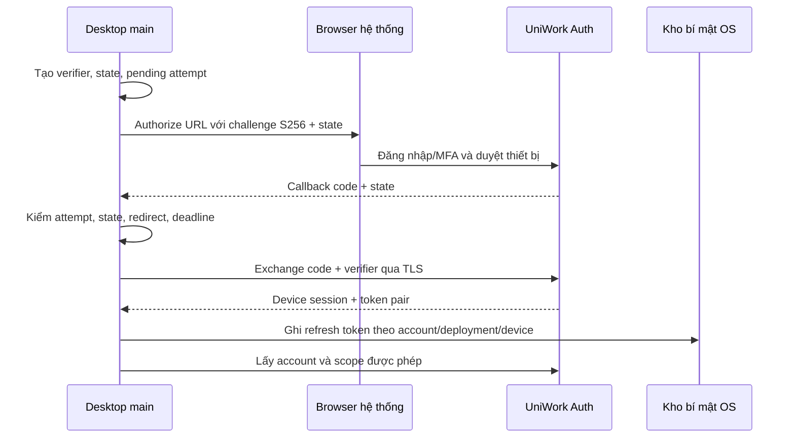

# UniWork Office G4 - Desktop, đăng nhập và Office Bridge

> **Trạng thái:** in-progress - spec v1.2 để duyệt, ngày 2026-09-27; đã sửa theo hai lượt review và quyết định bỏ autosave của người dùng; chưa triển khai hoặc nghiệm thu sản phẩm.

**Issue tài liệu:** UNI-819, parent UNI-437. **Issue triển khai:** G4 UNI-636.
**Roadmap:** C-16, liên quan C-01. **Spec đồng hành:** [G3 web editors](2026-09-27-office-g3-web-editors-design.md).

## 1. Mục tiêu và cơ sở

UniWork Office là ứng dụng desktop dùng cùng tài khoản UniWork để mở Document từ
web hoặc thư viện cloud, sửa bằng editor phù hợp và lưu thành version của chính
Document đó. File local vẫn có luồng mở/lưu riêng, được phân biệt rõ với tài liệu
cloud. Desktop không tạo một kho phiên bản hay mô hình quyền nghiệp vụ thứ hai.

G4 triển khai host desktop, đăng nhập, phiên thiết bị, deep link, bảo vệ nháp,
local I/O, thư viện cloud và đóng gói. Editor dùng cùng contract/module với G3,
engine dùng G2, dữ liệu/quyền/commit dùng G1. Spec cho phép triển khai các phần đủ
đầu vào song song; việc viết spec chưa khởi chạy runtime hay release.

### 1.1 Nguồn và ưu tiên

Baseline tài liệu là `develop` tại `c6b567f0`. Đã đọc [spec G0](2026-09-16-documents-office-g0-design.md),
[yêu cầu FE](2026-09-16-documents-office-fe-design.md), [ADR 0021](../../adr/0021-runtime-engine-office-da-dinh-dang.md),
[DOC-005](../../office/g0/login-sync-contract.md), [C-01](2026-09-08-documents-design.md),
[FS-C1 v1](2026-09-24-file-service-contract.md), [handoff G0](../../office/g0/handoff-map.md)
và [brand/integration](../../office/g0/uniwork-office-integration-brand.md).

Các bổ sung G1/G2 tại commit `215b9527` trên `feature/UNI-657-documents-office-g1-g2`
được dùng làm đầu vào: plan `docs/superpowers/plans/2026-09-18-documents-office-g1-g2.md`
cập nhật 27/09, C-01 §14, ADR 0024 accepted và `docs/office/g1g2/fs-c1-alignment.md`.
Chúng chưa nằm hết trong baseline checkout spec; phải tích hợp dependency trước
implementation, không sao chép lại hoặc sửa nhánh đang chạy của G1/G2.

U-1..U-4 ngày 27/09 đã duyệt: layout G1/G2, FileService giữ byte/intent/GC,
C-01 §14 và codec ảnh Node cho PDF web. G4 tiêu thụ quyết định đó, không dựng đường
lưu riêng từ bản Office Bridge cũ. Các tên/endpoint/policy có nhãn **đề xuất** trong
spec này chỉ có hiệu lực sau khi duyệt và phát hành contract cùng owner.

Phạm vi G4 là DOCX, XLSX, PPTX, PDF, Markdown và HTML theo ADR 0021/Q1-B. Mô tả C-16 cũ có ba định dạng là
nguồn của bốn hành vi an toàn bắt buộc, không phải lý do thu hẹp desktop về DOCX/XLSX/PPTX.
Khi lập plan, coordinator cần đối chiếu mô tả UNI-636 với spec được duyệt; không
coi tài liệu này tự cập nhật tracker hay ghi đè quyết định trước.

## Điểm cần người dùng quyết

**Đã chốt ngày 27/09: bỏ autosave file Office.** Native menu Lưu, nút Lưu,
Ctrl/Cmd+S hoặc lựa chọn Lưu trong dialog mới bắt đầu ghi file đích/cloud version.
Không tự lưu theo timer/idle, đóng cửa sổ, logout, update hoặc reconnect. Checkpoint
nháp được bảo vệ trên thiết bị vẫn tự chạy để phục hồi, không upload/commit và không
ghi đè file local gốc. Cùng chính sách G3 §4.3; không thêm working-file-version/squash.

Các điểm **còn mở** dưới đây không mở lại quyết định lưu đã chốt:

| Mã | Đề xuất / quyết định cần duyệt | Phần chờ |
| --- | --- | --- |
| G4-D1 | Giữ identity/scheme G0 trong §8.1; chốt chủ domain/update host và namespace từng channel | Đăng ký scheme, allowlist auth, installer/release identity |
| G4-D2 | Electron host từ source pin, Windows DPAPI + restricted key file, macOS Keychain; chọn thư viện, ACL, lock/recovery semantics và lifetime draft key | Native secrets/drafts và cam kết Q8 trên binary |
| G4-D3 | Windows/macOS theo Q3-B; G7 xác nhận OS/arch, signing/notarization, update feed/channel và thiết bị kiểm thực | Release; không chặn shell hoặc unsigned dev build có nhãn |
| G4-D4 | Duyệt auth/Bridge API §4-§5, TTL, relationship device session với auth hiện có, exemption tại `tenantExemptTables` và revoke middleware; sửa mâu thuẫn DOC-005 §2 khi phát hành contract theo §4.1 | Backend migration/auth integration; không chặn schema/fake thiết kế |

## 2. Phạm vi và ranh giới giao việc

| Thuộc G4 | Phụ thuộc / giới hạn |
| --- | --- |
| Desktop shell, main/preload, cửa sổ/tab, menu/dialog native | Tái sử dụng editor G3 và facade G2; đề xuất Electron từ upstream đã pin |
| Login bằng browser hệ thống, PKCE, exchange, refresh, revoke theo thiết bị | G4 phối hợp chủ auth UniWork; không dựng user/password/MFA riêng |
| App identity, scheme, deep link và launch ticket | Giá trị cuối cần duyệt ở G4-D1; không dùng scheme/data dir upstream |
| Chọn deployment/account/org/workspace, thư viện cloud, recent/search | Dùng API/quyền G1; không giữ cache như nguồn dữ liệu nghiệp vụ |
| Open/download/save qua Bridge và API Documents | G1 giữ version/ACL/quota; G2 giữ engine job; §5 giữ một commit pipeline |
| File local, Save As, đưa vào UniWork, protected draft và recovery | Tách origin/local capability; draft không phải thư viện offline G5 |
| Build/installer Windows/macOS, update client, signature verification | G7 giữ release infrastructure/evidence; credentials/signing ở G4-D3 |

Ngoài G4: change feed/cursor/full resync, thư viện offline, download/upload queue bền
và sync hai chiều đầy đủ thuộc G5 UNI-660. G4 vẫn phải giữ bản sửa khi mất mạng/restart
theo Q8; không được hoãn bảo vệ nháp tới G5. AI thuộc G6; coauthoring thuộc UNI-662.
OCR scan chưa thuộc mốc Q2-A. Linux installer không thuộc cam kết Q3-B hiện tại.

G4 không viết lại thư viện Documents/panels của G1 hoặc toolbar/edit engine của G3/G2.
Có thể dùng shared views không phụ thuộc Next qua navigation/storage/runtime adapters;
trong renderer không import `next/*`, không chứa service credential hoặc SQL client.

## 3. Tiến hành song song và bàn giao

| Mốc | Có thể bắt đầu | Điều kiện nhận kết quả |
| --- | --- | --- |
| D0 - Contract | Desktop shell, IPC allowlist, auth API design, keychain/draft tests, packaging scaffold, cloud UI bằng fake | Provider contract có revision; chưa claim cloud loop đã chạy |
| D1 - Host/auth | PKCE với auth backend thật, callback, refresh/revoke, key store và local I/O | Không cần toàn G1/G2; cần G4-D1/D2/D4 và auth contract tương ứng |
| D2 - Ghép từng format | Open/save cloud khi API G1 + adapter G2 tương ứng sẵn sàng | Stack thật, bốn Bridge invariants, draft/recovery và evidence đúng format |
| H1/H4 của G1/G2 | H1 là API/kho thật; H4 là nền sáu format tích hợp đã nghiệm thu | Không đổi hoặc bỏ gate; ghép thử trước H4 không thay acceptance |
| D3 - G4 bàn giao | H4 + sáu format + host/auth/installer acceptance | Bàn giao G5/G7, ghi rõ Mac/Safari hoặc signing còn chờ; chưa mặc định pilot ready |

G3/G4 thống nhất editor/host interface qua §4 của spec G3. G2 giữ registry/protocol,
G1 giữ endpoints/query keys, G4 giữ desktop implementation. Đổi contract phải tăng
revision, sửa fake/schema/tests và báo các consumer. Auth, catalog, lockfile và CI
có một owner ghi mỗi lượt; không nhận chung một file giữa nhiều task song song.

## 4. Đăng nhập và phiên thiết bị

### 4.1 Luồng chuẩn

Browser hệ thống dùng phiên web, provider login và MFA/chính sách tổ chức hiện tại.
Không nhập mật khẩu UniWork vào renderer Office riêng, không nhúng trang đăng nhập
có quyền Node/Electron, không hardcode login chỉ Google như sơ đồ minh họa G0.

**Client main sở hữu verifier/state/pending attempt.** Danh sách endpoint trong
DOC-005 (`docs/office/g0/login-sync-contract.md`) §2 có dòng cũ nói
`GET /auth/desktop/start` sinh `code_challenge`/`state`; dòng đó mâu thuẫn với chính
DOC-005 §2.2. Lấy quy tắc client ownership ở §2.2 làm chuẩn. Challenge là
BASE64URL(SHA256(ASCII(verifier))), không phải hex. Verifier không có trong authorize
URL; chỉ gửi ở token exchange. Pending attempt bị tiêu/hủy khi hoàn tất hoặc hết hạn.
Verifier và state dùng nguồn ngẫu nhiên mật mã của host, verifier theo RFC 7636;
không dùng timestamp, device id hoặc chuỗi cố định. Một callback chỉ tiêu đúng attempt
của nó; concurrent login không lấy verifier của attempt khác.

Backend phát code dùng một lần, lưu dạng hash, gắn account + client + challenge +
redirect URI + hạn. Callback phải khớp đúng URI đã đăng ký và state của attempt;
reject query trùng, near-miss URI, replay, callback tới sai deployment/account và
callback khi không có attempt. Không bắt đầu phiên chỉ vì app nhận URL có `code`.
Nếu main restart làm mất attempt, yêu cầu login lại; không đổi code không có verifier.

Khi phát hành auth contract (G4-D4), G4/chủ auth phải sửa danh sách endpoint DOC-005
§2 thành server **nhận/kiểm** challenge/state từ client và dẫn tới §2.2, đồng bộ
SDI/SDO/fake/tests trong cùng lượt. Đây là mục bàn giao bắt buộc để không để hai
nguồn hướng dẫn trái nhau; không sửa bằng chứng model cũ như thể runtime đã ship.

### 4.2 API auth đề xuất cho contract G4

Path tương đối với `/api/v1`; các endpoint mới dưới đây chưa tồn tại ở baseline.
G4/chủ auth phải phát hành SDI/SDO/OpenAPI và fake có cùng schema trước consumer.

Start GET chỉ validate/khởi tạo attempt; phát code sau khi browser đã hoàn tất login,
MFA và consent POST có CSRF protection. Không approve thiết bị hoặc phát code chỉ vì
một link GET được tải trước bởi browser/prefetch. Redirect callback không render
trang analytics; response nhạy cảm `no-store`, URL được lọc khỏi access log/referrer.

| Endpoint | Yêu cầu |
| --- | --- |
| `GET /auth/desktop/start` | Nhận client/challenge/method/state/redirect; validate allowlist, đi qua login/MFA và consent thiết bị. Server giữ attempt tương ứng, không nhận arbitrary `next` URL |
| `POST /auth/desktop/exchange` | Code + verifier + registered redirect/client; redeem nguyên tử, tạo device session; response token chỉ về main qua TLS, không URL/cookie web |
| `POST /auth/desktop/refresh` | Refresh token ở main, rotate/reuse detection theo policy auth; khóa refresh một luồng mỗi device session |
| `POST /auth/desktop/logout` | Thu hồi device session/family; xóa token ở main, giữ khóa/byte draft cần phục hồi |
| Device list/revoke trong session management | Tái dùng bề mặt quản lý phiên hiện có nếu phù hợp; caller chỉ liệt kê/thu hồi thiết bị của mình, không lộ phiên người khác |

Token response tối thiểu: account id, device-session id, access token, expires-in,
refresh token/rotation metadata. Đây là đề xuất cho native confidential storage,
không đổi response web hiện tại vốn dùng HttpOnly refresh cookie. Renderer chỉ nhận
session metadata và kết quả nghiệp vụ; main/host transport giữ token và thêm auth.

Đề xuất code TTL 120 giây, pending attempt tối đa 10 phút; giá trị phải được duyệt
trong auth contract G4-D4. Access/refresh lifetime theo policy auth triển khai,
không tự tăng thời hạn cho Office. Desktop client là public client, không nhúng
client secret vào binary. Rate limit start/exchange/refresh và ghi audit metadata
theo luật repo; token, verifier, code, password không vào log/telemetry/crash dump.

### 4.3 Device session, thu hồi và đổi tài khoản

G4 cần `device_sessions` theo DOC-005. Mô hình đề xuất gồm id, user/session-family,
client/device label, platform/build, created/last-used/expires/revoked và refresh-token
digest; không lưu raw token. Label do người dùng nhập phải sanitize và không là identity.
Mọi authorization nghiệp vụ vẫn kiểm organization/workspace membership và Document ACL.

Đây là identity infrastructure theo account, không gắn giả một organization vào
session nhiều tổ chức. Trước migration, G4/chủ auth phải chốt quan hệ với bảng session
hiện có (G4-D4). Nếu `device_sessions` không mang `organization_id`, phải thêm tên
bảng và lý do identity theo account vào `tenantExemptTables` trong
`server/migrations/lint_test.go` cùng lượt migration, theo ADR 0008. Chạy
`TestNewTablesCarryOrganizationID` và `TestTablesWithoutOrganizationIDAreTheKnownDebt`;
không chỉ ghi ngoại lệ trong spec hoặc mở rộng allowlist cho bảng nghiệp vụ.
Migration theo quy tắc repo, cấp số tại lúc tích hợp, không dùng số cố định trong spec.

Thu hồi device session phải chặn request cloud kế tiếp, kể cả access token chưa hết
TTL: middleware/host session check cần hiệu lực thực, không chỉ xóa refresh token.
Revoke desktop riêng không logout các browser session khác; revoke-all/password
reset phải bao phủ cả native session theo policy auth. Không thể thu hồi byte người
dùng đã tải ra ngoài ứng dụng; spec không hứa điều đó.

Main serialize refresh và atomic-persist token mới trước khi báo auth ready. Lỗi ghi
key store hoặc refresh reuse chuyển locked/login-required; không lưu plaintext làm
fallback. Đổi account/deployment tăng generation, hủy job/read/mutation đang chờ,
xóa Query cache và plaintext renderer của scope cũ trước khi hiển scope mới; late
responses bị loại. Scope bắt buộc gồm deployment + account + org + workspace + doc.

Device authorization được DOC-005 nêu làm fallback khi không mở browser. Khuyến nghị
để capability tắt cho tới khi backend hỗ trợ flow chuẩn và có acceptance riêng;
UI báo cần browser thay vì tự dựng mã đăng nhập dài hạn hoặc đường bypass MFA.

## 5. Office Bridge và một đường commit

### 5.1 Hai loại token không dùng lẫn nhau

Login authorization code dùng để tạo phiên thiết bị. **Launch ticket** dùng để mở
một Document đã chọn từ web; nó không cấp tài khoản, không là refresh token, không
thay session desktop hay quyền Document hiện tại.

Đề xuất Bridge contract v1:

| Thao tác | API / hành vi đề xuất |
| --- | --- |
| Tạo launch session từ web | `POST /documents/{documentID}/office/sessions`; auth web + view/edit theo thao tác, tạo ticket hash scope hẹp |
| Chuyển sang desktop | Scheme đã duyệt mang opaque ticket, không mang title, local path, byte, token đăng nhập hoặc storage URL |
| Đổi ticket lấy open descriptor | `POST /office/sessions/exchange`; main phải có device session hợp lệ đúng account/deployment; redeem nguyên tử, kiểm lại ACL |
| Desktop mở từ thư viện | Dùng device session + Documents API trực tiếp; không vòng qua launch ticket nếu không có chuyển từ web |

Ticket đề xuất TTL 120 giây, single-use, gắn account/org/ws/doc, operation và version
được chọn; thời hạn cuối thuộc G4-D4. Ticket không đủ để người cướp scheme đọc file
nếu không có đúng phiên account. Không đổi account tự động theo deep link. Sai
account thì yêu cầu người dùng đăng nhập đúng, không hiển metadata tài liệu trước.

Không nhận `server_url` tùy ý trong URL để gửi token tới; deployment phải có trong
profile đã người dùng cấu hình/allowlist. Mở deployment mới là thao tác rõ ràng,
không suy từ untrusted link. Version mở từ lịch sử là read-only; sửa tiếp phải qua
thao tác restore/copy có quyền, không commit âm thầm lên current version khác.

### 5.2 Ánh xạ sáu bước Bridge

Giữ trải nghiệm sáu bước của UNI-636, nhưng `prepare/upload/complete` là phương thức
facade client ghép vào API G1 đã duyệt; không dựng API lưu phiên bản thứ hai.

| Bước | Thực hiện | Nơi quyết quyền/commit |
| --- | --- | --- |
| 1. Tạo phiên | Web tạo scoped launch ticket | Go kiểm session và Document ACL |
| 2. Exchange | Device-authenticated main đổi ticket lấy descriptor/version/engine metadata | Go kiểm lại account, scope, ticket và ACL |
| 3. Download | Proxy Go có kiểm quyền từng request/Range; host kiểm checksum/length | Documents + FileService; không presign object |
| 4. Prepare | Host tạo immutable save intent: base/version, snapshot, checksum, key; chuẩn bị serialize/job qua G2 | Không cấp quyền ghi lâu dài; server vẫn có quyền từ chối commit |
| 5. Upload | `POST /documents/{documentID}/uploads`; engine output dùng provider-output flow G2 | Trả `upload_id = file_id`, chưa tạo version |
| 6. Complete | `POST /documents/{documentID}/versions/commit` với `{upload_id, base_revision}` và `Idempotency-Key` | G1 recheck quyền/base/quota/engine; transaction version + ClaimInTx + audit/outbox/idempotency |

Đọc [spec G3 §4](2026-09-27-office-g3-web-editors-design.md#4-hợp-đồng-dùng-chung-g3g4)
cho contract canonical: revision là chuỗi thập phân, idempotency theo fingerprint,
`error.error_class`, quota 403, upload-invalid và đường copies. Endpoint Bridge mới
ở §5.1 chỉ để handoff, không cấp bypass API Documents.

### 5.3 Bốn bất biến bắt buộc

1. **Idempotent complete:** retry cùng intent/key sau timeout hoặc mất response trả
   cùng một version logic. Cùng key khác fingerprint/actor bị từ chối. Persist receipt
   đúng snapshot; receipt N không xóa sửa N+1 đang dirty.
2. **Stale base:** file commit trả `document_version_conflict` 409, không overwrite,
   không thêm version; giữ bản local và bản server. Không tự rebase byte binary.
3. **Thu quyền giữa chừng:** open/download/upload có thể đã thành công; revoke trước
   commit thì complete bị từ chối, version không đổi, nháp còn nhưng blocked.
4. **Cách ly tổ chức:** tài khoản/tenant không có quyền không được metadata, filename,
   path, version hoặc id tổ chức; 403/404 theo policy server, không xác nhận tồn tại.

Kiểm session/ACL tại mỗi bước và mỗi download/range mới; ticket/session cũ không
giữ quyền đã bị thu. Cache local không được làm nguồn quyết định quyền. Nếu cancel
đụng complete, main không tự kết luận chưa lưu: reconcile cùng idempotency key để
biết receipt, rồi mới cho retry mới hoặc discard. Engine không ghi bảng nghiệp vụ.

## 6. Nháp, local I/O và ranh giới sync

### 6.1 Protected draft Q8

Draft store bền theo deployment/account/org/ws/doc/base revision/base version.
Main giữ khóa, namespace opaque, ghi nguyên tử và mã hóa có xác thực, ràng buộc
identity/base qua AAD. Theo seam DOC-005, store chỉ giữ byte; host policy mới quyết
session/ACL/recovery. Không port model auth G0 thành backend sản phẩm.

Đề xuất Windows dùng DPAPI bảo vệ khóa tài khoản với file ACL phù hợp, macOS dùng
Keychain để giữ khóa; credential provider cụ thể và hành vi khi OS store locked
phải chốt ở G4-D2. Draft key khác refresh token và không bị xóa khi logout, để nháp
có thể phục hồi sau login lại; không cho renderer trực tiếp đọc key.

| Sự kiện | Kết quả bắt buộc |
| --- | --- |
| Dirty/checkpoint | Nhịp 2 giây chỉ ghi nháp cục bộ có generation/checksum và xác nhận durability; không gọi upload/commit hoặc ghi file local gốc; lỗi IO không báo đã bảo vệ |
| Logout/session mất hiệu lực | Thu hồi token, xóa plaintext trong RAM/renderer, giữ ciphertext/khóa cần phục hồi; không cho API draft đọc bằng phiên cũ |
| Login account B | Không list/read/decrypt/replay nháp A; caller không được chọn account id tùy ý vào IPC |
| Restart/login A | List chỉ metadata, recovery kiểm session + live edit quyền + scope + cả hai base; không mặc định auto-upload |
| A mất edit/view | Nháp blocked, không export/copy/clipboard; chỉ committed byte còn view mới được hiển/tải |
| Base đổi | Conflict, giữ cả hai; không tự merge và không chỉ so revision mà bỏ base version |
| Mất khóa, ciphertext hỏng, disk full | `draft_recovery_locked`/lỗi lưu rõ; giữ byte cũ, không ghi file rỗng thay thế |
| Commit xác nhận / discard có xác nhận | Chỉ gỡ đúng snapshot đã được tiêu hoặc chủ nháp đã chọn bỏ; không xóa snapshot mới hơn |

Nháp không là hàng `files`, không chịu TTL staged 24 giờ của FileService. G5 có thể
thêm queue tham chiếu nháp qua contract, không chuyển owner cleanup sang GC storage.
Tích hợp logout hiện có phải tách clear-memory và delete-durable; không đăng ký vào
cleanup hook xóa global task/chat draft rồi nhận Q8 đã đạt.

### 6.2 Phân biệt file local và Document cloud

| Nguồn mở | Badge/state | Hành vi lưu |
| --- | --- | --- |
| File local qua OS dialog | “Trên máy này”, local handle do main cấp | Save/Save As vào handle được phép; không tự upload, không có Document/version id giả |
| Document cloud | Tổ chức/workspace + trạng thái commit | Save vào Document qua §5; byte làm việc local không đổi nó thành file tự do |
| Đưa file local vào UniWork | Người dùng chọn đích có quyền + xác nhận | API tạo Document file của G1; chỉ receipt thành công mới thiết lập cloud binding |
| Bản sao từ cloud/conversion | Q7 warning, consent và policy quyền | API copies giữ provenance/ACL; không dùng Save As local để né blocked draft |

Main chỉ cấp opaque file handle sau OS picker hoặc open event đã validate; renderer
không truyền path tùy ý để read/write/delete. Save local ghi temp cạnh đích rồi
atomic replace theo OS, giữ bản cũ khi lỗi, xử lý external modification/symlink và
file bị khóa; không âm thầm overwrite file bị chương trình khác sửa. Temporary
plaintext có permission hạn chế, không tồn tại sau logout như recovery thay ciphertext.

File local chưa từng bind cloud thuộc người dùng local; cloud draft luôn giữ source
identity và ACL policy kể cả main đang giữ một file tạm. Không đổi nhãn thành local
khi cloud save lỗi. Cloud export chỉ khi quyền hiện tại/capability cho phép; mất quyền
không được bật export để “cứu file” vượt DOC-005.

### 6.3 Mạng gián đoạn và G5

G4 bảo vệ snapshot đang sửa và báo chưa gửi khi mất mạng. Cho retry có giới hạn sau
khi session/quyền được kiểm lại; không tự khởi chạy toàn bộ dirty store khi reconnect.
Full offline library, background queue, cursor/tombstone và automatic cross-device
updates thuộc G5. Metadata/cache G4 không hứa offline authority; recovery cần live
ACL thì không unlock chỉ dựa vào cache khi mất mạng.

G4 bàn giao cho G5: định danh thống nhất, atomic draft store, session/revoke events,
idempotent save intent/receipt, conflict/blocked states và migration contract. G5
không được bypass keychain/main, tự đổi base hoặc replay nháp vào account khác.
Online library refetch/realtime invalidation hiện có không được gọi là sync đầy đủ.

## 7. Desktop host và UI

### 7.1 Kiến trúc đề xuất

`apps/office-desktop/` chứa main/preload/renderer platform bindings và packaging;
đây là đường dẫn đề xuất mới. Giữ các package engine theo U-1. Shared Office views
ở G3, core state/query/error theo contract chung; local filesystem, process, secret
store, deep link và OS window ở main. Renderer không gọi database hoặc storage service.

Renderer chạy sandbox, `contextIsolation` bật, `nodeIntegration` tắt. Preload chỉ
công bố typed allowlist, validate sender frame/origin, session generation, schema,
scope và byte limits ở main. Không `ipc.invoke(channel, arbitraryArgs)`, không generic
readFile/exec/openURL API, không mở renderer khác bằng remote URL có preload đặc quyền.
URL ngoài dùng browser hệ thống sau allowlist/protocol check; không `shell.openExternal`
với chuỗi tùy ý từ nội dung file. Chặn navigation/window-open ngoài ứng dụng.

Host transport proxy chỉ gọi endpoint/method thuộc API allowlist theo phiên hiện tại;
không cho renderer dùng token main làm HTTP proxy tùy ý. Mỗi cửa sổ/tab có binding
account/deployment/session, việc đổi binding phải qua main và hủy callback cũ.

Tiến trình native chỉ nhận operation/handle hợp lệ, không nhận shell command do file
hoặc renderer tạo. XLSX recalc cloud theo service nội bộ G2/ADR 0021. Nếu local-file
editing cần native runtime trên desktop, G2 phải chứng minh desktop export/adapter
đó và packaging G4 phải đóng gói đúng build; không suy từ engine lab. Q4-A vẫn cấm
gửi file sang provider Office/OCR bên ngoài.

### 7.2 Thư viện và editor

Màn đầu phân biệt mở file local, đăng nhập và thư viện cloud. Sau login, chỉ hiển org/ws
được phép; search/recent/list đều do quyền G1 quyết, không hiển metadata cache account
trước trong lúc chờ. Work Product Document không xuất hiện trong library/recent chung;
mở qua owner/deep link đúng quyền, không có share riêng.

Editor dùng cùng six-format matrix, save/error/draft và accessibility G3. Native menu
và Ctrl/Cmd shortcuts gọi cùng action coordinator; Save của menu không là save pipeline
thứ hai. **Không autosave cloud hoặc file local gốc.** Chỉ hành động Lưu rõ ràng mới
tạo intent; dirty N+1 trong khi N đang lưu không tự tạo lần ghi kế tiếp. Idle, đổi tab,
blur hoặc reconnect không kích hoạt save. Checkpoint nháp 2 giây chỉ bảo vệ bản sửa
trên thiết bị, không tạo Document version/blob/quota và không ghi đè file gốc.

Trong suốt lần lưu N, chặn Lưu mới qua nút/menu/shortcut/dialog theo G3 §4.3 mục 3;
không giữ lệnh chờ. Quy tắc áp dụng cả cloud và file local; N+1 cần một thao tác
Lưu mới sau khi kết quả N đã xác định và điều kiện lưu vẫn hợp lệ.

Đóng cửa sổ/app, logout và update đều kiểm dirty snapshot: người dùng chọn Lưu,
giữ nháp đã ghi bền rồi tiếp tục, bỏ có xác nhận, hoặc ở lại. Chỉ lựa chọn Lưu mới
ghi file đích/commit cloud; save lỗi hoặc có N+1 mới thì không tự đóng. Update chỉ
checkpoint nháp, không tự “lưu hộ” lên cloud. Crash recovery chỉ hứa tới checkpoint
được xác nhận; phục hồi nháp không tự ghi đích hoặc upload.

Header phân biệt “Đã giữ nháp trên thiết bị”, “Đã lưu trên máy”, “Đã lưu lên UniWork”, “Chưa gửi”, “Không có quyền
sửa” và conflict; không dùng một chữ “Đã lưu” cho mọi đích. G3 §5.1 và desktop dùng
chung i18n keys vi/en trong shared Office UI cho các nhãn này, không tách copy theo host.
Error class/code chung; theme chrome không sửa màu/font nội dung. Sửa PDF hai lần, DOCX lỗi mở,
embedded font và XLSX lỗi parse phải qua cùng P1-P4 acceptance của G3 trên host thật.

### 7.3 Preview HTML và asset

Renderer/editor không render HTML tài liệu như UI app. Desktop preview chạy trong
frame/process hoặc scheme cách ly, không preload/Node, không session/cookie app;
scheme nội bộ phải có chính sách origin rõ và không cấp quyền rộng chỉ vì là scheme
custom. File URL local, traversal và fetch tài nguyên ngoài manifest bị từ chối.
Asset broker cấp đúng asset đã authorize, không path/key/token; test script đọc
session, app API, local file và IPC đều phải thất bại. Quy tắc HTML ở G3 §5.3 vẫn áp
dụng; desktop không dùng cùng privileged origin chỉ để giải quyết relative assets.

## 8. Identity, giấy phép và phát hành

### 8.1 Giá trị cần chốt, chưa phải resource đã tồn tại

| Bề mặt | Đề xuất kế thừa G0 | Điều phải chứng minh |
| --- | --- | --- |
| Tên sản phẩm | UniWork Office | UI, menu, taskbar/Dock, installer/About cùng tên |
| App/bundle id | `com.uniwork.office` | Cài cạnh upstream không ghi đè/app-group nhầm |
| Executable / artifact prefix | `uniwork-office` / `uniwork-office_<version>_<arch>` | Shortcut, process, manifest và binary khớp |
| User scheme / login callback | `uniwork-office`, `uniwork-office://auth/callback` | OS route đúng app; backend allowlist chính xác cùng giá trị |
| Internal schemes | `uniwork-office-app`, `uniwork-office-preview`, `uniwork-office-asset` | Origin/IPC/preview separation được kiểm trên binary |
| User-data/cache/key store namespace | `uniwork-office`, tách channel/deployment/account | Không dùng chung dữ liệu/key/lock/control channel với upstream hoặc bản test |
| Update feed | Host/channel thuộc UniWork; URL cuối chưa có | Không trỏ GenOffice/Genspark; chỉ nhận artifact đúng publisher/app/channel |

G4-D1 chốt một identity manifest dùng cho build, backend redirect allowlist và test.
Không thay scheme tùy tiện giữa các platform. Nếu chọn khác đề xuất callback G0,
phải sửa contract/model/consumer theo revision và xem migration; không âm thầm nhận
cả scheme upstream. Development/testing có namespace riêng để không chạm dữ liệu người dùng.

### 8.2 Provenance, build và licence

G2 giao source pin/patch series, license/dependency inventory và artifacts reproducible.

DOC-040 yêu cầu kiểm kê bản fork UniWork Office hiện có trước khi quyết định tái sử
dụng: repo/commit, licence, entry main/preload, sáu module editor, build command,
dependencies, native artifacts và các patch so với upstream. Bản spec này chưa xác
minh một fork desktop build được. Nếu fork không đáp ứng boundary/clean build thì
dùng source pin G2 làm nền, ghi phần tái sử dụng và phần phải dựng; không chép toàn
shell upstream để mặc định nhận auth/update/telemetry của nó.

G4 build từ checkout sạch, không `../genoffice`, symlink cá nhân hoặc private registry
không khai báo. Giữ LICENSE/NOTICE, fork commit và third-party notices; loại `/ee`
chưa được phép và có CI scan. Upstream names chỉ nằm ở provenance/attribution allowlist,
không brand UI hay feed update. Font/binary/native dependency phải có quyền phân phối.

Phiên bản sản phẩm, engine build, contract/protocol và native sidecar được ghi vào
manifest/About/diagnostics không chứa content. G2 quyết support matrix giữa các build;
G4 không ép version string để bỏ qua incompatible gate. CI import-graph phải chứng
minh renderer không kéo Node/native; native package OS/arch đúng với installer.

### 8.3 Installer, update và rollback

Q3-B cam kết Windows/macOS. Danh sách OS tối thiểu và CPU architectures phải chốt theo
build inventory ở G4-D3; không hứa mọi kiến trúc khi mới có một binary chạy được.
G4 giữ electron-builder/equivalent config theo host được duyệt; G7 giữ release pipeline,
signing/notarization, distribution và evidence thật. Keys/certificates không trong repo.

Update phải kiểm TLS, signature, app/publisher/channel, artifact hash và engine
compatibility trước install. Không có signing/feed thật thì chỉ nhận development
artifact có nhãn; không bật auto-update unsigned hoặc upstream feed làm fallback.
Đề xuất stable/beta tách channel; channel cuối chốt cùng G4-D3.

Trước restart để update, checkpoint nháp và xác nhận write; disk-full/locked store
thì dừng update có lý do, không ép đóng editor. Migration local store giữ bản cũ,
test upgrade/restart/rollback với nháp chưa gửi. Bản rollback phải đọc committed
versions/drafts mới hoặc có compatibility path đã kiểm; không xóa ciphertext hoặc
đổi namespace khiến nháp biến mất. Kill switch có thể tắt cloud writes mới nhưng
phải giữ recovery/data đã có theo policy.

Cài mới, nâng cấp và uninstall/reinstall có ca kiểm dữ liệu: không xóa nháp theo mặc
định khi uninstall; dọn dữ liệu là hành động người dùng rõ ràng. Cài cạnh upstream
phải tách app id, scheme, directory, keychain, update feed, shortcut và control channel.
Mac/Safari thật nằm ở UNI-671; dev có thể bàn giao có giới hạn, không tuyên bố pilot
đã đủ platform bằng kết quả Windows/WebKit.

## 9. Bằng chứng nghiệm thu

Đây là yêu cầu test, không phải báo cáo đã chạy. G4 phải có evidence trên binary
và backend thật, không lấy model G0 hoặc browser-only harness thay thế.

| Mã | Kịch bản | Điều kiện đạt |
| --- | --- | --- |
| G4-A01 | PKCE RFC vector, MFA, callback hợp lệ | Login đúng account, token chỉ ở main/OS store, renderer không nhận refresh |
| G4-A02 | Callback giả, replay, wrong state/redirect/deployment, TTL | Từ chối trước phiên hoạt động; không account swap, không near-miss URI |
| G4-A03 | Refresh race, store locked, refresh reuse, revoke device | Một refresh logic; không plaintext fallback; revoked access bị chặn ở request kế tiếp |
| G4-A04 | Deep link cold/warm start, upstream cài cạnh, ticket bị chép | Đúng app/account, không lộ metadata trước auth, ticket không thay quyền |
| G4-A05 | Sáu format open/edit/save/fresh reopen | Cloud version/checksum thật, đủ oracle theo G3; dữ liệu engine không đi provider ngoài |
| G4-A06 | Gõ/idle 10 phút không Lưu, đổi tab/đóng/reconnect; lưu N rồi sửa N+1 và gọi Lưu qua nút/menu/shortcut/dialog lúc N chạy; retry/mất response/mismatch key | Chỉ local draft checkpoint, không upload/commit hoặc ghi file gốc khi chưa chọn Lưu; lệnh Lưu mới bị chặn, không có lệnh chờ cho cloud/local; retry cùng intent đúng một version; payload khác bị từ chối; receipt N không xóa N+1, N+1 chỉ lưu sau thao tác Lưu mới khi kết quả N đã xác định |
| G4-A07 | Hai thiết bị sửa cùng base | 409 conflict, không overwrite/duplicate, giữ cả hai |
| G4-A08 | Revoke sau download/upload trước commit | Version không đổi, blocked draft không có đường export |
| G4-A09 | Tenant/account switch, callback/job đến muộn | Không metadata/payload/receipt sang scope khác; query/editor plaintext đã reset |
| G4-A10 | Logout/restart/login A/B, draft wrong key/IO/disk full | Đúng Q8, giữ byte cũ, recovery chỉ đúng account/live ACL/base |
| G4-A11 | Local Save As, external modification, cloud import thất bại | Bản local không mất; không path tùy ý; chỉ receipt mới tạo cloud binding |
| G4-A12 | HTML đọc session/API/local file/IPC và asset traversal | Không vượt sandbox hoặc manifest; no privileged preview |
| G4-A13 | Native IPC misuse, renderer crash, cancel/complete race | Validate boundary, giữ nháp, xác định outcome một lần, app mở lại được |
| G4-A14 | Installer/upgrade/rollback với nháp dirty, upstream coexistence | Namespace đúng, signature/feed đúng, không mất nháp, engine compatibility được giữ |
| G4-A15 | Q7 conversion cancel/accept, owner Document | Source unchanged, consent/provenance/ACL đúng; không tạo free Document khi owner path chưa có |
| G4-A16 | vi/en, keyboard, native menu, theme và platform matrix | Hành vi cùng G3, nhãn trạng thái lưu dùng chung keys vi/en theo G3 §5.1/G4 §7.2; nội dung file không đổi theo theme, evidence đúng OS/arch/build |

Truy vết checklist workspace `DOCUMENTS_OFFICE_CHECKLIST.md` (UNI-655):

| Requirement | Phần spec / acceptance |
| --- | --- |
| DOC-040 kiểm fork, sáu editor, engine compatibility | §7.1/§8.2; G4-A05/A13/A14 |
| DOC-041 login/refresh/logout/device revoke | §4/§6.1; G4-A01..A03/A09/A10 |
| DOC-042 org/ws/cloud library/recent/search | §7.2; G4-A05/A09 và library permission fixtures |
| DOC-043 deep link/local/import/copy | §5.1/§6.2; G4-A04/A11/A15 |
| DOC-044 save/scope/account isolation | §5.2..5.3/§6; G4-A06..A10 |
| DOC-045 installer/update/rollback/platform | §8; G4-A14/A16, platform thật theo Q3-B |

G4-A02 gồm consent CSRF/prefetch và exchange hết hạn/mất response: không redeem lại
code/ticket đã tiêu để tạo phiên thừa; login lại hoặc yêu cầu launch ticket mới theo
luồng UI có chủ đích. Metadata library phải kiểm lại live ACL; recent của Work Product
không được trộn vào library chung.

Unit/contract tests gồm auth DTO/service, main/preload validators, draft/credential
adapter và save coordinator. Integration tests dùng API/DB/FileService/engine thật;
system tests khởi binary đóng gói, system-browser login, OS scheme/key store và update.
G3 assertions theo format được tái sử dụng nhưng ghi host riêng; web pass không là
desktop pass. Không screenshot nào chứng minh được idempotency/ACL/commit một mình.

Mỗi evidence ghi SHA binary/commit, OS/arch, browser login, engine/contract version,
fixture/hash, account/tenant fixture không chứa PII, API receipt/correlation, oracle
trước/sau và PASS/FAIL/BLOCKED. G4/G7 đo open/save/RAM/CPU theo artifact thực; ngưỡng
lab không chuyển thành cam kết hiệu năng desktop. Kiểm source với `make check` khi
implementation và bổ sung binary/system suite; chạy `make check` không thay OS tests.

## 10. Vận hành và theo dõi quyết định

Metric theo platform/build/format/error class, login/exchange/refresh outcome,
save/conflict, draft IO failure và update outcome; không log byte, title/path,
token/code/verifier hoặc password. Audit Document/version vẫn do G1/G2; G4 ghi
device/launch auth metadata theo service audit conventions. Telemetry không gửi
ra endpoint upstream; export diagnostics chỉ chứa thông tin kỹ thuật đã lọc.

Bảng G4-D1..D4 ở phần “Điểm cần người dùng quyết” ngay sau §1 là danh sách còn mở.
Quyết định bỏ autosave đã chốt; không tự đổi thành idle-save hoặc save-on-close.

Device authorization fallback cần capability/backend riêng nếu được chọn; không
mở rộng phạm vi mặc định bằng một implementation chưa có. G3-D1 về browser draft
key không chặn OS draft store G4, nhưng cả hai phải giữ cùng policy phục hồi.

## 11. Điều kiện chuyển sang plan

Spec được người dùng duyệt; G1/G2/G3/chủ auth nhận đúng contract và ownership; các
quyết định mở có owner/gate; mọi requirement DOC-040..045, Q3/Q7/Q8 và bốn Bridge
invariants có test intent. Plan sau duyệt tách task dưới UNI-636 qua coordinator,
theo D0/D1/D2 thay vì chờ toàn bộ G1/G2 mới bắt đầu. Không coi spec xong là runtime
G4 đã bắt đầu, pilot được chấp nhận hay issue được phép chuyển `done`.
